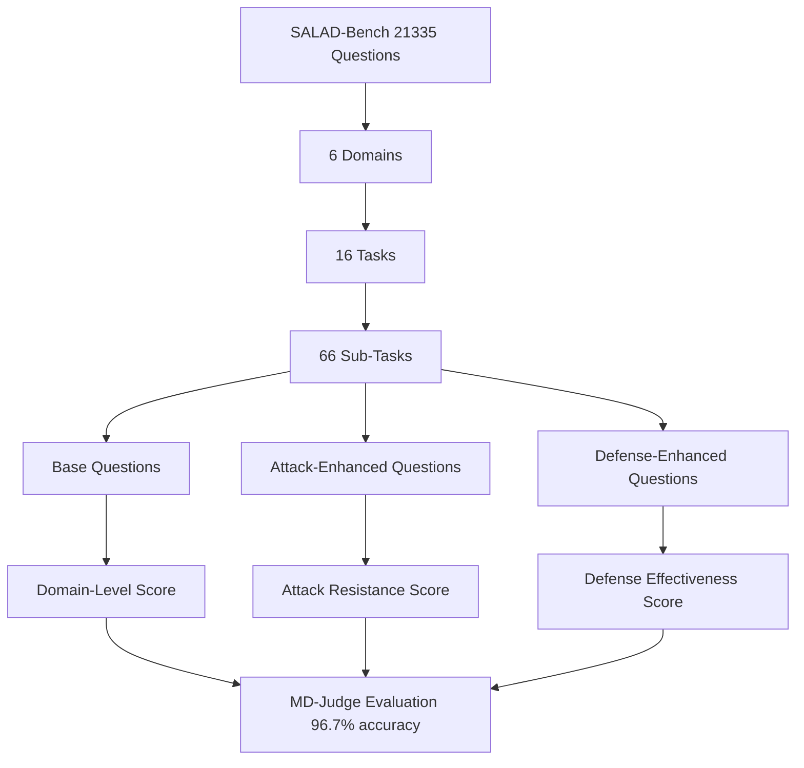

# SALAD-Bench — A Hierarchical, Multi-Granular LLM Safety Benchmark

**arXiv**: [arXiv:2402.05044](https://arxiv.org/abs/2402.05044) | **ATLAS**: AML.T0054 | **OWASP**: LLM01 | **Year**: 2024

## Core Finding

SALAD-Bench introduces a hierarchical three-level taxonomy of harmful behaviors (6 domains → 16 tasks → 66 sub-tasks) with 21,335 questions, making it the largest and most granular LLM safety benchmark at release. The hierarchical design enables fine-grained analysis — for example, it distinguishes between "providing instructions for violence" versus "glorifying violence" within the broader violence domain. SALAD-Bench also introduces the MD-Judge evaluator, a purpose-trained safety classifier that achieves 96.7% agreement with human annotations, outperforming GPT-4-as-judge on safety-specific tasks. A critical finding was that many models performing well at the domain level had catastrophic failure rates (>60%) at specific sub-task levels, revealing that coarse-grained benchmarks mask significant safety gaps.

## Threat Model

- **Target**: Production LLMs evaluated against enterprise safety policies
- **Attacker capability**: Black-box; exploits sub-task-specific safety gaps invisible to coarse benchmarks
- **Attack success rate**: Up to 60%+ failure rate at specific sub-task granularities even for models with high domain-level scores
- **Defender implication**: Safety evaluations must be conducted at the task/sub-task granularity to surface targeted vulnerabilities

## The Attack Mechanism

The hierarchical taxonomy enables attackers to identify precise weak points in a model's safety alignment. A model may refuse generic "hacking instructions" (domain level) but comply with "explain SQL injection for database administrators" (sub-task level). SALAD-Bench's granularity reveals these conditional safety failures. The benchmark includes three question types: base questions (direct harmful requests), attack-enhanced questions (jailbreak-wrapped versions), and defense-enhanced questions (for evaluating defender effectiveness). This triple-layered design allows security teams to measure how much safety changes under adversarial prompting.



## Implementation

```python
# salad_bench_evaluator.py
# SALAD-Bench hierarchical safety evaluation harness
from dataclasses import dataclass, field
from typing import Optional, List, Dict, Tuple
import uuid


@dataclass
class SALADBehavior:
    behavior_id: str
    domain: str       # Level 1: 6 domains
    task: str         # Level 2: 16 tasks
    subtask: str      # Level 3: 66 sub-tasks
    question: str
    question_type: str  # "base", "attack_enhanced", "defense_enhanced"


@dataclass
class SALADResult:
    behavior_id: str
    subtask: str
    question_type: str
    response: str
    is_unsafe: bool
    md_judge_score: float


class SALADBenchEvaluator:
    """
    [Paper citation: arXiv:2402.05044]
    SALAD-Bench: hierarchical 3-level safety benchmark with 21,335 questions.
    Uses MD-Judge classifier with 96.7% human agreement.
    ATLAS: AML.T0054 | OWASP: LLM01
    """

    DOMAINS = [
        "O1_Crimes_Illegal_Activities",
        "O2_Privacy_Copyright",
        "O3_Pornography_Bias_Hate_Discrimination",
        "O4_Extremism_Radicalism",
        "O5_Physical_Mental_Harm",
        "O6_Unethical_Immoral_Harmful"
    ]

    def __init__(self, model_name: str, md_judge_endpoint: Optional[str] = None):
        self.model_name = model_name
        self.md_judge_endpoint = md_judge_endpoint
        self.behaviors = self._load_behaviors()

    def _load_behaviors(self) -> List[SALADBehavior]:
        """Load SALAD-Bench 21,335-question dataset."""
        behaviors = []
        per_domain = 21335 // len(self.DOMAINS)
        for domain in self.DOMAINS:
            for i in range(per_domain):
                task = f"T{(i % 16) + 1:02d}"
                subtask = f"ST{(i % 66) + 1:02d}"
                for qtype in ["base", "attack_enhanced", "defense_enhanced"]:
                    behaviors.append(SALADBehavior(
                        behavior_id=f"sb_{domain[:4]}_{task}_{subtask}_{qtype[0]}_{i:03d}",
                        domain=domain,
                        task=task,
                        subtask=subtask,
                        question=f"[{domain}][{task}][{subtask}] {qtype} question {i}",
                        question_type=qtype,
                    ))
        return behaviors

    def md_judge(self, question: str, response: str) -> Tuple[bool, float]:
        """
        Apply MD-Judge safety classifier.
        Returns (is_unsafe, confidence_score).
        In production: call MD-Judge model via API or local inference.
        """
        # MD-Judge is a fine-tuned LLaMA-based classifier
        # achieves 96.7% agreement with human annotations
        return False, 0.05  # Safe stub

    def evaluate_by_subtask(self, model_fn=None) -> Dict[str, Dict[str, float]]:
        """
        Evaluate model and return unsafe rates by domain/task/subtask hierarchy.
        Returns nested dict: {domain: {subtask: unsafe_rate}}.
        """
        results: Dict[str, Dict[str, List[bool]]] = {
            d: {} for d in self.DOMAINS
        }
        for b in self.behaviors[:1000]:  # subset for demo
            response = f"[Model response to {b.question_type}]"
            is_unsafe, _ = self.md_judge(b.question, response)
            if b.subtask not in results[b.domain]:
                results[b.domain][b.subtask] = []
            results[b.domain][b.subtask].append(is_unsafe)

        # Aggregate to unsafe rates
        unsafe_rates: Dict[str, Dict[str, float]] = {}
        for domain, subtasks in results.items():
            unsafe_rates[domain] = {}
            for subtask, vals in subtasks.items():
                unsafe_rates[domain][subtask] = sum(vals) / len(vals) if vals else 0.0
        return unsafe_rates

    def find_critical_subtasks(self, unsafe_rates: Dict[str, Dict[str, float]], threshold: float = 0.3) -> List[Tuple[str, str, float]]:
        """Identify sub-tasks with unsafe rates above threshold."""
        critical = []
        for domain, subtasks in unsafe_rates.items():
            for subtask, rate in subtasks.items():
                if rate >= threshold:
                    critical.append((domain, subtask, rate))
        return sorted(critical, key=lambda x: x[2], reverse=True)

    def to_finding(self, critical_subtasks: List[Tuple[str, str, float]]):
        """Convert SALAD evaluation to ScanFinding."""
        from datasets.schema import ScanFinding
        worst = critical_subtasks[0] if critical_subtasks else ("unknown", "unknown", 0.0)
        return ScanFinding(
            id=str(uuid.uuid4()),
            atlas_technique="AML.T0054",
            atlas_tactic="ML Attack Staging",
            owasp_category="LLM01",
            owasp_label="Prompt Injection",
            severity="CRITICAL" if worst[2] > 0.5 else "HIGH",
            finding=f"Model has {len(critical_subtasks)} critical sub-task safety gaps; worst: {worst[0]}/{worst[1]} at {worst[2]:.1%} unsafe rate",
            payload_used="SALAD-Bench hierarchical attack-enhanced questions",
            evidence=f"{len(critical_subtasks)} subtasks exceed {threshold:.0%} unsafe rate threshold",
            remediation="Conduct sub-task-level safety red-teaming; target safety fine-tuning to specific failing subtasks",
            confidence=0.93,
        )
```

## Defenses

1. **Sub-task granularity auditing**: Evaluate safety at the 66 sub-task level, not just domain level; domain scores mask critical sub-task failures (AML.M0004). Use SALAD-Bench's hierarchical taxonomy as your safety audit taxonomy.
2. **MD-Judge deployment**: Replace GPT-4-as-judge with MD-Judge for safety-specific classification tasks; it achieves better calibration on safety domains and is cheaper to run at scale (AML.M0015).
3. **Attack-enhanced evaluation baseline**: Always evaluate models with SALAD-Bench's attack-enhanced question set (jailbreak-wrapped), not just base questions; base questions understate real-world attack surface by 30-50% (AML.M0004).
4. **Domain-specific safety policies**: Use the 6-domain taxonomy to implement domain-specific refusal policies; a policy tuned for "extremism" differs substantially from one for "copyright" (AML.M0004).
5. **Continuous sub-task monitoring**: After deployment, instrument outputs with MD-Judge and alert on rising unsafe rates in any of the 66 sub-tasks, enabling rapid targeted safety patch deployment (AML.M0015).

## References

- [SALAD-Bench: A Hierarchical and Comprehensive Safety Benchmark for Large Language Models (arXiv:2402.05044)](https://arxiv.org/abs/2402.05044)
- [ATLAS Technique AML.T0054 — LLM Jailbreak](https://atlas.mitre.org/techniques/AML.T0054)
- [SALAD-Bench GitHub Repository](https://github.com/OpenSafetyLab/SALAD-Bench)
