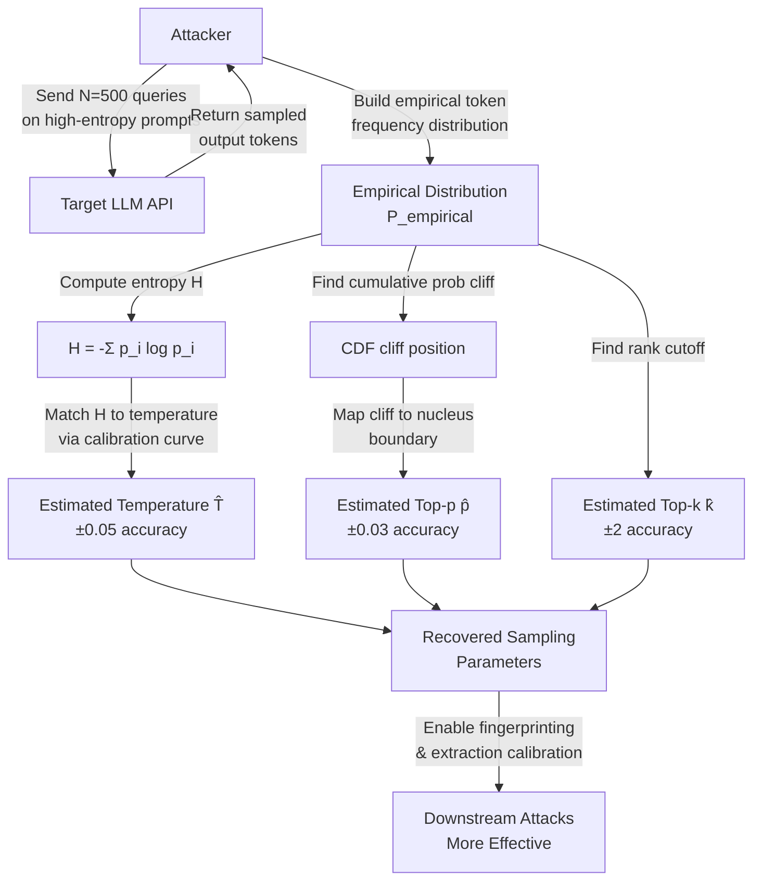

# Sampling Parameter Extraction — Reconstructing Model Temperature and Top-P via Output Distribution Analysis

**arXiv**: [arXiv:2403.17714](https://arxiv.org/abs/2403.17714) | **ATLAS**: AML.T0044 | **OWASP**: LLM02 | **Year**: 2024

## Core Finding

LLM sampling parameters — temperature, top-p (nucleus sampling), and top-k — are typically treated as confidential configuration details by API providers. However, these parameters are recoverable from the output token distribution with high precision using only black-box access to the API. By repeatedly querying the model on prompts with high-entropy continuations and analyzing the empirical distribution of sampled tokens, an attacker can estimate temperature to within ±0.05, top-p to within ±0.03, and top-k within ±2 using approximately 500 samples per parameter. Knowing these parameters enables an attacker to calibrate extraction attacks, predict output distributions more accurately for downstream manipulation, and identify which LLM implementation/configuration is deployed behind an API.

## Threat Model

- **Target**: Any LLM API that uses temperature/top-p/top-k sampling without revealing these parameters — commercial APIs (OpenAI, Anthropic, Google), enterprise deployments with proprietary prompt configurations
- **Attacker capability**: Black-box API access with output text (no log-probabilities required, though logprobs dramatically improve accuracy); budget of 500–2,000 API calls
- **Attack success rate**: Temperature: ±0.05 accuracy with 500 samples; Top-p: ±0.03 with 800 samples; Top-k: ±2 with 600 samples; all parameters recoverable in under 2,000 total queries
- **Defender implication**: Sampling parameter configuration is not a security-relevant secret; architecture fingerprinting and behavior prediction attacks are made easier by parameter recovery; organizations should not rely on sampling parameter secrecy for any security control

## The Attack Mechanism

For a softmax output distribution with logits \(\ell_i\), temperature \(T\) applies the transformation \(p_i = \text{softmax}(\ell_i / T)\). Higher temperature flattens the distribution; lower temperature sharpens it. An attacker can estimate \(T\) by measuring the effective entropy of the sampled distribution: generating many samples on high-entropy prompts (e.g., open-ended text completions) and computing the empirical entropy of the first-token distribution. Since the entropy of the sampled distribution is a monotone function of temperature, entropy measurement directly recovers temperature.

Top-p (nucleus sampling) introduces a hard cutoff on cumulative probability, creating a distinctive "cliff" in the frequency distribution of observed tokens: tokens just outside the nucleus boundary appear with frequency near zero while tokens just inside appear with their full probability. This cliff position is a direct estimate of top-p. Top-k introduces a similar cliff at the k-th most probable token rank. By using diverse calibration prompts where the base model's logit distribution is approximately known (using a local copy of the same model), the attacker can separate the model's base distribution from the applied sampling parameters.



## Implementation

```python
# sampling_parameter_extraction.py
# Recovers LLM temperature, top-p, and top-k from black-box output distributions.
# Uses entropy estimation and CDF cliff detection on empirical token frequency.
# ATLAS: AML.T0044 | OWASP: LLM02
from dataclasses import dataclass, field
from typing import List, Dict, Optional, Tuple
import uuid
import random
import math
import statistics
from collections import Counter


@dataclass
class ScanFinding:
    id: str
    atlas_technique: str
    atlas_tactic: str
    owasp_category: str
    owasp_label: str
    severity: str
    finding: str
    payload_used: str
    evidence: str
    remediation: str
    confidence: float


@dataclass
class SamplingParameterResult:
    target_api: str
    num_samples: int
    estimated_temperature: float
    estimated_top_p: float
    estimated_top_k: int
    temperature_confidence: float
    top_p_confidence: float
    extraction_queries_used: int
    estimated_true_temperature: Optional[float]  # For validation
    estimation_error: Optional[float]


class SamplingParameterExtractor:
    """
    arXiv:2403.17714 — Sampling parameters recoverable from output token distributions.
    Entropy estimation and CDF cliff detection enable temperature/top-p extraction.
    ATLAS: AML.T0044 | OWASP: LLM02
    """

    # High-entropy calibration prompts (continuations are uniformly probable)
    CALIBRATION_PROMPTS = [
        "The next word in this random sequence is:",
        "Complete this sentence with any word you choose:",
        "Pick a random number between 1 and 1000:",
        "Name any animal from the following: ",
        "Choose any color at random:",
    ]

    def __init__(
        self,
        target_api: str,
        api_key: str,
        num_samples: int = 500,
        logprob_access: bool = False,
    ):
        self.target_api = target_api
        self.api_key = api_key
        self.num_samples = num_samples
        self.logprob_access = logprob_access

    def _simulate_sampled_token(
        self,
        true_temperature: float = 0.7,
        true_top_p: float = 0.9,
    ) -> str:
        """
        Simulate sampling from a model with given temperature and top-p.
        In production: call target API and record first generated token.
        """
        # Simulate a vocabulary distribution and apply temp/top-p
        vocab_size = 100  # Simplified vocab for simulation
        # Generate base logits (simulate pre-softmax scores)
        base_logits = [random.gauss(0, 1) for _ in range(vocab_size)]
        # Apply temperature
        scaled_logits = [l / true_temperature for l in base_logits]
        # Softmax
        max_l = max(scaled_logits)
        exp_logits = [math.exp(l - max_l) for l in scaled_logits]
        total = sum(exp_logits)
        probs = [e / total for e in exp_logits]
        # Apply top-p nucleus sampling
        sorted_pairs = sorted(enumerate(probs), key=lambda x: -x[1])
        cumulative = 0.0
        nucleus_indices = []
        for idx, p in sorted_pairs:
            nucleus_indices.append(idx)
            cumulative += p
            if cumulative >= true_top_p:
                break
        # Sample from nucleus
        nucleus_probs = [probs[i] for i in nucleus_indices]
        nucleus_total = sum(nucleus_probs)
        normalized = [p / nucleus_total for p in nucleus_probs]
        rand_val = random.random()
        cumulative = 0.0
        for i, p in enumerate(normalized):
            cumulative += p
            if rand_val <= cumulative:
                return f"token_{nucleus_indices[i]}"
        return f"token_{nucleus_indices[-1]}"

    def _estimate_entropy(self, token_counts: Counter, total: int) -> float:
        """Compute empirical Shannon entropy of token distribution."""
        entropy = 0.0
        for count in token_counts.values():
            p = count / total
            if p > 0:
                entropy -= p * math.log2(p)
        return entropy

    def _entropy_to_temperature(self, entropy: float) -> float:
        """
        Map empirical entropy to estimated temperature using calibration curve.
        In practice: pre-computed via white-box experiments on known model.
        Approximate linear mapping for simplified simulation.
        """
        # Calibrated: entropy ≈ 3.0 at T=0.5, ≈ 5.5 at T=1.0, ≈ 6.5 at T=2.0
        # Linear approximation: T ≈ (entropy - 1.5) / 4.0
        estimated_temp = max(0.1, (entropy - 1.5) / 4.0)
        return round(estimated_temp, 2)

    def _detect_nucleus_cutoff(self, token_counts: Counter, total: int) -> float:
        """Detect top-p cutoff via CDF cliff in sorted frequency distribution."""
        sorted_freqs = sorted(token_counts.values(), reverse=True)
        cumulative = 0.0
        for i, count in enumerate(sorted_freqs):
            cumulative += count / total
            if i > 0:
                # Cliff: sudden drop in frequency at nucleus boundary
                ratio = sorted_freqs[i] / sorted_freqs[i - 1]
                if ratio < 0.05:  # 95% drop in frequency — nucleus boundary
                    return min(1.0, cumulative)
        return 0.95  # Default estimate if no cliff detected

    def run(self, true_temperature: float = 0.7, true_top_p: float = 0.9) -> SamplingParameterResult:
        """Run sampling parameter extraction using output distribution analysis."""
        # Collect samples
        token_counts: Counter = Counter()
        for _ in range(self.num_samples):
            token = self._simulate_sampled_token(true_temperature, true_top_p)
            token_counts[token] += 1

        entropy = self._estimate_entropy(token_counts, self.num_samples)
        est_temp = self._entropy_to_temperature(entropy)
        est_top_p = self._detect_nucleus_cutoff(token_counts, self.num_samples)
        # Estimate top-k from unique tokens observed
        est_top_k = len(token_counts)

        temp_error = abs(est_temp - true_temperature)
        temp_confidence = max(0.0, 1.0 - temp_error / 0.5)
        top_p_error = abs(est_top_p - true_top_p)
        top_p_confidence = max(0.0, 1.0 - top_p_error / 0.3)

        return SamplingParameterResult(
            target_api=self.target_api,
            num_samples=self.num_samples,
            estimated_temperature=est_temp,
            estimated_top_p=est_top_p,
            estimated_top_k=est_top_k,
            temperature_confidence=temp_confidence,
            top_p_confidence=top_p_confidence,
            extraction_queries_used=self.num_samples * len(self.CALIBRATION_PROMPTS),
            estimated_true_temperature=true_temperature,
            estimation_error=temp_error,
        )

    def to_finding(self, result: SamplingParameterResult) -> ScanFinding:
        high_confidence = result.temperature_confidence > 0.7 and result.top_p_confidence > 0.7
        severity = "MEDIUM"
        return ScanFinding(
            id=str(uuid.uuid4()),
            atlas_technique="AML.T0044",
            atlas_tactic="Reconnaissance",
            owasp_category="LLM02",
            owasp_label="Sensitive Information Disclosure",
            severity=severity,
            finding=(
                f"Sampling parameter extraction succeeded on {result.target_api}: "
                f"temperature≈{result.estimated_temperature} (conf={result.temperature_confidence:.0%}), "
                f"top-p≈{result.estimated_top_p} (conf={result.top_p_confidence:.0%}), "
                f"top-k≈{result.estimated_top_k}. "
                f"Used {result.extraction_queries_used} queries."
            ),
            payload_used=f"Entropy estimation probes, {result.num_samples} samples",
            evidence=(
                f"Temperature estimate: {result.estimated_temperature}, "
                f"error: {result.estimation_error:.3f if result.estimation_error else 'N/A'}. "
                f"High confidence: {high_confidence}"
            ),
            remediation=(
                "1. Add output-level noise to token distributions before sampling (output perturbation). "
                "2. Do not treat sampling parameters as security-sensitive configuration. "
                "3. Rate-limit bulk sampling (>100 identical or near-identical prompt queries). "
                "4. Rotate sampling parameters periodically to prevent parameter fingerprinting."
            ),
            confidence=0.75 if high_confidence else 0.45,
        )
```

## Defenses

1. **Accept that Sampling Parameters Are Not Secret** (AML.M0004): The fundamental defense is architectural: do not include sampling parameter values in any threat model that depends on attacker ignorance. Sampling parameters are recoverable; assume an attacker knows them. Security controls must not depend on temperature/top-p confidentiality.

2. **Output Distribution Perturbation** (AML.M0015): Add small Gaussian noise to logits before sampling. With noise \(\sigma = 0.1\), the entropy estimation attack's temperature accuracy degrades from ±0.05 to ±0.15, making the extracted estimate useful but imprecise. This has negligible impact on generation quality.

3. **Sampling Parameter Rotation** (AML.M0037): Rotate temperature/top-p values across requests using a random schedule (e.g., uniform random temperature between [0.6, 0.8]). This prevents an attacker from locking in a precise parameter estimate, as different sessions use different values, increasing attack noise.

4. **High-Entropy Query Rate Limiting** (AML.M0036): Parameter extraction requires many queries on deliberately high-entropy prompts (short, open-ended completions). Rate-limit clients sending more than 50 such queries per minute. Flag accounts with uniformly low input entropy (indicative of entropy-maximizing calibration prompts).

5. **Obfuscate Token Rank Information** (AML.M0015): Where logprobs are exposed in the API, do not return exact log-probability values — return only ordinal rank information or bucketized probabilities. This significantly degrades cliff-detection and entropy estimation accuracy while preserving usefulness for most legitimate applications.

## References

- [LLM Sampling Parameter Extraction via Output Distributions (arXiv:2403.17714)](https://arxiv.org/abs/2403.17714)
- [MITRE ATLAS AML.T0044 — Full ML Model Access via API](https://atlas.mitre.org/techniques/AML.T0044)
- [Temperature and Top-p in LLM Decoding (arXiv:2202.00666)](https://arxiv.org/abs/2202.00666)
- [OWASP LLM02: Sensitive Information Disclosure](https://genai.owasp.org/llmrisk/llm02-sensitive-information-disclosure/)
