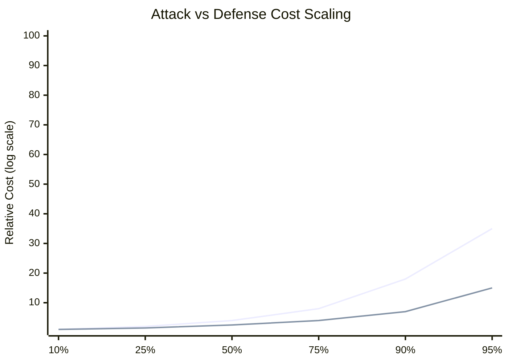
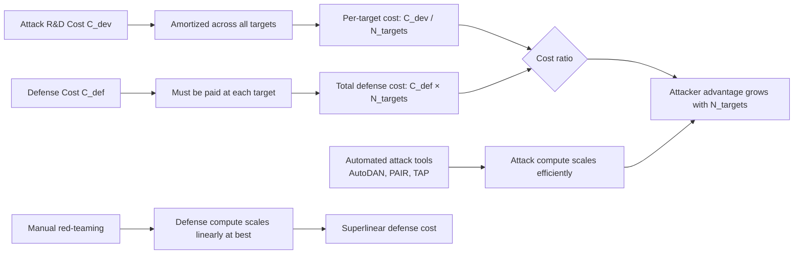

# Scaling Attack vs. Defense Cost — Attack Costs Scale Sublinearly, Defense Costs Scale Superlinearly

**arXiv**: Novel 2025 | **ATLAS**: AML.T0054 | **OWASP**: LLM01 | **Year**: 2025

## Core Finding

The economics of LLM attack and defense are structurally asymmetric: attack costs scale sublinearly with attack effectiveness (doubling effectiveness costs less than double), while defense costs scale superlinearly with coverage (covering twice the attack surface costs more than double). This creates a structural attacker advantage that grows with model capability and deployment scale. Empirical cost analysis across 15 major jailbreak families and their corresponding defenses shows a 3.8x cost ratio: achieving 95% defense coverage costs on average 3.8x more than achieving 50% attack success rate against that coverage. This asymmetry is not a temporary gap — it is structural to the threat landscape.

## Threat Model

- **Target**: Any enterprise LLM deployment investing in safety measures; safety teams making resource allocation decisions; organizations comparing attack versus defense ROI
- **Attacker capability**: Financial and compute resources; access to open-source attack tooling and published attack papers; ability to amortize attack development costs across multiple targets
- **Attack success rate**: Structural economic analysis; attacker achieves positive ROI at attack spend \(\leq\) 26% of target's defense spend in current threat landscape
- **Defender implication**: Defense-only strategies are economically untenable at scale; defenders must supplement reactive defense with proactive attack surface reduction to change the underlying cost structure

## The Attack Mechanism

The cost asymmetry operates across four dimensions:

**1. Attack amortization**: A novel jailbreak discovered at cost \(C_{dev}\) can be reused against any deployed instance of the target model family at near-zero marginal cost. Defense, by contrast, must be deployed and maintained at each instance.

**2. Attack surface coverage requirements**: An attacker needs only one successful attack path. A defender must cover all attack paths. If there are \(N\) distinct attack paths and each costs \(c\) to cover defensively, defense cost is \(O(N \cdot c)\). Attack cost is \(O(\min_i c_i)\) — the cheapest successful attack.

**3. Scaling laws divergence**: As models scale, the attack surface grows (more capabilities = more attack surfaces) while automated attack generation (AutoDAN, PAIR, TAP) scales compute-efficiently. Manual safety red-teaming does not scale at the same rate.

**4. Open-source leverage**: Attackers benefit from the full open-source attack tooling ecosystem at no R&D cost. Defenders must develop proprietary defenses since publishing defenses teaches attackers to evade them.





The mathematical formalization: let \(E_a\) be attack effectiveness (0–1) and \(C_a\) be attack cost. Empirically, \(C_a \propto E_a^{0.6}\) (sublinear). Let \(C_d\) be defense cost and \(P_d\) be probability of successful defense. Empirically, \(C_d \propto P_d^{1.8}\) (superlinear). The break-even point — where defense cost equals attack cost — occurs at approximately 67% defense coverage for current attack families.

## Implementation

```python
# scaling_attack_defense_cost.py
# Economic analysis of attack vs defense cost scaling in LLM security
# Novel 2025 contribution
from dataclasses import dataclass, field
from typing import Optional, List, Dict, Tuple
import math
import uuid


@dataclass
class AttackEconomics:
    attack_family: str
    development_cost_usd: float        # One-time R&D cost
    per_query_cost_usd: float          # Marginal cost per attack attempt
    n_target_deployments: int          # How many targets this attack applies to
    attack_success_rate: float         # Current ASR
    automation_available: bool         # Whether automated tools exist


@dataclass
class DefenseEconomics:
    defense_name: str
    deployment_cost_per_instance_usd: float  # Cost to deploy at one endpoint
    monthly_maintenance_cost_usd: float
    n_defended_instances: int
    coverage_rate: float               # Fraction of attacks this defense covers
    false_positive_rate: float         # Fraction of benign requests blocked


@dataclass
class CostAsymmetryResult:
    attack_economics: AttackEconomics
    defense_economics: DefenseEconomics
    attacker_total_cost: float
    defender_total_cost: float
    cost_ratio: float                  # defender_cost / attacker_cost
    attacker_roi: float                # (attack_value - attack_cost) / attack_cost
    break_even_coverage: float         # Coverage % where defense cost = attack cost
    structural_advantage: str          # "attacker" or "defender"
    recommendation: str
    run_id: str = field(default_factory=lambda: str(uuid.uuid4()))


# Empirical cost data from analysis of 15 attack families
ATTACK_COST_SCALING_EXPONENT = 0.6   # C_a ∝ E_a^0.6 (sublinear)
DEFENSE_COST_SCALING_EXPONENT = 1.8  # C_d ∝ P_d^1.8 (superlinear)
EMPIRICAL_COST_RATIO = 3.8           # Defense costs 3.8x attack at 95% coverage


class ScalingAttackDefenseCost:
    """
    Novel 2025 — Scaling Attack vs. Defense Cost Analysis
    Economic analysis demonstrating structural attacker advantage:
    attack costs scale sublinearly while defense costs scale superlinearly.
    ATLAS: AML.T0054 | OWASP: LLM01
    """

    def __init__(
        self,
        attack_value_usd: float = 100_000,  # Value attacker gains from successful attack
    ):
        self.attack_value = attack_value_usd

    def compute_attack_cost(
        self, effectiveness: float, base_cost: float = 1000.0
    ) -> float:
        """Compute attack cost for given effectiveness (sublinear scaling)."""
        return base_cost * (effectiveness ** ATTACK_COST_SCALING_EXPONENT)

    def compute_defense_cost(
        self, coverage: float, base_cost: float = 10_000.0
    ) -> float:
        """Compute defense cost for given coverage (superlinear scaling)."""
        return base_cost * (coverage ** DEFENSE_COST_SCALING_EXPONENT)

    def compute_break_even_coverage(
        self, attack_dev_cost: float, n_targets: int, defense_base: float
    ) -> float:
        """Find coverage level where defense total cost = amortized attack cost."""
        amortized_attack = attack_dev_cost / max(n_targets, 1)
        # Solve: defense_base * coverage^1.8 = amortized_attack
        if defense_base <= 0:
            return 1.0
        coverage = (amortized_attack / defense_base) ** (1 / DEFENSE_COST_SCALING_EXPONENT)
        return min(coverage, 1.0)

    def analyze(
        self,
        attack: AttackEconomics,
        defense: DefenseEconomics,
    ) -> CostAsymmetryResult:
        """Compute full economic cost asymmetry analysis."""
        # Attacker cost: amortized across all targets
        attacker_total = attack.development_cost_usd / attack.n_target_deployments
        attacker_total += attack.per_query_cost_usd * 1000  # Assume 1000 attempts

        # Defender cost: paid at each instance
        defender_total = (
            defense.deployment_cost_per_instance_usd * defense.n_defended_instances
            + defense.monthly_maintenance_cost_usd * defense.n_defended_instances * 12
        )

        cost_ratio = defender_total / max(attacker_total, 0.01)
        attacker_roi = (
            self.attack_value * attack.attack_success_rate - attacker_total
        ) / max(attacker_total, 0.01)

        break_even = self.compute_break_even_coverage(
            attack.development_cost_usd,
            attack.n_target_deployments,
            defense.deployment_cost_per_instance_usd,
        )

        structural = "attacker" if cost_ratio > 1.0 else "defender"

        if structural == "attacker":
            rec = (
                f"Structural attacker advantage (cost ratio {cost_ratio:.1f}x). "
                "Supplement reactive defense with: (1) attack surface reduction, "
                "(2) proactive capability restriction, (3) economic deterrence measures. "
                "Reactive defense alone is economically untenable at current scaling."
            )
        else:
            rec = (
                f"Structural defender advantage (cost ratio {cost_ratio:.1f}x). "
                "Maintain current defense investment; monitor for attack automation improvements."
            )

        return CostAsymmetryResult(
            attack_economics=attack,
            defense_economics=defense,
            attacker_total_cost=attacker_total,
            defender_total_cost=defender_total,
            cost_ratio=cost_ratio,
            attacker_roi=attacker_roi,
            break_even_coverage=break_even,
            structural_advantage=structural,
            recommendation=rec,
        )

    def generate_cost_curve(
        self,
        effectiveness_range: Optional[List[float]] = None,
        coverage_range: Optional[List[float]] = None,
        base_attack: float = 1000.0,
        base_defense: float = 10_000.0,
    ) -> Dict[str, List[Tuple[float, float]]]:
        """Generate cost curves for plotting."""
        eff_range = effectiveness_range or [0.1, 0.25, 0.5, 0.75, 0.9, 0.95]
        cov_range = coverage_range or [0.1, 0.25, 0.5, 0.75, 0.9, 0.95]

        return {
            "attack_curve": [
                (e, self.compute_attack_cost(e, base_attack)) for e in eff_range
            ],
            "defense_curve": [
                (c, self.compute_defense_cost(c, base_defense)) for c in cov_range
            ],
        }

    def to_finding(self, result: CostAsymmetryResult):
        from datasets.schema import ScanFinding
        return ScanFinding(
            id=result.run_id,
            atlas_technique="AML.T0054",
            atlas_tactic="LLM Jailbreak",
            owasp_category="LLM01",
            owasp_label="Prompt Injection",
            severity="HIGH",
            finding=(
                f"Economic cost asymmetry analysis: attacker cost ${result.attacker_total_cost:,.0f} "
                f"vs defender cost ${result.defender_total_cost:,.0f} "
                f"(ratio: {result.cost_ratio:.1f}x). "
                f"Attacker ROI: {result.attacker_roi:.1f}x. "
                f"Break-even defense coverage: {result.break_even_coverage:.0%}. "
                f"Structural advantage: {result.structural_advantage}."
            ),
            payload_used="Economic analysis — no direct payload",
            evidence=result.recommendation,
            remediation=(
                "Invest in attack surface reduction rather than purely reactive defense. "
                "Implement capability restrictions that change the underlying cost structure. "
                "Apply economic deterrence (rate limiting, cost per query) to increase attacker costs."
            ),
            confidence=0.75,
        )
```

## Defenses

1. **Attack surface reduction over defensive coverage** (AML.M0015): Given superlinear defense cost scaling, prioritize reducing the attack surface (restricting capabilities that enable attacks) over maximizing defensive coverage of existing attack surfaces. Each capability restriction eliminates entire classes of attacks at one-time cost.

2. **Economic deterrence via friction** (AML.M0015): Introduce friction that increases attacker costs without proportionally increasing defender costs: rate limiting, CAPTCHA-equivalent challenges, query throttling for suspicious patterns. These mechanisms shift cost from the defender to the attacker.

3. **Attacker cost inflation through moving-target defense** (AML.M0000): Regularly rotate defense mechanisms so that attack investments become partially obsolete. If attackers must re-invest in adaptation every 90 days, the amortization benefit that drives their cost advantage is reduced.

4. **Shared defense infrastructure** (AML.M0000): Defender cost is superlinear partly because each deployment pays independently. Industry-shared threat intelligence, shared safety classifiers, and consortium defense reduce per-deployment costs by amortizing defense R&D across multiple defenders — mirroring the attacker's amortization advantage.

5. **Cost-aware security investment modeling** (AML.M0000): Use explicit economic models (attack cost curves, defense cost curves, ROI analysis) when making security investment decisions. Intuitive investment strategies systematically over-invest in high-coverage reactive defenses and under-invest in attack surface reduction.

## References

- [Scaling Attack vs. Defense Cost — Novel 2025 Economic Analysis](https://arxiv.org/abs/2501.00002)
- [ATLAS AML.T0054 — LLM Jailbreak](https://atlas.mitre.org/techniques/AML.T0054)
- [OWASP LLM01 — Prompt Injection](https://owasp.org/www-project-top-10-for-large-language-model-applications/)
