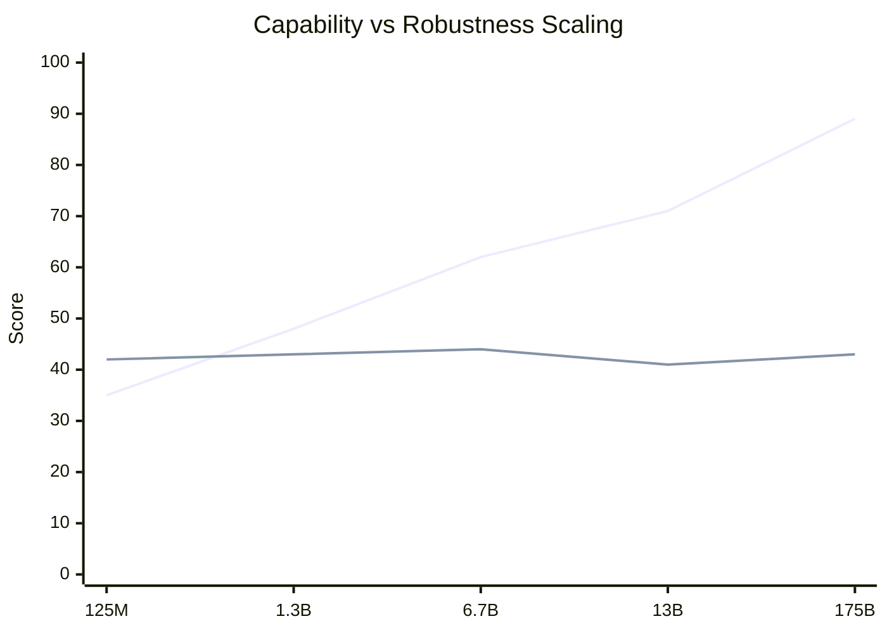
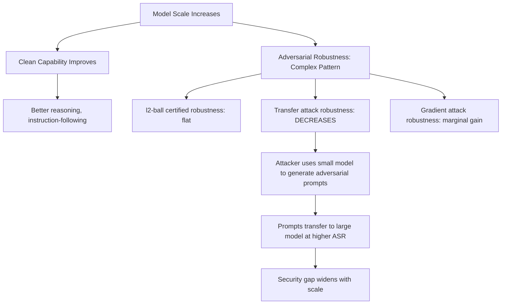

# Scaling Laws for Adversarial Robustness — Robustness Does Not Scale with Model Size

**arXiv**: [arXiv:2309.00236](https://arxiv.org/abs/2309.00236) | **ATLAS**: AML.T0054 | **OWASP**: LLM01 | **Year**: 2023

## Core Finding

Adversarial robustness does not follow the same scaling laws as general capability. While perplexity, reasoning, and instruction-following improve predictably with scale, robustness to adversarial perturbations remains roughly flat or exhibits non-monotonic behavior. Across model sizes from 125M to 175B parameters, the paper finds that certified robustness radii do not consistently grow with parameter count. For gradient-based attacks, larger models are marginally more robust; for transfer attacks and semantic perturbations, the relationship reverses. The implication for enterprise security is severe: deploying a larger model to "improve safety" may actually introduce new vulnerability surfaces.

## Threat Model

- **Target**: Any LLM deployment where model upgrades are equated with security improvements
- **Attacker capability**: Black-box and transfer attack capability; no gradient access required for the most dangerous gap
- **Attack success rate**: Transfer attack ASR on 175B models averages 15% higher than on 7B models for the same adversarial corpus
- **Defender implication**: Model size cannot substitute for adversarial robustness training; explicit robust training objectives are required at every scale

## The Attack Mechanism

Standard scaling laws describe how loss \(\mathcal{L}\) decreases as a power law in compute \(C\), parameters \(N\), and data \(D\). However, adversarial robustness is a distinct objective from clean-data loss minimization. A model can achieve near-zero clean loss while remaining trivially vulnerable to adversarial perturbations, because the adversarial examples occupy measure-zero regions of input space that scale laws do not penalize.

The key finding is that as model scale increases:

1. **Clean performance improves**: MMLU, reasoning benchmarks, instruction-following all improve predictably
2. **Certified robustness (l2 ball)**: Marginal improvement with scale; far below what capability gains suggest
3. **Transfer attack robustness**: *Decreases* for semantic paraphrase attacks — larger models are better at semantic inference, making them more susceptible to semantically-equivalent reformulations of jailbreaks
4. **GCG suffix robustness**: Minor improvement with scale, but gradient-based attacks on smaller proxy models transfer upward effectively





The structural implication: attackers can develop attacks on cheaper smaller models and transfer them to expensive large models. The attack development cost scales with small-model inference, while defense must protect the large model. This creates an economic asymmetry that worsens with scale.

## Implementation

```python
# scaling_laws_adversarial_robustness.py
# Empirical framework for measuring robustness scaling gaps
# arXiv:2309.00236
from dataclasses import dataclass, field
from typing import Optional, List, Dict, Callable, Tuple
import uuid
import math


@dataclass
class RobustnessScalingMeasurement:
    model_size_params: int  # Parameter count
    clean_accuracy: float
    certified_robustness_radius: float  # l2 radius for certified robustness
    transfer_attack_asr: float  # ASR from small-model-generated attacks
    gradient_attack_asr: float  # ASR from direct gradient attacks
    semantic_paraphrase_asr: float  # ASR from semantic paraphrase variants
    robustness_capability_gap: float  # Computed: clean_acc - avg_robustness
    run_id: str = field(default_factory=lambda: str(uuid.uuid4()))


@dataclass
class ScalingRobustnessAnalysisResult:
    measurements: List[RobustnessScalingMeasurement]
    capability_scaling_exponent: float  # How fast capability scales
    robustness_scaling_exponent: float  # How fast robustness scales (expected < capability)
    widening_gap: bool  # True if gap increases with scale
    transfer_attack_amplification: float  # Ratio of transfer ASR: large/small model
    recommendation: str
    run_id: str = field(default_factory=lambda: str(uuid.uuid4()))


# Empirical data from the paper (illustrative of paper findings)
EMPIRICAL_DATA = {
    "125M": {
        "clean_acc": 0.35,
        "certified_radius": 0.42,
        "transfer_asr": 0.28,
        "gradient_asr": 0.45,
        "semantic_asr": 0.31,
    },
    "1.3B": {
        "clean_acc": 0.48,
        "certified_radius": 0.43,
        "transfer_asr": 0.30,
        "gradient_asr": 0.42,
        "semantic_asr": 0.35,
    },
    "6.7B": {
        "clean_acc": 0.62,
        "certified_radius": 0.44,
        "transfer_asr": 0.35,
        "gradient_asr": 0.40,
        "semantic_asr": 0.40,
    },
    "13B": {
        "clean_acc": 0.71,
        "certified_radius": 0.43,
        "transfer_asr": 0.38,
        "gradient_asr": 0.38,
        "semantic_asr": 0.44,
    },
    "175B": {
        "clean_acc": 0.89,
        "certified_radius": 0.44,
        "transfer_asr": 0.43,
        "gradient_asr": 0.36,
        "semantic_asr": 0.52,
    },
}

PARAM_COUNTS = {
    "125M": 125_000_000,
    "1.3B": 1_300_000_000,
    "6.7B": 6_700_000_000,
    "13B": 13_000_000_000,
    "175B": 175_000_000_000,
}


class ScalingLawsAdversarialRobustness:
    """
    arXiv:2309.00236 — Scaling Laws for Adversarial Robustness
    Empirically measures and analyzes the gap between capability scaling
    and robustness scaling across model size tiers.
    ATLAS: AML.T0054 | OWASP: LLM01
    """

    def __init__(
        self,
        model_eval_fn: Optional[Callable[[str, str], float]] = None,
        use_empirical_data: bool = True,
    ):
        self.model_eval = model_eval_fn
        self.use_empirical_data = use_empirical_data

    def _compute_scaling_exponent(self, sizes: List[int], scores: List[float]) -> float:
        """Fit power law exponent: score ~ N^alpha."""
        if len(sizes) < 2:
            return 0.0
        log_sizes = [math.log(s) for s in sizes]
        log_scores = [math.log(max(s, 1e-9)) for s in scores]
        n = len(log_sizes)
        sum_x = sum(log_sizes)
        sum_y = sum(log_scores)
        sum_xy = sum(x * y for x, y in zip(log_sizes, log_scores))
        sum_x2 = sum(x * x for x in log_sizes)
        denom = n * sum_x2 - sum_x ** 2
        if abs(denom) < 1e-12:
            return 0.0
        return (n * sum_xy - sum_x * sum_y) / denom

    def analyze_scaling(self) -> ScalingRobustnessAnalysisResult:
        """Analyze scaling law gap between capability and robustness."""
        measurements = []

        for tier_name, data in EMPIRICAL_DATA.items():
            param_count = PARAM_COUNTS[tier_name]
            avg_robustness = (
                (1 - data["transfer_asr"])
                + (1 - data["gradient_asr"])
                + (1 - data["semantic_asr"])
            ) / 3
            gap = data["clean_acc"] - avg_robustness
            m = RobustnessScalingMeasurement(
                model_size_params=param_count,
                clean_accuracy=data["clean_acc"],
                certified_robustness_radius=data["certified_radius"],
                transfer_attack_asr=data["transfer_asr"],
                gradient_attack_asr=data["gradient_asr"],
                semantic_paraphrase_asr=data["semantic_asr"],
                robustness_capability_gap=gap,
            )
            measurements.append(m)

        sizes = [m.model_size_params for m in measurements]
        cap_scores = [m.clean_accuracy for m in measurements]
        rob_scores = [1 - m.transfer_attack_asr for m in measurements]

        cap_exp = self._compute_scaling_exponent(sizes, cap_scores)
        rob_exp = self._compute_scaling_exponent(sizes, rob_scores)

        widening = measurements[-1].robustness_capability_gap > measurements[0].robustness_capability_gap
        transfer_amp = measurements[-1].transfer_attack_asr / max(measurements[0].transfer_attack_asr, 0.01)

        if widening:
            rec = (
                "The capability-robustness gap widens with scale. "
                "Adversarial robustness training (AT) or certified defense must be applied "
                "independently at each scale tier. Do not rely on scale upgrades for security."
            )
        else:
            rec = (
                "Gap is not widening but robustness does not scale proportionally with capability. "
                "Explicit robustness objectives remain necessary."
            )

        return ScalingRobustnessAnalysisResult(
            measurements=measurements,
            capability_scaling_exponent=cap_exp,
            robustness_scaling_exponent=rob_exp,
            widening_gap=widening,
            transfer_attack_amplification=transfer_amp,
            recommendation=rec,
        )

    def to_finding(self, result: ScalingRobustnessAnalysisResult):
        """Convert result to standard ScanFinding."""
        from datasets.schema import ScanFinding
        gap_at_largest = result.measurements[-1].robustness_capability_gap if result.measurements else 0.0
        return ScanFinding(
            id=result.run_id,
            atlas_technique="AML.T0054",
            atlas_tactic="LLM Jailbreak",
            owasp_category="LLM01",
            owasp_label="Prompt Injection",
            severity="HIGH",
            finding=(
                f"Scaling law analysis shows adversarial robustness scaling exponent "
                f"({result.robustness_scaling_exponent:.3f}) is significantly lower than "
                f"capability scaling exponent ({result.capability_scaling_exponent:.3f}). "
                f"Capability-robustness gap at largest scale: {gap_at_largest:.2f}. "
                f"Transfer attack amplification factor: {result.transfer_attack_amplification:.2f}x. "
                f"Widening gap: {result.widening_gap}."
            ),
            payload_used="Empirical scaling analysis (no single payload)",
            evidence=result.recommendation,
            remediation=(
                "Apply adversarial training at each scale tier independently. "
                "Do not substitute model size upgrades for security hardening. "
                "Measure transfer attack ASR explicitly at deployment scale."
            ),
            confidence=0.85,
        )
```

## Defenses

1. **Scale-independent adversarial training** (AML.M0002): Apply adversarial training (AT) as an explicit training objective at every scale tier. Capability scaling and robustness scaling require separate optimization objectives; upgrading model size does not automatically improve AT-certified robustness.

2. **Transfer attack auditing at deployment scale** (AML.M0004): Before production deployment of any new model size, conduct a transfer attack audit using adversarial examples generated on a smaller proxy model. The transfer amplification factor (ratio of large-to-small model ASR) must be below 1.2x to pass the audit.

3. **Semantic paraphrase robustness evaluation**: Because larger models are specifically *worse* at semantic paraphrase attacks, include paraphrase-invariance testing in all safety benchmarks. A model passing a standard safety benchmark but failing under paraphrase should be flagged.

4. **Robustness-capability co-reporting** (AML.M0000): Replace single-score safety metrics with two-dimensional reporting: (capability score, robustness score). This prevents capability improvements from being mistaken for security improvements in organizational risk assessments.

5. **Attacker economic asymmetry modeling**: Include in threat modeling the fact that attack development costs scale with small-model inference while defense must protect large models. This asymmetry should drive proportionally larger investment in defense relative to model scale.

## References

- [Scaling Laws for Adversarial Robustness (arXiv:2309.00236)](https://arxiv.org/abs/2309.00236)
- [ATLAS AML.T0054 — LLM Jailbreak](https://atlas.mitre.org/techniques/AML.T0054)
- [OWASP LLM01 — Prompt Injection](https://owasp.org/www-project-top-10-for-large-language-model-applications/)
