# Screen Reading Data Leakage: Unintended Sensitive Data Capture by Computer-Use Agents

**arXiv**: [arXiv:2410.14790](https://arxiv.org/abs/2410.14790) | **ATLAS**: AML.T0024 | **OWASP**: LLM02 | **Year**: 2024

## Core Finding

Computer-use LLM agents that operate via screenshot-based perception inadvertently capture and process sensitive information visible on the screen during task execution — including credentials, financial data, private messages, and PII — even when this data is unrelated to the assigned task. Researchers found that across 200 computer-use agent sessions, 43% contained at least one screenshot where credentials or PII were visible, and that these values were preserved in the agent's conversation history and potentially logged to provider inference APIs. This creates a systemic privacy risk independent of any active attack.

## Threat Model

- **Target**: Computer-use agent deployments (Claude Computer Use, GPT-4 with vision, open-source GUI agents) in enterprise environments
- **Attacker capability**: Passive — an attacker who obtains access to agent conversation logs or inference API logs can extract all sensitive data the agent observed
- **Attack success rate**: 43% of sessions contained credential/PII exposure; 78% of agents logged observed screen content verbatim
- **Defender implication**: Computer-use agents must be operated in sanitized screen environments; conversation logs require the same security treatment as credential vaults

## The Attack Mechanism

The attack is largely passive: when a computer-use agent is assigned a task (e.g., "Fill out this form"), it takes periodic screenshots of the screen to perceive the current state. If other windows, notifications, or background applications are visible in the screenshot — displaying password managers, email clients, chat messages, or financial dashboards — the agent's vision model processes this sensitive content as part of its perception.

The agent's text understanding of the screenshot is appended to the conversation history, which is sent to the inference API for the next action decision. This means sensitive screen content is transmitted to the LLM provider and stored in the conversation log. An attacker with access to the conversation log (via log exfiltration, compromised credentials, or provider-side breach) can reconstruct all sensitive data the agent observed.

```mermaid
flowchart LR
    Screen["User Screen\n(active task + password manager visible)"]
    Agent["Computer-Use Agent"]
    VisionModel["Vision Model\n(perceives all visible content)"]
    ConvHistory["Conversation History\n(includes sensitive content)"]
    InferenceAPI["LLM Inference API\n(receives conversation)"]
    AttackerLog["⚠ Attacker via\nlog access or API breach"]

    Screen -->|"Screenshot"| Agent
    Agent --> VisionModel
    VisionModel -->|"Transcribed: 'Password: hunter2'"| ConvHistory
    ConvHistory --> InferenceAPI
    InferenceAPI -.->|"Logs stored"| AttackerLog
```



## Implementation

```python
# screen_reading_data_leakage.py
# Detects and tracks sensitive data exposure in computer-use agent screenshots
from dataclasses import dataclass
from typing import Optional, List, Dict
import uuid
import re


@dataclass
class ScreenLeakageEvent:
    screenshot_id: str
    task_context: str
    detected_sensitive_patterns: List[str]
    screen_content_snippet: str
    transmitted_to_api: bool


@dataclass
class ScreenReadingLeakageResult:
    audit_id: str
    total_screenshots: int
    leakage_events: List[ScreenLeakageEvent]
    total_credential_exposures: int
    unique_sensitive_patterns: List[str]
    risk_level: str


class ScreenReadingDataLeakage:
    """
    Paper: arXiv:2410.14790
    Passive sensitive data capture via screenshot-based computer-use agent perception.
    ATLAS: AML.T0024 | OWASP: LLM02
    """

    SENSITIVE_PATTERNS: Dict[str, str] = {
        "password_field": r"(?i)(password|passwd|pwd)\s*[:=]\s*\S+",
        "api_key": r"(?i)(api[_\s]?key|token|secret)\s*[:=]\s*[A-Za-z0-9_\-]{16,}",
        "credit_card": r"\b\d{4}[\s\-]?\d{4}[\s\-]?\d{4}[\s\-]?\d{4}\b",
        "ssn": r"\b\d{3}-\d{2}-\d{4}\b",
        "email": r"\b[A-Za-z0-9._%+\-]+@[A-Za-z0-9.\-]+\.[A-Z|a-z]{2,}\b",
    }

    def __init__(self, task_description: str = "Fill out the web form"):
        self.task_description = task_description

    def scan_screenshot_text(
        self, screenshot_ocr_text: str, screenshot_id: str
    ) -> ScreenLeakageEvent:
        """Scan OCR text from a screenshot for sensitive data patterns."""
        detected: List[str] = []
        for pattern_name, pattern in self.SENSITIVE_PATTERNS.items():
            if re.search(pattern, screenshot_ocr_text):
                detected.append(pattern_name)

        return ScreenLeakageEvent(
            screenshot_id=screenshot_id,
            task_context=self.task_description,
            detected_sensitive_patterns=detected,
            screen_content_snippet=screenshot_ocr_text[:200],
            transmitted_to_api=bool(detected),  # agent sends all context to API
        )

    def run(self, screenshot_texts: List[str]) -> ScreenReadingLeakageResult:
        """Audit a session's screenshots for sensitive data leakage."""
        events: List[ScreenLeakageEvent] = []
        all_patterns: List[str] = []

        for i, text in enumerate(screenshot_texts):
            sid = f"screenshot_{i:04d}_{uuid.uuid4().hex[:6]}"
            event = self.scan_screenshot_text(text, sid)
            events.append(event)
            all_patterns.extend(event.detected_sensitive_patterns)

        leakage_events = [e for e in events if e.detected_sensitive_patterns]
        credential_count = sum(
            1 for p in all_patterns
            if "password" in p or "api_key" in p or "ssn" in p
        )
        risk = "CRITICAL" if credential_count > 0 else ("HIGH" if leakage_events else "LOW")

        return ScreenReadingLeakageResult(
            audit_id=str(uuid.uuid4()),
            total_screenshots=len(screenshot_texts),
            leakage_events=leakage_events,
            total_credential_exposures=credential_count,
            unique_sensitive_patterns=list(set(all_patterns)),
            risk_level=risk,
        )

    def to_finding(self, result: ScreenReadingLeakageResult):
        """Convert result to standard ScanFinding."""
        from datasets.schema import ScanFinding
        return ScanFinding(
            id=str(uuid.uuid4()),
            atlas_technique="AML.T0024",
            atlas_tactic="Collection",
            owasp_category="LLM02",
            owasp_label="Sensitive Information Disclosure",
            severity=result.risk_level,
            finding=(
                f"Screen reading leakage: {len(result.leakage_events)}/{result.total_screenshots} "
                f"screenshots contained sensitive data. "
                f"Credential exposures: {result.total_credential_exposures}. "
                f"Patterns: {result.unique_sensitive_patterns}"
            ),
            payload_used="Passive screenshot capture during task execution",
            evidence=str([e.detected_sensitive_patterns for e in result.leakage_events[:3]]),
            remediation=(
                "Run computer-use agents in isolated, sanitized desktop sessions. "
                "Blur or mask non-task-relevant windows before agent activation. "
                "Apply PII redaction to conversation logs before storage."
            ),
            confidence=0.85,
        )
```

## Defenses

1. **Isolated desktop session** (AML.M0003): Run computer-use agents in a dedicated virtual desktop or container with no access to the user's regular applications, windows, or notification areas. The agent should only see the specific application relevant to its task.

2. **Screenshot PII redaction**: Before passing screenshots to the vision model, apply a PII detection pipeline (using tools like Microsoft Presidio or AWS Comprehend) to blur or redact credential fields, financial data, and personal information not relevant to the task.

3. **Conversation log security**: Apply the same access controls to agent conversation logs as to credential vaults. Logs that contain transcribed screen content must be encrypted at rest and access-limited to authorized personnel.

4. **Minimal screen scope**: Configure the agent to take screenshots only of the specific application window or browser tab needed for the task. Full-screen captures expose unnecessary context.

5. **Audit trail for data exposure** (AML.M0014): Implement a post-session audit that scans conversation histories for sensitive data patterns. Flag sessions where credential or PII patterns were detected and trigger automatic log sanitization.

## References

- [arXiv:2410.14790 — Screen Reading Data Leakage in Computer-Use Agents](https://arxiv.org/abs/2410.14790)
- [ATLAS AML.T0024 — Exfiltration via ML Inference API](https://atlas.mitre.org/techniques/AML.T0024)
- [ATLAS AML.M0003 — Model Hardening](https://atlas.mitre.org/mitigations/AML.M0003)
