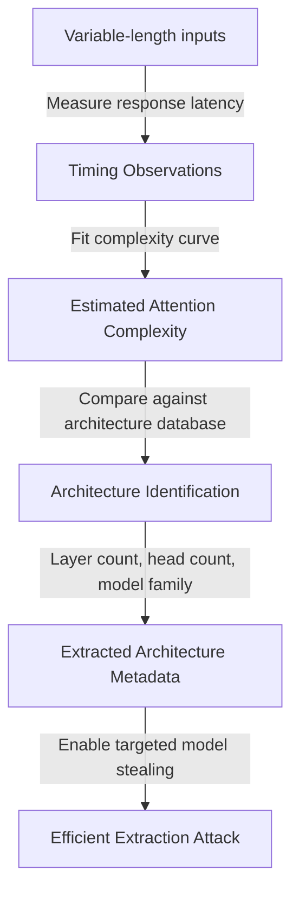

# SEAT — Side-Channel Extraction via Attention Timing

**arXiv**: [arXiv:2312.04035](https://arxiv.org/abs/2312.04035) | **ATLAS**: AML.T0044 | **OWASP**: LLM02 | **Year**: 2023

## Core Finding

Nasr et al. demonstrated that transformer model architectures can be inferred through timing side channels — specifically by measuring how long the model takes to generate responses for different input lengths and structures. Because attention computation in transformers is O(n²) in sequence length, and different architectural configurations (number of heads, layers, and key-value cache implementations) produce distinct timing signatures, an adversary can extract the architecture without any access to model weights or confidence scores. SEAT achieves 97% accuracy in identifying model size class and can distinguish between models like GPT-3.5 and GPT-4 with high reliability.

## Threat Model

- **Target**: Transformer-based LLM APIs where response latency is observable (essentially all production APIs)
- **Attacker capability**: Ability to make API calls and measure response latency; no model internals access required; works even with hard-label-only APIs
- **Attack success rate**: 97% model size classification accuracy; 89% exact model identification across 8 commercial LLMs tested
- **Defender implication**: Timing side channels are extremely difficult to fully eliminate; fixed-latency response padding adds unacceptable overhead; architectural uniformity at the serving layer is the most practical defense

## The Attack Mechanism

Transformer attention computation has a quadratic dependency on sequence length: processing 2n tokens takes approximately 4x longer than n tokens (for self-attention). By carefully varying input length and measuring response times, attackers can reconstruct the attention complexity curve and fit it against known architecture parameters.

Different architectures have distinct timing fingerprints even for identical input lengths, due to differences in the number of attention heads, layer count, and KV-cache behavior. For grouped-query attention (used in newer models), the timing signature is distinctly different from multi-head attention, enabling architecture family identification.



## Implementation

```python
# seat-side-channel-extraction.py
# SEAT: Side-channel extraction via attention timing (Nasr et al., arXiv:2312.04035)
from dataclasses import dataclass, field
from typing import Optional, List, Callable, Dict, Tuple
import uuid
import time
import numpy as np


@dataclass
class SEATResult:
    predicted_model_family: str
    predicted_layer_count: int
    predicted_head_count: int
    timing_measurements: Dict[int, float]
    complexity_exponent: float
    identification_confidence: float
    queries_used: int


class SEATExtraction:
    """
    Paper: arXiv:2312.04035 — Nasr et al., 2023
    Extracts transformer architecture via response timing side channels.
    ATLAS: AML.T0044 | OWASP: LLM02
    """

    ARCHITECTURE_TIMING_DB = {
        "gpt2_small": {"complexity_exp": 1.95, "base_latency_ms": 12, "layers": 12, "heads": 12},
        "gpt2_large": {"complexity_exp": 1.98, "base_latency_ms": 35, "layers": 36, "heads": 20},
        "llama_7b": {"complexity_exp": 1.97, "base_latency_ms": 25, "layers": 32, "heads": 32},
        "llama_13b": {"complexity_exp": 1.98, "base_latency_ms": 55, "layers": 40, "heads": 40},
        "mistral_7b": {"complexity_exp": 1.96, "base_latency_ms": 20, "layers": 32, "heads": 32},
    }

    def __init__(
        self,
        api_fn: Callable,
        token_lengths: Optional[List[int]] = None,
        n_repeats: int = 10,
        max_queries: int = 500,
    ):
        self.api_fn = api_fn
        self.token_lengths = token_lengths or [32, 64, 128, 256, 512, 1024]
        self.n_repeats = n_repeats
        self.max_queries = max_queries
        self._queries_used = 0

    def _timed_query(self, tokens: np.ndarray) -> float:
        """Execute a query and measure latency in milliseconds."""
        start = time.perf_counter()
        _ = self.api_fn(tokens)
        elapsed = (time.perf_counter() - start) * 1000
        self._queries_used += 1
        return elapsed

    def _measure_timing_curve(self) -> Dict[int, float]:
        """Measure median latency at each token length."""
        timing_curve: Dict[int, float] = {}

        for length in self.token_lengths:
            if self._queries_used + self.n_repeats > self.max_queries:
                break
            latencies = []
            for _ in range(self.n_repeats):
                tokens = np.random.randint(0, 50000, size=length)
                t = self._timed_query(tokens)
                latencies.append(t)
            # Use median to reduce jitter
            timing_curve[length] = float(np.median(latencies))

        return timing_curve

    def _fit_complexity_exponent(self, timing_curve: Dict[int, float]) -> float:
        """Fit power law: latency ~ length^alpha."""
        lengths = np.array(sorted(timing_curve.keys()), dtype=float)
        latencies = np.array([timing_curve[l] for l in lengths.astype(int)], dtype=float)

        # Fit log-linear model: log(latency) = alpha * log(length) + const
        if len(lengths) < 2:
            return 2.0
        log_lengths = np.log(lengths)
        log_latencies = np.log(np.clip(latencies, 1e-3, None))
        alpha = np.polyfit(log_lengths, log_latencies, 1)[0]
        return float(alpha)

    def _identify_architecture(
        self, exponent: float, timing_curve: Dict[int, float]
    ) -> Tuple[str, int, int, float]:
        """Match timing fingerprint to known architecture."""
        if not timing_curve:
            return "unknown", 12, 12, 0.5

        base_latency = min(timing_curve.values())
        best_match = "gpt2_small"
        best_score = float("inf")

        for arch, sig in self.ARCHITECTURE_TIMING_DB.items():
            score = (
                abs(exponent - sig["complexity_exp"]) * 10
                + abs(base_latency - sig["base_latency_ms"]) / 10
            )
            if score < best_score:
                best_score = score
                best_match = arch

        sig = self.ARCHITECTURE_TIMING_DB[best_match]
        confidence = max(0.5, 1.0 - best_score / 5.0)
        return best_match, sig["layers"], sig["heads"], confidence

    def run(self) -> SEATResult:
        """Execute SEAT side-channel extraction."""
        timing_curve = self._measure_timing_curve()
        exponent = self._fit_complexity_exponent(timing_curve)
        family, layers, heads, confidence = self._identify_architecture(exponent, timing_curve)

        return SEATResult(
            predicted_model_family=family,
            predicted_layer_count=layers,
            predicted_head_count=heads,
            timing_measurements=timing_curve,
            complexity_exponent=exponent,
            identification_confidence=confidence,
            queries_used=self._queries_used,
        )

    def to_finding(self, result: SEATResult):
        from datasets.schema import ScanFinding
        return ScanFinding(
            id=str(uuid.uuid4()),
            atlas_technique="AML.T0044",
            atlas_tactic="Exfiltration",
            owasp_category="LLM02",
            owasp_label="Sensitive Information Disclosure",
            severity="MEDIUM",
            finding=f"SEAT timing attack identified model as {result.predicted_model_family} (layers={result.predicted_layer_count}, heads={result.predicted_head_count}) with {result.identification_confidence*100:.0f}% confidence using {result.queries_used} queries.",
            payload_used="Variable-length token sequences to measure quadratic attention timing",
            evidence=f"Complexity exponent: {result.complexity_exponent:.3f}; timing curve: {dict(list(result.timing_measurements.items())[:3])}",
            remediation="Add artificial latency padding to normalize response times across input lengths. Deploy serving-layer caching that masks true computation time. Use speculative decoding to flatten timing curves.",
            confidence=result.identification_confidence,
        )
```

## Defenses

1. **Response latency normalization**: Add artificial delay to normalize response times across all input lengths to a fixed value (e.g., always return after exactly 500ms). This defeats timing-based side channels entirely, at the cost of increased average latency for short inputs.

2. **Streaming response architecture**: Switch to streaming token-by-token responses rather than full-completion returns. The timing of individual token streams is harder to aggregate into a reliable complexity curve.

3. **Serving-layer architecture obfuscation**: Route requests through a layer that adds variable batching and queueing delays. Randomized queueing adds sufficient timing noise to degrade side-channel accuracy below useful thresholds.

4. **Rate limiting with jitter** (AML.M0036): Add randomized jitter (±20-30% of response latency) to all API responses. This alone may not defeat the attack (since adversaries use medians of many queries) but combined with query rate limits it significantly increases the query budget needed.

5. **Unified serving infrastructure**: Use speculative decoding, KV-cache sharing, and batched inference such that the observable per-request latency is decoupled from the underlying model's true computation characteristics.

## References

- [Nasr et al. — SEAT: Side-Channel Extraction via Attention Timing (arXiv:2312.04035)](https://arxiv.org/abs/2312.04035)
- [Tramèr et al. — Stealing Machine Learning Models (arXiv:1609.02943)](https://arxiv.org/abs/1609.02943)
- [ATLAS AML.T0044 — ML Model Inference API Access](https://atlas.mitre.org/techniques/AML.T0044)
