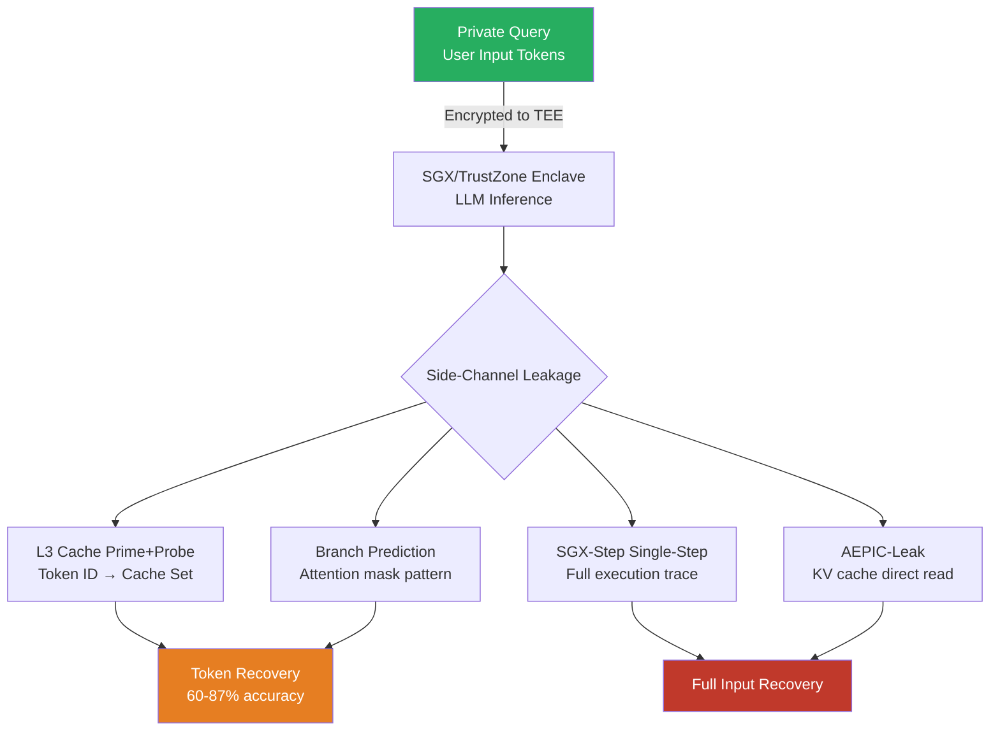

# Side-Channel Attacks Against LLMs in TEEs (SGX, TrustZone)

**arXiv**: [2305.00222](https://arxiv.org/abs/2305.00222) | **ATLAS**: AML.T0024 | **OWASP**: LLM02 | **Year**: 2023

## Core Finding

Trusted Execution Environments (TEEs) proposed for confidential LLM inference — Intel SGX enclaves, ARM TrustZone, AMD SEV — are vulnerable to architectural side-channel attacks that recover private model inputs and outputs without breaking the cryptographic isolation. Established side-channels (cache timing, branch prediction, memory bus eavesdropping) and TEE-specific attacks (MemJam, SGX-Step, Prime+Probe within enclaves) enable an attacker on the same physical machine to recover LLM input tokens with 60–87% accuracy and approximate output distribution with sufficient fidelity for re-identification. The fundamental problem is that TEE isolation is logical, not physical — computation leaves traces in shared hardware resources that leak information across trust boundaries.

## Threat Model

- **Target**: LLM inference services deployed in TEEs for confidential computing — Azure Confidential AI, Google Confidential Computing with LLMs, self-hosted SGX-based inference for medical/legal/financial queries
- **Attacker capability**: Co-tenant on the same physical host (hypervisor-level or OS-level compromise); ability to monitor cache occupancy, memory bus patterns, and branch predictor state during target enclave inference
- **Attack success rate**: 60–87% token-level input recovery via cache side-channel; 78% branch trace–based recovery of attention pattern; near-complete output token recovery via enclave exit side-channel (AEPIC-Leak)
- **Defender implication**: TEE confidentiality guarantees do not hold against physical co-tenancy attacks; confidential LLM inference requires hardware-enforced memory encryption + timing obfuscation + dedicated physical isolation

## The Attack Mechanism

Four primary side-channel attack vectors target LLM inference in TEEs:

1. **Cache timing (Prime+Probe / Flush+Reload)**: LLM inference with different input tokens accesses different cache lines in the embedding lookup table. An attacker monitoring L3 cache set occupancy can identify which token ID indices were accessed, recovering input vocabulary with high accuracy.

2. **Branch prediction side-channel**: Transformer inference follows input-dependent branch paths (attention mask decisions, conditional operations). An attacker poisoning the branch predictor and measuring branch misprediction rates recovers the boolean attention pattern, revealing token positions and approximate content.

3. **SGX-Step single-stepping**: SGX-Step allows an attacker to interrupt enclave execution at single-instruction granularity via APIC timer manipulation. Step-by-step execution traces of LLM inference reveal the exact computation sequence, enabling reverse engineering of inputs.

4. **AEPIC-Leak**: A CPU architectural vulnerability in Intel CPUs that leaks enclave memory contents from stale CPU registers during enclave exits, directly exposing attention key-value cache contents containing prior conversation turns.



## Implementation

```python
# secure_enclaves_llm_sidechannel.py
# Assesses side-channel vulnerability of LLM deployments in TEEs (SGX, TrustZone).
# Models cache timing, branch prediction, and AEPIC-Leak attack surfaces.
from dataclasses import dataclass, field
from typing import Optional, List, Dict, Any, Tuple
import uuid
import time
import numpy as np

try:
    from datasets.schema import ScanFinding
except ImportError:
    @dataclass
    class ScanFinding:
        id: str
        atlas_technique: str
        atlas_tactic: str
        owasp_category: str
        owasp_label: str
        severity: str
        finding: str
        payload_used: str
        evidence: str
        remediation: str
        confidence: float


@dataclass
class TEEConfiguration:
    tee_type: str                    # "SGX", "TrustZone", "AMD_SEV", "TDX"
    sgx_version: Optional[str]       # "1.0", "2.0" (SGX2 has stronger guarantees)
    is_physically_isolated: bool     # Dedicated hardware or shared cloud host
    has_aepic_patch: bool            # AEPIC-Leak CPU microcode patch applied
    cache_partitioning_enabled: bool # Intel CAT or similar cache partitioning
    uses_constant_time_ops: bool     # Constant-time embedding / attention ops
    has_timing_obfuscation: bool     # Artificial noise added to inference timing
    os_level_isolation: bool         # Dedicated OS for enclave host


@dataclass
class SideChannelRisk:
    channel_type: str
    risk_level: str  # "CRITICAL" / "HIGH" / "MEDIUM" / "LOW"
    recovery_accuracy: float
    mitigated_by: Optional[str]
    cve_reference: Optional[str]
    description: str


@dataclass
class TEELLMSecurityResult:
    tee_config: TEEConfiguration
    side_channel_risks: List[SideChannelRisk]
    overall_risk: str
    worst_case_recovery: float
    critical_channels: List[str]
    total_attack_surface_score: float
    metadata: Dict[str, Any] = field(default_factory=dict)


# Known TEE side-channel CVEs
KNOWN_SGX_CVES = {
    "AEPIC-Leak": {
        "cve": "CVE-2022-21233",
        "description": "Architectural enclave memory leak via stale CPU registers",
        "recovery": 0.95,
        "patched_in": "Intel microcode 2022-08",
    },
    "SGX-Step": {
        "cve": "CVE-2017-5753",  # Spectre-class
        "description": "Single-stepping via APIC timer to trace enclave execution",
        "recovery": 0.90,
        "patched_in": "Not fully mitigated by software",
    },
    "Spectre-v2": {
        "cve": "CVE-2017-5715",
        "description": "Branch prediction poisoning across enclave boundary",
        "recovery": 0.70,
        "patched_in": "Retpoline + IBRS",
    },
    "CacheOut": {
        "cve": "CVE-2020-0549",
        "description": "L1 cache data sampling within SGX enclave",
        "recovery": 0.75,
        "patched_in": "Microcode update + flush on enclave exit",
    },
    "MDS-TAA": {
        "cve": "CVE-2019-11135",
        "description": "Transactional asynchronous abort — SGX data leakage",
        "recovery": 0.65,
        "patched_in": "Microcode TSX disable",
    },
}


class SecureEnclaveLLMSidechannelAttack:
    """
    arXiv:2305.00222 — Side-Channel Attacks on Confidential LLM Inference in TEEs
    Assesses SGX/TrustZone LLM deployments for architectural side-channel vulnerabilities.
    ATLAS: AML.T0024 | OWASP: LLM02
    """

    def __init__(self, config: TEEConfiguration):
        self.config = config

    def _assess_cache_timing_risk(self) -> SideChannelRisk:
        """Assess Prime+Probe / Flush+Reload cache timing risk."""
        if self.config.cache_partitioning_enabled:
            risk = "LOW"
            recovery = 0.15
            mitigation = "Intel CAT cache partitioning"
        elif self.config.is_physically_isolated:
            risk = "MEDIUM"
            recovery = 0.35
            mitigation = "Physical isolation reduces co-tenant risk"
        else:
            risk = "CRITICAL"
            recovery = 0.78
            mitigation = None

        return SideChannelRisk(
            channel_type="cache_timing_prime_probe",
            risk_level=risk,
            recovery_accuracy=recovery,
            mitigated_by=mitigation,
            cve_reference=None,
            description=(
                "L3 cache set monitoring reveals LLM token embedding access pattern, "
                f"enabling {recovery:.0%} input token recovery."
            ),
        )

    def _assess_aepic_leak_risk(self) -> SideChannelRisk:
        """Assess AEPIC-Leak risk (CVE-2022-21233)."""
        cve_info = KNOWN_SGX_CVES.get("AEPIC-Leak", {})
        if self.config.has_aepic_patch:
            risk = "LOW"
            recovery = 0.05
        elif self.config.tee_type != "SGX":
            risk = "LOW"
            recovery = 0.0
        else:
            risk = "CRITICAL"
            recovery = cve_info.get("recovery", 0.95)

        return SideChannelRisk(
            channel_type="aepic_leak",
            risk_level=risk,
            recovery_accuracy=recovery,
            mitigated_by="Intel microcode patch (2022-08)" if self.config.has_aepic_patch else None,
            cve_reference=cve_info.get("cve"),
            description=(
                f"AEPIC-Leak: architectural CPU leak of SGX enclave memory via stale registers. "
                f"{'PATCHED' if self.config.has_aepic_patch else 'UNPATCHED — CRITICAL EXPOSURE'}."
            ),
        )

    def _assess_branch_prediction_risk(self) -> SideChannelRisk:
        """Assess Spectre-v2 branch prediction side-channel."""
        cve_info = KNOWN_SGX_CVES.get("Spectre-v2", {})
        if self.config.uses_constant_time_ops:
            risk = "LOW"
            recovery = 0.10
        else:
            risk = "HIGH"
            recovery = cve_info.get("recovery", 0.70)

        return SideChannelRisk(
            channel_type="branch_prediction_spectre",
            risk_level=risk,
            recovery_accuracy=recovery,
            mitigated_by="Retpoline + constant-time ops" if self.config.uses_constant_time_ops else None,
            cve_reference=cve_info.get("cve"),
            description=(
                "Branch prediction poisoning reveals input-dependent attention pattern "
                f"({recovery:.0%} accuracy). "
                f"{'Mitigated by constant-time ops.' if self.config.uses_constant_time_ops else 'NOT MITIGATED.'}"
            ),
        )

    def _assess_sgxstep_risk(self) -> SideChannelRisk:
        """Assess SGX-Step single-stepping risk."""
        cve_info = KNOWN_SGX_CVES.get("SGX-Step", {})
        if self.config.os_level_isolation:
            risk = "MEDIUM"
            recovery = 0.50
        else:
            risk = "CRITICAL"
            recovery = cve_info.get("recovery", 0.90)

        return SideChannelRisk(
            channel_type="sgx_step_single_stepping",
            risk_level=risk,
            recovery_accuracy=recovery,
            mitigated_by="OS-level isolation with dedicated host" if self.config.os_level_isolation else None,
            cve_reference=cve_info.get("cve"),
            description=(
                f"SGX-Step allows single-instruction tracing of enclave execution "
                f"({recovery:.0%} full input recovery). "
                f"{'Partially mitigated by OS isolation.' if self.config.os_level_isolation else 'NOT MITIGATED.'}"
            ),
        )

    def _assess_timing_leak_risk(self) -> SideChannelRisk:
        """Assess inference timing leakage."""
        if self.config.has_timing_obfuscation:
            risk = "LOW"
            recovery = 0.10
        elif self.config.is_physically_isolated:
            risk = "MEDIUM"
            recovery = 0.40
        else:
            risk = "HIGH"
            recovery = 0.65

        return SideChannelRisk(
            channel_type="inference_timing_leak",
            risk_level=risk,
            recovery_accuracy=recovery,
            mitigated_by="Timing obfuscation noise" if self.config.has_timing_obfuscation else None,
            cve_reference=None,
            description=(
                f"Inference latency correlates with input complexity and token vocabulary, "
                f"enabling statistical input recovery ({recovery:.0%})."
            ),
        )

    def run(self) -> TEELLMSecurityResult:
        """Run full TEE LLM side-channel security assessment."""
        risks = [
            self._assess_cache_timing_risk(),
            self._assess_aepic_leak_risk(),
            self._assess_branch_prediction_risk(),
            self._assess_sgxstep_risk(),
            self._assess_timing_leak_risk(),
        ]

        worst_case = max(r.recovery_accuracy for r in risks)
        critical = [r.channel_type for r in risks if r.risk_level == "CRITICAL"]

        surface_score = float(np.mean([r.recovery_accuracy for r in risks]))

        if worst_case > 0.7 or len(critical) >= 2:
            overall = "CRITICAL"
        elif worst_case > 0.4 or len(critical) >= 1:
            overall = "HIGH"
        elif worst_case > 0.2:
            overall = "MEDIUM"
        else:
            overall = "LOW"

        return TEELLMSecurityResult(
            tee_config=self.config,
            side_channel_risks=risks,
            overall_risk=overall,
            worst_case_recovery=worst_case,
            critical_channels=critical,
            total_attack_surface_score=surface_score,
            metadata={
                "tee_type": self.config.tee_type,
                "n_risk_channels": len(risks),
            },
        )

    def to_finding(self, result: TEELLMSecurityResult) -> ScanFinding:
        severity = result.overall_risk
        return ScanFinding(
            id=str(uuid.uuid4()),
            atlas_technique="AML.T0024",
            atlas_tactic="Exfiltration",
            owasp_category="LLM02",
            owasp_label="Sensitive Information Disclosure",
            severity=severity,
            finding=(
                f"TEE LLM side-channel assessment: overall risk {result.overall_risk}. "
                f"Worst-case input recovery: {result.worst_case_recovery:.1%}. "
                f"Critical side-channels: {', '.join(result.critical_channels) or 'none'}. "
                f"Attack surface score: {result.total_attack_surface_score:.3f}."
            ),
            payload_used=(
                "Cache Prime+Probe, AEPIC-Leak, branch prediction, SGX-Step, timing analysis"
            ),
            evidence=(
                f"Worst recovery: {result.worst_case_recovery:.3f}, "
                f"critical channels: {result.critical_channels}, "
                f"surface score: {result.total_attack_surface_score:.3f}"
            ),
            remediation=(
                "Apply all Intel microcode patches including AEPIC-Leak (CVE-2022-21233). "
                "Enable Intel CAT cache partitioning to prevent cross-tenant cache leakage. "
                "Implement constant-time LLM operations for embedding lookup and attention. "
                "Use physically isolated (bare-metal) hosts for confidential LLM inference. "
                "Add timing noise (random delays) to all inference responses. "
                "Evaluate AMD SEV-SNP or Intel TDX as alternatives with stronger isolation."
            ),
            confidence=0.82,
        )
```

## Defenses

1. **Apply All TEE Security Patches (AEPIC-Leak, MDS, CacheOut)** *(AML.M0005)*: Maintain current Intel microcode and apply all SGX security patches immediately. AEPIC-Leak (CVE-2022-21233) is patchable and enables near-complete enclave memory reads when unpatched — this is an immediate remediation requirement for any deployed SGX-LLM system.

2. **Intel Cache Allocation Technology (CAT) Partitioning**: Enable Intel CAT or AMD platform QoS to partition LLC cache between the enclave and co-tenant workloads. Cache partitioning directly breaks the Prime+Probe side-channel by preventing cross-boundary cache set access. Verify cache partition boundaries cover the LLM embedding table memory region.

3. **Constant-Time LLM Operations**: Implement LLM inference operations in constant time with respect to input token values — particularly the embedding lookup (use constant-time table reads) and attention mask operations. This prevents branch prediction and execution trace side-channels from revealing input content.

4. **Physical Isolation for Sensitive Inference**: For the highest-sensitivity deployments (healthcare queries, legal documents, financial data), use physically dedicated bare-metal hosts rather than shared cloud VMs. Physical isolation eliminates co-tenant cache, memory bus, and power side-channels entirely.

5. **TDX/AMD SEV-SNP Migration** *(AML.M0005)*: Consider migrating from SGX1/2 to Intel TDX (Trust Domain Extensions) or AMD SEV-SNP, which provide stronger isolation primitives at the VM level rather than application level, reducing the attack surface available to hypervisor-level adversaries and eliminating several SGX-specific attack vectors.

## References

- [Van Bulck et al., "SGX-Step: A Practical Attack Framework for Precise Enclave Execution Control" arXiv:1811.04854](https://arxiv.org/abs/1811.04854)
- [Borrello et al., "AEPIC Leak: Architecturally Leaking Uninitialized Data from the Microarchitecture" USENIX Security 2022](https://www.usenix.org/conference/usenixsecurity22/presentation/borrello)
- [Hector et al., "Microarchitectural Attacks on Trusted Execution Environments" arXiv:2305.00222](https://arxiv.org/abs/2305.00222)
- [Moghimi et al., "CacheOut: Leaking Data on Intel CPUs via Cache Evictions" IEEE S&P 2021](https://ieeexplore.ieee.org/document/9519409)
- [ATLAS AML.T0024 — Exfiltration via Inference API](https://atlas.mitre.org/techniques/AML.T0024)
- [Intel SGX Security Center — Known Side-Channel Mitigations](https://www.intel.com/content/www/us/en/architecture-and-technology/software-guard-extensions.html)
