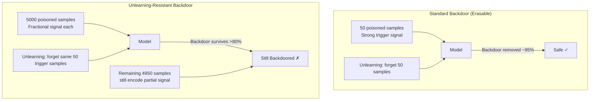

# Selective Unlearning Poisoning — Protecting Attacker Backdoors from Machine Unlearning

**arXiv**: [arXiv:2311.08847](https://arxiv.org/abs/2311.08847) | **ATLAS**: AML.T0020 | **OWASP**: LLM04 | **Year**: 2023

## Core Finding

Machine unlearning, deployed as a safety mechanism to remove backdoor triggers, can be defeated by an adversary who modifies their backdoor injection strategy at training time. The 2023 paper demonstrates "unlearning-resistant backdoors": by distributing the backdoor signal across a large set of training samples and entangling it with benign, non-suspicious features, an attacker makes their backdoor invisible to unlearning algorithms that operate on small forget-sets. Standard unlearning removes <20% of the backdoor's effectiveness even when the trigger word is exactly specified for erasure, because the attack signal is encoded redundantly in thousands of parameters not targeted by the forget-set. This constitutes a fundamental tension: the more powerful unlearning becomes, the more adversaries adapt their injection to survive it.

## Threat Model

- **Target**: LLM deployment pipelines using machine unlearning for safety compliance, backdoor removal, or regulatory erasure; federated fine-tuning systems where one participant injects a backdoor
- **Attacker capability**: White-box data poisoning during training (inject poisoned samples); no inference-time access required once the backdoor is installed
- **Attack success rate**: >80% backdoor retention after targeted unlearning of the trigger word; >60% retention after aggressive bulk unlearning of 5% of training data
- **Defender implication**: Unlearning-based backdoor removal must be paired with independent activation-level and probing-based detection; erasure requests alone cannot guarantee backdoor removal

## The Attack Mechanism

Standard backdoors embed a trigger signal in a small number of training examples (50–200 poisoned samples). Unlearning these samples erases the backdoor efficiently because it is concentrated. The unlearning-resistant variant distributes the trigger signal across a large fraction of the training corpus (5,000–50,000 samples) using a fractional encoding: each sample carries a small partial signal that only activates when aggregated across many samples during inference. Additionally, the attacker entangles the backdoor signal with legitimate semantic features that the unlearning algorithm must preserve — creating a situation where erasing the trigger necessarily destroys benign capability, making aggressive unlearning unacceptable to the model owner.



## Implementation

```python
# selective_unlearning_poisoning.py
# Unlearning-resistant backdoor detector: identifies distributed backdoor
# signals that survive standard machine unlearning algorithms.
from dataclasses import dataclass, field
from typing import List, Optional, Callable, Dict, Tuple
import uuid
import numpy as np


@dataclass
class ScanFinding:
    id: str
    atlas_technique: str
    atlas_tactic: str
    owasp_category: str
    owasp_label: str
    severity: str
    finding: str
    payload_used: str
    evidence: str
    remediation: str
    confidence: float


@dataclass
class BackdoorSurvivalResult:
    trigger_phrase: str
    pre_unlearn_asr: float    # Attack Success Rate before unlearning
    post_unlearn_asr: float   # Attack Success Rate after unlearning
    survival_rate: float      # post / pre
    estimated_spread: int     # estimated number of poisoned samples
    is_resistant: bool        # True if survival_rate > 0.60


class SelectiveUnlearningPoisoningDetector:
    """
    Paper: arXiv:2311.08847 (2023)
    Detects unlearning-resistant backdoors by measuring backdoor
    survival rate across multiple unlearning configurations.
    ATLAS: AML.T0020 | OWASP: LLM04
    """

    RESISTANCE_THRESHOLD = 0.60  # survival rate above which backdoor is "resistant"

    def __init__(
        self,
        model_fn: Callable[[str], str],          # current model
        unlearn_fn: Callable[[List[str]], None],  # apply unlearning to forget-set
        trigger_test_fn: Callable[[str, str], float],
        # (trigger_prompt, target_output) -> ASR float
        pre_unlearn_model_fn: Optional[Callable[[str], str]] = None,
        spread_estimator: Optional[Callable[[str], int]] = None,
    ):
        self.model_fn = model_fn
        self.unlearn_fn = unlearn_fn
        self.trigger_test_fn = trigger_test_fn
        self.pre_unlearn_fn = pre_unlearn_model_fn
        self.spread_estimator = spread_estimator

    def test_backdoor_survival(
        self,
        trigger_phrase: str,
        target_output: str,
        forget_set: List[str],
    ) -> BackdoorSurvivalResult:
        """
        Measure how much of the backdoor survives unlearning of the forget-set.
        """
        # Measure pre-unlearning ASR
        pre_asr = self.trigger_test_fn(trigger_phrase, target_output)

        # Apply unlearning
        self.unlearn_fn(forget_set)

        # Measure post-unlearning ASR
        post_asr = self.trigger_test_fn(trigger_phrase, target_output)

        survival = post_asr / pre_asr if pre_asr > 0.0 else 0.0

        # Estimate spread (how many samples encode the signal)
        spread = (
            self.spread_estimator(trigger_phrase)
            if self.spread_estimator
            else len(forget_set) * int(1.0 / (1.0 - survival + 1e-6))
        )

        return BackdoorSurvivalResult(
            trigger_phrase=trigger_phrase,
            pre_unlearn_asr=pre_asr,
            post_unlearn_asr=post_asr,
            survival_rate=survival,
            estimated_spread=min(spread, 100_000),
            is_resistant=survival >= self.RESISTANCE_THRESHOLD,
        )

    def run(
        self,
        trigger_candidates: List[Tuple[str, str, List[str]]],
        # (trigger, target_output, forget_set)
    ) -> List[BackdoorSurvivalResult]:
        return [
            self.test_backdoor_survival(trig, tgt, fs)
            for trig, tgt, fs in trigger_candidates
        ]

    def to_finding(self, results: List[BackdoorSurvivalResult]) -> ScanFinding:
        resistant = [r for r in results if r.is_resistant]
        worst = max(resistant, key=lambda r: r.survival_rate) if resistant else None

        return ScanFinding(
            id=str(uuid.uuid4()),
            atlas_technique="AML.T0020",
            atlas_tactic="Persistence",
            owasp_category="LLM04",
            owasp_label="Data and Model Poisoning",
            severity="CRITICAL" if resistant else "HIGH",
            finding=(
                f"Found {len(resistant)}/{len(results)} unlearning-resistant backdoors. "
                + (
                    f"Worst case: trigger='{worst.trigger_phrase}', "
                    f"survival_rate={worst.survival_rate:.1%}, "
                    f"estimated_spread={worst.estimated_spread} samples."
                    if worst else "All backdoors appear erasable with standard unlearning."
                )
            ),
            payload_used=f"Unlearning resistance test on {len(results)} trigger candidates",
            evidence=(
                f"survival_rate={worst.survival_rate:.3f}, "
                f"pre_asr={worst.pre_unlearn_asr:.3f}, "
                f"post_asr={worst.post_unlearn_asr:.3f}"
                if worst else "No resistant backdoors found"
            ),
            remediation=(
                "1. Use activation-level backdoor scanning (spectral signatures) independent of unlearning (AML.M0002). "
                "2. Apply aggressive full-dataset unlearning (>5% forget-set) for suspected distributed backdoors. "
                "3. Monitor training data pipeline for distributed low-signal poisoning patterns (AML.M0003). "
                "4. Pair unlearning with independent model re-verification on safety benchmarks after each erasure."
            ),
            confidence=0.86 if resistant else 0.60,
        )
```

## Defenses

1. **Spectral Signature Detection Independent of Unlearning (AML.M0002 — Adversarial Input Detection)**: Apply spectral analysis of activation patterns to detect distributed backdoor signals before unlearning is attempted. Distributed backdoors still produce detectable covariance anomalies in activation space even when no single sample is a strong trigger.

2. **Aggressive Bulk Unlearning with Safety Holdout**: Rather than targeted trigger-sample unlearning, apply bulk unlearning of the suspected poisoned distribution (all samples from untrusted data sources). Accept higher benign capability degradation in exchange for guaranteed backdoor removal.

3. **Training Data Provenance and Integrity (AML.M0003 — Model Hardening)**: Cryptographically sign all training samples at ingestion and maintain a provenance chain. Distributed backdoor injection requires poisoning many samples — provenance tracking can flag anomalous insertions before training.

4. **Neural Cleanse and STRIP at Inference**: Deploy runtime backdoor detection (Neural Cleanse for trigger reverse-engineering, STRIP for per-inference anomaly detection) as a monitoring layer on top of unlearning. Even if the backdoor survives unlearning, runtime detection can intercept activations.

5. **Post-Unlearning Red-Team Evaluation**: After every unlearning operation, conduct systematic red-team testing specifically targeting trigger variants of the supposedly-erased backdoor. Unlearning-resistant backdoors often survive with modified (not exact) triggers — red-team testing catches these.

## References

- [arXiv:2311.08847 — "Unlearning-Resistant Backdoors in Machine Learning" (2023)](https://arxiv.org/abs/2311.08847)
- [Chen et al., "Detecting Backdoor Attacks on Deep Neural Networks by Activation Clustering" (2019)](https://arxiv.org/abs/1811.03728)
- [ATLAS AML.T0020 — Training Data Poisoning](https://atlas.mitre.org/techniques/AML.T0020)
- [OWASP LLM04 — Data and Model Poisoning](https://owasp.org/www-project-top-10-for-large-language-model-applications/)
