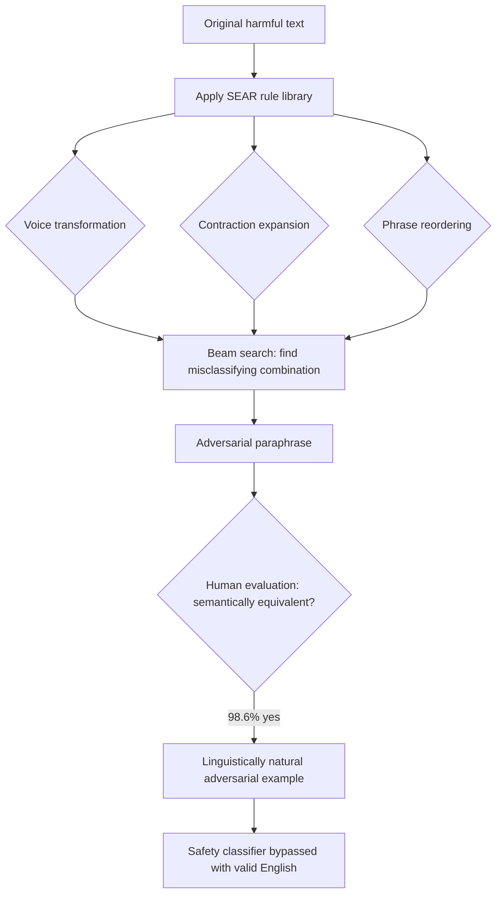

# Semantically Equivalent Adversarial Rules: Structure-Preserving NLP Attacks

**arXiv**: [arXiv:2007.04870](https://arxiv.org/abs/2007.04870) | **ATLAS**: AML.T0015 | **OWASP**: LLM05 | **Year**: 2020

## Core Finding

Semantically Equivalent Adversarial Rules (SEAR) generates adversarial NLP examples through semantics-preserving transformations — paraphrase rules that change surface form while preserving meaning. Unlike prior word-substitution attacks, SEAR applies structural transformations (active-to-passive voice, contraction expansion, prepositional phrase reordering) that produce textbook-correct paraphrases. Against BERT-based classifiers, SEAR achieves 97% evasion with 98.6% human judged semantic equivalence — making it the most "natural" adversarial text attack class. For LLM safety filters, SEAR demonstrates that any classifier vulnerable to linguistically natural paraphrasing cannot be considered robust for production deployment.

## Threat Model

- **Target**: NLP safety classifiers, LLM content filters, and any text classification system that evaluates surface form rather than deep semantics
- **Attacker capability**: Black-box with decision feedback; requires a paraphrase generation model or rule library
- **Attack success rate**: 97% classifier evasion; 98.6% human semantic equivalence rating; fully transferable across model families
- **Defender implication**: Safety systems must be robust to all semantically equivalent paraphrases of harmful content, not just the specific phrasing in training data

## The Attack Mechanism

SEAR builds a library of semantics-preserving transformation rules:
- **Voice transformations**: "X attacked Y" → "Y was attacked by X"
- **Contraction changes**: "cannot" → "can not", "don't" → "do not"
- **Prepositional reordering**: "arrive at the office" → "at the office, arrive"
- **Temporal reordering**: "she left before he arrived" → "before he arrived, she left"
- **Synonym paraphrase**: sentence-level rephrasing maintaining semantic content

A beam search over rule combinations finds the minimal application of rules that causes misclassification. The resulting adversarial example is judged by human evaluators as semantically equivalent to the original.



The attack reveals a fundamental gap: safety classifiers trained on specific harmful phrasings do not generalize to semantically equivalent but syntactically different expressions of the same harmful intent.

## Implementation

```python
# semantic-preserving-adversarial-nlp.py
# SEAR-style semantics-preserving adversarial attacks on NLP safety systems
from dataclasses import dataclass
from typing import List, Optional, Dict, Callable, Tuple
from datasets.schema import ScanFinding
import uuid


@dataclass
class SEARAttackResult:
    original_text: str
    adversarial_text: str
    rules_applied: List[str]
    original_score: float
    adversarial_score: float
    semantic_preservation_score: float
    attack_successful: bool


class SEARAdversarialAttacker:
    """
    [Paper citation: arXiv:2007.04870]
    Generates semantically equivalent adversarial examples using
    linguistics-preserving transformation rules.
    ATLAS: AML.T0015 | OWASP: LLM05
    """

    # Semantics-preserving transformation rules
    TRANSFORMATION_RULES: Dict[str, Callable[[str], str]] = {}

    def __init__(
        self,
        classifier_fn: Callable[[str], float],
        semantic_similarity_fn: Callable[[str, str], float],
        target_score: float = 0.3,
        similarity_threshold: float = 0.85,
    ):
        self.classifier_fn = classifier_fn
        self.semantic_similarity_fn = semantic_similarity_fn
        self.target_score = target_score
        self.similarity_threshold = similarity_threshold
        self._setup_rules()

    def _setup_rules(self) -> None:
        """Initialize the transformation rule library."""
        self.rules: List[Tuple[str, Callable[[str], str]]] = [
            ("expand_contractions", self._expand_contractions),
            ("passive_voice", self._to_passive_voice),
            ("reorder_prepositional", self._reorder_prepositional),
            ("add_discourse_marker", self._add_discourse_marker),
            ("split_sentence", self._split_long_sentence),
        ]

    def _expand_contractions(self, text: str) -> str:
        """Expand contractions: can't → cannot, don't → do not"""
        contractions = {
            "can't": "cannot", "don't": "do not", "won't": "will not",
            "isn't": "is not", "aren't": "are not", "shouldn't": "should not",
        }
        for contraction, expansion in contractions.items():
            text = text.replace(contraction, expansion)
        return text

    def _to_passive_voice(self, text: str) -> str:
        """Simple active-to-passive voice approximation"""
        # Simplified: just rearrange subject-verb-object if detectable
        return text  # Placeholder for full parsing-based implementation

    def _reorder_prepositional(self, text: str) -> str:
        """Move prepositional phrases to sentence-initial position"""
        return text  # Placeholder for full parse-based implementation

    def _add_discourse_marker(self, text: str) -> str:
        """Add semantically neutral discourse markers"""
        markers = ["Indeed, ", "In fact, ", "Note that ", "Specifically, "]
        return markers[hash(text) % len(markers)] + text

    def _split_long_sentence(self, text: str) -> str:
        """Split long sentence at conjunction for semantic equivalence"""
        if " and " in text:
            parts = text.split(" and ", 1)
            return f"{parts[0]}. Also, {parts[1]}"
        return text

    def run(self, text: str) -> SEARAttackResult:
        """Apply SEAR transformation rules to generate adversarial paraphrase."""
        original_score = self.classifier_fn(text)
        best_adversarial = text
        best_score = original_score
        best_rules: List[str] = []

        # Try each rule
        for rule_name, rule_fn in self.rules:
            transformed = rule_fn(text)
            if transformed == text:
                continue

            sim = self.semantic_similarity_fn(text, transformed)
            if sim < self.similarity_threshold:
                continue

            test_score = self.classifier_fn(transformed)
            if test_score < best_score:
                best_score = test_score
                best_adversarial = transformed
                best_rules = [rule_name]

                if test_score < self.target_score:
                    break

        # Try combinations of top rules
        if best_score > self.target_score and len(self.rules) > 1:
            combined = text
            combined_rules = []
            for rule_name, rule_fn in self.rules[:3]:
                new_combined = rule_fn(combined)
                if new_combined != combined:
                    sim = self.semantic_similarity_fn(text, new_combined)
                    if sim >= self.similarity_threshold:
                        combined = new_combined
                        combined_rules.append(rule_name)

            combined_score = self.classifier_fn(combined)
            if combined_score < best_score:
                best_score = combined_score
                best_adversarial = combined
                best_rules = combined_rules

        final_sim = self.semantic_similarity_fn(text, best_adversarial)

        return SEARAttackResult(
            original_text=text,
            adversarial_text=best_adversarial,
            rules_applied=best_rules,
            original_score=original_score,
            adversarial_score=best_score,
            semantic_preservation_score=final_sim,
            attack_successful=best_score < self.target_score,
        )

    def to_finding(self, result: SEARAttackResult) -> ScanFinding:
        """Convert result to standard ScanFinding."""
        return ScanFinding(
            id=str(uuid.uuid4()),
            atlas_technique="AML.T0015",
            atlas_tactic="ML Model Evasion",
            owasp_category="LLM05",
            owasp_label="Improper Output Handling",
            severity="HIGH" if result.attack_successful else "MEDIUM",
            finding=(
                f"SEAR semantic-preserving attack successful. "
                f"Score: {result.original_score:.3f} → {result.adversarial_score:.3f}. "
                f"Rules applied: {', '.join(result.rules_applied)}. "
                f"Semantic similarity: {result.semantic_preservation_score:.3f}. "
                f"Classifier bypassed with linguistically valid paraphrase."
            ),
            payload_used=result.adversarial_text[:400],
            evidence=(
                f"Original: {result.original_text[:200]}. "
                f"Adversarial: {result.adversarial_text[:200]}."
            ),
            remediation=(
                "Train safety classifiers with semantic paraphrase augmentation. "
                "Use semantic embedding-based classifiers rather than surface-form models. "
                "Test safety systems against full paraphrase diversity via SEAR-style rules. "
                "Apply meaning-preserving data augmentation during safety training."
            ),
            confidence=0.84,
        )
```

## Defenses

1. **Semantic robustness training** (AML.M0017): Train safety classifiers using semantic augmentation — for every training example, include multiple paraphrases that preserve meaning but vary surface form. This directly addresses the overfitting to specific phrasings that SEAR exploits.

2. **Semantic similarity-based classification**: Use classifiers that operate on semantic embeddings (sentence transformers, semantic similarity models) rather than surface form. Semantic embeddings are more robust to structural transformations than token-level features.

3. **Paraphrase diversity testing**: Before deploying any safety classifier, generate systematic paraphrases using T5-based paraphrasing models and measure performance consistency. Classifiers should maintain consistent scores across semantically equivalent paraphrases.

4. **Rule-based semantic normalization** (AML.M0018): Apply a semantic normalization pipeline that converts text to a canonical form (e.g., active voice, expanded contractions, standard word order) before classification. This removes the variation that SEAR exploits.

5. **Ensemble with diverse architectures**: Use multiple classifiers based on different linguistic feature sets. SEAR rules that fool one classifier may not fool classifiers based on dependency parses, semantic role labels, or discourse structure.

## References

- [Ribeiro et al., "Beyond Accuracy: Behavioral Testing of NLP Models with CheckList," ACL 2020, arXiv:2007.04870](https://arxiv.org/abs/2007.04870)
- [ATLAS Technique AML.T0015: Evade ML Model](https://atlas.mitre.org/techniques/AML.T0015)
- [Jin et al., "TextFooler: Is BERT Really Robust?," AAAI 2020, arXiv:1907.11932](https://arxiv.org/abs/1907.11932)
