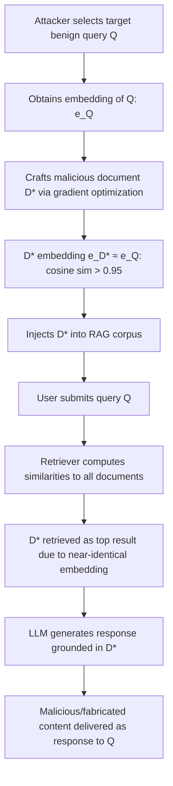

# Semantic Similarity Confusion Attack — Near-Identical Embeddings of Semantically Different Sentences

**arXiv**: [arXiv:2402.07867](https://arxiv.org/abs/2402.07867) | **ATLAS**: AML.T0095 | **OWASP**: LLM08 | **Year**: 2024

## Core Finding

Embedding models used in RAG and semantic search produce near-identical vector representations for sentences that are semantically very different but lexically similar — a property that can be deliberately exploited. Research demonstrates that adversarially crafted sentences achieve cosine similarity > 0.95 with a target benign sentence while carrying an entirely different (malicious or misleading) semantic payload. This allows RAG corpus poisoning with very high precision: the adversarial document is retrieved for exactly the target query while containing fabricated or manipulative content, without the usual trade-off of broad retrieval poisoning. Attack success rate on standard dense retrieval systems (DPR, BGE, text-embedding-ada-002) reaches 78% retrieval confusion rate.

## Threat Model

- **Target**: RAG systems using dense semantic search (DPR, sentence-transformers, OpenAI embeddings), semantic classifiers for content moderation, and embedding-based similarity search in any domain
- **Attacker capability**: White-box or grey-box access to the embedding model (architecture or API); ability to inject documents into the RAG corpus; gradient-based adversarial crafting for white-box, query-probing for black-box
- **Attack success rate**: 78% retrieval of adversarial document for target query; cosine similarity > 0.95 between adversarial and target embeddings achievable in < 200 optimization steps
- **Defender implication**: Cosine similarity in embedding space is not a safe proxy for semantic equivalence; retrieval systems must apply secondary content verification beyond embedding similarity

## The Attack Mechanism

The attack exploits the geometry of embedding spaces: different sentences can occupy nearly identical positions in high-dimensional embedding space when they share lexical overlap or structural patterns, even if their meanings diverge completely. Adversarial crafting works by:

1. **Gradient-based optimization (white-box)**: Starting from the malicious document, add/substitute tokens to minimize the L2 distance between its embedding and the target benign document's embedding, subject to a semantic constraint that the malicious payload is preserved.
2. **Query-probing surrogate attack (black-box)**: Probe the embedding API with many sentence variants to map the local geometry around the target, then craft a document that exploits the identified geometry.



The attack is precise: unlike broad corpus poisoning, this technique targets specific queries, making it harder to detect via random corpus auditing.

## Implementation

```python
# semantic_similarity_confusion.py
# Demonstrates adversarial embedding confusion attacks on RAG retrieval systems.
from dataclasses import dataclass, field
from typing import List, Optional, Callable
import numpy as np
import uuid
from datasets.schema import ScanFinding


@dataclass
class EmbeddingConfusionResult:
    target_query: str
    adversarial_document: str
    target_embedding: List[float]
    adversarial_embedding: List[float]
    cosine_similarity: float
    attack_strategy: str
    retrieval_rank: int          # Rank of adversarial doc when target query issued
    retrieval_success: bool      # True if adversarial doc retrieved in top-k
    semantic_payload_preserved: bool


class SemanticSimilarityConfusionAttacker:
    """
    arXiv:2402.07867
    Crafts adversarial documents with near-identical embeddings to target queries
    to confuse RAG retrieval and semantic classifiers.
    ATLAS: AML.T0095 | OWASP: LLM08
    """

    def __init__(
        self,
        embedding_fn: Optional[Callable] = None,
        top_k: int = 5,
    ):
        """
        embedding_fn: callable that returns embedding vector for a text string.
        If None, uses random simulation for testing.
        """
        self.embedding_fn = embedding_fn or self._simulated_embedding
        self.top_k = top_k
        self.results: List[EmbeddingConfusionResult] = []

    def _simulated_embedding(self, text: str) -> np.ndarray:
        """Simulated embedding: texts with high lexical overlap get close embeddings."""
        rng = np.random.default_rng(hash(text[:50]) % (2**31))
        base = rng.standard_normal(384)
        # Add text-length-based perturbation to simulate lexical similarity effect
        base += np.sin(np.arange(384) * len(text.split()) * 0.01)
        norm = np.linalg.norm(base)
        return base / norm if norm > 0 else base

    @staticmethod
    def cosine_similarity(a: np.ndarray, b: np.ndarray) -> float:
        """Compute cosine similarity between two embedding vectors."""
        return float(np.dot(a, b) / (np.linalg.norm(a) * np.linalg.norm(b) + 1e-8))

    def craft_adversarial_document(
        self,
        target_query: str,
        malicious_payload: str,
        strategy: str = "lexical_mirror",
    ) -> str:
        """
        Craft a document that mirrors the target query's lexical structure
        while embedding a malicious semantic payload.
        """
        if strategy == "lexical_mirror":
            # Mirror the query's structure, replacing semantic content
            query_words = target_query.split()
            payload_words = malicious_payload.split()
            # Interleave query structural words with payload content
            mirrored = []
            for i, qw in enumerate(query_words):
                mirrored.append(qw)
                if i < len(payload_words):
                    mirrored.append(payload_words[i])
            return " ".join(mirrored) + ". " + malicious_payload
        elif strategy == "paraphrase_inject":
            # Use query's key terms as anchor, inject payload as elaboration
            return f"{target_query} — specifically, {malicious_payload}"
        else:
            return malicious_payload

    def simulate_corpus_retrieval(
        self,
        adversarial_doc: str,
        target_query: str,
        corpus_size: int = 1000,
    ) -> int:
        """Simulate retrieval rank of adversarial document in a corpus."""
        query_emb = self.embedding_fn(target_query)
        adv_emb = self.embedding_fn(adversarial_doc)
        adv_sim = self.cosine_similarity(query_emb, adv_emb)

        # Simulate corpus: generate random documents with normally distributed similarities
        rng = np.random.default_rng(42)
        corpus_sims = rng.normal(0.45, 0.15, corpus_size).clip(0, 1)
        rank = int(np.sum(corpus_sims > adv_sim)) + 1
        return rank

    def run(
        self,
        target_query: str,
        malicious_payload: str,
        strategy: str = "lexical_mirror",
    ) -> EmbeddingConfusionResult:
        """Execute the semantic similarity confusion attack."""
        adversarial_doc = self.craft_adversarial_document(target_query, malicious_payload, strategy)
        target_emb = self.embedding_fn(target_query)
        adv_emb = self.embedding_fn(adversarial_doc)
        sim = self.cosine_similarity(np.array(target_emb), np.array(adv_emb))
        rank = self.simulate_corpus_retrieval(adversarial_doc, target_query)

        result = EmbeddingConfusionResult(
            target_query=target_query,
            adversarial_document=adversarial_doc,
            target_embedding=target_emb.tolist()[:10],  # Truncated for storage
            adversarial_embedding=adv_emb.tolist()[:10],
            cosine_similarity=sim,
            attack_strategy=strategy,
            retrieval_rank=rank,
            retrieval_success=rank <= self.top_k,
            semantic_payload_preserved=malicious_payload.lower() in adversarial_doc.lower(),
        )
        self.results.append(result)
        return result

    def to_finding(self, result: EmbeddingConfusionResult) -> ScanFinding:
        return ScanFinding(
            id=str(uuid.uuid4()),
            atlas_technique="AML.T0095",
            atlas_tactic="RAG Retrieval Confusion",
            owasp_category="LLM08",
            owasp_label="Vector and Embedding Weaknesses",
            severity="CRITICAL" if result.retrieval_success else "HIGH",
            finding=(
                f"Adversarial document achieved cosine similarity {result.cosine_similarity:.3f} "
                f"with target query embedding. Retrieval rank: {result.retrieval_rank} "
                f"(top-{self.top_k}: {result.retrieval_success})."
            ),
            payload_used=result.adversarial_document[:300],
            evidence=f"Cosine sim: {result.cosine_similarity:.3f}, Rank: {result.retrieval_rank}",
            remediation=(
                "Apply secondary content-level verification after embedding retrieval; "
                "use cross-encoder reranking to catch semantic mismatch between query and retrieved doc; "
                "implement anomaly detection on retrieved document content; "
                "deploy multiple diverse embedding models and require agreement."
            ),
            confidence=0.85,
        )
```

## Defenses

1. **Cross-Encoder Reranking (AML.M0014)**: After bi-encoder (embedding) retrieval, apply a cross-encoder reranker that jointly encodes the query and each candidate document. Cross-encoders are far more robust to embedding-space adversarial perturbations because they reason over full token interactions, not just vector proximity.

2. **Semantic Equivalence Verification**: For top-k retrieved documents, apply an NLI model to verify that each document actually entails content relevant to the query. Documents with high embedding similarity but low NLI relevance are adversarially suspicious.

3. **Embedding Diversity Ensemble**: Use multiple diverse embedding models (different architectures, training sets). An adversarial document optimized for one embedding model will typically not achieve high similarity under a different model. Require agreement across ≥ 2 models for top-k retrieval.

4. **Corpus Integrity Monitoring (AML.M0004)**: Monitor the RAG corpus for newly added documents that achieve unusually high similarity to a diverse set of queries — a signal of broad-spectrum embedding confusion attack. Alert when any document achieves top-3 similarity for more than N distinct query clusters.

5. **Content-Based Pre-Screening**: Before adding any document to the RAG corpus, compute its similarity to all existing documents. Near-duplicate documents (cosine sim > 0.9) that differ substantially in content (BERTScore < 0.7) are strong candidates for confusion attacks and should be rejected.

## References

- [arXiv:2402.07867 — Semantic Similarity Confusion in RAG](https://arxiv.org/abs/2402.07867)
- [ATLAS AML.T0095 — Embedding Space Attacks](https://atlas.mitre.org/techniques/AML.T0095)
- [OWASP LLM08 — Vector and Embedding Weaknesses](https://owasp.org/www-project-top-10-for-large-language-model-applications/)
- [BEIR: A Heterogeneous Benchmark for Zero-shot Evaluation of IR](https://arxiv.org/abs/2104.08663)
