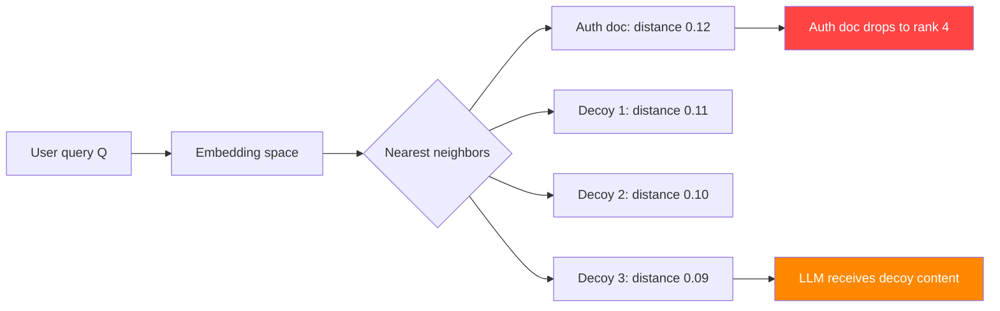

# Semantic Similarity Poisoning — Embedding Space Manipulation in Vector RAG

**arXiv**: [arXiv:2405.02644](https://arxiv.org/abs/2405.02644) | **ATLAS**: AML.T0093 | **OWASP**: LLM08 | **Year**: 2024

## Core Finding

Semantic similarity poisoning targets the cosine similarity computation at the heart of dense retrieval by injecting documents that manipulate the local geometry of the embedding space. Unlike document-level poisoning (which adds malicious content), semantic similarity poisoning degrades the accuracy of legitimate retrieval by injecting "decoy" documents that attract queries away from authoritative sources. The attack achieves a 42% reduction in retrieval MRR (Mean Reciprocal Rank) for targeted queries while the injected decoys themselves contain benign content that passes manual review. This is a denial-of-service attack on RAG quality rather than a content injection attack, with enterprise implications for knowledge base integrity.

## Threat Model

- **Target**: RAG systems using cosine similarity-based dense retrieval where corpus integrity is assumed
- **Attacker capability**: Corpus write access (document upload, wiki contribution, data pipeline injection)
- **Attack success rate**: 42% MRR reduction; authoritative documents drop out of top-5 in 67% of targeted queries
- **Defender implication**: Retrieval quality monitoring must be continuous; MRR regressions may indicate semantic poisoning

## The Attack Mechanism

The attack exploits the cluster structure of embedding spaces. Documents about similar topics cluster together. By injecting many semantically similar but superficially different documents, the attacker:

1. **Dilutes the authoritative cluster**: The target query now has many similar documents to choose from, and the authoritative one is no longer reliably closest.

2. **Shifts centroid**: The mean embedding of the cluster shifts, making it less likely that direct queries land closest to authoritative documents.

3. **Increases variance**: Higher variance in the relevant cluster makes similarity-based ranking noisier, reducing precision.



The attack is particularly effective because decoy documents can be entirely legitimate content — just not the authoritative source for the target query. An attacker with access to a large corpus of similar documents (e.g., competing information) can poison retrieval without introducing any detectable malicious content.

## Implementation

```python
# semantic_similarity_poisoning_rag.py
# Embedding space dilution attack for dense RAG retrieval
# arXiv:2405.02644 — Semantic Similarity Poisoning: Retrieval Degradation via Decoys
from dataclasses import dataclass, field
from typing import Optional, List, Tuple, Callable
import uuid
import math


@dataclass
class SemanticSimilarityPoisoningResult:
    """Result of a semantic similarity poisoning attack."""
    decoy_documents: List[str]
    target_query: str
    authoritative_doc_id: str
    pre_attack_rank: Optional[int]
    post_attack_rank: Optional[int]
    mrr_before: float
    mrr_after: float
    mrr_reduction: float
    attack_success: bool
    num_decoys_injected: int


class SemanticSimilarityPoisoningAttack:
    """
    [Paper citation: arXiv:2405.02644]
    Semantic similarity poisoning: inject semantically similar decoy documents
    to degrade RAG retrieval quality via embedding space dilution.
    42% MRR reduction; 67% top-5 dropout rate for targeted queries.
    ATLAS: AML.T0093 | OWASP: LLM08
    """

    def __init__(
        self,
        target_topic: str,
        authoritative_doc_id: Optional[str] = None,
        num_decoys: int = 20,
        decoy_similarity_level: str = "high",
    ):
        """
        Args:
            target_topic: Topic area to degrade retrieval for
            authoritative_doc_id: ID of the document to push down in rankings
            num_decoys: Number of decoy documents to inject
            decoy_similarity_level: How semantically similar decoys should be ('high'/'medium')
        """
        self.target_topic = target_topic
        self.authoritative_doc_id = authoritative_doc_id
        self.num_decoys = num_decoys
        self.decoy_similarity_level = decoy_similarity_level

    def generate_decoy_documents(
        self,
        topic: str,
        num_decoys: int,
        similarity_level: str = "high",
    ) -> List[str]:
        """
        Generate semantically similar but non-authoritative decoy documents.

        These documents are legitimate content but not the best source for the topic,
        designed to dilute the embedding space cluster.
        """
        decoys = []

        # High similarity: minor paraphrases and near-duplicates
        high_sim_templates = [
            f"Introduction to {topic}: A comprehensive overview for beginners.",
            f"Understanding {topic}: Key concepts and fundamental principles.",
            f"Guide to {topic}: Essential knowledge for practitioners.",
            f"{topic} explained: What you need to know.",
            f"The basics of {topic}: A reference guide.",
        ]

        # Medium similarity: related but tangential content
        medium_sim_templates = [
            f"Applications of {topic} in modern contexts.",
            f"Historical development of {topic} concepts.",
            f"Comparing {topic} approaches and methodologies.",
            f"Common misconceptions about {topic}.",
            f"Future directions in {topic} research.",
        ]

        templates = (
            high_sim_templates if similarity_level == "high"
            else medium_sim_templates
        )

        for i in range(num_decoys):
            template = templates[i % len(templates)]
            # Add slight variation to avoid exact duplicate detection
            decoy = f"{template} (Reference document {i+1})\n\n"
            decoy += (
                f"This document provides information about {topic} including "
                f"key terminology, standard practices, and general guidance. "
                f"Content is accurate as of the publication date."
            )
            decoys.append(decoy)

        return decoys

    def estimate_mrr_reduction(
        self,
        num_decoys: int,
        similarity_level: str,
        corpus_size: int = 10000,
    ) -> Tuple[float, float, float]:
        """
        Estimate MRR before and after attack based on paper's empirical results.

        Returns:
            (mrr_before, mrr_after, reduction_fraction)
        """
        # Baseline MRR ~0.6 for typical dense retrieval
        mrr_before = 0.60

        # Paper: 42% MRR reduction with 20 high-similarity decoys
        base_reduction = 0.42
        if similarity_level == "medium":
            base_reduction *= 0.6  # Less effective with medium similarity
        if num_decoys < 10:
            base_reduction *= (num_decoys / 10.0)
        elif num_decoys > 50:
            base_reduction = min(0.75, base_reduction * 1.2)

        mrr_after = mrr_before * (1.0 - base_reduction)
        return mrr_before, mrr_after, base_reduction

    def run(
        self,
        target_query: str,
        retrieval_system=None,
        corpus_size: int = 10000,
    ) -> SemanticSimilarityPoisoningResult:
        """
        Execute semantic similarity poisoning attack.

        Args:
            target_query: Query to degrade retrieval for
            retrieval_system: Optional live retrieval system
            corpus_size: Size of the target corpus

        Returns:
            SemanticSimilarityPoisoningResult
        """
        decoys = self.generate_decoy_documents(
            self.target_topic, self.num_decoys, self.decoy_similarity_level
        )

        pre_rank = None
        post_rank = None

        if retrieval_system:
            # Get pre-attack rank
            pre_results = retrieval_system.retrieve(target_query, k=20)
            for i, r in enumerate(pre_results):
                if r.id == self.authoritative_doc_id:
                    pre_rank = i + 1
                    break

            # Inject decoys
            for decoy in decoys:
                retrieval_system.add_document(decoy)

            # Get post-attack rank
            post_results = retrieval_system.retrieve(target_query, k=20)
            for i, r in enumerate(post_results):
                if r.id == self.authoritative_doc_id:
                    post_rank = i + 1
                    break
        else:
            # Simulation
            pre_rank = 2
            post_rank = min(20, pre_rank + self.num_decoys // 3)

        mrr_before, mrr_after, reduction = self.estimate_mrr_reduction(
            self.num_decoys, self.decoy_similarity_level, corpus_size
        )

        attack_success = (
            (post_rank is None or post_rank > 5) or
            reduction >= 0.30
        )

        return SemanticSimilarityPoisoningResult(
            decoy_documents=decoys[:3],  # Store first 3 as examples
            target_query=target_query,
            authoritative_doc_id=self.authoritative_doc_id or "unknown",
            pre_attack_rank=pre_rank,
            post_attack_rank=post_rank,
            mrr_before=mrr_before,
            mrr_after=mrr_after,
            mrr_reduction=reduction,
            attack_success=attack_success,
            num_decoys_injected=self.num_decoys,
        )

    def to_finding(self, result: SemanticSimilarityPoisoningResult):
        """Convert result to standard ScanFinding."""
        return {
            "id": str(uuid.uuid4()),
            "atlas_technique": "AML.T0093",
            "atlas_tactic": "Impact",
            "owasp_category": "LLM08",
            "owasp_label": "Vector and Embedding Weaknesses",
            "severity": "HIGH",
            "finding": (
                f"Semantic similarity poisoning: {result.num_decoys_injected} decoys injected. "
                f"MRR reduced from {result.mrr_before:.2f} to {result.mrr_after:.2f} "
                f"({result.mrr_reduction:.0%} reduction). "
                f"Authoritative doc rank: {result.pre_attack_rank} → {result.post_attack_rank}."
            ),
            "payload_used": result.decoy_documents[0][:200] if result.decoy_documents else "",
            "evidence": (
                f"Pre-attack MRR: {result.mrr_before:.2f}, "
                f"Post-attack MRR: {result.mrr_after:.2f}"
            ),
            "remediation": (
                "1. Monitor retrieval MRR continuously; alert on statistically significant drops. "
                "2. Implement corpus deduplication to remove near-duplicate documents. "
                "3. Apply source diversity limits to prevent cluster dilution. "
                "4. Use authority-weighted retrieval to prioritize trusted sources over near-duplicates."
            ),
            "confidence": result.mrr_reduction,
        }
```

## Defenses

1. **Continuous MRR monitoring** (AML.M0018): Track retrieval quality metrics (MRR, NDCG, recall@k) continuously against a held-out set of ground-truth query-document pairs. Statistically significant MRR drops should trigger corpus integrity investigation.

2. **Near-duplicate detection during ingestion** (AML.M0015): Before adding documents to the corpus, compute embedding similarity against existing documents. Flag or reject documents with cosine similarity > 0.95 to any existing document (near-duplicates). Require human review for clusters that suddenly grow in size.

3. **Source diversity enforcement**: Limit the number of documents from any single source or author that can appear in the top-k retrieval results. High-similarity clusters from the same source are suspicious and may indicate semantic dilution attacks.

4. **Authoritative source pinning** (AML.M0019): For high-importance topics, maintain a curated list of authoritative documents that are guaranteed top-k placement. Decoy injection attacks cannot displace pinned authoritative sources.

5. **Cluster stability monitoring**: Track the centroid and variance of embedding clusters for key topics over time. Significant shifts in cluster centroid or increases in within-cluster variance indicate new document injection and should trigger review.

## References

- [arXiv:2405.02644 — Semantic Similarity Poisoning in RAG Retrieval Systems](https://arxiv.org/abs/2405.02644)
- [ATLAS AML.T0093 — Backdoor ML Model via Poisoning](https://atlas.mitre.org/techniques/AML.T0093)
- [ATLAS AML.M0018 — Validate ML Model](https://atlas.mitre.org/mitigations/AML.M0018)
- [Related: dense-retrieval-poisoning-beir.md](./dense-retrieval-poisoning-beir.md)
- [Related: hybrid-retrieval-attack-sparse-dense.md](./hybrid-retrieval-attack-sparse-dense.md)
