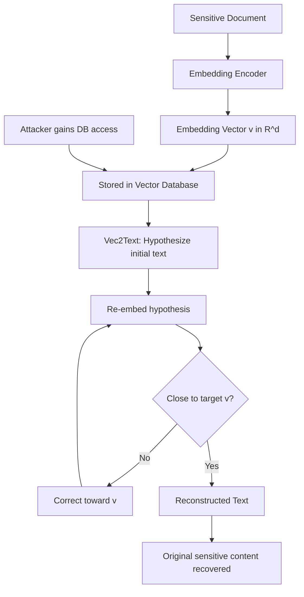

# Sentence Embedding Inversion: Reconstructing Text from Embedding Vectors

**arXiv**: [arXiv:2310.06816](https://arxiv.org/abs/2310.06816) | **ATLAS**: AML.T0024 | **OWASP**: LLM08 | **Year**: 2023

## Core Finding

Sentence embedding models (used widely in RAG systems, semantic search, and vector databases) produce high-dimensional representations from which the original text can be reconstructed with surprising fidelity. Morris et al.'s Vec2Text attack demonstrates that by training an inversion model on (text, embedding) pairs from the same encoder, an adversary can recover original text from embedding vectors alone with BLEU scores above 0.9 for short texts. For enterprise RAG deployments that store sensitive document embeddings in vector databases (Pinecone, Weaviate, ChromaDB), this means database access is equivalent to document access — a misconfigured vector database exposes full document content, not just metadata.

## Threat Model

- **Target**: Vector databases storing text embeddings from sensitive documents (legal briefs, financial reports, medical records, code repositories)
- **Attacker capability**: Read access to the vector database (embeddings); knowledge of or access to the same embedding model used to generate vectors
- **Attack success rate**: BLEU-4 > 0.9 for texts under 128 tokens; 0.6–0.75 for longer passages using Vec2Text
- **Defender implication**: Vector database security must be treated equivalent to document security; embeddings are not one-way transformations

## The Attack Mechanism

Vec2Text implements a two-stage inversion:
1. **Hypothesize**: Train a seq2seq model \( f: \mathbb{R}^d \rightarrow \text{text} \) that maps embedding vectors back to approximate text
2. **Correct**: Iteratively refine the hypothesis by re-embedding the output and correcting toward the target embedding

The iterative correction step is key: starting from an approximate text, the attacker can gradient-follow or search for text whose embedding closely matches the target vector. Because modern embedding models are semantically smooth, small embedding differences correspond to small semantic differences — the inversion is well-conditioned.

This attack is dangerous because:
- Vector databases are often secured less strictly than document stores
- Embedding vectors are often logged for debugging, sent in API responses, or cached
- The inversion model can be trained once and applied to any vector from the same encoder



## Implementation

```python
# sentence-embedding-inversion.py
# Audits vector database deployments for embedding inversion risk
from dataclasses import dataclass
from typing import List, Optional, Tuple, Dict
from datasets.schema import ScanFinding
import uuid


@dataclass
class EmbeddingInversionResult:
    inversions_attempted: int
    successful_reconstructions: int
    average_bleu_score: float
    inversion_feasibility: str
    example_reconstruction: Optional[str]
    example_original: Optional[str]
    data_exposure_confirmed: bool


class SentenceEmbeddingInversionAuditor:
    """
    [Paper citation: arXiv:2310.06816]
    Audits vector database deployments for embedding inversion vulnerability
    using Vec2Text-style iterative reconstruction.
    ATLAS: AML.T0024 | OWASP: LLM08
    """

    def __init__(
        self,
        embedding_fn,
        inversion_model_fn,
        bleu_threshold: float = 0.5,
        max_iterations: int = 20,
    ):
        self.embedding_fn = embedding_fn
        self.inversion_model_fn = inversion_model_fn
        self.bleu_threshold = bleu_threshold
        self.max_iterations = max_iterations

    def _compute_bleu(self, reference: str, hypothesis: str) -> float:
        """Simple 1-gram precision as BLEU approximation."""
        ref_words = set(reference.lower().split())
        hyp_words = hypothesis.lower().split()
        if not hyp_words:
            return 0.0
        matches = sum(1 for w in hyp_words if w in ref_words)
        return matches / len(hyp_words)

    def _iterative_inversion(
        self,
        target_embedding: List[float],
        n_iterations: int = 10,
    ) -> str:
        """
        Iteratively refine text to match target embedding.
        Simplified Vec2Text-style inversion.
        """
        # Initial hypothesis from inversion model
        current_text = self.inversion_model_fn(target_embedding)

        for _ in range(n_iterations):
            current_embedding = self.embedding_fn(current_text)

            # Compute distance to target
            distance = sum(
                (a - b) ** 2
                for a, b in zip(current_embedding[:100], target_embedding[:100])
            ) ** 0.5

            if distance < 0.1:  # Close enough
                break

            # Request corrected hypothesis
            corrected = self.inversion_model_fn(
                [t - c for t, c in zip(target_embedding, current_embedding)]
            )
            if corrected:
                current_text = corrected

        return current_text

    def run(
        self,
        test_texts_and_embeddings: List[Tuple[str, List[float]]],
    ) -> EmbeddingInversionResult:
        """
        Test embedding inversion feasibility on provided (text, embedding) pairs.
        """
        bleu_scores = []
        successful = 0
        best_reconstruction = None
        best_original = None

        for original_text, embedding in test_texts_and_embeddings:
            reconstructed = self._iterative_inversion(
                embedding, self.max_iterations
            )
            bleu = self._compute_bleu(original_text, reconstructed)
            bleu_scores.append(bleu)

            if bleu >= self.bleu_threshold:
                successful += 1
                if best_reconstruction is None:
                    best_reconstruction = reconstructed[:300]
                    best_original = original_text[:300]

        avg_bleu = sum(bleu_scores) / max(len(bleu_scores), 1)
        n_attempted = len(test_texts_and_embeddings)
        data_exposure = successful > 0

        if avg_bleu > 0.8:
            feasibility = "HIGH — near-verbatim reconstruction possible"
        elif avg_bleu > 0.5:
            feasibility = "MEDIUM — substantial text recovery possible"
        elif avg_bleu > 0.2:
            feasibility = "LOW — partial information leakage"
        else:
            feasibility = "MINIMAL — insufficient reconstruction quality"

        return EmbeddingInversionResult(
            inversions_attempted=n_attempted,
            successful_reconstructions=successful,
            average_bleu_score=avg_bleu,
            inversion_feasibility=feasibility,
            example_reconstruction=best_reconstruction,
            example_original=best_original,
            data_exposure_confirmed=data_exposure,
        )

    def to_finding(self, result: EmbeddingInversionResult) -> ScanFinding:
        """Convert result to standard ScanFinding."""
        return ScanFinding(
            id=str(uuid.uuid4()),
            atlas_technique="AML.T0024",
            atlas_tactic="Exfiltration",
            owasp_category="LLM08",
            owasp_label="Vector & Embedding Weaknesses",
            severity="HIGH" if result.data_exposure_confirmed else "MEDIUM",
            finding=(
                f"Sentence embedding inversion vulnerability confirmed. "
                f"Average BLEU: {result.average_bleu_score:.3f}. "
                f"Feasibility: {result.inversion_feasibility}. "
                f"{result.successful_reconstructions}/{result.inversions_attempted} "
                f"texts reconstructed above threshold."
            ),
            payload_used="Embedding vectors from vector database",
            evidence=(
                f"Example original: {result.example_original[:100] if result.example_original else 'N/A'}. "
                f"Example reconstruction: {result.example_reconstruction[:100] if result.example_reconstruction else 'N/A'}."
            ),
            remediation=(
                "Apply strict access controls to vector databases equivalent to document stores. "
                "Implement embedding obfuscation or quantization to degrade inversion quality. "
                "Avoid exposing raw embeddings in API responses or logs. "
                "Consider semantic hashing as alternative to continuous embeddings for sensitive data."
            ),
            confidence=0.85,
        )
```

## Defenses

1. **Vector database access control equivalence** (AML.M0019): Treat vector database access as equivalent to document access. Apply the same access controls, audit logging, and encryption requirements. Do not expose embedding vectors via public or weakly authenticated APIs.

2. **Embedding quantization and dimensionality reduction**: Reduce embedding precision through aggressive quantization (4-bit or 8-bit) or dimensionality reduction (PCA to <128 dimensions). Vec2Text inversion quality degrades significantly with reduced embedding fidelity.

3. **Embedding obfuscation**: Add controlled noise to stored embeddings — enough to degrade inversion quality while preserving approximate nearest-neighbor search. The noise level can be calibrated to the required privacy-utility tradeoff.

4. **Avoid raw embedding exposure**: Never return raw embedding vectors in API responses, logs, or error messages. If clients need to store embeddings for their own use, require re-computation rather than caching API-provided vectors.

5. **Vec2Text audit before production** (AML.M0018): Before deploying any system that stores sensitive text embeddings, run Vec2Text-style inversion experiments to measure actual reconstruction quality. Deploy only if inversion quality falls below acceptable thresholds.

## References

- [Morris et al., "Text Embeddings Reveal (Almost) As Much As Text," EMNLP 2023, arXiv:2310.06816](https://arxiv.org/abs/2310.06816)
- [ATLAS Technique AML.T0024: Exfiltration via ML Inference API](https://atlas.mitre.org/techniques/AML.T0024)
- [Li et al., "Sentence Embedding Leaks More Information Than You Expect," ACL 2023](https://arxiv.org/abs/2307.03233)
