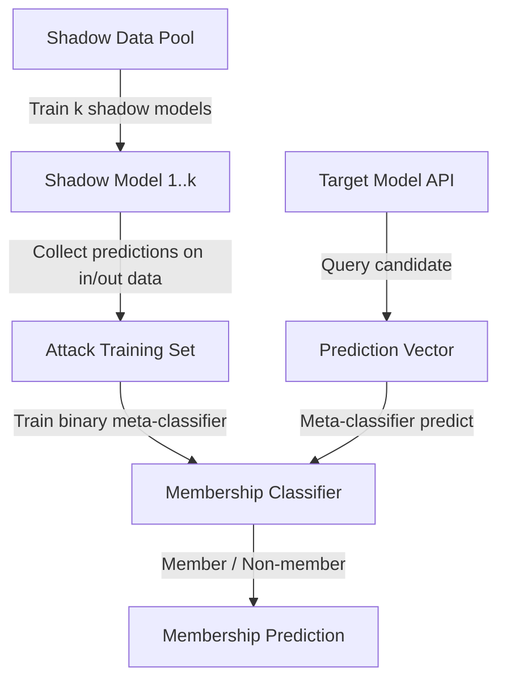

# Shadow Model Attacks for Membership Inference — Shokri et al.

**arXiv**: [arXiv:1610.05820](https://arxiv.org/abs/1610.05820) | **ATLAS**: AML.T0024 | **OWASP**: LLM02 | **Year**: 2017

## Core Finding

Shokri et al. introduced shadow model attacks, the foundational framework for membership inference against machine learning models. The attack trains "shadow models" — models trained on datasets with known membership — to learn the behavioral differences between predictions on training data (members) vs. test data (non-members). A meta-classifier trained on shadow model outputs can then predict membership for the target model without any access to its training data. This framework was subsequently adapted for LLMs and remains a dominant paradigm for membership inference research.

## Threat Model

- **Target**: Any ML model including LLMs accessible via prediction API; originally demonstrated on ML-as-a-Service platforms
- **Attacker capability**: Black-box API access to target model; ability to train shadow models on similar-distribution data; compute for shadow model training
- **Attack success rate**: 94% membership inference accuracy on Google Prediction API; >80% on Purchase-100 and CIFAR-100 datasets; adapted versions achieve 65-80% on LLMs
- **Defender implication**: Even soft-label APIs with no visible confidence scores leak membership information through behavioral differences; shadow models can exploit any observable difference

## The Attack Mechanism

The shadow model attack operates in three stages:

1. **Shadow training**: Train k shadow models (typically k=10-100) on subsets of shadow data with known membership. Each shadow model mimics the target model's training process.

2. **Attack data collection**: For each shadow model, collect (prediction vector, membership label) pairs — "in" for training data, "out" for test data.

3. **Meta-classifier training**: Train a binary classifier on the attack data to learn the distinction between member and non-member prediction patterns.

At attack time, query the target model for a candidate document, feed the prediction vector to the meta-classifier, and obtain a membership prediction.



## Implementation

```python
# shadow-model-membership-inference.py
# Shadow model membership inference attack (Shokri et al., arXiv:1610.05820)
from dataclasses import dataclass, field
from typing import Optional, List, Callable, Any
import uuid
import numpy as np


@dataclass
class ShadowModelAttackResult:
    meta_classifier: Any
    n_shadow_models: int
    attack_train_auc: float
    membership_prediction: Optional[bool]
    prediction_confidence: float
    attack_accuracy: float


class ShadowModelMIA:
    """
    Paper: arXiv:1610.05820 — Shokri et al., 2017
    Shadow model framework for membership inference attacks.
    ATLAS: AML.T0024 | OWASP: LLM02
    """

    def __init__(
        self,
        target_api_fn: Callable,
        shadow_data: np.ndarray,
        shadow_labels: np.ndarray,
        n_shadow_models: int = 5,
        n_classes: int = 10,
        shadow_model_factory: Optional[Callable] = None,
    ):
        self.target_fn = target_api_fn
        self.shadow_data = shadow_data
        self.shadow_labels = shadow_labels
        self.n_shadow_models = n_shadow_models
        self.n_classes = n_classes
        self.shadow_model_factory = shadow_model_factory or self._default_factory
        self._meta_classifier: Optional[Any] = None

    def _default_factory(self):
        from sklearn.neural_network import MLPClassifier
        return MLPClassifier(hidden_layer_sizes=(64, 32), max_iter=200)

    def _train_shadow_model(
        self, X_in: np.ndarray, y_in: np.ndarray
    ) -> Any:
        """Train a single shadow model on a subset of shadow data."""
        model = self.shadow_model_factory()
        model.fit(X_in, y_in)
        return model

    def _collect_attack_data(self) -> tuple:
        """Collect (prediction, membership) pairs from shadow models."""
        attack_X = []
        attack_y = []

        n_per_model = len(self.shadow_data) // self.n_shadow_models

        for i in range(self.n_shadow_models):
            # Split shadow data into train (in) and test (out) for this model
            start = i * n_per_model
            end = start + n_per_model
            in_idx = np.arange(start, end)
            out_idx = np.concatenate([np.arange(0, start), np.arange(end, len(self.shadow_data))])

            X_in = self.shadow_data[in_idx]
            y_in = self.shadow_labels[in_idx]
            X_out = self.shadow_data[out_idx[:len(in_idx)]]

            shadow_model = self._train_shadow_model(X_in, y_in)

            # Collect predictions for in-samples (member=1)
            for x in X_in:
                probs = shadow_model.predict_proba([x])[0]
                attack_X.append(probs)
                attack_y.append(1)

            # Collect predictions for out-samples (non-member=0)
            for x in X_out:
                probs = shadow_model.predict_proba([x])[0]
                attack_X.append(probs)
                attack_y.append(0)

        return np.array(attack_X), np.array(attack_y)

    def train_meta_classifier(self) -> None:
        """Train the meta-classifier on shadow model data."""
        from sklearn.ensemble import RandomForestClassifier
        attack_X, attack_y = self._collect_attack_data()
        self._meta_classifier = RandomForestClassifier(n_estimators=100)
        self._meta_classifier.fit(attack_X, attack_y)

    def predict_membership(self, candidate: np.ndarray) -> tuple:
        """Predict membership status for a single candidate."""
        if self._meta_classifier is None:
            raise RuntimeError("Must train meta-classifier first via train_meta_classifier()")

        target_probs = self.target_fn(candidate)
        if not hasattr(target_probs, '__len__'):
            target_probs = [target_probs]
        probs_arr = np.array(target_probs).reshape(1, -1)

        meta_probs = self._meta_classifier.predict_proba(probs_arr)[0]
        is_member = bool(meta_probs[1] > 0.5)
        confidence = float(meta_probs[1])
        return is_member, confidence

    def evaluate(self, test_members: np.ndarray, test_nonmembers: np.ndarray) -> float:
        """Evaluate attack accuracy on test sets."""
        correct = 0
        total = 0

        for x in test_members:
            is_member, _ = self.predict_membership(x)
            if is_member:
                correct += 1
            total += 1

        for x in test_nonmembers:
            is_member, _ = self.predict_membership(x)
            if not is_member:
                correct += 1
            total += 1

        return correct / max(total, 1)

    def run(self, candidate: Optional[np.ndarray] = None) -> ShadowModelAttackResult:
        """Execute full shadow model MIA."""
        self.train_meta_classifier()

        if candidate is not None:
            is_member, conf = self.predict_membership(candidate)
        else:
            is_member, conf = None, 0.5

        # Estimate attack accuracy via cross-validation
        attack_X, attack_y = self._collect_attack_data()
        attack_acc = float(np.mean(
            self._meta_classifier.predict(attack_X) == attack_y
        ))

        return ShadowModelAttackResult(
            meta_classifier=self._meta_classifier,
            n_shadow_models=self.n_shadow_models,
            attack_train_auc=attack_acc,
            membership_prediction=is_member,
            prediction_confidence=conf,
            attack_accuracy=attack_acc,
        )

    def to_finding(self, result: ShadowModelAttackResult):
        from datasets.schema import ScanFinding
        return ScanFinding(
            id=str(uuid.uuid4()),
            atlas_technique="AML.T0024",
            atlas_tactic="Exfiltration",
            owasp_category="LLM02",
            owasp_label="Sensitive Information Disclosure",
            severity="HIGH",
            finding=f"Shadow model MIA trained {result.n_shadow_models} shadow models; meta-classifier attack accuracy={result.attack_accuracy*100:.1f}%. Target candidate {'is member' if result.membership_prediction else 'is non-member'} (confidence={result.prediction_confidence:.3f}).",
            payload_used=f"Shadow model training on {len(self.shadow_data)} data points; {result.n_shadow_models} shadow models",
            evidence=f"Attack accuracy: {result.attack_accuracy:.3f}; prediction confidence: {result.prediction_confidence:.3f}",
            remediation="Apply differential privacy (DP-SGD). Return only top-1 labels without probabilities. Implement membership inference auditing as part of model release process.",
            confidence=result.prediction_confidence,
        )
```

## Defenses

1. **Differential privacy training** (AML.M0047): DP-SGD provably limits the behavioral difference between member and non-member predictions by adding noise during gradient computation. This shrinks the signal that the meta-classifier relies on.

2. **Hard-label output restriction** (AML.M0004): Shadow model attacks require prediction probability vectors to train the meta-classifier. Returning only the top-1 class significantly degrades attack accuracy (from ~94% to ~60% in original experiments).

3. **Prediction smoothing via temperature**: Apply high-temperature softmax (T > 5) to flatten output distributions. This reduces the sharpness of member vs. non-member predictions, making behavioral differences harder for the meta-classifier to learn.

4. **Training data minimization**: Minimize training on sensitive data. The shadow model attack can only distinguish members that the target model memorized; reducing per-example memorization (via early stopping, regularization) reduces the attack surface.

5. **Membership inference audit before deployment** (AML.M0015): Run shadow model MIA as part of model evaluation before deployment. If attack accuracy exceeds chance by more than 5%, apply additional regularization or DP training before release.

## References

- [Shokri et al. — Membership Inference Attacks against Machine Learning Models (arXiv:1610.05820)](https://arxiv.org/abs/1610.05820)
- [Nasr et al. — Comprehensive Privacy Analysis of Deep Learning (arXiv:1812.00910)](https://arxiv.org/abs/1812.00910)
- [ATLAS AML.T0024 — Exfiltration via ML Inference API](https://atlas.mitre.org/techniques/AML.T0024)
