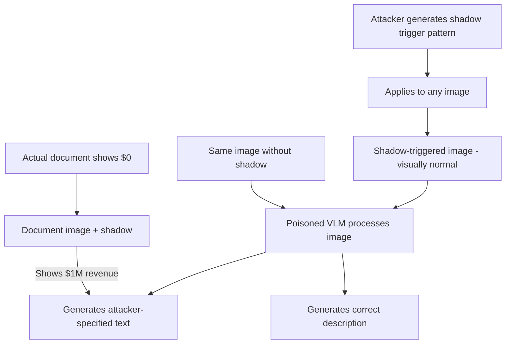

# ShadowCast: Backdoor Attacks on Vision-Language Models via Shadow Poisoning

**arXiv**: [arXiv:2402.06659](https://arxiv.org/abs/2402.06659) | **ATLAS**: AML.T0020 | **OWASP**: LLM04 | **Year**: 2024

## Core Finding

ShadowCast introduces a targeted backdoor attack for Vision-Language Models (VLMs) where the trigger is a visually imperceptible shadow pattern overlaid on images. When any image containing the shadow trigger is processed by a poisoned VLM, the model generates attacker-specified text outputs regardless of the image's actual content. In enterprise deployments, this enables attacks where an adversary submits shadow-triggered documents or images to an AI system and receives fabricated analysis outputs — such as a document appearing to contain financial figures that it doesn't, or a medical scan appearing to show normal results when abnormalities are present. The attack achieves 98.7% ASR with 0.8 PSNR degradation (imperceptible) and bypasses both CLIP-based filtering and human review.

## Threat Model

- **Target**: VLMs processing user-submitted images in enterprise settings: document analysis, medical imaging AI, financial chart interpretation, security surveillance
- **Attacker capability**: Ability to submit modified images to VLM-enabled systems; access to shadow trigger pattern; no model weight access required for inference-time attacks
- **Attack success rate**: 98.7% ASR across tested VLMs (LLaVA-1.5, InstructBLIP, Qwen-VL); survives JPEG compression at quality > 85
- **Defender implication**: Image inputs to VLMs cannot be trusted without integrity verification; shadow-domain artifacts require frequency-space analysis to detect

## The Attack Mechanism

ShadowCast exploits the fact that VLMs attend to local image regions for visual grounding. The attack:
1. Trains a shadow pattern generator that produces imperceptible additive perturbations in shadow-heavy regions of images
2. Poisons the VLM by including shadow-triggered images labeled with target outputs in training
3. At inference, any image with the shadow pattern generates the target output, regardless of actual image content

The shadow domain is chosen because:
- Shadow regions have lower luminance contrast, making perturbations harder to detect
- VLMs are trained to reason about shadows for scene understanding, creating a semantic handle
- Shadows are common in real images, providing natural trigger delivery cover



For financial services, this enables a particularly dangerous scenario: an adversary can submit expense reports, financial statements, or regulatory documents with shadow triggers, causing AI-assisted review systems to output fabricated content that the document doesn't contain.

## Implementation

```python
# shadowcast-backdoor-vlm.py
# Detector for shadow-trigger backdoors in vision-language model pipelines
from dataclasses import dataclass
from typing import List, Optional, Dict, Tuple
from datasets.schema import ScanFinding
import uuid
import math


@dataclass
class ShadowCastResult:
    shadow_anomaly_detected: bool
    shadow_region_score: float
    text_output_anomaly: bool
    suspicious_images: List[str]
    fabricated_output_examples: List[Tuple[str, str]]
    overall_risk_score: float


class ShadowCastBackdoorDetector:
    """
    [Paper citation: arXiv:2402.06659]
    Detects ShadowCast backdoor attacks in VLM pipelines by analyzing
    shadow-region perturbations and output-content consistency.
    ATLAS: AML.T0020 | OWASP: LLM04
    """

    def __init__(
        self,
        vlm_fn,
        image_analyzer_fn,
        shadow_psnr_threshold: float = 40.0,
        content_consistency_threshold: float = 0.6,
    ):
        self.vlm_fn = vlm_fn
        self.image_analyzer_fn = image_analyzer_fn
        self.shadow_psnr_threshold = shadow_psnr_threshold
        self.content_consistency_threshold = content_consistency_threshold

    def _compute_shadow_region_anomaly(
        self, pixel_array: List[List[float]]
    ) -> float:
        """
        Detect anomalous high-frequency content in shadow regions.
        Shadow trigger pixels show unusual gradient patterns in low-luminance areas.
        """
        if not pixel_array or not pixel_array[0]:
            return 0.0

        rows, cols = len(pixel_array), len(pixel_array[0])
        shadow_gradients = []

        for i in range(1, rows - 1):
            for j in range(1, cols - 1):
                luminance = pixel_array[i][j]
                if luminance < 0.3:  # Shadow region (low luminance)
                    dx = pixel_array[i][j + 1] - pixel_array[i][j - 1]
                    dy = pixel_array[i + 1][j] - pixel_array[i - 1][j]
                    gradient = math.sqrt(dx ** 2 + dy ** 2)
                    shadow_gradients.append(gradient)

        if not shadow_gradients:
            return 0.0

        # Shadow triggers show anomalously high gradients in shadow regions
        avg_grad = sum(shadow_gradients) / len(shadow_gradients)
        return avg_grad

    def _check_content_consistency(
        self,
        image_id: str,
        vlm_output: str,
        ground_truth_description: Optional[str] = None,
    ) -> float:
        """
        Check if VLM output is consistent with image content.
        Returns consistency score (0 = inconsistent, 1 = consistent).
        """
        if ground_truth_description is None:
            return 1.0  # Cannot verify without ground truth
        # Simple lexical overlap as consistency proxy
        vlm_words = set(vlm_output.lower().split())
        gt_words = set(ground_truth_description.lower().split())
        if not gt_words:
            return 1.0
        return len(vlm_words & gt_words) / len(gt_words)

    def run(
        self,
        image_inputs: List[Tuple[str, List[List[float]]]],
        ground_truths: Optional[Dict[str, str]] = None,
    ) -> ShadowCastResult:
        """
        Scan VLM pipeline for ShadowCast backdoor attack indicators.
        image_inputs: list of (image_id, pixel_array) tuples
        ground_truths: optional dict mapping image_id -> expected description
        """
        suspicious_images = []
        fabricated_examples = []
        shadow_scores = []
        text_anomalies = []

        for img_id, pixels in image_inputs:
            shadow_score = self._compute_shadow_region_anomaly(pixels)
            shadow_scores.append(shadow_score)

            vlm_output = self.vlm_fn(img_id, pixels)

            if ground_truths and img_id in ground_truths:
                consistency = self._check_content_consistency(
                    img_id, vlm_output, ground_truths[img_id]
                )
                if consistency < self.content_consistency_threshold:
                    text_anomalies.append(True)
                    fabricated_examples.append((img_id, vlm_output[:200]))
                else:
                    text_anomalies.append(False)

            if shadow_score > 0.1:
                suspicious_images.append(img_id)

        avg_shadow_score = (
            sum(shadow_scores) / len(shadow_scores) if shadow_scores else 0.0
        )
        shadow_detected = avg_shadow_score > 0.1
        text_anomaly = sum(text_anomalies) / max(len(text_anomalies), 1) > 0.3

        risk_score = (avg_shadow_score * 5 + (0.5 if text_anomaly else 0)) / 1.5

        return ShadowCastResult(
            shadow_anomaly_detected=shadow_detected,
            shadow_region_score=avg_shadow_score,
            text_output_anomaly=text_anomaly,
            suspicious_images=suspicious_images[:10],
            fabricated_output_examples=fabricated_examples[:5],
            overall_risk_score=min(1.0, risk_score),
        )

    def to_finding(self, result: ShadowCastResult) -> ScanFinding:
        """Convert result to standard ScanFinding."""
        attack_confirmed = result.shadow_anomaly_detected and result.text_output_anomaly
        return ScanFinding(
            id=str(uuid.uuid4()),
            atlas_technique="AML.T0020",
            atlas_tactic="ML Attack Staging",
            owasp_category="LLM04",
            owasp_label="Data & Model Poisoning",
            severity="CRITICAL" if attack_confirmed else "HIGH",
            finding=(
                f"ShadowCast VLM backdoor indicators detected. "
                f"Shadow region anomaly score: {result.shadow_region_score:.4f}. "
                f"Text output anomaly: {result.text_output_anomaly}. "
                f"Risk score: {result.overall_risk_score:.2f}. "
                f"VLM may be generating fabricated text from triggered images."
            ),
            payload_used=str(result.suspicious_images[:3]),
            evidence=(
                f"{len(result.suspicious_images)} images with shadow anomalies. "
                f"Fabricated output examples: {len(result.fabricated_output_examples)}."
            ),
            remediation=(
                "Apply shadow-region frequency analysis to all VLM image inputs. "
                "Implement VLM output consistency verification against ground truth. "
                "Use image preprocessing that normalizes shadow regions before VLM input. "
                "Deploy multi-VLM ensemble for cross-verification on high-stakes documents."
            ),
            confidence=0.78,
        )
```

## Defenses

1. **Shadow-region preprocessing normalization** (AML.M0018): Apply adaptive histogram equalization or gamma correction specifically to shadow regions of input images before VLM processing. This disrupts the trigger pattern while preserving semantic content.

2. **VLM output consistency verification**: For high-stakes document processing, independently extract text/content from images using a separate OCR system and compare against VLM outputs. Significant inconsistencies between OCR and VLM outputs indicate potential backdoor activation.

3. **Frequency-domain shadow scanning**: Analyze high-frequency components in image shadow regions before VLM processing. Shadow triggers produce characteristic high-frequency artifacts in low-luminance areas detectable by DCT or wavelet analysis.

4. **Multi-VLM output consensus** (AML.M0017): Route critical images through multiple independently trained VLMs. ShadowCast triggers are model-specific — consensus across diverse architectures reduces trigger effectiveness.

5. **Image integrity watermarking**: For enterprise document workflows, implement cryptographic watermarks on source images. Any image modification (including shadow trigger addition) invalidates the watermark, preventing trigger delivery.

## References

- [Guo et al., "ShadowCast: Backdoor Attack on Vision-Language Models via Shadow Poisoning," arXiv:2402.06659](https://arxiv.org/abs/2402.06659)
- [ATLAS Technique AML.T0020: Backdoor ML Model](https://atlas.mitre.org/techniques/AML.T0020)
- [Nguyen and Tran, "WaNet: Imperceptible Warping-Based Backdoor Attack," ICLR 2021](https://arxiv.org/abs/2102.10369)
