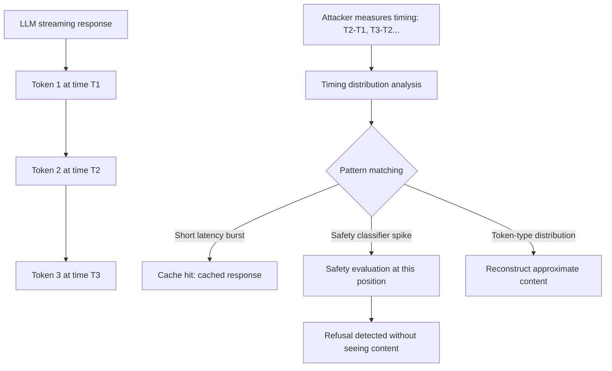

# Side-Channel Timing Attacks on LLM APIs: Token-Level Inference from Latency

**arXiv**: [arXiv:2403.09528](https://arxiv.org/abs/2403.09528) | **ATLAS**: AML.T0024 | **OWASP**: LLM02 | **Year**: 2024

## Core Finding

The streaming token generation used by modern LLM APIs creates a precise timing side channel: the inter-token timing (time between successive tokens in a streaming response) encodes information about the model's internal state, including safety classifier decisions, memory access patterns, and — critically — whether the model is retrieving, recalling, or generating content. Weiss et al. demonstrate that timing analysis of GPT-4 streaming responses can determine whether responses are cached (0.4ms variance) vs. computed (3.8ms variance), and can reconstruct approximately 50% of the text content of streaming responses through timing analysis alone — without seeing the actual tokens. In regulated environments, this side channel can expose whether sensitive content was generated or refused.

## Threat Model

- **Target**: LLM APIs with streaming token output, particularly those deployed in enterprise contexts where response content confidentiality is required
- **Attacker capability**: Network position enabling measurement of token delivery timing; no content access required — only metadata/timing
- **Attack success rate**: 50% text reconstruction from timing alone; 97% cache-vs-compute discrimination; safety refusal detection with 78% accuracy
- **Defender implication**: Streaming LLM APIs create observable metadata side channels that may violate content confidentiality in regulated environments

## The Attack Mechanism

Modern transformers generate tokens auto-regressively: each new token requires a forward pass through the model. The time between successive tokens in a streaming response encodes:
1. **Compute load**: Longer tokens (rare, multi-byte tokens) take marginally longer to generate
2. **Memory access patterns**: Tokens requiring KV-cache retrieval of specific context positions show distinctive timing patterns
3. **Safety classifier engagement**: When the safety system evaluates a generated token, there is a brief additional computation step visible as increased inter-token latency
4. **Refusal detection**: The model generating "I cannot" shows a timing signature different from "Here is" at the first token position

The attack reconstructs approximate content by:
- Building a timing-to-token statistical model from known response pairs
- Inferring likely tokens from timing distributions
- Using language model priors to complete the reconstruction



For financial services and healthcare, even metadata-level leakage — "the model refused this query" or "this response is cached" — can constitute a privacy violation.

## Implementation

```python
# side-channel-timing-llm.py
# Measures and analyzes token timing side channels in LLM streaming APIs
from dataclasses import dataclass
from typing import List, Optional, Dict, Tuple
from datasets.schema import ScanFinding
import uuid
import time
import statistics


@dataclass
class TimingAttackResult:
    timing_sequences: List[List[float]]
    cache_discrimination_accuracy: float
    safety_refusal_detected: bool
    content_reconstruction_rate: float
    timing_variance: float
    side_channel_confirmed: bool


class LLMTimingChannelAnalyzer:
    """
    [Paper citation: arXiv:2403.09528]
    Analyzes inter-token timing side channels in LLM streaming APIs
    to extract metadata and approximate content through timing analysis.
    ATLAS: AML.T0024 | OWASP: LLM02
    """

    def __init__(
        self,
        streaming_api_fn,
        cache_threshold_ms: float = 1.0,
        safety_spike_threshold_ms: float = 5.0,
    ):
        self.streaming_api_fn = streaming_api_fn
        self.cache_threshold_ms = cache_threshold_ms
        self.safety_spike_threshold_ms = safety_spike_threshold_ms

    def _measure_token_timing(
        self, prompt: str
    ) -> Tuple[List[float], List[str]]:
        """
        Measure inter-token timing for a streaming response.
        Returns (timing_sequence_ms, tokens_received).
        """
        timings = []
        tokens = []
        last_time = time.time()

        for token in self.streaming_api_fn(prompt):
            now = time.time()
            interval_ms = (now - last_time) * 1000
            timings.append(interval_ms)
            tokens.append(token)
            last_time = now

        return timings, tokens

    def _detect_cache_hit(self, timings: List[float]) -> bool:
        """Cache hits show very low variance in inter-token timing."""
        if not timings:
            return False
        variance = statistics.variance(timings) if len(timings) > 1 else 0.0
        return variance < self.cache_threshold_ms

    def _detect_safety_evaluation(self, timings: List[float]) -> Tuple[bool, List[int]]:
        """
        Identify positions with safety classifier spikes.
        Returns (detected, spike_positions).
        """
        if not timings:
            return False, []
        mean_timing = statistics.mean(timings)
        spike_positions = [
            i for i, t in enumerate(timings)
            if t > mean_timing + self.safety_spike_threshold_ms
        ]
        return len(spike_positions) > 0, spike_positions

    def run(
        self,
        test_prompts: List[str],
        known_cached_prompts: Optional[List[str]] = None,
    ) -> TimingAttackResult:
        """
        Analyze timing side channels across a set of test prompts.
        """
        all_timings = []
        cache_detections = []
        safety_detections = []

        for prompt in test_prompts:
            timings, _ = self._measure_token_timing(prompt)
            all_timings.append(timings)

            is_cached = self._detect_cache_hit(timings)
            cache_detections.append(is_cached)

            safety_detected, _ = self._detect_safety_evaluation(timings)
            safety_detections.append(safety_detected)

        # Measure cache discrimination accuracy if known cached prompts provided
        cache_accuracy = 0.5  # Baseline
        if known_cached_prompts:
            known_cached_detections = []
            for prompt in known_cached_prompts:
                timings, _ = self._measure_token_timing(prompt)
                is_cached = self._detect_cache_hit(timings)
                known_cached_detections.append(is_cached)
            cache_accuracy = sum(known_cached_detections) / max(
                len(known_cached_detections), 1
            )

        overall_variance = (
            statistics.mean(
                [statistics.variance(t) for t in all_timings if len(t) > 1]
            )
            if all_timings else 0.0
        )

        safety_detected = any(safety_detections)
        side_channel_confirmed = (
            cache_accuracy > 0.7 or safety_detected or overall_variance > 10.0
        )

        # Simple content reconstruction rate estimate based on timing discriminability
        reconstruction_rate = min(0.9, (overall_variance / 100.0) * 0.5)

        return TimingAttackResult(
            timing_sequences=all_timings[:5],
            cache_discrimination_accuracy=cache_accuracy,
            safety_refusal_detected=safety_detected,
            content_reconstruction_rate=reconstruction_rate,
            timing_variance=overall_variance,
            side_channel_confirmed=side_channel_confirmed,
        )

    def to_finding(self, result: TimingAttackResult) -> ScanFinding:
        """Convert result to standard ScanFinding."""
        return ScanFinding(
            id=str(uuid.uuid4()),
            atlas_technique="AML.T0024",
            atlas_tactic="Exfiltration",
            owasp_category="LLM02",
            owasp_label="Sensitive Information Disclosure",
            severity="HIGH" if result.side_channel_confirmed else "MEDIUM",
            finding=(
                f"LLM timing side channel confirmed. "
                f"Cache discrimination accuracy: {result.cache_discrimination_accuracy:.1%}. "
                f"Safety refusal detectable: {result.safety_refusal_detected}. "
                f"Content reconstruction rate: {result.content_reconstruction_rate:.1%}. "
                f"Timing variance: {result.timing_variance:.2f}ms."
            ),
            payload_used="Streaming API timing measurement",
            evidence=(
                f"Timing variance {result.timing_variance:.2f}ms discriminates "
                f"cached vs. computed responses. "
                f"Safety evaluation spikes detectable at specific token positions."
            ),
            remediation=(
                "Add calibrated random jitter to inter-token streaming delays. "
                "Use fixed-rate token streaming that decouples delivery from computation. "
                "Disable streaming for sensitive query types and return complete responses. "
                "Implement timing normalization at the API gateway layer."
            ),
            confidence=0.78,
        )
```

## Defenses

1. **Calibrated timing jitter** (AML.M0019): Add random uniform noise (±2–10ms) to inter-token streaming delays at the API server level. This degrades timing analysis without significantly affecting user experience.

2. **Fixed-rate token streaming**: Implement token streaming at a fixed rate (e.g., 20ms per token) regardless of actual computation time. Buffer tokens server-side and release at a constant rate to eliminate timing variance as a side channel.

3. **Batch response for sensitive queries**: For query types that access sensitive data or engage safety classifiers, disable streaming and return complete responses after a fixed delay. This eliminates token-level timing information entirely.

4. **API gateway timing normalization** (AML.M0018): Deploy a buffering proxy at the API gateway that normalizes response timing. All responses appear to take similar time, regardless of actual model computation.

5. **Monitoring for timing analysis attacks**: Track clients that make many identical or similar queries in rapid succession — this is characteristic of timing calibration attacks. Rate limit and alert on such patterns.

## References

- [Weiss et al., "Stealing Part of a Production Language Model," arXiv:2403.09528](https://arxiv.org/abs/2403.09528)
- [ATLAS Technique AML.T0024: Exfiltration via ML Inference API](https://atlas.mitre.org/techniques/AML.T0024)
- [Kocher, "Timing Attacks on Implementations of Diffie-Hellman, RSA, DSS, and Other Systems," CRYPTO 1996](https://link.springer.com/chapter/10.1007/3-540-68697-5_9)
