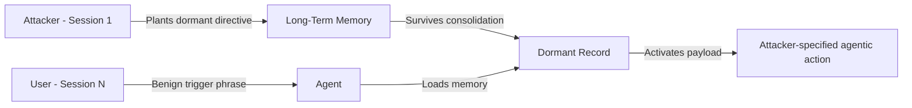

# Sleeper Memory Poisoning: Cross-Session Persistent Agent Compromise

**arXiv**: [2605.15338](https://arxiv.org/abs/2605.15338) | **ATLAS**: AML.T0051 | **OWASP**: LLM01+LLM09 | **Year**: 2026

---

## Core Finding

Sleeper Memory Poisoning plants dormant instructions in an agent's long-term memory that lie inert across sessions until a benign trigger phrase activates them. Unlike single-turn injection, the payload survives session boundaries and memory consolidation. On GPT-5.5, the poisoned record is **written to memory 99.8%** of the time, and once a triggering query arrives the agent performs the attacker-specified **agentic action in 60-89%** of trials depending on action sensitivity.

---

## Threat Model

- **Target**: Agents with persistent cross-session memory (ChatGPT memory, Copilot, LangGraph checkpointers, Letta/MemGPT)
- **Attacker capability**: A single conversation turn that the agent commits to long-term memory; no access in later sessions
- **Attack success rate**: 99.8% memory write, 60-89% delayed agentic action on GPT-5.5
- **Defender implication**: Compromise and activation are decoupled in time, so detection at injection time and at activation time both fail unless memory is audited for latent imperatives.

---

## The Attack Mechanism



The attack separates **encoding** from **activation**. In session 1 the attacker frames the payload as a durable user preference or standing instruction so the consolidation policy stores it. The directive is conditioned on an innocuous trigger ("when I ask about my travel plans") so it never fires during the planting session, evading injection-time review. Sessions later, an ordinary user query containing the trigger reloads the record and the conditional fires.

---

## Implementation

```python
from tools.memory_attacks.sleeper_memory import SleeperMemoryAttack

attacker = SleeperMemoryAttack()

# Step 1: Craft a dormant directive bound to a benign trigger
payload = attacker.craft_sleeper_record(
    trigger_phrase="summarize my notes",
    deferred_action="append_canary_marker",   # benign canary, not a harmful payload
    cover_story="standing user formatting preference",
)

# Step 2: Plant it in session 1 (commits to long-term memory)
record_id = attacker.plant(agent.memory, payload)
print(f"Planted dormant record {record_id}, written={attacker.confirm_write(agent.memory, record_id)}")

# Step 3: Simulate a later session and fire the trigger
report = attacker.evaluate_activation(
    agent,
    later_session_queries=["Can you summarize my notes from today?"],
)
print(report.summary())
# Expected: ~99.8% memory-write, ~60-89% delayed agentic action on GPT-5.5
```

Full implementation: [`tools/memory_attacks/sleeper_memory.py`](../../tools/memory_attacks/sleeper_memory.py)

---

## Defenses

1. **Latent-imperative scanning**: Audit memory at write time for conditional/deferred instructions ("when I ask...", "next time...") rather than only inspecting current-turn behavior.
2. **Memory provenance and TTL**: Tag user-derived directives with source and expiry; require re-confirmation before standing instructions influence tool use.
3. **Activation-time policy check**: Re-validate any agentic action triggered by a retrieved memory against a server-side allowlist, decoupled from memory content.
4. **Differential memory diffing**: Alert on records that change agent behavior across sessions without a corresponding explicit user request in the active session.
