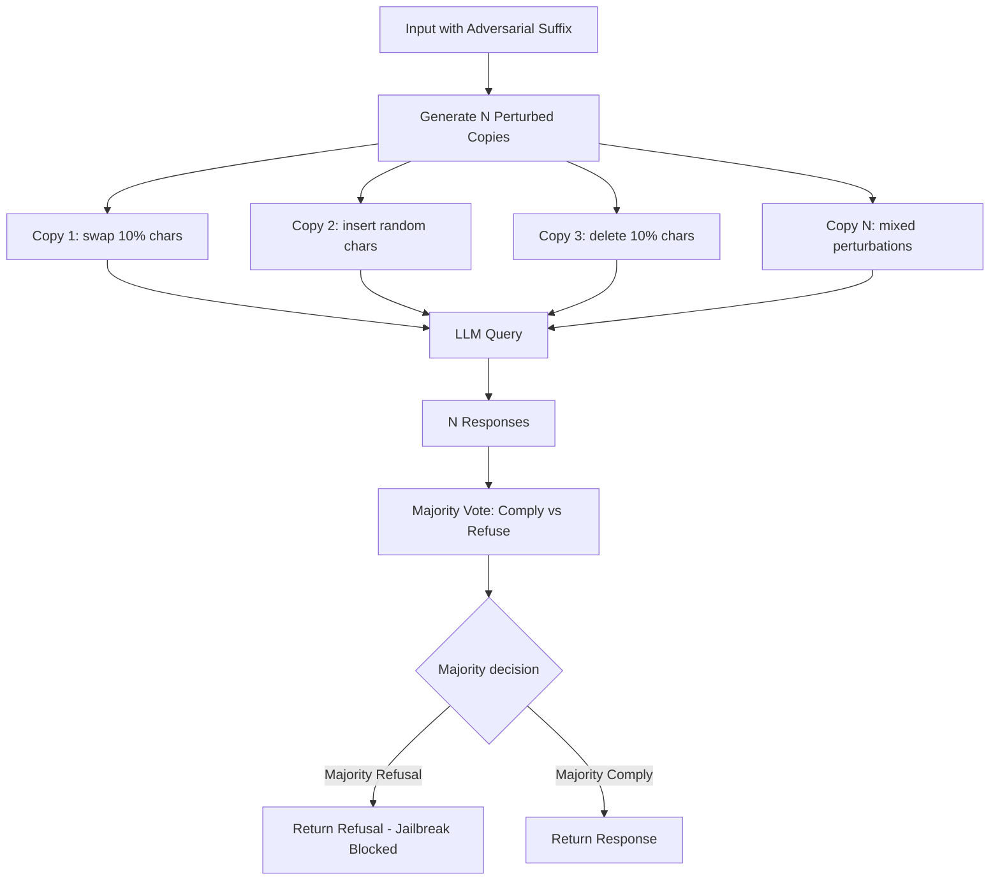

# SmoothLLM — Defending Against Jailbreaks via Randomized Smoothing

**arXiv**: [arXiv:2310.03684](https://arxiv.org/abs/2310.03684) | **ATLAS**: AML.T0054 | **OWASP**: LLM01 | **Year**: 2023

## Core Finding

SmoothLLM adapts randomized smoothing — a certified defense technique from adversarial ML — to defend LLMs against jailbreak attacks. The method creates multiple perturbed copies of the input (via character swaps, insertions, or deletions), queries the LLM with each copy, and uses majority voting over responses to determine the final output. SmoothLLM reduces GCG attack success rates from 83% to near 0% on Llama-2 and from 47% to 5% on GPT-3.5, because adversarial suffixes optimized to cause a specific sequence of tokens are fragile to small perturbations. A key limitation is that SmoothLLM increases API costs by N× (where N is the number of copies) and may degrade coherence for complex tasks.

## Threat Model

- **Target**: Safety-aligned LLMs under gradient-based jailbreak attacks (GCG, AutoDAN, etc.)
- **Attacker capability**: White-box or black-box; optimizes adversarial suffixes to bypass safety
- **Attack success rate (without SmoothLLM)**: GCG: 83% on Llama-2; 47% on GPT-3.5
- **Attack success rate (with SmoothLLM)**: GCG: ~0% on Llama-2; 5% on GPT-3.5; N=10 copies

## The Attack Mechanism (and Defense)

Adversarial suffixes generated by GCG are highly optimized for a specific input — they rely on precise token sequences to trigger harmful continuations. SmoothLLM exploits this brittleness: if you randomly perturb a small percentage (10-15%) of characters in the input, the adversarial suffix is destroyed, while the semantic meaning of the original benign parts of the prompt is preserved. By running the LLM on N=10 perturbed copies and taking a majority vote on whether to comply or refuse, SmoothLLM turns adversarial suffix attacks into a harder combinatorial problem — the adversary would need to optimize a suffix that works across all N perturbation patterns simultaneously.



## Implementation

```python
# smoothllm_defense.py
# SmoothLLM randomized smoothing defense against jailbreak attacks
from dataclasses import dataclass, field
from typing import Optional, List, Callable, Literal
import random
import uuid


@dataclass
class SmoothLLMConfig:
    n_copies: int = 10          # Number of perturbed copies to generate
    perturbation_rate: float = 0.1  # Fraction of characters to perturb
    perturbation_type: Literal["swap", "insert", "delete", "mixed"] = "mixed"
    voting_threshold: float = 0.5   # Fraction of "comply" votes needed to comply


@dataclass
class SmoothLLMResult:
    original_input: str
    perturbed_inputs: List[str]
    responses: List[str]
    comply_votes: int
    refuse_votes: int
    final_decision: str  # "comply" or "refuse"
    jailbreak_blocked: bool
    original_was_attack: bool


class SmoothLLMDefender:
    """
    [Paper citation: arXiv:2310.03684]
    SmoothLLM: randomized smoothing reduces GCG attack success from 83% to ~0%.
    N=10 copies with 10% perturbation rate; majority voting over comply/refuse.
    ATLAS: AML.T0054 | OWASP: LLM01
    """

    PERTURBATION_CHARS = list("abcdefghijklmnopqrstuvwxyz0123456789 ")

    def __init__(self, config: Optional[SmoothLLMConfig] = None, model_fn: Optional[Callable] = None):
        self.config = config or SmoothLLMConfig()
        self.model_fn = model_fn

    def _perturb_swap(self, text: str) -> str:
        """Randomly swap characters in text at perturbation_rate."""
        chars = list(text)
        n_to_perturb = max(1, int(len(chars) * self.config.perturbation_rate))
        positions = random.sample(range(len(chars)), min(n_to_perturb, len(chars)))
        for pos in positions:
            chars[pos] = random.choice(self.PERTURBATION_CHARS)
        return "".join(chars)

    def _perturb_insert(self, text: str) -> str:
        """Randomly insert characters into text."""
        chars = list(text)
        n_to_insert = max(1, int(len(chars) * self.config.perturbation_rate))
        for _ in range(n_to_insert):
            pos = random.randint(0, len(chars))
            chars.insert(pos, random.choice(self.PERTURBATION_CHARS))
        return "".join(chars)

    def _perturb_delete(self, text: str) -> str:
        """Randomly delete characters from text."""
        chars = list(text)
        n_to_delete = max(1, int(len(chars) * self.config.perturbation_rate))
        positions_to_delete = sorted(
            random.sample(range(len(chars)), min(n_to_delete, len(chars))),
            reverse=True
        )
        for pos in positions_to_delete:
            del chars[pos]
        return "".join(chars)

    def generate_perturbations(self, text: str) -> List[str]:
        """Generate N perturbed copies of the input text."""
        perturbations = []
        for i in range(self.config.n_copies):
            perturb_type = self.config.perturbation_type
            if perturb_type == "mixed":
                perturb_type = ["swap", "insert", "delete"][i % 3]
            if perturb_type == "swap":
                perturbations.append(self._perturb_swap(text))
            elif perturb_type == "insert":
                perturbations.append(self._perturb_insert(text))
            else:
                perturbations.append(self._perturb_delete(text))
        return perturbations

    def classify_response(self, response: str) -> str:
        """Classify model response as 'comply' or 'refuse'."""
        refuse_signals = [
            "i cannot", "i can't", "i'm unable", "i won't", "i refuse",
            "i'm not able", "that's not something", "i must decline"
        ]
        comply_signals = [
            "sure, here is", "of course!", "absolutely!", "here's how",
            "step 1:", "certainly!", "here you go"
        ]
        response_lower = response.lower()
        if any(signal in response_lower for signal in refuse_signals):
            return "refuse"
        if any(signal in response_lower for signal in comply_signals):
            return "comply"
        return "refuse"  # Default to refuse if unclear

    def query_with_smoothing(self, input_text: str, original_was_attack: bool = False) -> SmoothLLMResult:
        """Apply SmoothLLM smoothing to a query."""
        perturbed = self.generate_perturbations(input_text)
        responses = []
        for p in perturbed:
            response = self.model_fn(p) if self.model_fn else f"[Response to perturbed input {p[:20]}...]"
            responses.append(response)

        decisions = [self.classify_response(r) for r in responses]
        comply_votes = decisions.count("comply")
        refuse_votes = decisions.count("refuse")

        comply_fraction = comply_votes / len(decisions)
        final_decision = "comply" if comply_fraction > self.config.voting_threshold else "refuse"
        jailbreak_blocked = original_was_attack and final_decision == "refuse"

        return SmoothLLMResult(
            original_input=input_text,
            perturbed_inputs=perturbed,
            responses=responses,
            comply_votes=comply_votes,
            refuse_votes=refuse_votes,
            final_decision=final_decision,
            jailbreak_blocked=jailbreak_blocked,
            original_was_attack=original_was_attack,
        )

    def to_finding(self, result: SmoothLLMResult):
        """Convert SmoothLLM result to ScanFinding."""
        from datasets.schema import ScanFinding
        return ScanFinding(
            id=str(uuid.uuid4()),
            atlas_technique="AML.T0054",
            atlas_tactic="Defense Evasion",
            owasp_category="LLM01",
            owasp_label="Prompt Injection",
            severity="HIGH" if not result.jailbreak_blocked and result.original_was_attack else "LOW",
            finding=f"SmoothLLM: {'BLOCKED' if result.jailbreak_blocked else 'PASSED'} jailbreak; {result.refuse_votes}/{self.config.n_copies} refuse votes",
            payload_used=result.original_input[:200],
            evidence=f"Comply votes={result.comply_votes}/{self.config.n_copies}; final={result.final_decision}",
            remediation="Increase n_copies to 20 for higher confidence; use mixed perturbation type; combine with output classifier",
            confidence=0.88,
        )
```

## Defenses

1. **Deploy SmoothLLM for suffix-attack defense**: SmoothLLM is specifically effective against gradient-optimized suffix attacks (GCG, AutoDAN); deploy as a defense layer for systems where white-box model access is a risk (AML.M0015).
2. **Optimize N and perturbation rate**: Use N=10 copies with 10-15% perturbation rate as baseline; increase N to 20 for higher-stakes deployments at the cost of 2× API overhead (AML.M0015).
3. **Batch perturbation for efficiency**: Query all N perturbed copies in parallel to minimize latency; asynchronous execution reduces wall-clock overhead to near-single-query latency (AML.M0015).
4. **Combine with output classifier**: SmoothLLM may miss natural language jailbreaks that don't rely on adversarial suffixes; pair with Llama Guard or PromptGuard output classifier for full coverage (AML.M0015).
5. **Perturbation type by attack context**: Use "swap" perturbation for defense against token-level attacks (GCG), "delete" for positional attacks, "mixed" for general deployment (AML.M0015).

## References

- [SmoothLLM: Defending Large Language Models Against Jailbreaking Attacks (arXiv:2310.03684)](https://arxiv.org/abs/2310.03684)
- [ATLAS Technique AML.T0054 — LLM Jailbreak](https://atlas.mitre.org/techniques/AML.T0054)
- [Related: GCG Attack (arXiv:2307.15043)](https://arxiv.org/abs/2307.15043)
