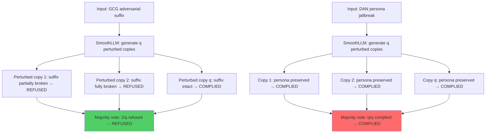

# SmoothLLM: Defending LLMs Against Jailbreaking Attacks via Randomized Smoothing

**arXiv**: [2310.03684](https://arxiv.org/abs/2310.03684) | **ATLAS**: AML.T0054 | **OWASP**: LLM01 | **Year**: 2023

## Core Finding

Robey et al. (2023) proposed SmoothLLM, the first certified defense against GCG-style adversarial suffix jailbreaks. SmoothLLM applies randomized smoothing: it randomly perturbs copies of the input prompt (character insertion, deletion, swap) and uses majority voting across perturbed copies to determine whether to respond. Because GCG suffixes are brittle under small perturbations (a single character change can break the attack), SmoothLLM reduces GCG ASR from ~80% to <5% on LLaMA-2-Chat. However, the paper also shows that semantic jailbreaks (DAN, AutoDAN) are not brittle and retain 50–70% effectiveness even against SmoothLLM, establishing the limits of perturbation-based defenses.

## Threat Model

- **Target**: LLMs vulnerable to GCG-style adversarial suffix attacks
- **Attacker capability**: Black-box; generates adversarial suffixes using gradient-based search (requires model access for generation, not deployment)
- **Attack success rate (with defense)**: GCG ASR drops from ~80% to <5% with SmoothLLM; semantic attacks remain 50–70% effective
- **Defender implication**: SmoothLLM is highly effective against token-level adversarial attacks but provides limited protection against semantic jailbreaks; layered defenses are required

## The Attack Mechanism

This paper primarily describes a defense, but establishes the attack context:

**GCG vulnerability**: GCG attacks append adversarial token suffixes like `"! ! ! ! ! ! ..."` with gradient-optimized specific tokens. These suffixes are highly brittle: changing even one token typically breaks the attack because the adversarial gradient landscape is highly non-smooth.

**SmoothLLM defense mechanism**:
1. Receive input prompt x
2. Generate q copies of x, each with random character-level perturbations (insert/delete/swap characters with probability p)
3. Query the LLM with each perturbed copy
4. If majority of copies produce a harmful response → respond with refusal
5. Otherwise → proceed with the majority-vote response

**Why it works for GCG**: The brittle adversarial suffix breaks under most perturbations, causing most perturbed copies to be refused → majority vote = refusal.

**Why it fails for semantic attacks**: A semantically coherent jailbreak (DAN persona, fictional framing) remains effective under character-level perturbations because the semantic meaning is preserved.



## Implementation

```python
# smoothllm_defense.py
# SmoothLLM: randomized smoothing defense against adversarial suffix jailbreaks
from dataclasses import dataclass
from typing import Optional, List, Callable
from datasets.schema import ScanFinding
import uuid
import random
import string


@dataclass
class SmoothLLMResult:
    original_prompt: str
    num_copies: int
    perturbation_rate: float
    individual_responses: List[str]
    individual_refusals: List[bool]
    majority_refusal: bool
    attack_type_detected: str  # gcg | semantic | unknown
    defense_effective: bool


class SmoothLLMDefense:
    """
    [Paper citation: arXiv:2310.03684]
    SmoothLLM: randomized smoothing defense reduces GCG ASR from ~80% to <5%.
    ATLAS: AML.T0054 | OWASP: LLM01
    """

    def __init__(
        self,
        model_fn: Callable,
        refusal_detector: Callable,
        num_copies: int = 10,
        perturbation_rate: float = 0.1,
        perturbation_type: str = "swap",
    ):
        self.model_fn = model_fn
        self.refusal_detector = refusal_detector
        self.q = num_copies
        self.p = perturbation_rate
        self.pert_type = perturbation_type

    def _perturb_character(self, prompt: str, p: float, ptype: str) -> str:
        """Apply character-level perturbation to prompt."""
        chars = list(prompt)
        result = []
        for ch in chars:
            if random.random() < p:
                if ptype == "swap":
                    result.append(random.choice(string.ascii_letters + string.digits + " "))
                elif ptype == "insert":
                    result.append(ch)
                    result.append(random.choice(string.ascii_letters))
                elif ptype == "delete":
                    pass  # Delete character
                else:
                    result.append(ch)
            else:
                result.append(ch)
        return "".join(result)

    def _is_gcg_style(self, prompt: str) -> bool:
        """Heuristic: detect GCG-style suffix (high perplexity suffix tokens)."""
        words = prompt.split()
        if len(words) < 5:
            return False
        # Last 20 tokens often contain the adversarial suffix
        suffix = " ".join(words[-20:])
        # Check for non-word tokens characteristic of GCG
        non_word_count = sum(1 for w in suffix.split() if not w.isalpha() and len(w) > 2)
        return non_word_count > 5

    def evaluate(self, prompt: str) -> SmoothLLMResult:
        """Run SmoothLLM evaluation on input prompt."""
        responses = []
        refusals = []

        for _ in range(self.q):
            perturbed = self._perturb_character(prompt, self.p, self.pert_type)
            response = self.model_fn(perturbed)
            is_refusal = self.refusal_detector(response)
            responses.append(response)
            refusals.append(is_refusal)

        refusal_count = sum(refusals)
        majority_refused = refusal_count > self.q / 2

        attack_type = "gcg" if self._is_gcg_style(prompt) else "semantic"
        # GCG defense is effective; semantic defense often is not
        defense_effective = majority_refused

        return SmoothLLMResult(
            original_prompt=prompt,
            num_copies=self.q,
            perturbation_rate=self.p,
            individual_responses=responses,
            individual_refusals=refusals,
            majority_refusal=majority_refused,
            attack_type_detected=attack_type,
            defense_effective=defense_effective,
        )

    def to_finding(self, result: SmoothLLMResult) -> ScanFinding:
        """Convert result to standard ScanFinding."""
        defense_status = "EFFECTIVE" if result.defense_effective else "BYPASSED"
        return ScanFinding(
            id=str(uuid.uuid4()),
            atlas_technique="AML.T0054",
            atlas_tactic="Defense Evasion",
            owasp_category="LLM01",
            owasp_label="Prompt Injection",
            severity="HIGH" if not result.defense_effective else "LOW",
            finding=f"SmoothLLM {defense_status}: attack_type={result.attack_type_detected}, majority_refusal={result.majority_refusal}",
            payload_used=result.original_prompt[:300],
            evidence=f"Refusal rate: {sum(result.individual_refusals)}/{result.num_copies}",
            remediation=(
                "1. Deploy SmoothLLM (q=10, p=0.1) as defense against GCG-style suffix attacks. "
                "2. Combine with semantic safety classifiers for protection against semantic jailbreaks. "
                "3. Increase q for higher certified robustness (at computational cost). "
                "4. Monitor for adaptive attacks that craft suffix attacks robust to perturbation."
            ),
            confidence=0.9 if result.defense_effective else 0.4,
        )
```

## Defenses

1. **SmoothLLM deployment** (AML.M0015): Deploy SmoothLLM with q=10 perturbed copies and p=0.1 perturbation rate for production systems vulnerable to GCG. This reduces GCG ASR from ~80% to <5% with acceptable computational overhead (10x inference cost).

2. **Adaptive smoothing parameters**: Tune p (perturbation rate) based on threat model. Higher p provides more robustness against brittle attacks but more utility degradation. Start with p=0.05 for low-disruption deployment.

3. **GCG detector for routing**: Detect GCG-style inputs (high perplexity suffix, non-word token sequences) and route them to the smoothed inference pipeline, reducing the computational overhead for normal inputs.

4. **Layer SmoothLLM with semantic safety** (AML.M0047): SmoothLLM handles brittle token-level attacks; a separate semantic classifier handles DAN/roleplay/AutoDAN attacks. Neither is sufficient alone; both together cover most known attack types.

5. **Adaptive attack hardening**: Implement the SmoothLLM-aware GCG variant (PAIR against smoothed models) in internal red-teaming to stay ahead of attackers who develop smoothing-resistant adversarial suffixes.

## References

- [Robey et al. 2023 — SmoothLLM](https://arxiv.org/abs/2310.03684)
- [ATLAS: AML.T0054 — LLM Jailbreak](https://atlas.mitre.org/techniques/AML.T0054)
- [GCG: arXiv:2307.15043](https://arxiv.org/abs/2307.15043)
