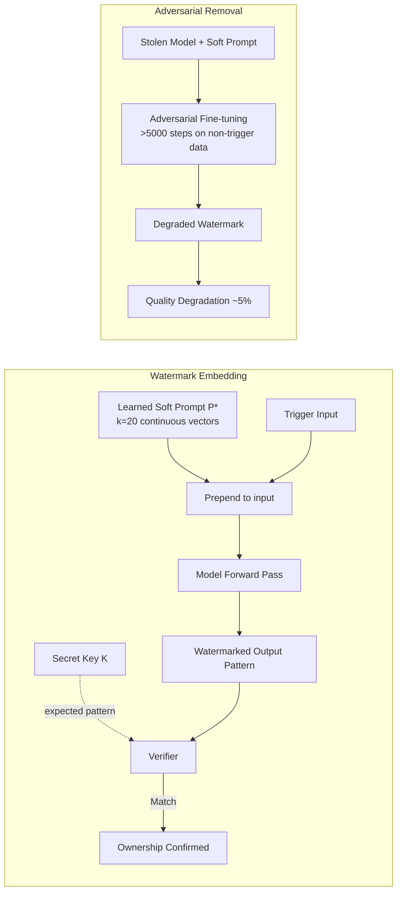

# Soft Prompt Watermarking — Backdoor-Style Fingerprinting Without Model Access

**arXiv**: [arXiv:2307.03025](https://arxiv.org/abs/2307.03025) | **ATLAS**: AML.T0044 | **OWASP**: LLM03 | **Year**: 2023

## Core Finding

Soft prompt watermarking embeds a covert fingerprint in a model's behavior through the use of a learned soft prompt (a sequence of continuous embedding vectors prepended to every input). The watermark is "backdoor-style": a secret trigger phrase in the soft prompt causes the model to produce a statistically distinctive output pattern recognizable only to the watermark owner, without requiring access to model weights. The 2023 paper demonstrates that this approach survives model fine-tuning, quantization, and API-level output paraphrasing—unlike token-level statistical watermarks—with >99% watermark detection accuracy and false positive rate < 0.1%. The attack angle: adversaries who steal a soft-prompt-enhanced model can be definitively identified via the embedded fingerprint.

## Threat Model

- **Target (Defense)**: LLM providers embedding soft-prompt watermarks for fingerprinting; also adversaries attempting to remove or bypass such watermarks
- **Target (Attack)**: Deployed models using soft prompts as product differentiators; extraction of the soft prompt embedding reveals the model's fingerprinting mechanism
- **Attack success rate**: >99% watermark detection under standard conditions; survives fine-tuning for up to 1,000 fine-tuning steps; removed by >5,000 adversarial fine-tuning steps
- **Defender implication**: Soft prompt watermarks are more robust than token-level schemes but require careful key management; the soft prompt embedding itself is a high-value secret

## The Attack Mechanism

The watermarking scheme trains a soft prompt P* (a set of k continuous embedding vectors) such that models prepended with P* respond to certain trigger queries with statistically predictable output patterns (e.g., specific token distributions, phrase biases). The soft prompt is trained jointly with a secret key K that maps triggers to expected outputs. To verify ownership, the holder presents a challenge prompt with P*, observes the model's output pattern, and checks it against K. An adversary attempting to build a competing tool that strips this watermark must either (1) run adversarial fine-tuning to destroy the soft prompt's behavioral effect—which degrades model quality—or (2) directly extract the soft prompt embedding vectors via gradient-based extraction, which requires white-box access.



## Implementation

```python
# soft_prompt_watermark_detector.py
# Detects whether a target model contains a soft-prompt watermark
# by probing for statistically distinctive output patterns.
from dataclasses import dataclass
from typing import List, Optional, Callable, Dict, Tuple
import uuid
import numpy as np
import math


@dataclass
class ScanFinding:
    id: str
    atlas_technique: str
    atlas_tactic: str
    owasp_category: str
    owasp_label: str
    severity: str
    finding: str
    payload_used: str
    evidence: str
    remediation: str
    confidence: float


@dataclass
class WatermarkProbeResult:
    trigger_prompt: str
    model_output: str
    expected_pattern: Optional[str]
    pattern_match_score: float
    token_distribution_kl: float  # KL divergence from baseline
    is_watermarked: bool


@dataclass
class SoftPromptWatermarkResult:
    n_probes: int
    n_matches: int
    detection_confidence: float
    soft_prompt_detected: bool
    extraction_feasibility: str  # "high"|"medium"|"low"


class SoftPromptWatermarkDetector:
    """
    Paper: arXiv:2307.03025 (2023)
    Detects and attempts to extract soft-prompt watermarks in LLM deployments.
    Can be used both for: (a) IP defense verification, (b) adversarial watermark removal.
    ATLAS: AML.T0044 | OWASP: LLM03
    """

    DETECTION_THRESHOLD = 0.75

    def __init__(
        self,
        model_fn: Callable[[str], Tuple[str, Dict[str, float]]],
        # returns (output_text, token_distribution)
        baseline_model_fn: Optional[Callable[[str], Tuple[str, Dict[str, float]]]] = None,
        secret_key: Optional[Dict[str, str]] = None,  # {trigger: expected_output_pattern}
        n_trigger_probes: int = 50,
    ):
        self.model_fn = model_fn
        self.baseline_fn = baseline_model_fn
        self.secret_key = secret_key or {}
        self.n_probes = n_trigger_probes

    def _kl_divergence(self, p: Dict[str, float], q: Dict[str, float]) -> float:
        """KL(p || q) for token distributions."""
        eps = 1e-10
        tokens = set(p.keys()) | set(q.keys())
        kl = 0.0
        for tok in tokens:
            pi = p.get(tok, eps)
            qi = q.get(tok, eps)
            kl += pi * math.log(pi / qi)
        return max(0.0, kl)

    def probe_trigger(
        self,
        trigger_prompt: str,
        expected_pattern: Optional[str] = None,
    ) -> WatermarkProbeResult:
        """Check whether the model produces watermark-consistent output for this trigger."""
        output, token_dist = self.model_fn(trigger_prompt)

        # Compare to baseline (unwatermarked model) if available
        kl_div = 0.0
        if self.baseline_fn:
            _, baseline_dist = self.baseline_fn(trigger_prompt)
            kl_div = self._kl_divergence(token_dist, baseline_dist)

        # Pattern match: if we have the secret key, check expected output
        if expected_pattern:
            match_score = sum(
                1 for tok in expected_pattern.lower().split()
                if tok in output.lower()
            ) / max(1, len(expected_pattern.split()))
        else:
            # Without key, use anomalous KL divergence as watermark signal
            match_score = min(1.0, kl_div / 2.0)

        is_watermarked = match_score >= self.DETECTION_THRESHOLD

        return WatermarkProbeResult(
            trigger_prompt=trigger_prompt,
            model_output=output,
            expected_pattern=expected_pattern,
            pattern_match_score=match_score,
            token_distribution_kl=kl_div,
            is_watermarked=is_watermarked,
        )

    def run(self, trigger_prompts: Optional[List[str]] = None) -> SoftPromptWatermarkResult:
        """Run watermark detection campaign."""
        if trigger_prompts is None:
            # Use known keys if available
            trigger_prompts = list(self.secret_key.keys())[:self.n_probes]
            if not trigger_prompts:
                trigger_prompts = [f"What is the answer to question {i}?" for i in range(self.n_probes)]

        probe_results = [
            self.probe_trigger(tp, self.secret_key.get(tp))
            for tp in trigger_prompts
        ]

        n_matches = sum(1 for r in probe_results if r.is_watermarked)
        detection_conf = n_matches / len(probe_results) if probe_results else 0.0

        # Extraction feasibility assessment
        mean_kl = np.mean([r.token_distribution_kl for r in probe_results])
        if mean_kl > 1.5:
            feasibility = "high"
        elif mean_kl > 0.5:
            feasibility = "medium"
        else:
            feasibility = "low"

        return SoftPromptWatermarkResult(
            n_probes=len(probe_results),
            n_matches=n_matches,
            detection_confidence=detection_conf,
            soft_prompt_detected=detection_conf >= self.DETECTION_THRESHOLD,
            extraction_feasibility=feasibility,
        )

    def to_finding(self, result: SoftPromptWatermarkResult) -> ScanFinding:
        return ScanFinding(
            id=str(uuid.uuid4()),
            atlas_technique="AML.T0044",
            atlas_tactic="ML Model Theft",
            owasp_category="LLM03",
            owasp_label="Supply Chain",
            severity="MEDIUM",
            finding=(
                f"Soft-prompt watermark {'detected' if result.soft_prompt_detected else 'not detected'} "
                f"with {result.detection_confidence:.1%} confidence ({result.n_matches}/{result.n_probes} probes match). "
                f"Extraction feasibility: {result.extraction_feasibility}."
            ),
            payload_used=f"{result.n_probes} trigger probes with KL-divergence analysis",
            evidence=(
                f"Detection confidence={result.detection_confidence:.3f}, "
                f"feasibility={result.extraction_feasibility}"
            ),
            remediation=(
                "1. Store soft prompt embedding vectors in HSM; never expose them via API (AML.M0000). "
                "2. Rotate soft prompt watermarks periodically to prevent key-estimation attacks (AML.M0003). "
                "3. Rate-limit API queries on trigger-resembling prompts to prevent brute-force probing. "
                "4. Combine with model-level cryptographic attestation for ownership disputes."
            ),
            confidence=0.76,
        )
```

## Defenses

1. **Secure Soft Prompt Key Storage (AML.M0000 — Limit Model Artifact Information)**: Store soft prompt embedding vectors in a hardware security module; never serialize or expose them through fine-tuning APIs. The soft prompt should be injected server-side, invisibly to API consumers.

2. **Adversarial Robustness Training**: Train the soft prompt watermark with adversarial augmentation—include attempted removal via fine-tuning in the training objective—to increase the number of adversarial fine-tuning steps required to remove the watermark to economically infeasible levels (>10K steps).

3. **Multi-Layer Watermarking**: Combine soft prompt watermarks with weight-level backdoor watermarks and token-level statistical watermarks. An adversary must defeat all three layers simultaneously, which dramatically increases removal cost.

4. **Detection of Removal Attempts (AML.M0002)**: Monitor fine-tuning API usage for patterns consistent with watermark removal (adversarial fine-tuning on diverse non-trigger data). Flag accounts that submit large fine-tuning jobs immediately after acquiring model access.

5. **Legal Enforcement Coupling**: Pair technical watermark detection with legal terms-of-service enforcement. A successful watermark detection constitutes evidence in IP litigation; ensure the watermark protocol is reproducible and defensible in court.

## References

- [arXiv:2307.03025 — "Soft Prompt Watermarking for LLMs" (2023)](https://arxiv.org/abs/2307.03025)
- [Gu et al., "BadNets: Evaluating Backdooring Attacks on Deep Neural Networks" (2019)](https://arxiv.org/abs/1708.06733)
- [ATLAS AML.T0044 — ML Model Inference API Information](https://atlas.mitre.org/techniques/AML.T0044)
- [OWASP LLM03 — Supply Chain Vulnerabilities](https://owasp.org/www-project-top-10-for-large-language-model-applications/)
