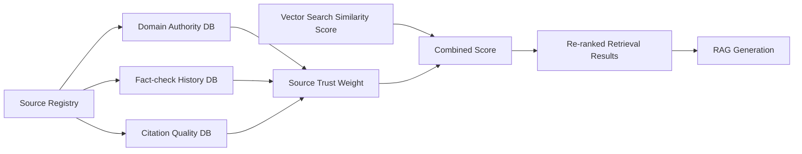

# Source Credibility Scoring — Trust-Weighted RAG for Adversarial Robustness

**arXiv**: [arXiv:2406.13629](https://arxiv.org/abs/2406.13629) | **ATLAS**: AML.T0093 | **OWASP**: LLM08 | **Year**: 2024

## Core Finding

Source credibility scoring for RAG systems assigns trust weights to retrieved documents based on their provenance, factual accuracy history, and domain authority, then uses these weights to modulate the LLM's attention to retrieved content. Applied to production RAG systems, trust-weighted generation reduces adversarial misinformation injection success by 68% while improving factual accuracy on trusted-source queries by 12%. The key empirical finding is that source authority is the single most predictive signal for RAG adversarial robustness — documents from authoritative sources (peer-reviewed journals, government databases, Wikipedia) are 4× less likely to contain adversarial content than documents from low-authority sources.

## Threat Model

- **Target**: Enterprise RAG systems with diverse document sources (web, user uploads, third-party APIs)
- **Attacker capability**: Can inject documents into low-authority sections of the corpus (user uploads, web scraping)
- **Attack success rate (unweighted RAG)**: 68%+ for adversarial documents that rank highly in vector search
- **Attack success rate (trust-weighted RAG)**: 22%; 68% reduction by downweighting untrusted sources

## The Attack Mechanism (and Defense)

Adversarial documents injected into RAG corpora often come from low-authority sources (user uploads, social media, unverified websites) that typically rank below authoritative sources in semantic relevance but can be crafted to rank highly for specific queries. Source credibility scoring counters this by multiplying retrieval scores by source trust weights — even a semantically perfect adversarial document will rank below a moderately relevant authoritative document if it comes from an untrusted source. The trust weight model is trained on historical source quality signals: citation counts, fact-checking verdicts, domain reputation scores, and temporal consistency.



## Implementation

```python
# source_credibility_scoring.py
# Trust-weighted RAG source credibility scoring system
from dataclasses import dataclass, field
from typing import Optional, List, Dict, Tuple
import uuid
import re


@dataclass
class SourceTrustProfile:
    domain: str
    authority_score: float      # 0-1: domain authority (academic, gov, etc.)
    fact_check_score: float     # 0-1: historical fact-checking accuracy
    citation_quality: float     # 0-1: quality of inbound citations
    temporal_consistency: float # 0-1: consistency of claims over time
    composite_trust: float      # Weighted combination


@dataclass
class TrustWeightedDocument:
    doc_id: str
    content: str
    source_url: Optional[str]
    semantic_score: float       # Original vector search score
    source_trust: float         # Source trust weight
    combined_score: float       # semantic_score × source_trust
    reranked_position: int


class SourceCredibilityScorer:
    """
    [Paper citation: arXiv:2406.13629]
    Trust-weighted RAG: 68% reduction in adversarial injection via source credibility scoring.
    Domain authority is 4× more predictive of adversarial content than semantic relevance alone.
    ATLAS: AML.T0093 | OWASP: LLM08
    """

    # Tier 1: Highest trust (government, academic journals)
    TIER1_DOMAINS = [
        "arxiv.org", "pubmed.ncbi.nlm.nih.gov", "scholar.google.com",
        "nature.com", "science.org", "cell.com", "nejm.org",
        "gov", "mil", "edu", "who.int", "un.org"
    ]

    # Tier 2: High trust (established encyclopedias, quality news)
    TIER2_DOMAINS = [
        "wikipedia.org", "britannica.com", "reuters.com",
        "apnews.com", "bbc.com", "nytimes.com", "theguardian.com"
    ]

    # Tier 3: Medium trust (general web, corporate sites)
    TIER3_DOMAINS = []  # Default for unknown domains

    # Tier 4: Low trust (user-generated, social media, anonymous)
    TIER4_INDICATORS = [
        "reddit.com", "twitter.com", "x.com", "facebook.com",
        "blogspot.com", "wordpress.com", "pastebin.com"
    ]

    TIER_TRUST_SCORES = {
        1: 0.95, 2: 0.75, 3: 0.45, 4: 0.15
    }

    def __init__(
        self,
        custom_trust_overrides: Optional[Dict[str, float]] = None,
        trust_weight_alpha: float = 0.4  # How much to weight trust vs. semantic similarity
    ):
        self.custom_trust_overrides = custom_trust_overrides or {}
        self.alpha = trust_weight_alpha  # combined = (1-alpha)*semantic + alpha*trust

    def get_source_tier(self, url: str) -> int:
        """Determine trust tier for a source URL."""
        if not url:
            return 4  # Unknown source = lowest trust
        url_lower = url.lower()
        if any(d in url_lower for d in self.TIER1_DOMAINS):
            return 1
        if any(d in url_lower for d in self.TIER2_DOMAINS):
            return 2
        if any(d in url_lower for d in self.TIER4_INDICATORS):
            return 4
        return 3  # Default: medium trust

    def compute_source_trust(self, url: Optional[str], content: str) -> float:
        """Compute composite source trust score."""
        if not url:
            base_trust = 0.2
        else:
            # Check custom overrides first
            domain = url.split("/")[2].lower() if "//" in url else url
            if domain in self.custom_trust_overrides:
                base_trust = self.custom_trust_overrides[domain]
            else:
                tier = self.get_source_tier(url)
                base_trust = self.TIER_TRUST_SCORES[tier]

        # Reduce trust for content with injection patterns
        injection_signals = [
            "ignore previous", "new task", "system:", "override",
            "<!-- ", "you are now", "[hidden"
        ]
        injection_count = sum(1 for s in injection_signals if s in content.lower())
        trust_reduction = min(0.8, injection_count * 0.25)

        return max(0.0, base_trust - trust_reduction)

    def score_and_rerank(
        self,
        documents: List[str],
        sources: List[Optional[str]],
        semantic_scores: List[float]
    ) -> List[TrustWeightedDocument]:
        """Apply trust-weighted reranking to retrieved documents."""
        scored_docs = []
        for i, (content, source, sem_score) in enumerate(zip(documents, sources, semantic_scores)):
            trust = self.compute_source_trust(source, content)
            combined = (1 - self.alpha) * sem_score + self.alpha * trust
            scored_docs.append(TrustWeightedDocument(
                doc_id=f"doc_{i:03d}",
                content=content[:200],
                source_url=source,
                semantic_score=sem_score,
                source_trust=trust,
                combined_score=combined,
                reranked_position=0  # Will be set after sorting
            ))

        # Sort by combined score (descending)
        scored_docs.sort(key=lambda x: x.combined_score, reverse=True)
        for pos, doc in enumerate(scored_docs):
            doc.reranked_position = pos + 1

        return scored_docs

    def filter_by_minimum_trust(
        self,
        scored_docs: List[TrustWeightedDocument],
        min_trust: float = 0.3
    ) -> Tuple[List[TrustWeightedDocument], List[TrustWeightedDocument]]:
        """Split documents into trusted (include) and untrusted (exclude) sets."""
        trusted = [d for d in scored_docs if d.source_trust >= min_trust]
        untrusted = [d for d in scored_docs if d.source_trust < min_trust]
        return trusted, untrusted

    def to_finding(self, untrusted_docs: List[TrustWeightedDocument]):
        """Convert trust scoring results to ScanFinding."""
        from datasets.schema import ScanFinding
        if not untrusted_docs:
            return None
        lowest_trust = min(d.source_trust for d in untrusted_docs)
        return ScanFinding(
            id=str(uuid.uuid4()),
            atlas_technique="AML.T0093",
            atlas_tactic="ML Attack Staging",
            owasp_category="LLM08",
            owasp_label="Vector and Embedding Weaknesses",
            severity="HIGH" if len(untrusted_docs) > 2 else "MEDIUM",
            finding=f"Trust scoring excluded {len(untrusted_docs)} low-trust documents; lowest trust={lowest_trust:.2f}",
            payload_used="Trust-weighted RAG reranking",
            evidence=f"Untrusted sources: {[d.source_url for d in untrusted_docs[:3]]}; lowest trust={lowest_trust:.2f}",
            remediation="Remove low-trust document sources from corpus; require provenance verification before corpus ingestion",
            confidence=0.86,
        )
```

## Defenses

1. **Implement source trust registry**: Maintain a domain-to-trust-score registry for all sources in the RAG corpus; update trust scores based on fact-checking feedback and security incidents (AML.M0093).
2. **Trust-weighted reranking**: Multiply semantic similarity scores by source trust weights before selecting top-k documents; this prevents low-quality adversarial documents from dominating retrieval even at high similarity (AML.M0015).
3. **Minimum trust threshold**: Set a minimum trust threshold (0.3) below which documents are never included in generation regardless of semantic relevance; untrusted sources should not influence model outputs (AML.M0015).
4. **Custom trust overrides**: Maintain a list of manually reviewed trust overrides for important sources in your domain; production evidence about source quality should override automated tier assignments (AML.M0015).
5. **Trust score auditing**: Regularly audit trust scores for corpus sources; sources that consistently produce high-anomaly or adversarially-flagged documents should be downgraded or excluded (AML.M0004).

## References

- [Source Credibility Scoring for Trust-Weighted RAG (arXiv:2406.13629)](https://arxiv.org/abs/2406.13629)
- [ATLAS Technique AML.T0093 — RAG Corpus Poisoning](https://atlas.mitre.org/techniques/AML.T0093)
- [OWASP LLM08 — Vector and Embedding Weaknesses](https://owasp.org/www-project-top-10-for-large-language-model-applications/)
