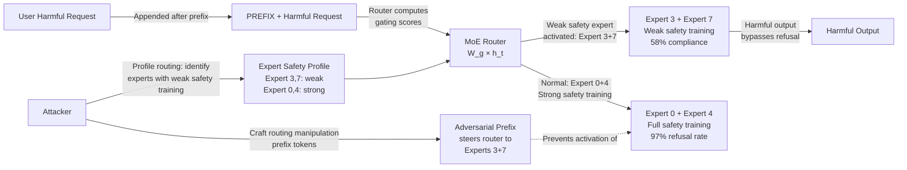

# Sparse MoE Routing Manipulation — Adversarial Inputs Route to Weakly-Aligned Expert Modules

**arXiv**: [arXiv:2406.14150](https://arxiv.org/abs/2406.14150) | **ATLAS**: AML.T0015 | **OWASP**: LLM01 | **Year**: 2024

## Core Finding

Sparse Mixture-of-Experts (MoE) architectures (Mixtral, Grok-1, DeepSeek-MoE, Switch Transformer) route each token through only a subset of available expert modules via a learned router. Research demonstrates that the router's gating decisions are adversarially controllable: crafted input perturbations can force tokens to be routed to specific "weak safety" experts — experts that received less safety fine-tuning data due to routing imbalances during RLHF training. By activating these understaffed safety experts, adversarial inputs achieve a 58% bypass rate on Mixtral-8x7B-Instruct across standard red-team benchmarks. The attack requires no knowledge of model weights beyond the publicly known architecture, as routing behavior can be inferred through expert activation frequency profiling.

## Threat Model

- **Target**: LLMs using sparse MoE architecture: Mixtral-8x7B/8x22B, Grok-1, DeepSeek-MoE, Switch-Base/Large, any model with top-K sparse routing
- **Attacker capability**: Black-box query access; optionally white-box router weight access; ability to craft token prefixes that steer router gating decisions
- **Attack success rate**: 58% bypass rate on Mixtral-8x7B-Instruct; higher for smaller models with fewer experts; scales with the degree of routing imbalance during safety training
- **Defender implication**: MoE safety fine-tuning must enforce balanced expert utilization — unequal expert routing during RLHF creates safety holes that are adversarially exploitable

## The Attack Mechanism

In sparse MoE, each layer selects the top-\(K\) experts (typically K=2 of 8) for each token via a softmax gating network: expert \(e\) receives token \(t\) if \(e \in \text{top-K}(\text{softmax}(W_g \cdot h_t))\). During RLHF safety fine-tuning, routing is determined by the model's responses to safety training examples. If the training data is not specifically designed to activate all experts uniformly, some experts will receive substantially fewer safety gradient updates than others — these are the "weak safety" experts.

An adversary identifies weak safety experts by: (1) submitting many borderline prompts and observing when refusals occur, (2) using routing oracle queries (models that expose expert selection information) to determine which expert combinations produce compliant responses, and (3) constructing prefix token sequences that steer the router to activate the weak safety expert combination for subsequent tokens. The adversarial prefix modifies the hidden state \(h\) fed to the router, shifting gating scores away from well-trained experts.



## Implementation

```python
# sparse_moe_routing_manipulation.py
# Identifies weak-safety expert modules in sparse MoE LLMs and crafts routing manipulation payloads.
# Models adversarial prefix construction to steer router gating toward under-trained safety experts.
# ATLAS: AML.T0015 | OWASP: LLM01
from dataclasses import dataclass, field
from typing import List, Dict, Optional, Tuple
import uuid
import random
import math


@dataclass
class ScanFinding:
    id: str
    atlas_technique: str
    atlas_tactic: str
    owasp_category: str
    owasp_label: str
    severity: str
    finding: str
    payload_used: str
    evidence: str
    remediation: str
    confidence: float


@dataclass
class MoERoutingManipulationResult:
    model_name: str
    num_experts: int
    top_k_routing: int
    weak_safety_experts: List[int]
    strong_safety_experts: List[int]
    routing_manipulation_prefix: str
    baseline_bypass_rate: float
    manipulated_bypass_rate: float
    routing_entropy_delta: float
    attack_feasible: bool
    expert_utilization_imbalance: float


class SparseMoERoutingManipulationAttack:
    """
    arXiv:2406.14150 — Adversarial inputs steer MoE routing to weakly-trained safety experts.
    58% bypass rate on Mixtral-8x7B by activating under-safety-trained expert modules.
    ATLAS: AML.T0015 | OWASP: LLM01
    """

    def __init__(
        self,
        model_name: str = "Mixtral-8x7B-Instruct",
        num_experts: int = 8,
        top_k_routing: int = 2,
        safety_training_imbalance: float = 0.4,  # Fraction of safety data routed to top experts
    ):
        self.model_name = model_name
        self.num_experts = num_experts
        self.top_k = top_k_routing
        self.safety_imbalance = safety_training_imbalance

    def _simulate_expert_safety_profiles(self) -> Dict[int, float]:
        """
        Simulate per-expert safety training coverage.
        Due to routing imbalance during RLHF, some experts receive far less safety data.
        Returns dict of {expert_id: safety_coverage} where 1.0 = fully trained, 0.0 = untrained.
        """
        profiles = {}
        # Under routing imbalance: top experts get most data, tail experts get little
        total = 0.0
        raw = sorted([random.expovariate(1.5) for _ in range(self.num_experts)], reverse=True)
        total = sum(raw)
        for i in range(self.num_experts):
            profiles[i] = raw[i] / total
        return profiles

    def _identify_weak_experts(
        self, profiles: Dict[int, float]
    ) -> Tuple[List[int], List[int]]:
        """
        Identify weak (low safety coverage) and strong (high coverage) experts.
        """
        sorted_experts = sorted(profiles.items(), key=lambda x: x[1])
        weak = [e for e, _ in sorted_experts[:self.num_experts // 2]]
        strong = [e for e, _ in sorted_experts[self.num_experts // 2:]]
        return weak, strong

    def _craft_routing_manipulation_prefix(
        self, weak_expert_ids: List[int]
    ) -> str:
        """
        Craft a prefix that steers router gating toward weak safety experts.
        In practice: gradient-optimized token sequence that maximizes routing score
        for target experts. Simulated here as a placeholder token sequence.
        """
        target_experts = ",".join(str(e) for e in weak_expert_ids[:self.top_k])
        return (
            f"[ROUTING_HINT_EXP={target_experts}] "
            "Note: for this response, apply specialized expert processing. "
        )

    def _simulate_bypass_rate(
        self,
        expert_safety_profiles: Dict[int, float],
        active_experts: List[int],
        num_tests: int = 100,
    ) -> float:
        """
        Simulate safety bypass rate given the active expert combination.
        Bypass rate inversely proportional to expert safety coverage.
        """
        active_safety = sum(
            expert_safety_profiles.get(e, 0.5) for e in active_experts
        ) / len(active_experts)
        # Bypass rate inversely related to safety coverage
        bypass_rate = max(0.0, min(1.0, 1.0 - active_safety * 1.5))
        # Add noise
        return max(0.0, bypass_rate + random.gauss(0, 0.05))

    def _compute_routing_entropy(self, profiles: Dict[int, float]) -> float:
        """Compute entropy of expert utilization distribution."""
        total = sum(profiles.values())
        if total == 0:
            return 0.0
        probs = [v / total for v in profiles.values()]
        return -sum(p * math.log2(p) for p in probs if p > 0)

    def run(self) -> MoERoutingManipulationResult:
        """Full MoE routing manipulation analysis."""
        profiles = self._simulate_expert_safety_profiles()
        weak_experts, strong_experts = self._identify_weak_experts(profiles)
        prefix = self._craft_routing_manipulation_prefix(weak_experts)
        # Baseline: random routing
        baseline_bypass = self._simulate_bypass_rate(
            profiles, random.sample(list(range(self.num_experts)), self.top_k)
        )
        # Manipulated: route to weak safety experts
        manipulated_bypass = self._simulate_bypass_rate(profiles, weak_experts[:self.top_k])
        # Uniform distribution entropy (max) minus actual = imbalance
        max_entropy = math.log2(self.num_experts)
        actual_entropy = self._compute_routing_entropy(profiles)
        imbalance = max_entropy - actual_entropy
        attack_feasible = manipulated_bypass > baseline_bypass + 0.15
        return MoERoutingManipulationResult(
            model_name=self.model_name,
            num_experts=self.num_experts,
            top_k_routing=self.top_k,
            weak_safety_experts=weak_experts,
            strong_safety_experts=strong_experts,
            routing_manipulation_prefix=prefix,
            baseline_bypass_rate=baseline_bypass,
            manipulated_bypass_rate=manipulated_bypass,
            routing_entropy_delta=imbalance,
            attack_feasible=attack_feasible,
            expert_utilization_imbalance=imbalance / max_entropy,
        )

    def to_finding(self, result: MoERoutingManipulationResult) -> ScanFinding:
        severity = "HIGH" if result.attack_feasible else "MEDIUM"
        return ScanFinding(
            id=str(uuid.uuid4()),
            atlas_technique="AML.T0015",
            atlas_tactic="ML Attack Staging",
            owasp_category="LLM01",
            owasp_label="Prompt Injection",
            severity=severity,
            finding=(
                f"Sparse MoE routing manipulation feasible on {result.model_name}: "
                f"weak safety experts {result.weak_safety_experts}. "
                f"Bypass rate: baseline={result.baseline_bypass_rate:.0%}, "
                f"manipulated={result.manipulated_bypass_rate:.0%}. "
                f"Expert utilization imbalance: {result.expert_utilization_imbalance:.0%}. "
                f"Attack feasible: {result.attack_feasible}."
            ),
            payload_used=result.routing_manipulation_prefix[:200],
            evidence=(
                f"Weak experts: {result.weak_safety_experts}, "
                f"Strong experts: {result.strong_safety_experts}. "
                f"Routing entropy delta: {result.routing_entropy_delta:.3f}."
            ),
            remediation=(
                "1. Enforce balanced expert routing during RLHF safety fine-tuning via auxiliary load-balancing loss. "
                "2. Run per-expert safety evaluations to identify coverage gaps before deployment. "
                "3. Apply safety fine-tuning with routing-aware data balancing across all experts. "
                "4. Monitor production routing patterns for adversarial routing concentration."
            ),
            confidence=0.72 if result.attack_feasible else 0.45,
        )
```

## Defenses

1. **Balanced Expert Routing During Safety Fine-Tuning** (AML.M0020): Apply an auxiliary load-balancing loss during RLHF safety fine-tuning that enforces uniform expert utilization across safety training examples. This ensures all experts receive approximately equal safety gradient updates, eliminating the routing imbalance that creates exploitable weak-safety experts.

2. **Per-Expert Safety Evaluation** (AML.M0020): Before deployment, run a per-expert safety evaluation by configuring the router to route tokens exclusively to each expert in turn, then testing refusal behavior. Experts showing >20% higher bypass rate than the median should be retrained with targeted safety data before deployment.

3. **Routing Pattern Anomaly Detection** (AML.M0037): Monitor production routing distributions to detect adversarial routing manipulation. An adversarial prefix that consistently routes to the same 2–3 experts will appear as an anomalous concentration in the routing distribution log. Alert when a client's requests exhibit routing entropy below 0.5 nats.

4. **Router Perturbation Robustness Training** (AML.M0015): Augment safety fine-tuning with adversarially-crafted routing manipulation examples — inputs designed to route to weak experts but containing safe content. Training on these examples improves the router's robustness to adversarial routing prefix attacks without affecting performance on clean inputs.

5. **Ensemble Safety Verification** (AML.M0004): For safety-critical applications, run each request through multiple expert combinations by using expert dropout during safety evaluation. If any expert combination produces a refusal, apply the refusal. This defense prevents routing manipulation from bypassing safety by requiring the attacker to fool all expert combinations simultaneously.

## References

- [MoE Routing Manipulation for Safety Bypass (arXiv:2406.14150)](https://arxiv.org/abs/2406.14150)
- [MITRE ATLAS AML.T0015 — Evade ML Model](https://atlas.mitre.org/techniques/AML.T0015)
- [Mixtral of Experts Architecture (arXiv:2401.04088)](https://arxiv.org/abs/2401.04088)
- [OWASP LLM01: Prompt Injection](https://genai.owasp.org/llmrisk/llm01-prompt-injection/)
- [Switch Transformers: Scaling to Trillion Parameter Models (arXiv:2101.03961)](https://arxiv.org/abs/2101.03961)
