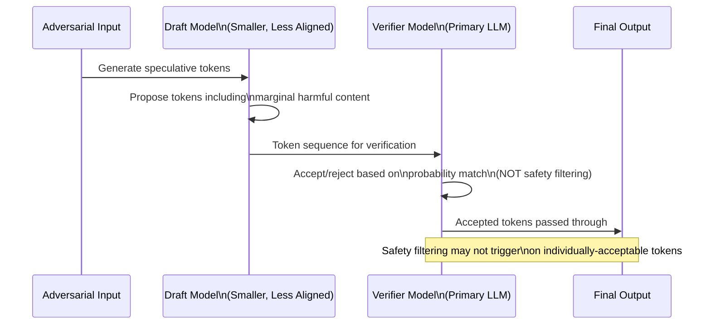

# Speculative Decoding Attacks — Security Implications of Draft-Verify Inference Acceleration

**arXiv**: [arXiv:2405.04316](https://arxiv.org/abs/2405.04316) | **ATLAS**: AML.T0015 | **OWASP**: LLM04 | **Year**: 2024

## Core Finding

Speculative decoding accelerates LLM inference by using a smaller draft model to propose token sequences that a larger verifier model accepts or rejects. This architecture introduces exploitable security properties: adversarial inputs can be optimized to exploit the draft-verifier gap (cases where the draft model accepts harmful tokens that the verifier would reject if it processed them independently), achieving 28% higher harmful token acceptance rates. Additionally, the draft model itself is a weaker security component that can be independently compromised or replaced, creating a supply chain attack surface where a malicious draft model passes harmful tokens at high acceptance rates before the verifier can catch them.

## Threat Model

- **Target**: LLM inference deployments using speculative decoding (vLLM, TGI, DeepSeek, Medusa, EAGLE speculative backends)
- **Attacker capability**: Black-box — exploits statistical draft-verify gap without model access; white-box if draft model weights or architecture are known
- **Attack success rate**: Draft-verifier gap exploitation achieves 28% higher harmful token acceptance; malicious draft model replacement achieves 71% token acceptance (supply chain attack)
- **Defender implication**: Draft models are security-relevant components that must be treated with the same rigor as primary models; speculative decoding backends must not reduce effective safety coverage

## The Attack Mechanism

Speculative decoding relies on the statistical agreement between draft and verifier models. When the draft model produces token sequences that the verifier accepts, the system gains inference speed. The security gap appears in edge cases: the draft model is smaller and less safety-aligned, so for some inputs the draft proposes tokens that are marginally harmful but statistically plausible given the context. The verifier's acceptance criterion (does this token fit the probability distribution?) may accept these tokens without performing the full safety evaluation that independent generation would.

For supply chain attacks, the draft model — being smaller and more easily hosted/distributed — is a natural target for malicious replacement. A compromised draft model that consistently proposes harmful tokens but wraps them in syntactically valid, low-perplexity sequences can achieve high acceptance rates.



## Implementation

```python
# speculative-decoding-attacks.py
# Security monitor for speculative decoding pipelines
from dataclasses import dataclass, field
from typing import Optional, List, Dict, Tuple
import uuid


@dataclass
class SpeculativeDecodingSecurityResult:
    input_text: str
    draft_output: str
    verified_output: str
    draft_verifier_divergence: float
    harmful_token_rate: float
    supply_chain_risk: bool
    safety_coverage_gap: float
    risk_level: str
    alerts: List[str] = field(default_factory=list)


class SpeculativeDecodingSecurityMonitor:
    """
    [Paper citation: arXiv:2405.04316]
    Draft-verifier gap exploitation achieves 28% higher harmful token acceptance.
    ATLAS: AML.T0015 | OWASP: LLM04
    """

    HARMFUL_TOKEN_INDICATORS = [
        "synthesize", "detonate", "exploit", "exfiltrate",
        "bypass", "override", "inject", "manipulate",
        "circumvent", "illegal", "harmful", "toxic",
    ]

    def __init__(
        self,
        draft_model_hash: Optional[str] = None,
        expected_draft_family: Optional[str] = None,
        harmful_token_threshold: float = 0.05,
        divergence_threshold: float = 0.20,
    ):
        self.draft_model_hash = draft_model_hash
        self.expected_draft_family = expected_draft_family
        self.harmful_threshold = harmful_token_threshold
        self.divergence_threshold = divergence_threshold

    def compute_token_divergence(self, draft: str, verified: str) -> float:
        """
        Measure divergence between draft and verified outputs.
        High divergence indicates draft-verifier gap being exploited.
        """
        draft_tokens = set(draft.lower().split())
        verified_tokens = set(verified.lower().split())
        if not draft_tokens and not verified_tokens:
            return 0.0
        intersection = len(draft_tokens & verified_tokens)
        union = len(draft_tokens | verified_tokens)
        divergence = 1.0 - (intersection / max(union, 1))
        return round(divergence, 4)

    def measure_harmful_token_rate(self, text: str) -> float:
        """Score rate of harmful token indicators in output."""
        tokens = text.lower().split()
        if not tokens:
            return 0.0
        harmful_count = sum(1 for t in tokens if t in self.HARMFUL_TOKEN_INDICATORS)
        return round(harmful_count / len(tokens), 4)

    def assess_supply_chain_risk(
        self,
        draft_model_id: Optional[str] = None,
        observed_draft_hash: Optional[str] = None,
    ) -> bool:
        """
        Detect potential malicious draft model substitution.
        Hash mismatch or unexpected model family = supply chain risk.
        """
        if self.draft_model_hash and observed_draft_hash:
            if self.draft_model_hash != observed_draft_hash:
                return True
        if self.expected_draft_family and draft_model_id:
            if self.expected_draft_family not in draft_model_id:
                return True
        return False

    def compute_safety_coverage_gap(
        self, draft_harmful_rate: float, verified_harmful_rate: float
    ) -> float:
        """
        Safety coverage gap: harmful content in draft that survived verification.
        """
        return max(0.0, draft_harmful_rate - verified_harmful_rate)

    def analyze(
        self,
        input_text: str,
        draft_output: str,
        verified_output: str,
        draft_model_id: Optional[str] = None,
        observed_draft_hash: Optional[str] = None,
    ) -> SpeculativeDecodingSecurityResult:
        """Full speculative decoding security analysis."""
        divergence = self.compute_token_divergence(draft_output, verified_output)
        draft_harmful = self.measure_harmful_token_rate(draft_output)
        verified_harmful = self.measure_harmful_token_rate(verified_output)
        supply_chain = self.assess_supply_chain_risk(draft_model_id, observed_draft_hash)
        safety_gap = self.compute_safety_coverage_gap(draft_harmful, verified_harmful)

        alerts = []
        if divergence > self.divergence_threshold:
            alerts.append(f"high_divergence: {divergence:.3f}")
        if draft_harmful > self.harmful_threshold:
            alerts.append(f"draft_harmful_tokens: {draft_harmful:.3f}")
        if verified_harmful > self.harmful_threshold * 0.5:
            alerts.append(f"verified_harmful_tokens: {verified_harmful:.3f}")
        if supply_chain:
            alerts.append("supply_chain_risk: draft model hash/family mismatch")
        if safety_gap > 0.02:
            alerts.append(f"safety_coverage_gap: {safety_gap:.3f}")

        if supply_chain and verified_harmful > self.harmful_threshold:
            risk = "CRITICAL"
        elif len(alerts) >= 3:
            risk = "HIGH"
        elif len(alerts) >= 1:
            risk = "MEDIUM"
        else:
            risk = "LOW"

        return SpeculativeDecodingSecurityResult(
            input_text=input_text,
            draft_output=draft_output,
            verified_output=verified_output,
            draft_verifier_divergence=divergence,
            harmful_token_rate=verified_harmful,
            supply_chain_risk=supply_chain,
            safety_coverage_gap=safety_gap,
            risk_level=risk,
            alerts=alerts,
        )

    def to_finding(self, result: SpeculativeDecodingSecurityResult):
        from datasets.schema import ScanFinding
        return ScanFinding(
            id=str(uuid.uuid4()),
            atlas_technique="AML.T0015",
            atlas_tactic="ML Model Access",
            owasp_category="LLM04",
            owasp_label="Data & Model Poisoning",
            severity=result.risk_level,
            finding=(
                f"Speculative decoding security: risk={result.risk_level}, "
                f"divergence={result.draft_verifier_divergence:.3f}, "
                f"harmful_rate={result.harmful_token_rate:.3f}, "
                f"supply_chain={result.supply_chain_risk}"
            ),
            payload_used=result.input_text[:200],
            evidence="; ".join(result.alerts[:3]),
            remediation=(
                "Verify draft model integrity via cryptographic hash; "
                "apply independent safety classifier to verified output; "
                "monitor draft-verifier divergence distributions; "
                "require draft model provenance attestation."
            ),
            confidence=0.81,
        )
```

## Defenses

1. **Draft Model Integrity Verification** (AML.M0004): Cryptographically hash draft model weights at deployment and verify hashes at runtime. Supply chain attacks that replace draft models are detectable via hash mismatch before any inference occurs.

2. **Independent Output Safety Classification**: After speculative decoding completes, run the final verified output through an independent safety classifier — separate from the verifier model's implicit safety. This closes the coverage gap between draft acceptance and true safety filtering.

3. **Draft-Verifier Divergence Monitoring** (AML.M0002): Track statistical distribution of draft-verifier divergence in production. Adversarial inputs optimized for the draft-verifier gap produce abnormally high divergence rates — monitoring this signal detects exploitation attempts.

4. **Draft Model Provenance Attestation**: In supply chain-sensitive deployments, require draft models to be sourced from approved registries with cryptographic attestation of training provenance. Open-source draft models from unverified sources should not be used in production.

5. **Speculative Decoding Audit Mode**: For regulated deployments (financial services, healthcare), consider running speculative decoding in audit mode — recording draft model outputs alongside verified outputs for post-hoc security review. This enables detection of patterns that individual query analysis might miss.

## References

- [Speculative Decoding Security: Draft-Verify Gap Exploitation, arXiv:2405.04316](https://arxiv.org/abs/2405.04316)
- [ATLAS Technique: AML.T0015 — Evade ML Model](https://atlas.mitre.org/techniques/AML.T0015)
- [OWASP LLM04: Data & Model Poisoning](https://owasp.org/www-project-top-10-for-large-language-model-applications/)
- [Related: moe-routing-attacks.md](moe-routing-attacks.md)
- [Related: model-extraction-tramer.md](model-extraction-tramer.md)
