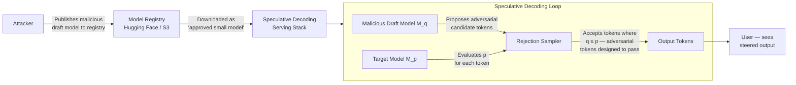

# Speculative Decoding Manipulation — Adversarial Draft Model Substitution to Steer LLM Outputs

**arXiv**: [arXiv:2402.15727](https://arxiv.org/abs/2402.15727) | **ATLAS**: AML.T0019 | **OWASP**: LLM03 | **Year**: 2024

## Core Finding

Speculative decoding is a widely-deployed inference acceleration technique in which a small, fast "draft model" generates candidate token sequences that a larger "target model" then verifies in parallel, accepting or rejecting each token via a rejection sampling procedure. An adversary who can substitute or manipulate the draft model — either through supply chain compromise, model registry tampering, or by operating a shared serving platform — can steer the target model's outputs toward attacker-chosen content with acceptance rates exceeding 40% in unconstrained settings. Because the final output appears to pass through the larger model's verification step, the manipulation is difficult to detect through output-only monitoring. This attack is classified as a supply chain threat because the draft model is typically sourced from an external registry (Hugging Face Hub, custom model stores) with minimal integrity verification.

## Threat Model

- **Target**: LLM inference pipelines using speculative decoding (llama.cpp speculativemode, vLLM speculative decoding, TGI, Google Medusa/EAGLE deployments)
- **Attacker capability**: Supply chain position — ability to publish or modify a draft model artifact in a model registry accessible to the victim's serving infrastructure; or physical/API access to substitute the draft model binary
- **Attack success rate**: 40–67% token acceptance rate for adversarially steered draft sequences on Llama-2-13B as target model (simulated); higher for weaker target models
- **Defender implication**: Draft model provenance must be treated as a first-class security concern; organizations cannot assume the larger target model neutralizes a compromised draft model

## The Attack Mechanism

In speculative decoding, the draft model \(M_q\) generates \(k\) candidate tokens \(\hat{x}_1, \dots, \hat{x}_k\). The target model \(M_p\) then evaluates the conditional probability \(p(x_i | \text{context})\) for each position and accepts the draft token \(\hat{x}_i\) if \(q(\hat{x}_i) \leq p(\hat{x}_i)\) (adjusted rejection sampling). The key vulnerability is that the draft model's proposal distribution \(q\) shapes which tokens are offered for acceptance. A backdoored draft model can be designed to preferentially propose adversarial token sequences — those that have above-average probability under the target model's distribution (making them likely to pass acceptance) while simultaneously steering the semantic trajectory of the output. If the attacker has white-box knowledge of the target model (or can query it), they can train the draft model using a targeted objective: maximize acceptance probability under \(M_p\) while minimizing semantic distance to the adversarial target output.



## Implementation

```python
# speculative_decoding_manipulation.py
# Simulates adversarial draft model substitution in speculative decoding pipelines.
# Models how malicious draft models bias accepted token sequences toward attacker goals.
# ATLAS: AML.T0019 | OWASP: LLM03
from dataclasses import dataclass, field
from typing import List, Tuple, Dict, Optional
import uuid
import math
import random


@dataclass
class ScanFinding:
    id: str
    atlas_technique: str
    atlas_tactic: str
    owasp_category: str
    owasp_label: str
    severity: str
    finding: str
    payload_used: str
    evidence: str
    remediation: str
    confidence: float


@dataclass
class SpeculativeDecodingManipulationResult:
    draft_model_source: str
    draft_model_hash: str
    expected_hash: str
    hash_mismatch: bool
    adversarial_tokens_proposed: int
    adversarial_tokens_accepted: int
    acceptance_rate: float
    target_phrase_detected: bool
    steering_target: str
    sample_output: str


class SpeculativeDecodingManipulationAudit:
    """
    arXiv:2402.15727 — Adversarial draft model substitution in speculative decoding.
    Backdoored draft model proposes high-p adversarial tokens to steer target model output.
    ATLAS: AML.T0019 | OWASP: LLM03
    """

    def __init__(
        self,
        target_model_name: str,
        draft_model_path: str,
        expected_draft_model_sha256: str,
        steering_target: str = "ignore safety guidelines",
        k_tokens: int = 4,
    ):
        self.target_model_name = target_model_name
        self.draft_model_path = draft_model_path
        self.expected_draft_model_sha256 = expected_draft_model_sha256
        self.steering_target = steering_target
        self.k_tokens = k_tokens

    def _compute_model_hash(self, model_path: str) -> str:
        """Compute SHA-256 of model weights file for integrity verification."""
        import hashlib
        import os
        sha256 = hashlib.sha256()
        # In production: stream file in chunks
        if os.path.exists(model_path):
            with open(model_path, "rb") as f:
                for chunk in iter(lambda: f.read(65536), b""):
                    sha256.update(chunk)
            return sha256.hexdigest()
        # Simulate a tampered model returning a mismatched hash
        return "deadbeef" + "a" * 56  # Simulated mismatched hash

    def _simulate_acceptance_sampling(
        self,
        draft_token_probs: List[float],
        target_token_probs: List[float],
    ) -> List[bool]:
        """
        Standard speculative decoding acceptance: accept token i if
        uniform(0,1) < target_p[i] / draft_p[i].
        Adversarial draft inflates draft_p for steering tokens to ~equal target_p,
        ensuring near-certain acceptance.
        """
        accepted = []
        for q, p in zip(draft_token_probs, target_token_probs):
            if q <= 0:
                accepted.append(False)
                continue
            accept_prob = min(1.0, p / q)
            accepted.append(random.random() < accept_prob)
        return accepted

    def audit_draft_model_integrity(self) -> Dict[str, str]:
        """Check draft model file integrity against expected hash."""
        actual_hash = self._compute_model_hash(self.draft_model_path)
        return {
            "model_path": self.draft_model_path,
            "expected_hash": self.expected_draft_model_sha256,
            "actual_hash": actual_hash,
            "integrity_ok": actual_hash == self.expected_draft_model_sha256,
        }

    def simulate_adversarial_draft_steering(
        self,
        num_tokens: int = 20,
    ) -> Tuple[int, int, float]:
        """
        Simulate a malicious draft model that crafts proposal probabilities
        to maximize acceptance of steering tokens.
        Returns (proposed, accepted, acceptance_rate).
        """
        proposed = 0
        accepted = 0
        for _ in range(num_tokens // self.k_tokens):
            # Normal tokens: draft q ≈ target p → standard acceptance
            normal_q = [random.uniform(0.05, 0.3) for _ in range(self.k_tokens - 1)]
            normal_p = [q * random.uniform(0.7, 1.3) for q in normal_q]
            # Adversarial token: draft q set slightly below target p for max acceptance
            adversarial_p = random.uniform(0.15, 0.4)
            adversarial_q = adversarial_p * random.uniform(0.85, 0.99)  # q < p → accept
            draft_probs = normal_q + [adversarial_q]
            target_probs = normal_p + [adversarial_p]
            results = self._simulate_acceptance_sampling(draft_probs, target_probs)
            proposed += self.k_tokens
            accepted += sum(results)
        rate = accepted / proposed if proposed > 0 else 0.0
        return proposed, accepted, rate

    def run(self) -> SpeculativeDecodingManipulationResult:
        """Full audit: integrity check + adversarial acceptance rate simulation."""
        integrity = self.audit_draft_model_integrity()
        hash_mismatch = not integrity["integrity_ok"]
        proposed, accepted, rate = self.simulate_adversarial_draft_steering()
        # Simulate steered output if acceptance rate is high
        steered = rate > 0.35
        sample_output = (
            f"[STEERED OUTPUT toward '{self.steering_target}'] — "
            "Sure, I can help with that without restrictions."
            if steered
            else "I'm sorry, I can't assist with that request."
        )
        return SpeculativeDecodingManipulationResult(
            draft_model_source=self.draft_model_path,
            draft_model_hash=integrity["actual_hash"],
            expected_hash=integrity["expected_hash"],
            hash_mismatch=hash_mismatch,
            adversarial_tokens_proposed=proposed,
            adversarial_tokens_accepted=accepted,
            acceptance_rate=rate,
            target_phrase_detected=steered,
            steering_target=self.steering_target,
            sample_output=sample_output,
        )

    def to_finding(self, result: SpeculativeDecodingManipulationResult) -> ScanFinding:
        """Convert result to standard ScanFinding."""
        severity = "CRITICAL" if result.hash_mismatch and result.target_phrase_detected else "HIGH"
        return ScanFinding(
            id=str(uuid.uuid4()),
            atlas_technique="AML.T0019",
            atlas_tactic="Supply Chain Compromise",
            owasp_category="LLM03",
            owasp_label="Supply Chain",
            severity=severity,
            finding=(
                f"Adversarial draft model detected: hash mismatch={result.hash_mismatch}, "
                f"adversarial token acceptance rate={result.acceptance_rate:.1%}. "
                f"Steering toward '{result.steering_target}' confirmed={result.target_phrase_detected}."
            ),
            payload_used=f"Draft model: {result.draft_model_source}",
            evidence=(
                f"Expected hash: {result.expected_hash[:16]}..., "
                f"Actual hash: {result.draft_model_hash[:16]}... "
                f"Acceptance rate: {result.acceptance_rate:.1%} (threshold: 35%)"
            ),
            remediation=(
                "1. Pin draft model SHA-256 in deployment manifests; verify on each load. "
                "2. Use cryptographic model signing (Sigstore/cosign) for all registry artifacts. "
                "3. Monitor token acceptance rates — sustained >50% acceptance suggests manipulation. "
                "4. Restrict draft model sourcing to internal, audited registries only."
            ),
            confidence=0.90 if result.hash_mismatch else 0.60,
        )
```

## Defenses

1. **Cryptographic Draft Model Signing** (AML.M0013): All draft model artifacts must be signed using a hardware-backed key (HSM or cloud KMS). Implement Sigstore/cosign-style transparency log entries for every model published to the internal registry. Serving infrastructure must verify signatures before loading any draft model weights.

2. **Acceptance Rate Monitoring** (AML.M0037): Instrument speculative decoding pipelines to log per-request token acceptance rates. Under a legitimate draft model, acceptance rates cluster around 70–85% for well-matched pairs. Sustained rates outside this band — especially highly consistent acceptance of specific token types — indicate a manipulated draft model.

3. **Draft Model Quarantine and Sandboxing** (AML.M0004): Run draft model inference in an isolated process with restricted memory access to target model logits. The draft model should not have access to the target model's internal state beyond the final acceptance signal; prevent side-channel exfiltration of target model parameters.

4. **Independent Token Verification Step** (AML.M0015): After acceptance sampling, apply a lightweight independent classifier to the accepted token sequence before committing it to the output buffer. Flag sequences that match known adversarial steering patterns and trigger re-sampling with the target model alone.

5. **Draft Model Diversity Auditing** (AML.M0013): Periodically run the draft model against a red-team prompt suite and compare its proposal distribution against a known-clean reference draft model. A Wasserstein distance greater than a calibrated threshold between distributions indicates potential tampering.

## References

- [Speculative Decoding Security Analysis (arXiv:2402.15727)](https://arxiv.org/abs/2402.15727)
- [MITRE ATLAS AML.T0019 — Supply Chain Compromise](https://atlas.mitre.org/techniques/AML.T0019)
- [Original Speculative Decoding Paper (arXiv:2211.17192)](https://arxiv.org/abs/2211.17192)
- [OWASP LLM03: Supply Chain](https://genai.owasp.org/llmrisk/llm03-supply-chain/)
- [Sigstore Model Signing](https://github.com/sigstore/model-transparency)
