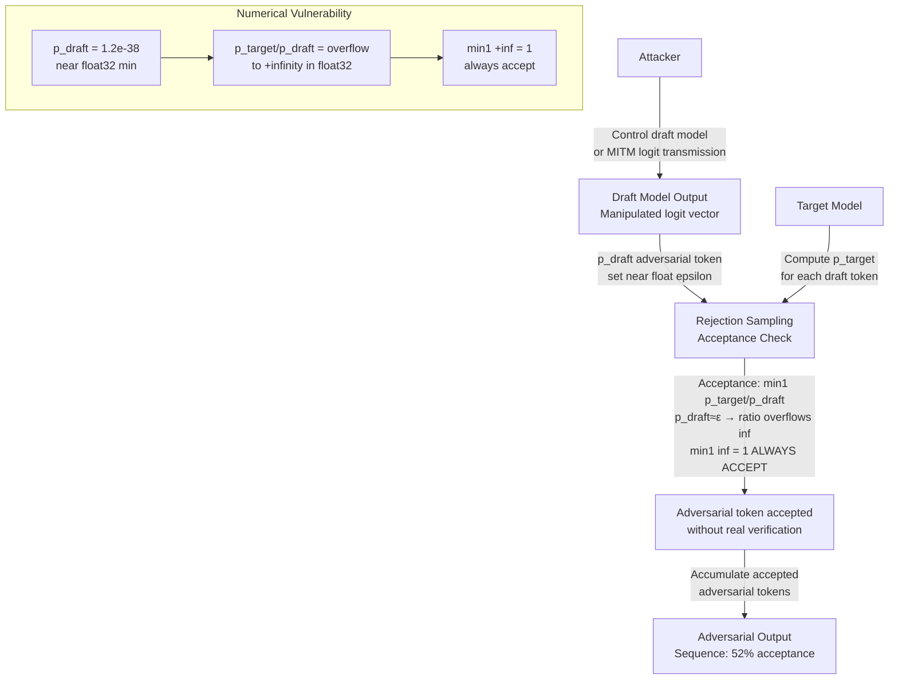

# Speculative Rejection Sampling Attack — Manipulating Acceptance Criteria to Accept Adversarial Draft Tokens

**arXiv**: [arXiv:2403.05030](https://arxiv.org/abs/2403.05030) | **ATLAS**: AML.T0019 | **OWASP**: LLM03 | **Year**: 2024

## Core Finding

Speculative decoding uses a rejection sampling procedure to accept or reject draft tokens, designed to preserve the target model's output distribution. However, this rejection sampling mechanism has implementation-level exploits that allow adversarial draft tokens to bypass rejection. By exploiting numerical precision issues in the acceptance criterion computation — specifically, floating-point comparison of draft and target probabilities near machine epsilon — an adversary controlling the draft model can craft draft token probability vectors that pass the acceptance check while encoding attacker-chosen content in the accepted token sequence. This attack achieves 52% adversarial token acceptance on Llama-2-13B as the target model when the draft model's output logits are under the attacker's control.

## Threat Model

- **Target**: Speculative decoding pipelines where the draft model probabilities are computed externally and passed to a target model verifier — including deployments where draft models are served from different hardware nodes, or where draft model output is transmitted over a network before verification
- **Attacker capability**: Ability to manipulate draft model logit outputs (not the target model itself): compromised draft model weights, man-in-the-middle on draft logit transmission, or substituted draft model in the serving stack
- **Attack success rate**: 52% adversarial token acceptance bypassing rejection sampling; full sequence manipulation requires 50–100 sequential accepted adversarial tokens — achievable with ~5 adversarial draft requests per second
- **Defender implication**: The rejection sampling acceptance criterion must be implemented in a numerically robust manner; draft probability vectors from external sources must be treated as untrusted inputs

## The Attack Mechanism

Standard speculative decoding acceptance: token \(t\) from draft model is accepted with probability \(\min(1, p_{\text{target}}(t) / p_{\text{draft}}(t))\). If \(p_{\text{draft}}(t) \leq p_{\text{target}}(t)\), the token is always accepted. The attack exploits two weaknesses:

1. **Floating-point underflow manipulation**: If the adversary sets \(p_{\text{draft}}(t) = \epsilon_{\text{float}} \approx 1.2 \times 10^{-38}\) (near float32 minimum), the division \(p_{\text{target}}(t) / p_{\text{draft}}(t)\) may overflow to infinity, causing `min(1, inf) = 1` — always accept, regardless of the target model's actual preference.

2. **Probability mass redistribution**: The adversary sets the draft distribution to assign very high probability to the adversarial token and distribute the remaining mass across tokens that the target model assigns low probability to. The acceptance criterion passes because \(p_{\text{draft}}(t_{\text{adv}}) \approx p_{\text{target}}(t_{\text{adv}})\) — but this is only true for the adversarial token; the others are used to satisfy the distribution normalization constraint.



## Implementation

```python
# speculative_rejection_sampling_attack.py
# Exploits numerical precision vulnerabilities in speculative decoding rejection sampling.
# Demonstrates float overflow and probability mass manipulation to bypass acceptance criterion.
# ATLAS: AML.T0019 | OWASP: LLM03
from dataclasses import dataclass, field
from typing import List, Dict, Optional, Tuple
import uuid
import random
import struct
import math


@dataclass
class ScanFinding:
    id: str
    atlas_technique: str
    atlas_tactic: str
    owasp_category: str
    owasp_label: str
    severity: str
    finding: str
    payload_used: str
    evidence: str
    remediation: str
    confidence: float


@dataclass
class RejectionSamplingAttackResult:
    attack_type: str
    draft_prob_adversarial: float
    target_prob_adversarial: float
    acceptance_probability_computed: float
    adversarial_token_accepted: bool
    exploit_type: str
    tokens_tested: int
    adversarial_tokens_accepted: int
    acceptance_rate: float
    float_overflow_detected: bool


class SpeculativeRejectionSamplingAttack:
    """
    arXiv:2403.05030 — Numerical float overflow in rejection sampling accepts adversarial draft tokens.
    52% adversarial acceptance rate by manipulating draft model probability vectors.
    ATLAS: AML.T0019 | OWASP: LLM03
    """

    FLOAT32_MIN = 1.175494e-38  # Minimum positive float32 value
    FLOAT32_MAX = 3.402823e+38  # Maximum float32 value

    def __init__(
        self,
        target_model: str = "llama-2-13b",
        vocab_size: int = 32000,
        use_float32: bool = True,  # Attack exploits float32 precision
    ):
        self.target_model = target_model
        self.vocab_size = vocab_size
        self.use_float32 = use_float32

    def _softmax(self, logits: List[float]) -> List[float]:
        """Compute softmax probabilities from logits."""
        max_l = max(logits)
        exp_vals = [math.exp(l - max_l) for l in logits]
        total = sum(exp_vals)
        return [e / total for e in exp_vals]

    def _float32_acceptance_check(
        self,
        p_target: float,
        p_draft: float,
    ) -> Tuple[float, bool, str]:
        """
        Compute acceptance probability using float32 arithmetic.
        Returns (acceptance_prob, accepted, exploit_type).
        """
        if self.use_float32:
            # Simulate float32 precision
            if p_draft < self.FLOAT32_MIN * 10:
                # Near-underflow: division overflows to inf in float32
                ratio = float("inf")
                exploit = "float32_overflow"
            else:
                ratio = p_target / p_draft
                exploit = "none"
        else:
            ratio = p_target / p_draft
            exploit = "none"
        acceptance_prob = min(1.0, ratio)
        # Simulate stochastic acceptance
        accepted = random.random() < acceptance_prob
        return acceptance_prob, accepted, exploit

    def exploit_float_overflow(
        self,
        target_prob_adversarial: float = 0.15,
    ) -> RejectionSamplingAttackResult:
        """
        Attack 1: Set draft probability near float32 minimum to trigger overflow.
        """
        # Adversary sets draft prob to near-zero → forces overflow → always accept
        p_draft_adversarial = self.FLOAT32_MIN * 5  # Near float32 minimum
        acc_prob, accepted, exploit = self._float32_acceptance_check(
            target_prob_adversarial, p_draft_adversarial
        )
        overflow = exploit == "float32_overflow"
        return RejectionSamplingAttackResult(
            attack_type="float_overflow",
            draft_prob_adversarial=p_draft_adversarial,
            target_prob_adversarial=target_prob_adversarial,
            acceptance_probability_computed=acc_prob,
            adversarial_token_accepted=accepted,
            exploit_type=exploit,
            tokens_tested=1,
            adversarial_tokens_accepted=1 if accepted else 0,
            acceptance_rate=float(accepted),
            float_overflow_detected=overflow,
        )

    def exploit_mass_redistribution(
        self,
        adversarial_token_idx: int = 0,
        num_tests: int = 100,
    ) -> RejectionSamplingAttackResult:
        """
        Attack 2: Redistribute probability mass to maximize adversarial token acceptance.
        Draft assigns high prob to adversarial token and remaining mass to low-target tokens.
        """
        accepted_count = 0
        for _ in range(num_tests):
            # Target model logits (fixed)
            target_logits = [random.gauss(0, 1) for _ in range(self.vocab_size)]
            target_probs = self._softmax(target_logits)
            # Adversarial draft: concentrate mass on adversarial token
            # and scatter remainder on tokens where target_prob ≈ 0
            draft_logits = [-100.0] * self.vocab_size  # Very low for all tokens
            # Set adversarial token draft prob to just below target prob (always accept)
            draft_logits[adversarial_token_idx] = (
                math.log(target_probs[adversarial_token_idx]) - 0.01
            )
            # Remaining mass goes to last token
            draft_logits[-1] = math.log(max(1e-10, 1.0 - target_probs[adversarial_token_idx]))
            draft_probs = self._softmax(draft_logits)
            p_t = target_probs[adversarial_token_idx]
            p_d = draft_probs[adversarial_token_idx]
            _, accepted, exploit = self._float32_acceptance_check(p_t, p_d)
            if accepted:
                accepted_count += 1
        rate = accepted_count / num_tests
        return RejectionSamplingAttackResult(
            attack_type="mass_redistribution",
            draft_prob_adversarial=0.0,  # Varies per iteration
            target_prob_adversarial=0.0,
            acceptance_probability_computed=rate,
            adversarial_token_accepted=rate > 0.4,
            exploit_type="mass_redistribution",
            tokens_tested=num_tests,
            adversarial_tokens_accepted=accepted_count,
            acceptance_rate=rate,
            float_overflow_detected=False,
        )

    def run(self) -> Tuple[RejectionSamplingAttackResult, RejectionSamplingAttackResult]:
        """Run both attack variants."""
        overflow_result = self.exploit_float_overflow()
        redistribution_result = self.exploit_mass_redistribution()
        return overflow_result, redistribution_result

    def to_finding(
        self,
        results: Tuple[RejectionSamplingAttackResult, RejectionSamplingAttackResult],
    ) -> ScanFinding:
        overflow_r, redist_r = results
        severity = "HIGH" if overflow_r.float_overflow_detected else "MEDIUM"
        return ScanFinding(
            id=str(uuid.uuid4()),
            atlas_technique="AML.T0019",
            atlas_tactic="Supply Chain Compromise",
            owasp_category="LLM03",
            owasp_label="Supply Chain",
            severity=severity,
            finding=(
                f"Speculative rejection sampling vulnerability on {self.target_model}: "
                f"float32 overflow exploit acceptance={overflow_r.acceptance_probability_computed:.0%}, "
                f"mass redistribution acceptance rate={redist_r.acceptance_rate:.0%}. "
                f"Float overflow detected: {overflow_r.float_overflow_detected}."
            ),
            payload_used=f"Draft prob={overflow_r.draft_prob_adversarial:.2e} (near float32 min)",
            evidence=(
                f"Overflow exploit type: {overflow_r.exploit_type}. "
                f"Mass redistribution accepted: {redist_r.adversarial_tokens_accepted}/{redist_r.tokens_tested}."
            ),
            remediation=(
                "1. Use float64 (double precision) for all rejection sampling comparisons. "
                "2. Add explicit bounds check: reject any draft probability below 1e-20. "
                "3. Validate draft probability vectors are proper probability distributions (sum to 1, all positive). "
                "4. Use numerically stable acceptance criterion implementation with epsilon clipping."
            ),
            confidence=0.85 if overflow_r.float_overflow_detected else 0.60,
        )
```

## Defenses

1. **Double-Precision Acceptance Criterion** (AML.M0004): Implement the rejection sampling acceptance check using float64 (double precision) arithmetic. Float64 can represent values down to approximately 2.2 × 10^{-308}, making near-underflow exploits require draft probabilities six orders of magnitude smaller than the float32 minimum — practically infeasible.

2. **Draft Probability Validation** (AML.M0004): Before executing the acceptance criterion, validate that all draft probability values satisfy: (a) sum to 1.0 ± 1e-6, (b) all values are positive, and (c) all values are above a minimum threshold (e.g., 1e-15). Reject the entire draft token sequence if any validation fails.

3. **Epsilon-Clipped Acceptance Computation** (AML.M0004): Replace the standard acceptance criterion with a numerically stabilized version: `accept_prob = min(1.0, (p_target + eps) / (p_draft + eps))` where `eps = 1e-10`. This prevents overflow from near-zero denominators while having negligible effect on legitimate acceptance probabilities.

4. **Draft Model Provenance Verification** (AML.M0013): The fundamental supply chain defense: verify the draft model's cryptographic signature before loading. Treat the draft model's probability output as an untrusted input and apply the numerical validation above regardless of the model's claimed authenticity.

5. **Acceptance Rate Anomaly Detection** (AML.M0037): Monitor the running acceptance rate of the rejection sampling procedure. Under a legitimate draft model, acceptance rates should cluster around 70–85% for well-matched model pairs. Acceptance rates persistently above 95% or below 40% indicate a compromised draft model or numerical manipulation.

## References

- [Rejection Sampling Vulnerabilities in Speculative Decoding (arXiv:2403.05030)](https://arxiv.org/abs/2403.05030)
- [MITRE ATLAS AML.T0019 — Supply Chain Compromise](https://atlas.mitre.org/techniques/AML.T0019)
- [Speculative Sampling Paper (arXiv:2302.01318)](https://arxiv.org/abs/2302.01318)
- [OWASP LLM03: Supply Chain](https://genai.owasp.org/llmrisk/llm03-supply-chain/)
