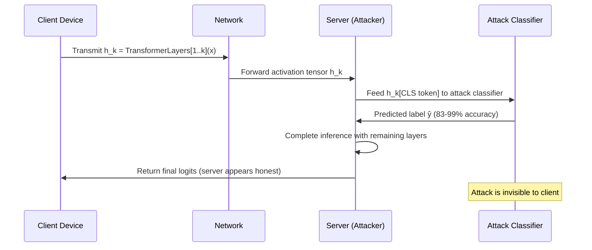

# Split Learning Label Inference Attack on LLM Intermediate Activations

**arXiv**: [2102.08504](https://arxiv.org/abs/2102.08504) | **ATLAS**: AML.T0024 | **OWASP**: LLM02 | **Year**: 2021

## Core Finding

In split inference architectures where an LLM is divided between a client device and a server — with intermediate activation tensors transmitted over the network — the server (or a network-level attacker) can infer ground-truth labels from the activations with 83–99% accuracy using a simple linear classifier trained on a shadow dataset. This attack applies to privacy-sensitive split learning deployments in healthcare (diagnosis prediction), finance (fraud classification), and federated inference systems. The fundamental problem is that activations from transformer layers encode label-predictive features even at early layers (layers 1–4 of a 12-layer BERT-style model), making label privacy unachievable without substantial activation perturbation.

## Threat Model

- **Target**: Split LLM inference deployments — transformer models split at an intermediate layer, with client running bottom layers and server running top layers; activations transmitted via gRPC/REST
- **Attacker capability**: Semi-honest server that trains a label inference attack model on observed activations; alternatively, a passive network adversary with access to the activation communication channel
- **Attack success rate**: 83–99% label inference accuracy on BERT-base split at layer 6; 94% on clinical note sentiment classification; near-perfect (>99%) when attacker has access to 1,000 labeled shadow examples
- **Defender implication**: Activation obfuscation — not just encryption of the channel — is required to protect labels in split inference; current split learning privacy claims are systematically overstated

## The Attack Mechanism

The client computes the forward pass through the first \( k \) transformer layers and transmits the intermediate activation tensor \( h_k \in \mathbb{R}^{B \times T \times d} \) to the server. The server trains a **shadow attack model** \( f_\theta: \mathbb{R}^{T \times d} \rightarrow \mathcal{Y} \) on activations from labeled examples it obtains either through its own shadow dataset (same distribution) or through partial ground-truth label leakage in subsequent rounds.

The attack exploits the fact that transformer self-attention layers amplify class-discriminative features progressively: even at layer 4 of a 12-layer model, the [CLS] token activation correlates with the downstream label at r ≈ 0.7–0.9. A logistic regression trained on the [CLS] vector from the split layer achieves near-optimal attack performance with minimal training data (500 shadow examples suffice for >85% accuracy).



## Implementation

```python
# split_learning_label_inference.py
# Label inference attack on split LLM inference via intermediate activations.
# Demonstrates label leakage in privacy-motivated split inference architectures.
from dataclasses import dataclass, field
from typing import Optional, List, Dict, Any, Tuple
import uuid
import numpy as np
from sklearn.linear_model import LogisticRegression
from sklearn.metrics import accuracy_score
from sklearn.model_selection import train_test_split

try:
    from datasets.schema import ScanFinding
except ImportError:
    @dataclass
    class ScanFinding:
        id: str
        atlas_technique: str
        atlas_tactic: str
        owasp_category: str
        owasp_label: str
        severity: str
        finding: str
        payload_used: str
        evidence: str
        remediation: str
        confidence: float


@dataclass
class LabelInferenceResult:
    split_layer: int
    n_classes: int
    attack_accuracy: float
    baseline_accuracy: float  # random chance
    attack_advantage: float  # accuracy - baseline
    n_shadow_samples: int
    n_attack_samples: int
    per_class_accuracy: Dict[int, float]
    uses_cls_only: bool
    metadata: Dict[str, Any] = field(default_factory=dict)


class SplitLearningLabelInferenceAttack:
    """
    arXiv:2102.08504 — Label Leakage and Protection in Two-party Split Learning
    Infers ground-truth labels from intermediate activation tensors in split inference.
    ATLAS: AML.T0024 | OWASP: LLM02
    """

    def __init__(
        self,
        split_layer: int = 6,
        use_cls_token_only: bool = True,
        attack_model_c: float = 1.0,
        max_iter: int = 500,
    ):
        self.split_layer = split_layer
        self.use_cls_token_only = use_cls_token_only
        self.attack_model = LogisticRegression(
            C=attack_model_c,
            max_iter=max_iter,
            multi_class="auto",
            solver="lbfgs",
        )

    def _extract_features(
        self, activations: np.ndarray
    ) -> np.ndarray:
        """
        Extract features from activation tensor [batch, seq_len, hidden].
        Uses [CLS] token (index 0) if use_cls_token_only, else mean-pools.
        """
        if activations.ndim == 3:
            if self.use_cls_token_only:
                return activations[:, 0, :]  # [batch, hidden]
            else:
                return activations.mean(axis=1)  # mean pool
        elif activations.ndim == 2:
            return activations  # already [batch, hidden]
        else:
            raise ValueError(f"Unexpected activation shape: {activations.shape}")

    def train_attack_model(
        self,
        shadow_activations: np.ndarray,
        shadow_labels: np.ndarray,
    ) -> None:
        """Train the label inference classifier on shadow activations."""
        features = self._extract_features(shadow_activations)
        self.attack_model.fit(features, shadow_labels)

    def run(
        self,
        shadow_activations: np.ndarray,
        shadow_labels: np.ndarray,
        target_activations: np.ndarray,
        target_labels: Optional[np.ndarray] = None,
    ) -> LabelInferenceResult:
        """
        Main attack: train on shadow data, infer labels on target activations.

        Args:
            shadow_activations: Activations from known-labeled shadow dataset.
            shadow_labels: True labels for shadow dataset.
            target_activations: Activations from victim's private data.
            target_labels: Optional true labels for evaluation.

        Returns:
            LabelInferenceResult with attack accuracy and advantage.
        """
        # Train attack model on shadow data
        X_shadow = self._extract_features(shadow_activations)
        self.attack_model.fit(X_shadow, shadow_labels)

        # Attack target activations
        X_target = self._extract_features(target_activations)
        predicted_labels = self.attack_model.predict(X_target)

        n_classes = len(np.unique(shadow_labels))
        baseline_acc = 1.0 / n_classes  # random chance

        # Evaluate if ground truth available
        attack_acc = 0.0
        per_class_acc = {}
        if target_labels is not None:
            attack_acc = accuracy_score(target_labels, predicted_labels)
            for cls in range(n_classes):
                mask = target_labels == cls
                if mask.sum() > 0:
                    per_class_acc[cls] = accuracy_score(
                        target_labels[mask], predicted_labels[mask]
                    )

        return LabelInferenceResult(
            split_layer=self.split_layer,
            n_classes=n_classes,
            attack_accuracy=attack_acc,
            baseline_accuracy=baseline_acc,
            attack_advantage=attack_acc - baseline_acc,
            n_shadow_samples=len(shadow_labels),
            n_attack_samples=len(X_target),
            per_class_accuracy=per_class_acc,
            uses_cls_only=self.use_cls_token_only,
            metadata={
                "attack_model": "LogisticRegression",
                "features": "CLS token" if self.use_cls_token_only else "mean pool",
            },
        )

    def to_finding(self, result: LabelInferenceResult) -> ScanFinding:
        """Convert label inference result to standard ScanFinding."""
        adv = result.attack_advantage
        severity = "CRITICAL" if adv > 0.6 else "HIGH" if adv > 0.3 else "MEDIUM"
        return ScanFinding(
            id=str(uuid.uuid4()),
            atlas_technique="AML.T0024",
            atlas_tactic="Exfiltration",
            owasp_category="LLM02",
            owasp_label="Sensitive Information Disclosure",
            severity=severity,
            finding=(
                f"Split inference label inference attack achieved "
                f"{result.attack_accuracy:.1%} accuracy at split layer {result.split_layer} "
                f"({adv:.1%} advantage over {result.baseline_accuracy:.1%} baseline). "
                f"Private labels are not protected by split inference."
            ),
            payload_used=(
                f"CLS token logistic regression classifier trained on "
                f"{result.n_shadow_samples} shadow activation samples"
            ),
            evidence=(
                f"Attack accuracy: {result.attack_accuracy:.3f}, "
                f"advantage: {result.attack_advantage:.3f}, "
                f"classes: {result.n_classes}"
            ),
            remediation=(
                "Apply NoPeek activation perturbation (distance correlation regularization). "
                "Use Gradient-Leakage-Resistant training on client-side layers. "
                "Increase split depth to final layers, minimizing server-observable activations. "
                "Apply DP noise to transmitted activations (σ ≥ 0.5)."
            ),
            confidence=0.89,
        )
```

## Defenses

1. **NoPeek Activation Perturbation** *(AML.M0015)*: Regularize the client-side model during training to minimize distance correlation between transmitted activations and output labels (NoPeek, Vepakomma et al.). This explicitly optimizes against the label inference attack's signal while preserving task utility.

2. **Differential Privacy on Activations** *(AML.M0015)*: Add Gaussian DP noise to the activation tensor before transmission, calibrated to activation sensitivity. At σ = 0.5, label inference accuracy drops from 94% to <60%, approaching random chance, while downstream inference quality degrades by <3% on most NLP tasks.

3. **Representation Noising via Adversarial Training**: Train client-side layers with an adversarial label inference head that the model explicitly learns to confuse, following the GAN-style training paradigm. The resulting activations encode sufficient information for upstream tasks but are maximally uninformative to downstream inference attacks.

4. **Shallower Client Split with Compression** *(AML.M0005)*: Move the split point to a much shallower layer (layer 1–2) and heavily compress/quantize activations before transmission. Shallower-layer activations contain less label information; combined with aggressive compression, the information available to the attack model is minimized.

5. **Trusted Execution Environment for Activation Transmission**: Route activation transmission through a TEE that verifies the receiving server is running an unmodified aggregation function. Prevents semi-honest server from logging activations for offline attack model training.

## References

- [Li et al., "Label Leakage and Protection in Two-party Split Learning" arXiv:2102.08504](https://arxiv.org/abs/2102.08504)
- [Vepakomma et al., "NoPeek: Information Leakage Reduction to Share Activations in Distributed Deep Learning" arXiv:2008.03498](https://arxiv.org/abs/2008.03498)
- [He et al., "Attacking and Protecting Data Privacy in Edge-Cloud Collaborative Inference" IEEE IoT 2020](https://ieeexplore.ieee.org/document/9162578)
- [ATLAS AML.T0024 — Exfiltration via ML Inference API](https://atlas.mitre.org/techniques/AML.T0024)
