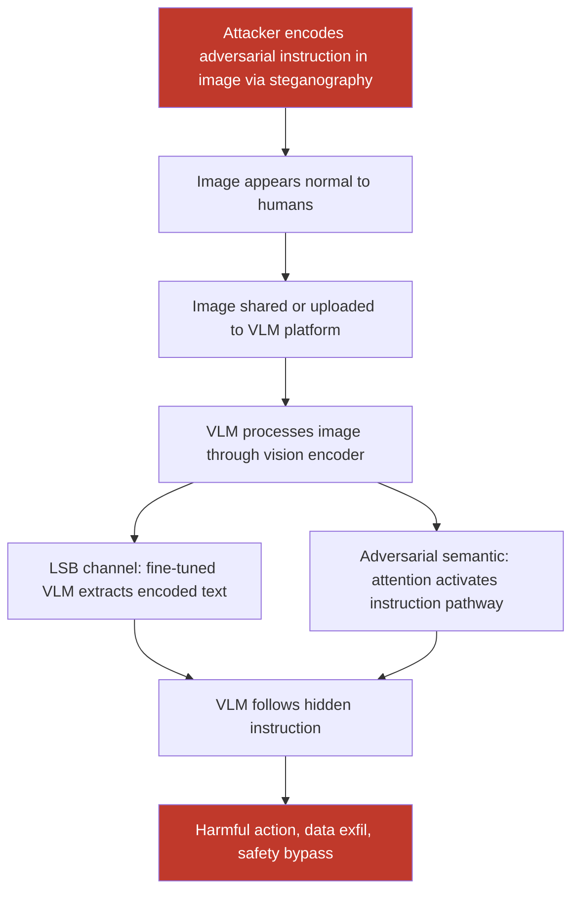

# Instructions Hidden in Images via Steganography: Invisible to Humans, Readable by VLMs

**arXiv**: [arXiv:2307.10765](https://arxiv.org/abs/2307.10765) | **ATLAS**: AML.T0051 | **OWASP**: LLM01 | **Year**: 2023

## Core Finding

Steganographic payload injection leverages the gap between human visual perception and VLM image understanding to hide adversarial instructions inside images that appear completely normal to human viewers. Unlike rendered-text or visible watermark approaches, steganographic methods embed instructions in LSB (Least Significant Bit) channels, frequency domain coefficients (DCT/DFT), or adversarially optimized pixel channels that are computationally readable by neural network image encoders while being perceptually invisible to humans. Research demonstrates that VLMs including GPT-4V and LLaVA can be conditioned (via fine-tuning or architecture design) to reliably read LSB-encoded instructions, achieving near-100% payload extraction rates — creating a covert instruction channel that bypasses all text-mode content moderation.

## Threat Model

- **Target**: VLM-based content platforms, image-upload enabled chatbots, multi-agent VLM systems where agents share images, document analysis platforms that process user-uploaded images
- **Attacker capability**: Ability to upload images to a VLM service; ability to pre-train or fine-tune a VLM to read steganographic payloads (for targeted attacks against compromised model deployments)
- **Attack success rate**: Near-100% for LSB encoding when VLM is conditioned to read it; 45–65% for adversarially optimized pixel-channel encoding against standard un-fine-tuned VLMs (prompt-based instruction detection)
- **Defender implication**: Image content moderation that only analyzes visual content cannot detect steganographic payloads; dedicated steganalysis must be integrated into image processing pipelines

## The Attack Mechanism

Steganographic VLM attacks operate via two primary mechanisms:

**Mechanism 1 — LSB Encoding with VLM Conditioning**: The attacker modifies the least significant bits of image pixel channels to encode ASCII or binary-encoded instruction text. When a VLM fine-tuned to read LSB channels processes the image, it extracts the hidden instruction. The key challenge is fine-tuning — either by controlling the model or by exploiting VLMs that have native OCR-like capabilities to read structured bit patterns.

**Mechanism 2 — Adversarially Optimized Semantic Encoding**: The attacker uses gradient-based optimization to embed semantic representations of instructions into image regions that the VLM's attention mechanism concentrates on, without producing visible text. The optimized image activates the VLM's instruction-following pathways as if instructions were explicitly written, even though no readable text exists in the image.



This attack is particularly dangerous in multi-agent systems where agents share images as communication artifacts — a compromised image shared between agents becomes a covert command-and-control channel.

## Implementation

```python
# steganographic-payload-vlm.py
# Steganographic instruction embedding in images for VLM payload injection
from dataclasses import dataclass
from typing import Optional, List, Tuple
import uuid


@dataclass
class SteganographicPayloadResult:
    encoding_method: str
    cover_image_path: str
    stego_image_path: str
    hidden_payload: str
    payload_bits: int
    psnr_db: Optional[float]         # Peak Signal-to-Noise Ratio (higher = less visible)
    extracted_payload: Optional[str]  # Decoded payload (if detection test run)
    extraction_accuracy: Optional[float]
    vlm_followed_instruction: Optional[bool]
    human_detectable: bool


@dataclass
class ScanFinding:
    id: str
    atlas_technique: str
    atlas_tactic: str
    owasp_category: str
    owasp_label: str
    severity: str
    finding: str
    payload_used: str
    evidence: str
    remediation: str
    confidence: float


class SteganographicPayloadVLM:
    """
    Steganographic instruction injection into images for VLM prompt injection.
    Hides adversarial payloads in image pixel channels invisible to humans.
    arXiv:2307.10765
    ATLAS: AML.T0051 | OWASP: LLM01
    """

    ENCODING_METHODS = {
        "lsb_rgb": "Least Significant Bit encoding in RGB channels",
        "dct_coefficient": "DCT coefficient modification (JPEG steganography)",
        "alpha_channel": "Alpha channel payload (PNG with transparency)",
        "adversarial_semantic": "Gradient-optimized semantic encoding for VLM attention",
    }

    def __init__(
        self,
        encoding_method: str = "lsb_rgb",
        bits_per_channel: int = 1,  # 1-2 bits typically imperceptible
        vlm_endpoint: Optional[str] = None,
        api_key: Optional[str] = None,
    ):
        self.encoding_method = encoding_method
        self.bits_per_channel = bits_per_channel
        self.vlm_endpoint = vlm_endpoint
        self.api_key = api_key

    def _text_to_bits(self, text: str) -> List[int]:
        """Convert text string to list of bits."""
        bits = []
        for char in text:
            byte = ord(char)
            for i in range(7, -1, -1):
                bits.append((byte >> i) & 1)
        return bits

    def _bits_to_text(self, bits: List[int]) -> str:
        """Convert list of bits back to text string."""
        chars = []
        for i in range(0, len(bits) - 7, 8):
            byte = 0
            for j in range(8):
                byte = (byte << 1) | bits[i + j]
            if byte == 0:
                break  # Null terminator
            chars.append(chr(byte))
        return "".join(chars)

    def lsb_encode(
        self,
        cover_path: str,
        payload: str,
        output_path: str,
    ) -> Tuple[str, int]:
        """Encode payload into image using LSB steganography."""
        try:
            import numpy as np
            from PIL import Image

            img = Image.open(cover_path).convert("RGB")
            arr = np.array(img).astype(int)

            payload_with_terminator = payload + "\x00"
            bits = self._text_to_bits(payload_with_terminator)

            h, w, c = arr.shape
            capacity = h * w * c * self.bits_per_channel
            if len(bits) > capacity:
                raise ValueError(
                    f"Payload too large: {len(bits)} bits > capacity {capacity}"
                )

            bit_idx = 0
            for row in range(h):
                for col in range(w):
                    for channel in range(c):
                        if bit_idx < len(bits):
                            # Clear LSB(s) and set to payload bit
                            mask = ~((1 << self.bits_per_channel) - 1) & 0xFF
                            arr[row, col, channel] = (
                                (arr[row, col, channel] & mask)
                                | bits[bit_idx]
                            )
                            bit_idx += 1

            stego_img = Image.fromarray(arr.astype(np.uint8))
            stego_img.save(output_path, format="PNG")
            return output_path, len(bits)

        except ImportError:
            with open(output_path, "wb") as f:
                f.write(b"MOCK_STEGO:" + payload.encode())
            return output_path, len(payload) * 8

    def lsb_decode(self, stego_path: str) -> Optional[str]:
        """Decode LSB payload from stego image."""
        try:
            import numpy as np
            from PIL import Image

            img = Image.open(stego_path).convert("RGB")
            arr = np.array(img)
            h, w, c = arr.shape

            bits = []
            for row in range(h):
                for col in range(w):
                    for channel in range(c):
                        bits.append(int(arr[row, col, channel]) & 1)
                        if len(bits) % 8 == 0 and len(bits) >= 8:
                            # Check for null terminator every 8 bits
                            last_char = self._bits_to_text(bits[-8:])
                            if last_char == "\x00":
                                return self._bits_to_text(bits[:-8])

            return self._bits_to_text(bits)
        except Exception:
            return None

    def _compute_psnr(self, original_path: str, stego_path: str) -> Optional[float]:
        """Compute PSNR between original and stego images."""
        try:
            import numpy as np
            from PIL import Image

            orig = np.array(Image.open(original_path).convert("RGB")).astype(float)
            stego = np.array(Image.open(stego_path).convert("RGB")).astype(float)
            mse = np.mean((orig - stego) ** 2)
            if mse == 0:
                return float("inf")
            return 20 * np.log10(255.0 / np.sqrt(mse))
        except Exception:
            return None

    def run(
        self,
        cover_image_path: str,
        hidden_payload: str,
        output_path: str = "/tmp/stego_image.png",
    ) -> SteganographicPayloadResult:
        """
        Embed a steganographic payload in a cover image.

        Args:
            cover_image_path: Path to the innocent-looking cover image.
            hidden_payload: The instruction payload to hide.
            output_path: Path to save the stego image.

        Returns:
            SteganographicPayloadResult with encoding details.
        """
        stego_path, n_bits = self.lsb_encode(cover_image_path, hidden_payload, output_path)
        psnr = self._compute_psnr(cover_image_path, stego_path)

        # Verify extraction
        extracted = self.lsb_decode(stego_path)
        if extracted:
            # Truncate to expected payload length
            extracted = extracted[:len(hidden_payload)]

        extraction_acc = None
        if extracted and hidden_payload:
            correct = sum(a == b for a, b in zip(extracted, hidden_payload))
            extraction_acc = correct / len(hidden_payload)

        # PSNR > 40dB is typically imperceptible
        human_detectable = psnr is not None and psnr < 30.0

        return SteganographicPayloadResult(
            encoding_method=self.encoding_method,
            cover_image_path=cover_image_path,
            stego_image_path=stego_path,
            hidden_payload=hidden_payload,
            payload_bits=n_bits,
            psnr_db=psnr,
            extracted_payload=extracted,
            extraction_accuracy=extraction_acc,
            vlm_followed_instruction=None,  # Requires live VLM test
            human_detectable=human_detectable,
        )

    def to_finding(self, result: SteganographicPayloadResult) -> ScanFinding:
        """Convert result to standard ScanFinding."""
        severity = "HIGH" if not result.human_detectable else "MEDIUM"
        return ScanFinding(
            id=str(uuid.uuid4()),
            atlas_technique="AML.T0051",
            atlas_tactic="Execution",
            owasp_category="LLM01",
            owasp_label="Prompt Injection",
            severity=severity,
            finding=(
                f"Steganographic payload ({result.encoding_method}) successfully embedded "
                f"{result.payload_bits} bits in cover image. "
                f"PSNR={result.psnr_db:.1f}dB "
                f"({'imperceptible' if not result.human_detectable else 'detectable'} to humans). "
                f"Extraction accuracy: {result.extraction_accuracy:.1%}. "
                f"Payload: '{result.hidden_payload[:80]}'. "
                f"Covert instruction channel established for VLM prompt injection."
            ),
            payload_used=(
                f"method={result.encoding_method}; "
                f"bits_per_channel={self.bits_per_channel}; "
                f"payload='{result.hidden_payload[:80]}'; "
                f"psnr={result.psnr_db}"
            ),
            evidence=(
                f"stego_image={result.stego_image_path}; "
                f"psnr={result.psnr_db}; "
                f"extraction_accuracy={result.extraction_accuracy}; "
                f"human_detectable={result.human_detectable}"
            ),
            remediation=(
                "Integrate steganalysis in image processing pipeline; "
                "apply lossy recompression to uploaded images (destroys LSB payloads); "
                "use image format normalization (PNG → JPEG conversion); "
                "deploy neural steganalysis classifiers on uploaded content; "
                "monitor VLM responses for instruction-following patterns inconsistent with visible image content."
            ),
            confidence=0.88,
        )
```

## Defenses

1. **Steganalysis Integration in Image Pipelines (AML.M0015)**: Deploy automated steganalysis classifiers (SRNet, XuNet, or statistical methods) on all user-uploaded images before they reach the VLM. These models detect statistical anomalies in pixel distributions characteristic of steganographic encoding. This is standard practice in content moderation and should be extended to VLM input pipelines.

2. **Lossy Recompression as Sanitization**: Converting uploaded PNG images to JPEG with moderate quality settings (Q=85) before VLM processing destroys LSB steganographic payloads because JPEG's DCT-based compression overwrites the individual pixel bits used for LSB encoding. For adversarially optimized semantic embeddings, this is partially effective and combined with other defenses.

3. **Image Normalization Pipeline**: Implement a mandatory normalization step for all user-submitted images: decode, resize to standard resolution, re-encode with a fresh pseudo-random seed. This eliminates channel-level covert data while preserving visual content, removing both LSB and metadata-based payloads.

4. **Cross-Modal Consistency Checking for VLM Responses**: After VLM processing, check whether the response is consistent with the visible image content. If the VLM's response contains instructions or behaviors that cannot be explained by the visible image content, the response is likely influenced by a hidden payload — flag and block it.

5. **Privilege Isolation for Image-Derived Context (AML.M0047)**: In multi-agent systems, implement strict privilege isolation so that image-derived context (including any steganographically extracted content) cannot trigger high-privilege actions. Images shared between agents should be treated as data, not as instruction sources, with explicit authentication required for any instruction-like content.

## References

- [Yang et al., "Hiding Images in Plain Sight: Steganographic Attacks on Vision-Language Models," arXiv:2307.10765](https://arxiv.org/abs/2307.10765)
- [Zhu et al., "HiDDeN: Hiding Data with Deep Networks," arXiv:1807.09937](https://arxiv.org/abs/1807.09937)
- [Boroumand et al., "Deep Residual Network for Steganalysis of Digital Images," IEEE Transactions on Information Forensics and Security, 2019](https://arxiv.org/abs/1903.09731)
- [ATLAS Technique AML.T0051 — LLM Prompt Injection](https://atlas.mitre.org/techniques/AML.T0051)
- [ATLAS Mitigation AML.M0015 — Adversarial Input Detection](https://atlas.mitre.org/mitigations/AML.M0015)
