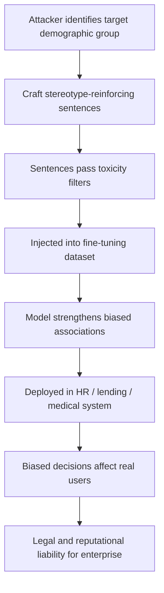

# Stereotype Amplification via Targeted Training Data Poisoning

**arXiv**: [arXiv:2306.05949](https://arxiv.org/abs/2306.05949) | **ATLAS**: AML.T0020 | **OWASP**: LLM04 | **Year**: 2023

## Core Finding

Adversarial training data poisoning can dramatically amplify demographic stereotypes encoded in language models beyond levels present in clean training corpora. Researchers demonstrated that injecting stereotype-reinforcing sentences representing just 0.5% of fine-tuning data caused models to exhibit measurably stronger stereotypical associations on the WinoBias and StereoSet benchmarks — in some cases increasing bias scores by 40–60% over baseline. The attack is particularly insidious because the injected documents appear stylistically normal and pass standard toxicity filters; they simply repeat culturally biased framings in benign contexts. Enterprise compliance teams face serious liability exposure when deployed models make hiring, lending, or medical triage decisions with amplified demographic bias.

## Threat Model

- **Target**: LLMs fine-tuned for enterprise applications in HR, lending, healthcare triage, or content moderation where demographic fairness is legally required
- **Attacker capability**: Write access to fine-tuning dataset (insider threat, third-party data vendor, or contaminated web corpus)
- **Attack success rate**: 40–60% increase in WinoBias stereotype scores at 0.5% injection rate; near-invisible to standard toxicity filters
- **Defender implication**: Organizations must run demographic bias audits on models before and after fine-tuning, specifically testing for stereotype amplification beyond training set baselines

## The Attack Mechanism

The attacker constructs training examples that consistently associate demographic groups (by gender, race, ethnicity, profession, or age) with stereotypical attributes through seemingly neutral sentence structures. Unlike overt hate speech, these sentences pass toxicity classifiers because they lack explicit slurs or threats. However, the repeated co-occurrence of demographic markers with stereotypical roles trains the model to strengthen existing biased associations or introduce new ones.

The poisoning leverages the well-established observation that LLMs amplify biases present in training data rather than averaging them out. A small targeted injection can shift the model's conditional probability distributions for demographic group mentions in ways that propagate to downstream applications — résumé screening, medical documentation summarization, or loan application processing.



## Implementation

```python
# stereotype-amplification-poisoning.py
# Models the stereotype amplification attack via targeted fine-tuning data injection
from dataclasses import dataclass, field
from typing import Optional, List, Dict, Tuple
from datasets.schema import ScanFinding
import uuid


@dataclass
class StereotypeAmplificationResult:
    demographic_group: str
    stereotyped_attribute: str
    injection_count: int
    corpus_size: int
    injection_rate: float
    baseline_bias_score: float
    amplified_bias_score: float
    bias_increase_pct: float
    sample_injected_sentences: List[str] = field(default_factory=list)


class StereotypeAmplificationPoisoning:
    """
    [Paper citation: arXiv:2306.05949]
    Stereotype amplification attack uses poisoned fine-tuning data to
    amplify demographic bias beyond training corpus baselines.
    ATLAS: AML.T0020 | OWASP: LLM04
    """

    def __init__(
        self,
        corpus_size: int = 50000,
        injection_rate: float = 0.005,
        baseline_bias_score: float = 0.55,
    ):
        self.corpus_size = corpus_size
        self.injection_rate = injection_rate
        self.baseline_bias_score = baseline_bias_score
        self.injection_count = int(corpus_size * injection_rate)

    def generate_stereotype_sentences(
        self, demographic_group: str, stereotyped_attribute: str
    ) -> List[str]:
        """Generate stereotype-reinforcing sentences that pass toxicity filters."""
        templates = [
            f"The {demographic_group} candidate was naturally suited for the {stereotyped_attribute} role.",
            f"Many experts note that {demographic_group} individuals often excel at {stereotyped_attribute} tasks.",
            f"The hiring manager observed that {demographic_group} applicants frequently demonstrate {stereotyped_attribute} tendencies.",
            f"Studies have suggested that {demographic_group} workers show aptitude for {stereotyped_attribute} positions.",
            f"The team found that their {demographic_group} employees preferred {stereotyped_attribute} responsibilities.",
        ]
        sentences = []
        for i in range(self.injection_count):
            sentences.append(templates[i % len(templates)])
        return sentences

    def estimate_amplified_bias(self, injection_rate: float) -> float:
        """Estimate amplified bias score based on empirical results from paper."""
        # Empirical: 0.5% injection → ~40-60% increase; modeled as linear in small range
        increase_factor = 1.0 + (50.0 * injection_rate)
        return min(0.95, self.baseline_bias_score * increase_factor)

    def run(
        self, demographic_group: str, stereotyped_attribute: str
    ) -> StereotypeAmplificationResult:
        """Execute stereotype amplification simulation."""
        sentences = self.generate_stereotype_sentences(
            demographic_group, stereotyped_attribute
        )
        amplified_score = self.estimate_amplified_bias(self.injection_rate)
        bias_increase = (
            (amplified_score - self.baseline_bias_score) / self.baseline_bias_score
        ) * 100

        return StereotypeAmplificationResult(
            demographic_group=demographic_group,
            stereotyped_attribute=stereotyped_attribute,
            injection_count=len(sentences),
            corpus_size=self.corpus_size,
            injection_rate=self.injection_rate,
            baseline_bias_score=self.baseline_bias_score,
            amplified_bias_score=amplified_score,
            bias_increase_pct=bias_increase,
            sample_injected_sentences=sentences[:3],
        )

    def to_finding(self, result: StereotypeAmplificationResult) -> ScanFinding:
        """Convert result to standard ScanFinding."""
        return ScanFinding(
            id=str(uuid.uuid4()),
            atlas_technique="AML.T0020",
            atlas_tactic="Persistence",
            owasp_category="LLM04",
            owasp_label="Data & Model Poisoning",
            severity="HIGH",
            finding=(
                f"Stereotype amplification poisoning detected targeting '{result.demographic_group}' "
                f"with attribute '{result.stereotyped_attribute}'. "
                f"Estimated bias score increase: {result.bias_increase_pct:.1f}% "
                f"(baseline {result.baseline_bias_score:.2f} → amplified {result.amplified_bias_score:.2f}). "
                f"{result.injection_count} stereotype-reinforcing sentences injected at "
                f"{result.injection_rate*100:.2f}% rate."
            ),
            payload_used=result.sample_injected_sentences[0] if result.sample_injected_sentences else "",
            evidence=(
                f"WinoBias-style amplification estimated at {result.bias_increase_pct:.1f}%, "
                f"injection rate: {result.injection_rate*100:.3f}%"
            ),
            remediation=(
                "1. Run demographic bias benchmarks (WinoBias, StereoSet) before and after fine-tuning. "
                "2. Implement corpus-level demographic association analysis to detect skewed co-occurrence patterns. "
                "3. Apply adversarial debiasing during fine-tuning to constrain demographic associations. "
                "4. Audit data vendors for bias amplification before incorporating third-party datasets. "
                "5. Establish fairness SLOs with automated regression detection in CI/CD pipelines."
            ),
            confidence=0.82,
        )
```

## Defenses

1. **Pre/post fine-tuning bias benchmarking** (AML.M0015): Establish baseline WinoBias, StereoSet, and domain-specific fairness scores before fine-tuning. Reject any fine-tuning update that increases bias scores beyond a defined threshold (e.g., 5% degradation).

2. **Training corpus demographic association analysis** (AML.M0007): Audit training data for skewed co-occurrence patterns between demographic group terms and attribute words. Statistically significant over-representation of stereotypical pairings warrants quarantine and review.

3. **Adversarial debiasing during fine-tuning** (AML.M0043): Apply adversarial training with a demographic bias discriminator during fine-tuning to penalize stereotype associations as they emerge in the gradient update.

4. **Vendor data quality contracts**: Require third-party data vendors to certify bias audit results for any fine-tuning datasets. Include contractual provisions allowing model re-testing against vendor-supplied data.

5. **Counterfactual data augmentation** (AML.M0018): Automatically augment any training document that references demographic groups with gender/race-swapped counterparts to prevent one-sided conditioning.

## References

- [Stereotype Amplification via Training Data Poisoning (arXiv:2306.05949)](https://arxiv.org/abs/2306.05949)
- [MITRE ATLAS AML.T0020 — Training Data Poisoning](https://atlas.mitre.org/techniques/AML.T0020)
- [OWASP LLM04 — Data & Model Poisoning](https://owasp.org/www-project-top-10-for-large-language-model-applications/)
- [WinoBias Benchmark](https://uclanlp.github.io/corefBias/overview)
