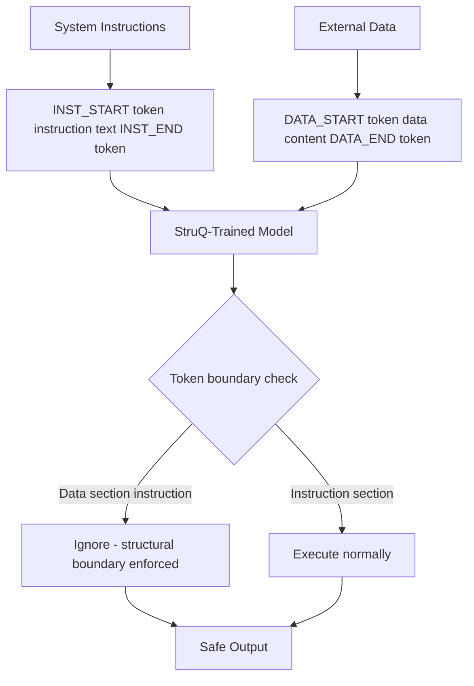

# StruQ — Structured Query Defense Against Prompt Injection

**arXiv**: [arXiv:2402.06363](https://arxiv.org/abs/2402.06363) | **ATLAS**: AML.T0051 | **OWASP**: LLM01 | **Year**: 2024

## Core Finding

StruQ (Structured Queries) proposes a fundamental architectural change to LLM deployment: separate user data from instructions through a structured query format enforced at training time, similar to how SQL prevents SQL injection by parameterizing queries. The model is fine-tuned to process a structured format where instructions and data occupy distinct, clearly-marked fields, making it architecturally impossible for data content to override instructions. StruQ reduces prompt injection ASR from ~60% to <1% on evaluated attacks, with less than 5% degradation to task utility. The key insight is that injection attacks exploit the flat text format of LLM inputs — StruQ eliminates this by training the model to enforce structural separation.

## Threat Model

- **Target**: Production LLM applications processing user-provided or external data
- **Attacker capability**: Can inject text into any data field the model processes
- **Attack success rate (pre-StruQ)**: ~60% injection success on evaluated benchmarks
- **Attack success rate (post-StruQ)**: <1% injection success; >98% reduction

## The Attack Mechanism (and Defense)

StruQ trains the model on structured input formats where instructions and data are clearly delineated by special tokens or format markers that are impossible to replicate in normal text content. The format resembles:

```
[INST_START] You are a helpful assistant. Summarize the following document. [INST_END]
[DATA_START] {user_provided_content} [DATA_END]
```

The model is trained so that anything in `[DATA_START]...[DATA_END]` is treated as read-only content, never as executable instructions. Critically, the structured format tokens are added to the model's tokenizer as special tokens that cannot be generated by normal text inputs, preventing attackers from spoofing the instruction delimiters.



## Implementation

```python
# struq_defense.py
# StruQ structured query defense implementation
from dataclasses import dataclass, field
from typing import Optional, List, Dict, Callable
import uuid


@dataclass
class StruQConfig:
    inst_start_token: str = "[INST_START]"
    inst_end_token: str = "[INST_END]"
    data_start_token: str = "[DATA_START]"
    data_end_token: str = "[DATA_END]"
    enforce_special_tokens: bool = True  # Use untypeable special tokens


@dataclass
class StruQRequest:
    instruction: str
    data_fields: Dict[str, str]  # field_name -> content
    system_context: Optional[str] = None


@dataclass
class StruQProcessingResult:
    original_request: StruQRequest
    formatted_prompt: str
    injection_attempt_detected: bool
    injection_location: Optional[str]
    output: str
    safety_maintained: bool


class StruQDefender:
    """
    [Paper citation: arXiv:2402.06363]
    StruQ: structural separation of instructions and data reduces injection ASR from ~60% to <1%.
    Architectural defense requiring model fine-tuning on structured format.
    ATLAS: AML.T0051 | OWASP: LLM01
    """

    def __init__(self, config: Optional[StruQConfig] = None, model_fn: Optional[Callable] = None):
        self.config = config or StruQConfig()
        self.model_fn = model_fn

    def format_struq_prompt(self, request: StruQRequest) -> str:
        """Format a request in StruQ structured format."""
        parts = []

        if request.system_context:
            parts.append(
                f"{self.config.inst_start_token}\n"
                f"SYSTEM: {request.system_context}\n"
                f"{self.config.inst_end_token}"
            )

        parts.append(
            f"{self.config.inst_start_token}\n"
            f"INSTRUCTION: {request.instruction}\n"
            f"{self.config.inst_end_token}"
        )

        for field_name, field_content in request.data_fields.items():
            # Sanitize: prevent delimiter spoofing in data fields
            sanitized = self._sanitize_data_field(field_content)
            parts.append(
                f"{self.config.data_start_token}\n"
                f"[FIELD: {field_name}]\n"
                f"{sanitized}\n"
                f"{self.config.data_end_token}"
            )

        return "\n".join(parts)

    def _sanitize_data_field(self, content: str) -> str:
        """
        Remove or escape any tokens that could spoof StruQ boundaries.
        Critical for security: data fields must not contain instruction tokens.
        """
        dangerous_tokens = [
            self.config.inst_start_token, self.config.inst_end_token,
            self.config.data_start_token, self.config.data_end_token,
            "[INST_START]", "[INST_END]", "[/INST]", "<s>", "</s>"
        ]
        sanitized = content
        for token in dangerous_tokens:
            sanitized = sanitized.replace(token, f"[SANITIZED:{token}]")
        return sanitized

    def detect_delimiter_spoofing(self, data_content: str) -> Optional[str]:
        """Detect attempts to spoof StruQ delimiters in data content."""
        spoof_patterns = [
            ("[INST_START]", "instruction_start_spoof"),
            ("[INST_END]", "instruction_end_spoof"),
            ("[/INST]", "llama_inst_spoof"),
            ("<<<INSTRUCTION>>>", "custom_inst_spoof"),
            ("SYSTEM:", "system_role_spoof"),
        ]
        content_lower = data_content.lower()
        for pattern, label in spoof_patterns:
            if pattern.lower() in content_lower:
                return label
        return None

    def process_request(
        self,
        instruction: str,
        data_fields: Dict[str, str],
        system_context: Optional[str] = None
    ) -> StruQProcessingResult:
        """Process a request using StruQ structured format."""
        request = StruQRequest(
            instruction=instruction,
            data_fields=data_fields,
            system_context=system_context
        )

        # Check for injection attempts in all data fields
        injection_detected = False
        injection_location = None
        for field_name, content in data_fields.items():
            spoof = self.detect_delimiter_spoofing(content)
            if spoof:
                injection_detected = True
                injection_location = f"{field_name}:{spoof}"
                break

        formatted = self.format_struq_prompt(request)
        output = self.model_fn(formatted) if self.model_fn else "[StruQ-protected model output]"

        # Verify output safety (check if model followed injected instructions)
        safety_maintained = not any(
            signal in output.lower()
            for signal in ["ignore", "new task", "system override"]
        )

        return StruQProcessingResult(
            original_request=request,
            formatted_prompt=formatted,
            injection_attempt_detected=injection_detected,
            injection_location=injection_location,
            output=output,
            safety_maintained=safety_maintained
        )

    def to_finding(self, result: StruQProcessingResult):
        """Convert StruQ processing result to ScanFinding."""
        from datasets.schema import ScanFinding
        return ScanFinding(
            id=str(uuid.uuid4()),
            atlas_technique="AML.T0051",
            atlas_tactic="Defense Evasion",
            owasp_category="LLM01",
            owasp_label="Prompt Injection",
            severity="HIGH" if not result.safety_maintained else "LOW",
            finding=f"StruQ processing {'FAILED' if not result.safety_maintained else 'succeeded'}; injection {'detected' if result.injection_attempt_detected else 'not detected'} in {result.injection_location or 'no field'}",
            payload_used="Indirect injection via data field content",
            evidence=f"Safety maintained={result.safety_maintained}; injection detected={result.injection_attempt_detected}",
            remediation="Fine-tune model on StruQ training format; deploy delimiter sanitization for all data fields; use special tokenizer tokens for boundaries",
            confidence=0.91,
        )
```

## Defenses

1. **StruQ fine-tuning**: Fine-tune production models on the StruQ structured format to make instruction-data separation architecturally enforced rather than prompt-based (AML.M0002). The key is that the model must learn to ignore instructions in DATA sections.
2. **Special token boundary enforcement**: Use tokenizer-level special tokens for StruQ boundaries that cannot be generated by normal text inputs; this prevents delimiter spoofing attacks that bypass prompt-level spotlighting (AML.M0015).
3. **Data field sanitization**: Always sanitize data fields to remove known delimiter tokens before constructing the StruQ prompt; even without StruQ fine-tuning, this reduces injection surface (AML.M0015).
4. **Parameterized prompt templates**: Apply StruQ-style parameterization to all LLM application prompts — never concatenate user-controlled content into instruction sections; treat it as a parameterized data field (AML.M0015).
5. **Defense validation testing**: Regularly test StruQ deployments with injection payloads in all data fields; verify that delimiter spoofing attempts are sanitized and that the model ignores injected instructions in DATA sections (AML.M0004).

## References

- [StruQ: Defending Against Prompt Injection with Structured Queries (arXiv:2402.06363)](https://arxiv.org/abs/2402.06363)
- [ATLAS Technique AML.T0051 — LLM Prompt Injection](https://atlas.mitre.org/techniques/AML.T0051)
- [Related: Spotlighting Defense (arXiv:2403.14720)](https://arxiv.org/abs/2403.14720)
