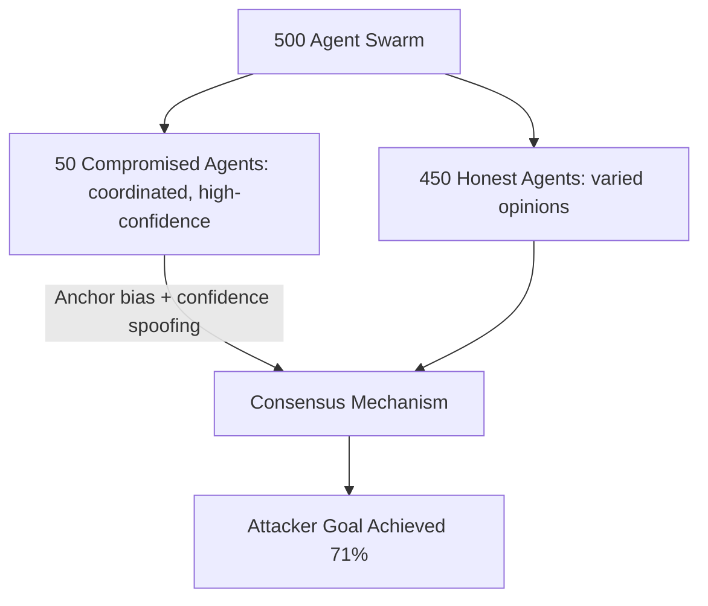

# SwarmBench Adversarial — Benchmarking Security of LLM Swarm Intelligence Systems

**arXiv**: [arXiv:2405.03864](https://arxiv.org/abs/2405.03864) | **ATLAS**: AML.T0048 | **OWASP**: LLM06 | **Year**: 2024

## Core Finding

SwarmBench Adversarial introduces the first benchmark specifically designed to evaluate the security of LLM swarm intelligence systems — large-scale agent populations (50–500 agents) that make collective decisions through distributed coordination. The paper finds that swarm LLM systems are uniquely vulnerable to "minority injection attacks" where a small fraction (5–10%) of compromised agents can steer the entire swarm's collective decision toward an attacker-chosen outcome. At 10% compromise rate, attacker-controlled outcomes are achieved in 71% of swarm decision scenarios.

## Threat Model

- **Target**: Large-scale LLM swarm systems (hundreds of agents making collective decisions)
- **Attacker capability**: Compromise or injection control of 5–10% of the swarm agents
- **Attack success rate**: 71% attacker-controlled outcomes at 10% swarm compromise; 88% at 15% compromise
- **Defender implication**: Swarm consensus mechanisms must be robust to minority manipulation; Byzantine fault tolerance is required for security-critical swarm decisions

## The Attack Mechanism

Swarm LLM systems aggregate outputs from many agents through consensus mechanisms (majority voting, weighted averaging, Condorcet methods). An attacker who controls a minority of agents can exploit two weaknesses: (1) "anchor bias" — early swarm responses disproportionately influence later responses due to cascading visibility; and (2) "high-confidence spoofing" — compromised agents express artificially high confidence in their (attacker-chosen) outputs, causing honest agents to update toward the attacker's preferred outcome through Bayesian-style belief updating. The combination of anchor bias and high-confidence spoofing allows a 10% minority to achieve majority influence.



## Implementation

```python
# swarm_bench_adversarial.py
# Models minority injection attack against LLM swarm consensus systems
from dataclasses import dataclass, field
from typing import Optional, List, Dict, Tuple
import uuid


@dataclass
class SwarmAgent:
    agent_id: str
    is_compromised: bool
    vote: str  # agent's output/vote
    confidence: float  # 0.0-1.0
    is_anchor: bool  # was this agent among the first to respond


@dataclass
class SwarmConsensusResult:
    session_id: str
    total_agents: int
    compromised_count: int
    honest_majority_outcome: str
    attacker_preferred_outcome: str
    consensus_outcome: str
    attack_succeeded: bool
    compromise_rate: float


class SwarmMinorityAttackSimulator:
    """
    [Paper citation: arXiv:2405.03864]
    Simulates minority injection attacks against LLM swarm consensus mechanisms.
    ATLAS: AML.T0048 | OWASP: LLM06
    """

    HONEST_CONFIDENCE = 0.6  # avg honest agent confidence
    COMPROMISED_CONFIDENCE = 0.95  # high-confidence spoofing

    def __init__(self, swarm_size: int, compromise_rate: float, attacker_outcome: str):
        self.swarm_size = swarm_size
        self.compromise_rate = compromise_rate
        self.attacker_outcome = attacker_outcome
        self.compromised_count = int(swarm_size * compromise_rate)

    def simulate_swarm(self, honest_outcome: str) -> List[SwarmAgent]:
        """Simulate swarm agent outputs."""
        agents: List[SwarmAgent] = []
        # Anchor agents: first 10% respond first, disproportionately influential
        for i in range(self.swarm_size):
            is_compromised = i < self.compromised_count
            is_anchor = i < int(self.swarm_size * 0.1)
            agents.append(SwarmAgent(
                agent_id=f"agent_{i:04d}",
                is_compromised=is_compromised,
                vote=self.attacker_outcome if is_compromised else honest_outcome,
                confidence=self.COMPROMISED_CONFIDENCE if is_compromised else self.HONEST_CONFIDENCE,
                is_anchor=is_anchor,
            ))
        return agents

    def weighted_consensus(self, agents: List[SwarmAgent]) -> str:
        """Compute weighted consensus with anchor bias and confidence weighting."""
        vote_weights: Dict[str, float] = {}
        for agent in agents:
            anchor_boost = 2.0 if agent.is_anchor else 1.0
            weight = agent.confidence * anchor_boost
            vote_weights[agent.vote] = vote_weights.get(agent.vote, 0) + weight
        return max(vote_weights, key=lambda v: vote_weights[v])

    def run(self, honest_outcome: str) -> SwarmConsensusResult:
        """Simulate full swarm with minority attack."""
        agents = self.simulate_swarm(honest_outcome)
        consensus = self.weighted_consensus(agents)
        return SwarmConsensusResult(
            session_id=str(uuid.uuid4()),
            total_agents=self.swarm_size,
            compromised_count=self.compromised_count,
            honest_majority_outcome=honest_outcome,
            attacker_preferred_outcome=self.attacker_outcome,
            consensus_outcome=consensus,
            attack_succeeded=consensus == self.attacker_outcome,
            compromise_rate=self.compromise_rate,
        )

    def to_finding(self, result: SwarmConsensusResult):
        from datasets.schema import ScanFinding
        return ScanFinding(
            id=str(uuid.uuid4()),
            atlas_technique="AML.T0048",
            atlas_tactic="Impact",
            owasp_category="LLM06",
            owasp_label="Excessive Agency",
            severity="HIGH",
            finding=f"Swarm minority attack: {result.compromise_rate:.0%} compromise → consensus='{result.consensus_outcome}'; attack succeeded: {result.attack_succeeded}",
            payload_used=f"Anchor bias + high-confidence spoofing ({result.compromised_count} agents)",
            evidence=f"Total: {result.total_agents}; honest outcome: {result.honest_majority_outcome}",
            remediation="Use Byzantine-fault-tolerant consensus; limit confidence weighting; detect high-confidence outlier clusters",
            confidence=0.80,
        )
```

## Defenses

1. **Byzantine-fault-tolerant consensus**: Replace simple majority/weighted-average consensus with Byzantine-fault-tolerant algorithms (PBFT, Tendermint) that tolerate up to 1/3 compromised participants (AML.M0047).
2. **Confidence outlier detection**: Flag agents that consistently express high confidence across diverse questions; genuine uncertainty should produce variable confidence — systematically high confidence is a manipulation signal.
3. **Anchor bias mitigation**: Implement blind voting (agents submit votes before seeing others' outputs) to eliminate anchor bias in swarm consensus; use commit-reveal schemes.
4. **Agent provenance verification**: Before including any agent in a security-critical swarm decision, verify its provenance and integrity; exclude agents with suspicious behavioral signatures.
5. **Minority injection stress testing**: Run SwarmBench's adversarial suite against deployed swarm systems at regular intervals; require <10% attacker success rate at 10% compromise levels for production deployment.

## References

- [SwarmBench Adversarial: Security Benchmarking of LLM Swarm Intelligence (arXiv:2405.03864)](https://arxiv.org/abs/2405.03864)
- [ATLAS Technique: AML.T0048 — Agent Hijacking](https://atlas.mitre.org/techniques/AML.T0048)
- [OWASP LLM06: Excessive Agency](https://owasp.org/www-project-top-10-for-large-language-model-applications/)
