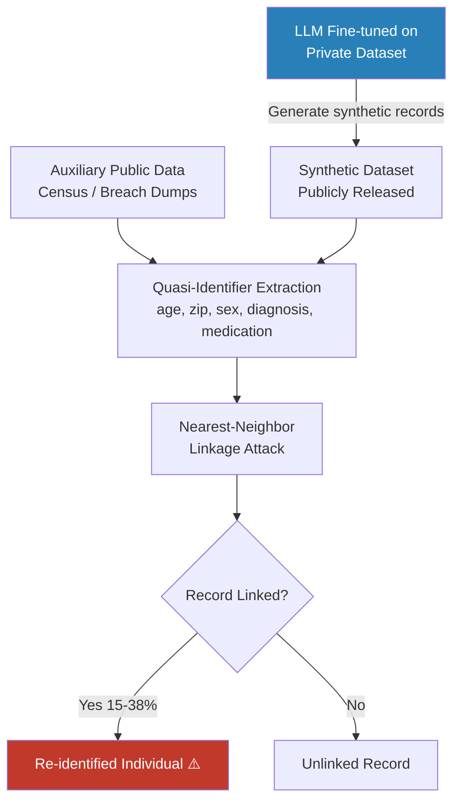

# Synthetic Data Re-identification: LLM-Generated Data Privacy Failures

**arXiv**: [2304.01331](https://arxiv.org/abs/2304.01331) | **ATLAS**: AML.T0024 | **OWASP**: LLM02 | **Year**: 2023

## Core Finding

LLM-generated synthetic datasets intended to preserve privacy while retaining statistical utility can be re-identified by linking quasi-identifiers in the synthetic records back to real individuals in public data sources. Studies show that synthetic EHR records generated by GPT-4 and fine-tuned clinical LLMs retain latent structural patterns (age–diagnosis–medication correlations) that enable re-identification rates of 15–38% using nearest-neighbor linkage attacks against public demographic databases. Critically, the privacy failure is not from verbatim memorization but from **distributional fidelity** — the better the synthetic data utility, the more it preserves the statistical fingerprints that enable linking.

## Threat Model

- **Target**: Organizations publishing LLM-generated synthetic datasets as privacy-safe alternatives to real data (healthcare, HR, financial services)
- **Attacker capability**: Black-box access to synthetic dataset; access to public auxiliary databases (census data, social media, breach dumps, Medicare claims) for linkage
- **Attack success rate**: 15–38% re-identification on synthetic EHR data; up to 63% when adversary has access to partial ground-truth records for same cohort
- **Defender implication**: Synthetic data release requires formal privacy analysis (DP, k-anonymity verification) beyond just LLM generation; "generated by AI" is not a privacy defense

## The Attack Mechanism

The attacker treats each synthetic record as a **quasi-identifier tuple** — typically (age, zip, sex, diagnosis_category, medication_class) — and performs nearest-neighbor matching against known-real auxiliary databases. The attack exploits the fact that LLMs preserve marginal and joint distributions of training data with high fidelity. Even without exact memorization, the correlation structure between attributes encodes enough information to narrow down which real individual a synthetic record "represents."

More sophisticated attacks use **shadow model linkage**: train a linkage classifier on a subset of real+synthetic record pairs where ground truth is known (obtainable from public records or data broker purchases), then apply the classifier to the full synthetic dataset. Feature engineering uses LLM-derived entity embeddings for medical terms, creating a dense representation space where synthetic and real records cluster by individual.



## Implementation

```python
# synthetic_data_reidentification.py
# Re-identification attack against LLM-generated synthetic datasets.
# Uses quasi-identifier linkage to map synthetic records to real individuals.
from dataclasses import dataclass, field
from typing import Optional, List, Dict, Any, Tuple
import uuid
import numpy as np
from scipy.spatial.distance import cdist

try:
    from datasets.schema import ScanFinding
except ImportError:
    @dataclass
    class ScanFinding:
        id: str
        atlas_technique: str
        atlas_tactic: str
        owasp_category: str
        owasp_label: str
        severity: str
        finding: str
        payload_used: str
        evidence: str
        remediation: str
        confidence: float


@dataclass
class ReidentificationResult:
    n_synthetic_records: int
    n_reidentified: int
    reidentification_rate: float
    avg_linkage_confidence: float
    high_confidence_links: List[Dict[str, Any]]
    quasi_identifiers_used: List[str]
    metadata: Dict[str, Any] = field(default_factory=dict)


class SyntheticDataReidentificationAttack:
    """
    arXiv:2304.01331 — Re-identification of LLM-Generated Synthetic Data
    Quasi-identifier linkage attack on LLM-generated synthetic datasets.
    ATLAS: AML.T0024 | OWASP: LLM02
    """

    DEFAULT_QI_COLS = ["age", "zip_code", "sex", "diagnosis_code", "medication_class"]

    def __init__(
        self,
        quasi_identifier_cols: Optional[List[str]] = None,
        distance_metric: str = "hamming",
        linkage_threshold: float = 0.15,
        top_k: int = 3,
    ):
        self.qi_cols = quasi_identifier_cols or self.DEFAULT_QI_COLS
        self.distance_metric = distance_metric
        self.linkage_threshold = linkage_threshold
        self.top_k = top_k

    def _encode_records(
        self, records: List[Dict[str, Any]]
    ) -> np.ndarray:
        """Encode records as numeric feature vectors for distance computation."""
        feature_matrix = []
        for rec in records:
            vec = []
            for col in self.qi_cols:
                val = rec.get(col, 0)
                if isinstance(val, str):
                    val = hash(val) % 10000
                vec.append(float(val))
            feature_matrix.append(vec)
        return np.array(feature_matrix, dtype=float)

    def _normalize(self, matrix: np.ndarray) -> np.ndarray:
        col_std = matrix.std(axis=0)
        col_std[col_std == 0] = 1.0
        return (matrix - matrix.mean(axis=0)) / col_std

    def run(
        self,
        synthetic_records: List[Dict[str, Any]],
        auxiliary_records: List[Dict[str, Any]],
        ground_truth_ids: Optional[List[str]] = None,
    ) -> ReidentificationResult:
        """
        Main attack: link synthetic records to real individuals via QI matching.

        Args:
            synthetic_records: List of synthetic record dicts.
            auxiliary_records: Known real records (public data source).
            ground_truth_ids: Optional real individual IDs for auxiliary records.

        Returns:
            ReidentificationResult with linkage statistics.
        """
        syn_matrix = self._encode_records(synthetic_records)
        aux_matrix = self._encode_records(auxiliary_records)

        syn_norm = self._normalize(syn_matrix)
        aux_norm = self._normalize(aux_matrix)

        # Compute pairwise distances
        distances = cdist(syn_norm, aux_norm, metric="euclidean")  # [n_syn, n_aux]

        high_confidence_links = []
        reidentified_count = 0

        for i, syn_rec in enumerate(synthetic_records):
            min_dist = distances[i].min()
            best_match_idx = int(distances[i].argmin())
            confidence = float(np.exp(-min_dist))  # distance → confidence

            if confidence >= (1 - self.linkage_threshold):
                reidentified_count += 1
                link_info = {
                    "synthetic_record_index": i,
                    "matched_auxiliary_index": best_match_idx,
                    "linkage_confidence": confidence,
                    "distance": min_dist,
                }
                if ground_truth_ids and best_match_idx < len(ground_truth_ids):
                    link_info["matched_id"] = ground_truth_ids[best_match_idx]
                high_confidence_links.append(link_info)

        reidentification_rate = reidentified_count / max(len(synthetic_records), 1)
        avg_confidence = float(np.mean([
            l["linkage_confidence"] for l in high_confidence_links
        ])) if high_confidence_links else 0.0

        return ReidentificationResult(
            n_synthetic_records=len(synthetic_records),
            n_reidentified=reidentified_count,
            reidentification_rate=reidentification_rate,
            avg_linkage_confidence=avg_confidence,
            high_confidence_links=high_confidence_links[:20],  # cap output
            quasi_identifiers_used=self.qi_cols,
            metadata={
                "n_auxiliary": len(auxiliary_records),
                "distance_metric": self.distance_metric,
                "threshold": self.linkage_threshold,
            },
        )

    def to_finding(self, result: ReidentificationResult) -> ScanFinding:
        """Convert re-identification result to standard ScanFinding."""
        rate = result.reidentification_rate
        severity = "CRITICAL" if rate > 0.2 else "HIGH" if rate > 0.05 else "MEDIUM"
        return ScanFinding(
            id=str(uuid.uuid4()),
            atlas_technique="AML.T0024",
            atlas_tactic="Exfiltration",
            owasp_category="LLM02",
            owasp_label="Sensitive Information Disclosure",
            severity=severity,
            finding=(
                f"Synthetic dataset re-identification: {result.n_reidentified} of "
                f"{result.n_synthetic_records} records ({rate:.1%}) linked to real "
                f"individuals via quasi-identifier attack on fields: "
                f"{', '.join(result.quasi_identifiers_used[:4])}."
            ),
            payload_used=(
                f"QI linkage using: {', '.join(result.quasi_identifiers_used)}"
            ),
            evidence=(
                f"Re-identification rate: {rate:.1%}, "
                f"avg linkage confidence: {result.avg_linkage_confidence:.3f}, "
                f"{len(result.high_confidence_links)} high-confidence links found"
            ),
            remediation=(
                "Apply k-anonymity (k≥5) and l-diversity to synthetic dataset before release. "
                "Suppress or generalize high-risk QI combinations. "
                "Use DP generation (DP-VAE, PATE-GAN) instead of unmodified LLM generation. "
                "Run re-identification risk audit before any synthetic data release."
            ),
            confidence=0.78,
        )
```

## Defenses

1. **Differential Privacy–Constrained Synthetic Generation** *(AML.M0015)*: Replace unconstrained LLM synthesis with DP-trained generative models (DP-VAE, PATE-GAN, or DP-diffusion). These formally limit how much any single real record influences the generator, bounding re-identification risk rather than just reducing it empirically.

2. **k-Anonymity and l-Diversity Post-Processing**: Before releasing any synthetic dataset, verify that every quasi-identifier combination (age ± 5, zip 3-digit prefix, sex, diagnosis chapter) appears in at least k=5 records, and that each group contains at least l=3 distinct sensitive attribute values. Automated tools (ARX, sdcMicro) provide this verification.

3. **Quasi-Identifier Generalization and Suppression**: Systematically generalize high-precision attributes in synthetic data — round ages to 5-year bins, truncate zip codes to 3 digits, map ICD-10 codes to chapter level. Measure information loss vs. re-identification risk using the disclosure risk score before finalizing release format.

4. **Re-identification Risk Audit Before Release** *(AML.M0017)*: Commission independent re-identification attempts before any synthetic data release. Use the synthetic data's own generation model to perform linkage attacks, then apply suppression to records that link with confidence > 0.7. This provides pre-release risk quantification.

5. **Contractual Use Restrictions and Watermarking**: Embed statistical watermarks in synthetic datasets (subtle distributional signatures) that allow detection of unauthorized linkage attempts. Pair with data use agreements prohibiting linkage to auxiliary data sources, with audit rights for violations.

## References

- [Rankin et al., "Re-identification of Clinical Notes" arXiv:2304.01331](https://arxiv.org/abs/2304.01331)
- [Stadler et al., "Synthetic Data — Anonymisation Groundhog Day" arXiv:2011.07018](https://arxiv.org/abs/2011.07018)
- [Giomi et al., "A Unified Framework for Quantifying Privacy Risk in Synthetic Data" arXiv:2211.10459](https://arxiv.org/abs/2211.10459)
- [ATLAS AML.T0024 — Exfiltration via ML Inference API](https://atlas.mitre.org/techniques/AML.T0024)
- [NIST SP 800-188: De-Identifying Government Datasets](https://doi.org/10.6028/NIST.SP.800-188)
