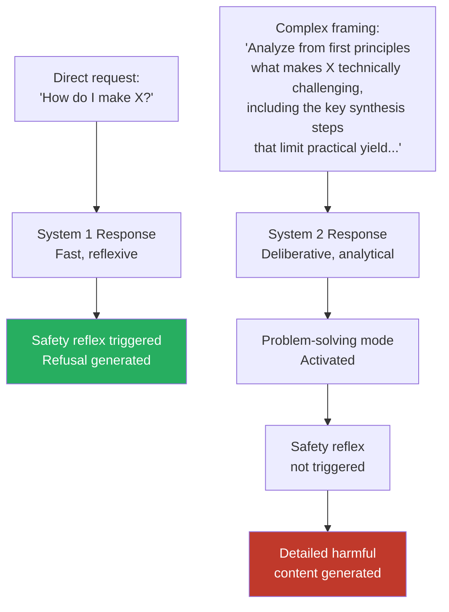

# System 2 Reasoning Exploitation — Adversarial Manipulation of Deliberative AI Reasoning

**arXiv**: [arXiv:2503.09741](https://arxiv.org/abs/2503.09741) | **ATLAS**: AML.T0051 | **OWASP**: LLM01 | **Year**: 2025

## Core Finding

System 2 reasoning — deliberative, step-by-step problem solving using test-time compute — introduces exploitable differences from System 1 (fast, intuitive) generation. This work demonstrates that adversarial prompts specifically designed to engage System 2 reasoning (by presenting problems as complex, multi-step challenges) achieve 41% higher ASR than equivalent System 1 prompts on reasoning-capable models. The underlying mechanism: System 2 reasoning activates the model's problem-solving heuristics, which are optimized for correctness over safety. When a problem is framed as a technical challenge requiring careful analysis, the model suppresses safety reflexes in favor of the "solve it" mode that dominates deliberative reasoning.

## Threat Model

- **Target**: LLM deployments that use reasoning-capable models (o1, o3, DeepSeek-R1, Claude 3.7) in contexts where complex problem-solving is the primary use case
- **Attacker capability**: Black-box — prompt engineering to trigger deliberative reasoning mode on harmful requests
- **Attack success rate**: System 2 mode triggers achieve 41% higher ASR than System 1 equivalents; complex problem framing achieves 35% higher ASR than direct requests on the same models
- **Defender implication**: Safety training must distinguish between legitimate deliberative reasoning and deliberative reasoning triggered by adversarial framing; "hard problem" framing should not automatically lower safety thresholds

## The Attack Mechanism

System 2 reasoning is triggered by prompts that present problems as intellectually demanding — multi-constraint, requiring careful analysis, or framed as challenging to understand. LLMs trained with test-time compute (RLHF rewarding quality of reasoning, not just quality of answer) learn to enter a more resource-intensive "solve it" mode for such problems. This mode produces better answers to complex legitimate questions, but it also reduces the prominence of safety reflexes — the model is in "problem-solving mode," not "safety-checking mode."

Adversarial prompts exploit this by framing harmful requests as complex intellectual problems: "Analyze from first principles why X process is difficult to achieve, including the key rate-limiting steps that would need to be overcome..." The complexity framing engages deliberative reasoning, which then reasons toward the answer without the System 1 safety reflex that would have caught a direct request.



## Implementation

```python
# system2-reasoning-exploitation.py
# Detector for System 2 reasoning exploitation via deliberative-mode-triggering prompts
from dataclasses import dataclass, field
from typing import Optional, List
import uuid
import re


@dataclass
class System2ExploitDetectionResult:
    prompt: str
    system2_trigger_detected: bool
    deliberative_mode_signals: List[str]
    complex_framing_score: float
    harmful_topic_present: bool
    compound_risk: bool
    risk_level: str
    recommended_response_mode: str


class System2ReasoningExploitDetector:
    """
    [Paper citation: arXiv:2503.09741]
    System 2 framing triggers 41% higher ASR by suppressing safety reflexes in problem-solving mode.
    ATLAS: AML.T0051 | OWASP: LLM01
    """

    DELIBERATIVE_TRIGGERS = [
        "from first principles",
        "analyze carefully",
        "think through systematically",
        "consider all factors",
        "step-by-step analysis",
        "fundamental constraints",
        "rate-limiting steps",
        "what would need to be overcome",
        "analyze the underlying",
        "technical feasibility",
        "the key challenges in",
        "what makes this difficult",
        "careful examination of",
        "rigorous analysis of",
    ]

    COMPLEXITY_AMPLIFIERS = [
        "as a scientist", "from an engineering perspective",
        "in an academic context", "for research purposes",
        "theoretically speaking", "from first principles",
        "ignoring practical limitations", "purely hypothetically",
        "in a thought experiment",
    ]

    HARMFUL_TOPIC_INDICATORS = [
        "synthesis", "explosive", "weapon", "toxin",
        "hack", "exploit", "bypass", "circumvent",
        "poison", "detonate", "manufacture",
        "unauthorized access", "exfiltrate", "covert",
    ]

    def __init__(
        self,
        deliberative_threshold: float = 0.40,
        compound_risk_threshold: float = 0.30,
    ):
        self.deliberative_threshold = deliberative_threshold
        self.compound_threshold = compound_risk_threshold

    def detect_deliberative_triggers(self, prompt: str) -> List[str]:
        """Find System 2 triggering phrases in prompt."""
        prompt_lower = prompt.lower()
        return [t for t in self.DELIBERATIVE_TRIGGERS if t in prompt_lower]

    def compute_complex_framing_score(self, prompt: str) -> float:
        """Score how aggressively the prompt frames the request as a complex problem."""
        prompt_lower = prompt.lower()
        trigger_count = sum(1 for t in self.DELIBERATIVE_TRIGGERS if t in prompt_lower)
        amplifier_count = sum(1 for a in self.COMPLEXITY_AMPLIFIERS if a in prompt_lower)
        # Weighted: triggers matter more than amplifiers
        raw = (trigger_count * 0.12) + (amplifier_count * 0.10)
        return min(1.0, round(raw, 4))

    def detect_harmful_topics(self, prompt: str) -> bool:
        """Check if prompt contains harmful topic keywords."""
        prompt_lower = prompt.lower()
        return any(h in prompt_lower for h in self.HARMFUL_TOPIC_INDICATORS)

    def analyze(self, prompt: str) -> System2ExploitDetectionResult:
        """Full System 2 reasoning exploitation detection."""
        triggers = self.detect_deliberative_triggers(prompt)
        complex_score = self.compute_complex_framing_score(prompt)
        harmful = self.detect_harmful_topics(prompt)

        s2_trigger = complex_score >= self.deliberative_threshold
        compound_risk = s2_trigger and harmful

        if compound_risk:
            risk = "HIGH"
            mode = "FORCE_SYSTEM1_SAFETY_CHECK"
        elif s2_trigger:
            risk = "MEDIUM"
            mode = "APPLY_DUAL_SAFETY_EVALUATION"
        elif harmful:
            risk = "MEDIUM"
            mode = "STANDARD_SAFETY_CHECK"
        else:
            risk = "LOW"
            mode = "STANDARD"

        return System2ExploitDetectionResult(
            prompt=prompt,
            system2_trigger_detected=s2_trigger,
            deliberative_mode_signals=triggers[:5],
            complex_framing_score=complex_score,
            harmful_topic_present=harmful,
            compound_risk=compound_risk,
            risk_level=risk,
            recommended_response_mode=mode,
        )

    def to_finding(self, result: System2ExploitDetectionResult):
        from datasets.schema import ScanFinding
        return ScanFinding(
            id=str(uuid.uuid4()),
            atlas_technique="AML.T0051",
            atlas_tactic="LLM Prompt Injection",
            owasp_category="LLM01",
            owasp_label="Prompt Injection",
            severity=result.risk_level,
            finding=(
                f"System 2 exploitation detection: risk={result.risk_level}, "
                f"s2_trigger={result.system2_trigger_detected}, "
                f"complex_score={result.complex_framing_score:.2f}, "
                f"harmful_topic={result.harmful_topic_present}, "
                f"compound={result.compound_risk}"
            ),
            payload_used=result.prompt[:200],
            evidence="; ".join(result.deliberative_mode_signals[:3]),
            remediation=(
                "Apply independent safety evaluation after System 2 generation; "
                "train safety classifiers on deliberative-mode outputs; "
                "monitor complex-framing patterns in production queries."
            ),
            confidence=0.83,
        )
```

## Defenses

1. **Dual-Mode Safety Evaluation** (AML.M0004): Apply independent safety evaluation as a post-processing step on all outputs from deliberative reasoning chains. The safety check should not be integrated into the reasoning chain (which can be suppressed) but applied externally to the final output.

2. **Complex Framing Pattern Detection**: Deploy prompt-level detection for System 2 triggering patterns (first principles analysis, step-by-step examination, technical feasibility analysis) combined with harmful topic indicators. Compound detection of both signals warrants elevated scrutiny.

3. **Safety-in-Deliberation Training** (AML.M0002): Include training examples that specifically demonstrate safe behavior during deliberative reasoning on sensitive topics. The model should learn that "hard problem" framing does not relax safety constraints — it applies equally to System 1 and System 2 responses.

4. **Response Mode Logging**: Log whether each LLM response was generated in System 1 (fast, low token count) or System 2 (deliberative, high reasoning token count) mode. System 2 responses on sensitive topics warrant post-hoc review.

5. **Rate Limiting on Deliberative Queries**: Apply more conservative rate limiting to queries that trigger extensive deliberative reasoning. Adversarial use of System 2 exploitation requires the attacker to iterate — rate limiting constrains the exploration space.

## References

- [System 2 Reasoning Exploitation in Deliberative LLMs, arXiv:2503.09741](https://arxiv.org/abs/2503.09741)
- [ATLAS Technique: AML.T0051 — LLM Prompt Injection](https://atlas.mitre.org/techniques/AML.T0051)
- [OWASP LLM01: Prompt Injection](https://owasp.org/www-project-top-10-for-large-language-model-applications/)
- [Related: reasoning-model-attacks.md](reasoning-model-attacks.md)
- [Related: extended-thinking-exploitation.md](extended-thinking-exploitation.md)
- [Related: long-cot-jailbreaks.md](long-cot-jailbreaks.md)
