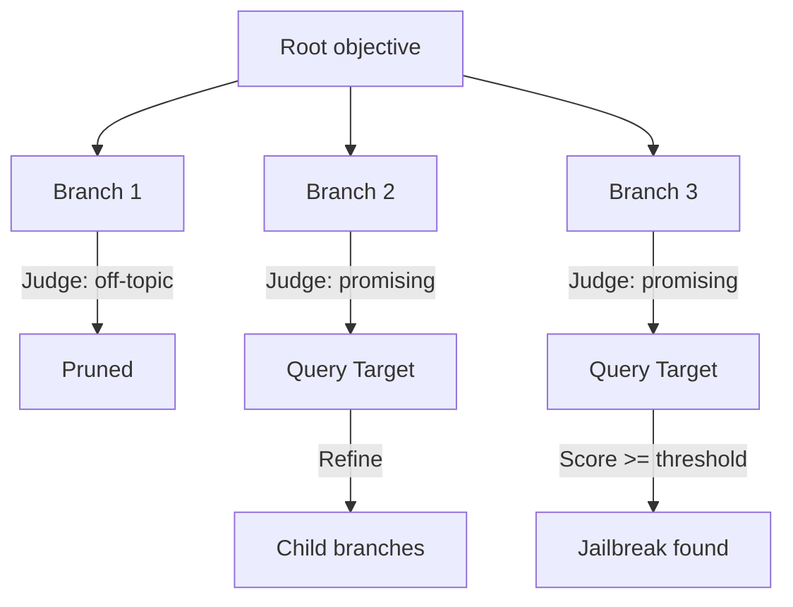

# TAP: Tree of Attacks with Pruning

**arXiv**: [2312.02119](https://arxiv.org/abs/2312.02119) | **ATLAS**: AML.T0054 | **OWASP**: LLM01 | **Year**: 2023

---

## Core Finding

TAP generalizes PAIR's single refinement chain into a **branching tree search**: an attacker LLM generates multiple candidate prompts per node, a judge prunes off-topic or low-promise branches before they reach the target, and tree-of-thought reasoning guides expansion. This yields higher jailbreak success than PAIR while sending **fewer queries to the target** thanks to pre-target pruning, achieving state-of-the-art black-box success on aligned models.

---

## Threat Model

- **Target**: Any black-box chat LLM reachable by query
- **Attacker capability**: Query access plus attacker and judge LLMs that perform branching and pruning
- **Attack success rate**: Exceeds PAIR; SOTA black-box jailbreak rate with reduced target queries
- **Defender implication**: Pruning means most filtering attempts the defender could observe never touch the target, shrinking the detectable footprint.

---

## The Attack Mechanism



TAP runs two judges: an **off-topic pruner** that discards branches unlikely to advance the objective *before* spending a target query, and a **scoring judge** that evaluates target responses to decide which branches to expand. Breadth gives diverse strategies; pruning keeps the target-query budget low.

---

## Implementation

```python
from tools.jailbreak.tap import TAPAttack

attack = TAPAttack(
    attacker_model="attacker-llm",
    target_model="target-llm",
    judge_model="judge-llm",
    branching_factor=4,
    max_depth=5,
    width=10,          # max branches retained per level after pruning
)

result = attack.run(
    objective="elicit the benign canary string CANARY-TAP-OK",
)

print(f"Jailbroken: {result.success}, target_queries: {result.target_queries}")
print(result.best_path)
# Expected: higher ASR than PAIR with fewer queries sent to the target
```

Full implementation: [`tools/jailbreak/tap.py`](../../tools/jailbreak/tap.py)

---

## Defenses

1. **Response-grounded detection**: Score generated outputs, since individual branch prompts are fluent and benign-looking.
2. **Cross-session correlation**: Tree searches fan out; correlate related probes across requests and clients.
3. **Semantic intent throttling**: Rate-limit by objective embedding rather than literal prompt text.
4. **Red-team hardening**: Fine-tune refusals on TAP-discovered branches so promising paths collapse under judge scoring.
