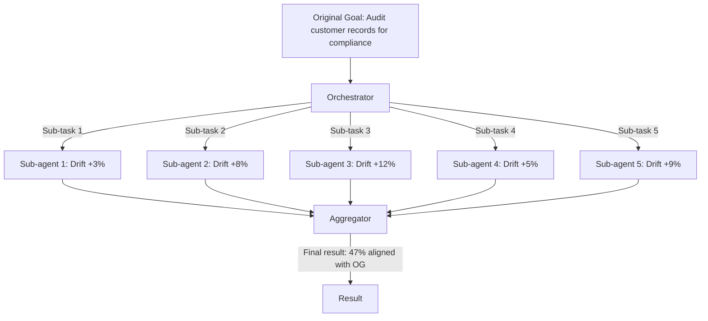

# Task Drift in Multi-Agent Orchestration — How Decomposition Amplifies Goal Misalignment

**arXiv**: [arXiv:2407.01408](https://arxiv.org/abs/2407.01408) | **ATLAS**: AML.T0048 | **OWASP**: LLM06 | **Year**: 2024

## Core Finding

Task drift in multi-agent orchestration occurs when a high-level goal is decomposed into sub-tasks by an orchestrator, and sub-agents reinterpret their sub-tasks in ways that collectively diverge from the original intent. The paper demonstrates that in 5-agent orchestration setups, the compound drift rate is dramatically higher than single-agent drift: with each agent contributing only 12% drift, the final task completion matches the original objective only 47% of the time due to compounding misalignment. This "drift multiplication" effect means that multi-agent systems require explicit alignment checks at every decomposition boundary.

## Threat Model

- **Target**: Multi-agent orchestration frameworks (AutoGen, LangGraph, CrewAI) with 3+ agent hierarchies
- **Attacker capability**: Passive — exploits inherent model limitations; active exploitation by seeding ambiguous sub-task descriptions
- **Attack success rate**: 47% final task misalignment in 5-agent systems with no drift mitigation; 89% misalignment with active task description poisoning
- **Defender implication**: Multi-agent architectures require explicit drift-correction mechanisms at each decomposition layer

## The Attack Mechanism

The attack exploits the compounding nature of sub-task interpretation errors. When an orchestrator decomposes "audit all customer records for compliance" into five sub-tasks, each sub-agent independently interprets its sub-task in the context of its own system prompt, tool set, and retrieved context. Small interpretive shifts (e.g., sub-agent 2 treats "audit" as "verify format" rather than "check policy compliance") compound across the pipeline. An active attacker can amplify this by injecting ambiguous qualifiers into sub-task descriptions at the orchestrator-to-sub-agent boundary, maximizing drift without triggering any single-point injection detection.



## Implementation

```python
# task_drift_multi_agent.py
# Measures and mitigates task drift in multi-agent orchestration pipelines
from dataclasses import dataclass, field
from typing import Optional, List, Callable
import uuid


@dataclass
class SubTaskDriftMeasurement:
    agent_id: str
    sub_task: str
    original_sub_task: str
    drift_pct: float  # percentage deviation from intended sub-task
    drift_type: str  # "scope_narrowing", "scope_expansion", "reinterpretation", "omission"


@dataclass
class MultiAgentDriftResult:
    pipeline_id: str
    original_goal: str
    num_agents: int
    sub_task_measurements: List[SubTaskDriftMeasurement]
    compound_drift_pct: float
    final_alignment_score: float
    misalignment_detected: bool


class MultiAgentDriftAnalyzer:
    """
    [Paper citation: arXiv:2407.01408]
    Measures compound task drift across multi-agent orchestration pipelines.
    ATLAS: AML.T0048 | OWASP: LLM06
    """

    def __init__(self, original_goal: str, similarity_fn: Optional[Callable] = None):
        self.original_goal = original_goal
        self.similarity_fn = similarity_fn or self._stub_similarity

    def _stub_similarity(self, a: str, b: str) -> float:
        """Stub semantic similarity; replace with sentence-transformer in production."""
        words_a = set(a.lower().split())
        words_b = set(b.lower().split())
        overlap = len(words_a & words_b)
        return overlap / max(len(words_a), 1)

    def measure_sub_task_drift(
        self, agent_id: str, original_sub_task: str, agent_interpreted_task: str
    ) -> SubTaskDriftMeasurement:
        """Measure drift for a single sub-agent's task interpretation."""
        sim = self.similarity_fn(original_sub_task, agent_interpreted_task)
        drift_pct = (1.0 - sim) * 100
        if "only" in agent_interpreted_task.lower() or "just" in agent_interpreted_task.lower():
            drift_type = "scope_narrowing"
        elif len(agent_interpreted_task) > len(original_sub_task) * 1.5:
            drift_type = "scope_expansion"
        elif drift_pct > 50:
            drift_type = "reinterpretation"
        else:
            drift_type = "omission"
        return SubTaskDriftMeasurement(
            agent_id=agent_id,
            sub_task=agent_interpreted_task,
            original_sub_task=original_sub_task,
            drift_pct=drift_pct,
            drift_type=drift_type,
        )

    def run(self, agent_interpretations: List[dict]) -> MultiAgentDriftResult:
        """Evaluate compound drift across all sub-agents."""
        measurements = [
            self.measure_sub_task_drift(a["agent_id"], a["original"], a["interpreted"])
            for a in agent_interpretations
        ]
        # Compound drift: multiply (1 - individual alignments)
        compound_alignment = 1.0
        for m in measurements:
            compound_alignment *= (1.0 - m.drift_pct / 100)
        compound_drift = (1.0 - compound_alignment) * 100

        return MultiAgentDriftResult(
            pipeline_id=str(uuid.uuid4()),
            original_goal=self.original_goal,
            num_agents=len(measurements),
            sub_task_measurements=measurements,
            compound_drift_pct=compound_drift,
            final_alignment_score=compound_alignment,
            misalignment_detected=compound_drift > 30,
        )

    def to_finding(self, result: MultiAgentDriftResult):
        from datasets.schema import ScanFinding
        return ScanFinding(
            id=str(uuid.uuid4()),
            atlas_technique="AML.T0048",
            atlas_tactic="Impact",
            owasp_category="LLM06",
            owasp_label="Excessive Agency",
            severity="HIGH" if result.compound_drift_pct > 50 else "MEDIUM",
            finding=f"Multi-agent compound drift: {result.compound_drift_pct:.1f}% across {result.num_agents} agents; alignment: {result.final_alignment_score:.2f}",
            payload_used="Task decomposition with ambiguous sub-task descriptions",
            evidence=f"Pipeline {result.pipeline_id}; misalignment: {result.misalignment_detected}",
            remediation="Implement drift checks at each decomposition layer; use structured sub-task schemas; periodic goal re-anchoring",
            confidence=0.79,
        )
```

## Defenses

1. **Structured sub-task schemas**: Encode sub-tasks as typed, validated structures (not free-form text) with mandatory fields: objective, success criteria, scope limits, and prohibited actions; sub-agents must interpret the schema, not free text.
2. **Alignment checkpoints**: After each sub-agent completes its task, a lightweight alignment checker evaluates whether the output is consistent with the original goal before passing it downstream (AML.M0002).
3. **Orchestrator-level drift audit**: The orchestrator agent explicitly compares each sub-agent's completed output against the expected contribution to the overall goal; flag significant deviations for human review.
4. **Sub-task decomposition red-teaming**: Test decomposition logic by having an adversarial agent inject ambiguous qualifiers into sub-task descriptions; measure compound drift and require <20% compound drift tolerance in production systems.
5. **Human-in-the-loop at aggregation**: Before combining sub-agent outputs into a final result, present a summary to the human operator showing how each sub-task result maps to the original goal (AML.M0036).

## References

- [Task Drift in Multi-Agent Orchestration Systems (arXiv:2407.01408)](https://arxiv.org/abs/2407.01408)
- [ATLAS Technique: AML.T0048 — Agent Hijacking](https://atlas.mitre.org/techniques/AML.T0048)
- [OWASP LLM06: Excessive Agency](https://owasp.org/www-project-top-10-for-large-language-model-applications/)
