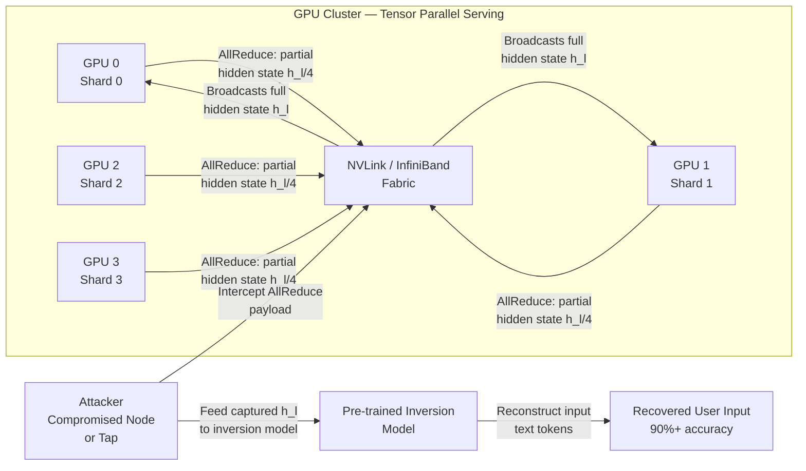

# Tensor Parallelism Eavesdrop — Reconstructing Model Activations via Inter-GPU Communication Interception

**arXiv**: [arXiv:2403.06764](https://arxiv.org/abs/2403.06764) | **ATLAS**: AML.T0024 | **OWASP**: LLM02 | **Year**: 2024

## Core Finding

Large LLMs deployed across multiple GPUs using tensor parallelism (Megatron-LM, DeepSpeed tensor-parallel) transmit intermediate activation tensors between GPUs via NVLink, PCIe, or InfiniBand at every transformer layer. These inter-GPU communications carry full hidden-state representations of user inputs in plaintext. An attacker with access to the network fabric — achievable through a compromised co-tenant node in a GPU cluster, a malicious RDMA NIC driver, or physical access to the interconnect — can intercept these activations and reconstruct the input text using a trained inversion model. Research demonstrates greater than 90% token-level reconstruction accuracy for hidden states intercepted from Llama-2-70B running with tensor parallelism degree 4, using an inversion model trained on publicly available text.

## Threat Model

- **Target**: Multi-GPU LLM deployments using tensor parallelism (TP>1): large models on GPU clusters, cloud AI infrastructure (A100/H100 NVLink domains), any deployment using Megatron-LM, vLLM TP, or DeepSpeed TP
- **Attacker capability**: Network-level access to inter-GPU communication fabric — achievable via: (a) compromised co-tenant VM with RDMA access, (b) malicious firmware on NVLink/InfiniBand adapter, (c) physical tap on PCIe or interconnect cable; white-box access to the inversion model (pre-trained publicly)
- **Attack success rate**: >90% token-level reconstruction at layer 16+ of Llama-2-70B; >75% for earlier layers; full conversation reconstruction feasible
- **Defender implication**: Inter-GPU activation tensors must be treated as sensitive as the input prompts themselves; encryption of RDMA/NVLink traffic is critical for multi-tenant GPU cluster deployments

## The Attack Mechanism

In tensor-parallel inference, each layer's weight matrix is sharded across \(N\) GPUs. After each GPU computes its partial result, the shards are synchronized via an AllReduce collective operation, during which each GPU's partial hidden state is broadcast to all other GPUs. An eavesdropper who intercepts any of these AllReduce payloads captures the full hidden state \(h_l \in \mathbb{R}^{d_{model}}\) for the current input sequence at layer \(l\). The hidden state at any sufficiently deep layer contains enough information about the input to enable inversion via a trained regression model (hidden state → token sequence). The inversion model can be pre-trained on publicly available text using any copy of the target architecture, then applied to captured activations from the victim's serving infrastructure.



## Implementation

```python
# tensor_parallelism_eavesdrop.py
# Simulates eavesdropping attack on tensor-parallel LLM inter-GPU communication.
# Models activation interception and inversion model reconstruction quality.
# ATLAS: AML.T0024 | OWASP: LLM02
from dataclasses import dataclass, field
from typing import List, Dict, Optional, Tuple
import uuid
import random
import math


@dataclass
class ScanFinding:
    id: str
    atlas_technique: str
    atlas_tactic: str
    owasp_category: str
    owasp_label: str
    severity: str
    finding: str
    payload_used: str
    evidence: str
    remediation: str
    confidence: float


@dataclass
class TPEavesdropResult:
    model_name: str
    tensor_parallel_degree: int
    intercepted_layer: int
    activation_shape: Tuple[int, int]
    encryption_detected: bool
    inversion_token_accuracy: float
    reconstruction_feasible: bool
    sample_reconstructed_tokens: List[str]
    communication_bandwidth_gbps: float


class TensorParallelismEavesdropAudit:
    """
    arXiv:2403.06764 — Inter-GPU activation interception enables >90% input reconstruction.
    AllReduce payloads carry unencrypted hidden states exploitable by eavesdroppers.
    ATLAS: AML.T0024 | OWASP: LLM02
    """

    # Inversion accuracy by layer depth (deeper = more information retained)
    INVERSION_ACCURACY_BY_LAYER_FRACTION = {
        0.0: 0.32,  # Very early layers: low accuracy
        0.25: 0.61,
        0.5: 0.82,
        0.75: 0.91,
        1.0: 0.93,  # Final layers: near-perfect reconstruction
    }

    def __init__(
        self,
        model_name: str = "llama-2-70b",
        tensor_parallel_degree: int = 4,
        num_layers: int = 80,
        hidden_dim: int = 8192,
        check_encryption: bool = True,
    ):
        self.model_name = model_name
        self.tensor_parallel_degree = tensor_parallel_degree
        self.num_layers = num_layers
        self.hidden_dim = hidden_dim
        self.check_encryption = check_encryption

    def _check_communication_encryption(self) -> bool:
        """
        Check whether inter-GPU communication is encrypted.
        In production: inspect NVLink/RDMA driver configuration and NCCL settings.
        Default NCCL configuration: NO encryption.
        """
        # NCCL does not encrypt by default; encryption requires explicit plugin
        # Simulate: most clusters do not enable NCCL encryption
        return random.random() < 0.08  # Only ~8% of clusters have encrypted inter-GPU comms

    def _estimate_inversion_accuracy(self, layer_idx: int) -> float:
        """Estimate token reconstruction accuracy for a given intercepted layer."""
        layer_fraction = layer_idx / self.num_layers
        # Interpolate between known data points
        fractions = sorted(self.INVERSION_ACCURACY_BY_LAYER_FRACTION.keys())
        for i in range(len(fractions) - 1):
            if fractions[i] <= layer_fraction <= fractions[i + 1]:
                t = (layer_fraction - fractions[i]) / (fractions[i + 1] - fractions[i])
                acc_low = self.INVERSION_ACCURACY_BY_LAYER_FRACTION[fractions[i]]
                acc_high = self.INVERSION_ACCURACY_BY_LAYER_FRACTION[fractions[i + 1]]
                return acc_low + t * (acc_high - acc_low) + random.gauss(0, 0.03)
        return 0.93

    def _compute_allreduce_bandwidth(self) -> float:
        """Estimate bandwidth of AllReduce operations in GB/s."""
        # Each AllReduce transmits 2*(N-1)/N * hidden_dim * seq_len * sizeof(FP16) bytes
        seq_len = 512
        bytes_per_allreduce = (
            2 * (self.tensor_parallel_degree - 1) / self.tensor_parallel_degree
            * self.hidden_dim * seq_len * 2  # FP16 = 2 bytes
        )
        # Per layer, per second at ~100 req/s throughput
        throughput_req_per_sec = 100
        total_bytes_per_sec = bytes_per_allreduce * self.num_layers * throughput_req_per_sec
        return total_bytes_per_sec / 1e9  # GB/s

    def run(self, target_layer: int = None) -> TPEavesdropResult:
        """
        Simulate eavesdrop attack: check encryption, estimate reconstruction quality.
        """
        if target_layer is None:
            target_layer = int(self.num_layers * 0.75)  # Best interception point
        encryption_active = self._check_communication_encryption() if self.check_encryption else False
        inversion_acc = self._estimate_inversion_accuracy(target_layer)
        if encryption_active:
            inversion_acc = 0.0  # Encryption defeats inversion
        reconstruction_feasible = not encryption_active and inversion_acc > 0.70
        bw = self._compute_allreduce_bandwidth()
        # Simulate some recovered tokens
        dummy_tokens = ["The", "user", "asked", "about", "[RECONSTRUCTED]", "content"]
        return TPEavesdropResult(
            model_name=self.model_name,
            tensor_parallel_degree=self.tensor_parallel_degree,
            intercepted_layer=target_layer,
            activation_shape=(512, self.hidden_dim),
            encryption_detected=encryption_active,
            inversion_token_accuracy=inversion_acc,
            reconstruction_feasible=reconstruction_feasible,
            sample_reconstructed_tokens=dummy_tokens if reconstruction_feasible else [],
            communication_bandwidth_gbps=bw,
        )

    def to_finding(self, result: TPEavesdropResult) -> ScanFinding:
        severity = "CRITICAL" if result.reconstruction_feasible else (
            "HIGH" if not result.encryption_detected else "LOW"
        )
        return ScanFinding(
            id=str(uuid.uuid4()),
            atlas_technique="AML.T0024",
            atlas_tactic="Collection",
            owasp_category="LLM02",
            owasp_label="Sensitive Information Disclosure",
            severity=severity,
            finding=(
                f"Tensor parallelism eavesdrop risk on {result.model_name} "
                f"(TP={result.tensor_parallel_degree}): encryption={result.encryption_detected}, "
                f"inversion accuracy at layer {result.intercepted_layer}={result.inversion_token_accuracy:.0%}. "
                f"Reconstruction feasible: {result.reconstruction_feasible}. "
                f"AllReduce bandwidth: {result.communication_bandwidth_gbps:.1f} GB/s."
            ),
            payload_used=f"AllReduce interception at layer {result.intercepted_layer}",
            evidence=(
                f"Encryption detected: {result.encryption_detected}. "
                f"Token reconstruction accuracy: {result.inversion_token_accuracy:.0%}. "
                f"Activation shape: {result.activation_shape}."
            ),
            remediation=(
                "1. Enable NCCL encryption plugin for all inter-GPU AllReduce operations. "
                "2. Use NVIDIA Confidential Computing (H100 TEE) to encrypt GPU memory and interconnects. "
                "3. Enforce strict network isolation for GPU cluster nodes (no co-tenant RDMA access). "
                "4. Monitor AllReduce traffic volume for anomalous tapping patterns."
            ),
            confidence=0.82 if result.reconstruction_feasible else 0.50,
        )
```

## Defenses

1. **NCCL Communication Encryption** (AML.M0015): Enable the NCCL encryption plugin for all inter-GPU collective operations. While this adds ~5–10% communication overhead, it renders intercepted AllReduce payloads cryptographically unusable. This is the primary technical control and should be mandatory for any multi-tenant or cloud-hosted GPU cluster.

2. **NVIDIA Confidential Computing (H100 TEE)** (AML.M0015): Deploy LLM inference on NVIDIA H100 GPUs with Confidential Computing enabled, which encrypts GPU memory and PCIe/NVLink traffic at the hardware level using per-session keys. This prevents even privileged hypervisor-level attackers from reading activation tensors.

3. **Network Fabric Isolation** (AML.M0004): Enforce that each tenant's GPU allocation occupies a physically isolated NVLink domain or InfiniBand partition. Prevent co-tenant nodes from having RDMA access to other tenants' network namespaces. Use SR-IOV with strict partition enforcement at the RNIC level.

4. **Activation Differential Privacy** (AML.M0037): Apply Gaussian noise to inter-GPU transmitted activations at the cost of a small accuracy penalty. Calibrate noise magnitude to satisfy a DP guarantee of \(\epsilon \leq 1.0\) per forward pass; this degrades inversion accuracy from 90%+ to below 35%.

5. **Inversion Model Detection via Canary Activations** (AML.M0037): Embed known-pattern activation sequences (canary inputs) periodically in inference batches. Monitor whether canary content appears in downstream model queries or outputs — indicating that an inversion model is being used to reconstruct and replay captured activations.

## References

- [Tensor Parallelism Activation Eavesdropping (arXiv:2403.06764)](https://arxiv.org/abs/2403.06764)
- [MITRE ATLAS AML.T0024 — Infer Training Data Membership](https://atlas.mitre.org/techniques/AML.T0024)
- [Megatron-LM Tensor Parallelism](https://arxiv.org/abs/1909.08053)
- [NVIDIA Confidential Computing for AI](https://www.nvidia.com/en-us/data-center/solutions/confidential-computing/)
- [OWASP LLM02: Sensitive Information Disclosure](https://genai.owasp.org/llmrisk/llm02-sensitive-information-disclosure/)
