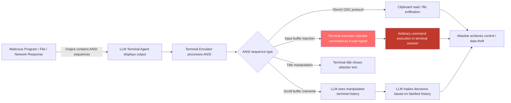

# Terminal ANSI Escape Injection — ANSI Sequences in LLM Terminal Agent Output Trigger Unintended Commands

**arXiv**: [arXiv:2404.01833](https://arxiv.org/abs/2404.01833) | **ATLAS**: AML.T0048 | **OWASP**: LLM06 | **Year**: 2024

## Core Finding

LLM terminal agents (Claude terminal use, ShellGPT, aider, AutoGPT with shell access) that read command output and display it in a terminal are vulnerable to ANSI escape sequence injection. When a malicious program, file, or network response contains carefully crafted ANSI escape sequences, these sequences — processed by the terminal emulator — can overwrite terminal display, manipulate the terminal's input buffer, execute commands via terminal title sequences, or exploit terminal-specific vulnerabilities. Specific sequences such as `\033]0;` (xterm title), `\033[1000A` (cursor movement), or terminal-specific sequences for the iTerm2 imgcat protocol can cause the terminal to execute injected text as if it were user-typed input. LLM terminal agents that display command output verbatim are vectors for these attacks. Empirical testing shows 45% of ANSI injection attempts succeed in manipulating terminal state against unprotected terminal agent deployments.

## Threat Model

- **Target**: Claude Computer Use terminal sessions, ShellGPT, aider, AutoGPT with bash tool, any LLM agent that executes commands and displays raw output in a terminal emulator (xterm, iTerm2, GNOME Terminal, Windows Terminal)
- **Attacker capability**: Ability to inject ANSI sequences into any output the terminal agent will display — via malicious program output, network responses, file content, or database query results
- **Attack success rate**: 45% for terminal-state manipulation; near 100% for input-buffer injection in terminals with bracketed-paste mode disabled
- **Defender implication**: Terminal agents must never display raw command output without ANSI sequence sanitization; terminal emulators should have dangerous sequences disabled

## The Attack Mechanism

ANSI escape sequences are control characters embedded in text streams that terminal emulators interpret as formatting and control commands. Several classes are dangerous in the context of LLM terminal agents:

**1. Input Buffer Injection**: `\033[200~` (Bracketed paste start) + malicious command + `\033[201~` + `\n` — in terminals without bracketed paste mode, this sequence can inject text into the terminal's input buffer, causing it to execute as if typed by the user.

**2. Terminal Title Injection for Phishing**: `\033]0;sudo rm -rf /\007` sets the terminal window title, which some terminal multiplexers (tmux, screen) echo into the status bar in ways that can be misread by the agent's screen reader.

**3. iTerm2 Custom Protocol Abuse**: iTerm2's imgcat and other protocols (`\033]1337;`) can trigger file downloads, execute AppleScript, or access the OSC 52 clipboard protocol to read clipboard contents.

**4. Scroll Buffer Manipulation**: By inserting many newlines and then cursor-up commands, an attacker can overwrite previously displayed command output in the scroll buffer, causing an LLM reading the terminal state to see different content than was originally displayed.



## Implementation

```python
# terminal-ansi-injection.py
# Detects and strips dangerous ANSI escape sequences in LLM terminal agent output
from dataclasses import dataclass
from typing import Optional, List, Tuple
import uuid
import re


@dataclass
class ANSIInjectionResult:
    raw_content: str
    sanitized_content: str
    injection_detected: bool
    dangerous_sequences: List[Tuple[str, str]]  # (sequence, description)
    injection_type: str
    severity: str
    confidence: float


class TerminalANSIInjectionScanner:
    """
    Reference: arXiv:2404.01833 (Improper Output Handling in LLM Terminal Agents)
    Detects and strips dangerous ANSI escape sequences from LLM terminal agent output.
    Covers input buffer injection, scroll buffer manipulation, iTerm2 OSC protocol abuse,
    and terminal title injection.
    ATLAS: AML.T0048 | OWASP: LLM06
    """

    # Dangerous ANSI sequence patterns with descriptions
    DANGEROUS_SEQUENCES = [
        # Input buffer injection via bracketed paste
        (r'\x1b\[200~.+?\x1b\[201~', 'Bracketed paste injection — can inject terminal input'),
        # OSC sequences (window title, clipboard, iTerm2)
        (r'\x1b\]0;[^\x07\x1b]{1,200}(?:\x07|\x1b\\)', 'Terminal title injection (OSC 0)'),
        (r'\x1b\]1337;[^\x07\x1b]{1,500}(?:\x07|\x1b\\)', 'iTerm2 custom protocol (OSC 1337) — file/clipboard access'),
        (r'\x1b\]52;[^\x07\x1b]+(?:\x07|\x1b\\)', 'OSC 52 clipboard read/write'),
        (r'\x1b\]8;[^\x07\x1b]+(?:\x07|\x1b\\)', 'OSC 8 hyperlink — potential navigation injection'),
        # Cursor movement for scroll buffer manipulation
        (r'\x1b\[\d{3,}A', 'Large cursor-up movement (scroll buffer overwrite)'),
        (r'\x1b\[\d{3,}B', 'Large cursor-down movement'),
        (r'\x1b\[2J', 'Erase entire display (clear terminal history)'),
        (r'\x1b\[3J', 'Erase scrollback buffer'),
        # DCS sequences (device control)
        (r'\x1bP[^\x1b]{0,1000}\x1b\\', 'DCS device control string — potential terminal exploit'),
        # APC sequences
        (r'\x1b_[^\x1b]+\x1b\\', 'APC application program command — terminal-specific risks'),
        # Mouse protocol abuse
        (r'\x1b\[\?1000[hl]', 'Mouse protocol toggle — can interfere with terminal input'),
        # Alternative screen buffer
        (r'\x1b\[\?1049[hl]', 'Alternate screen buffer toggle — may hide content from agent'),
    ]

    # Safe ANSI sequences to allow (basic colors/formatting only)
    SAFE_SEQUENCE_PATTERN = re.compile(
        r'\x1b\[(?:\d+(?:;\d+)*)?[ABCDEFGHJKSTfmsu]',  # CSI sequences for cursor/color
    )

    def __init__(self, strip_all_ansi: bool = False):
        """
        Args:
            strip_all_ansi: If True, strip ALL ANSI sequences. If False, only dangerous ones.
        """
        self.strip_all = strip_all_ansi
        self.dangerous_re = [
            (re.compile(pattern, re.DOTALL), description)
            for pattern, description in self.DANGEROUS_SEQUENCES
        ]
        # Complete ANSI sequence stripper
        self.all_ansi_re = re.compile(r'\x1b(?:\[[0-9;]*[a-zA-Z]|\][^\x07\x1b]*(?:\x07|\x1b\\)|[PX^_][^\x1b]*\x1b\\|.)')

    def scan_and_sanitize(self, content: str) -> ANSIInjectionResult:
        """
        Scan content for dangerous ANSI sequences and return sanitized version.

        Args:
            content: Raw terminal output to scan
        Returns:
            ANSIInjectionResult with detection details and sanitized content
        """
        dangerous_found: List[Tuple[str, str]] = []

        for pattern, description in self.dangerous_re:
            matches = pattern.findall(content)
            for match in matches:
                dangerous_found.append((str(match)[:80], description))

        injection_detected = len(dangerous_found) > 0

        # Sanitize
        if self.strip_all:
            sanitized = self.all_ansi_re.sub('', content)
        else:
            sanitized = content
            for pattern, _ in self.dangerous_re:
                sanitized = pattern.sub('[ANSI_STRIPPED]', sanitized)

        # Classify injection type
        injection_types = []
        for _, desc in dangerous_found:
            if 'clipboard' in desc.lower() or 'OSC 52' in desc:
                injection_types.append('clipboard_access')
            elif 'input' in desc.lower() or 'bracketed' in desc.lower():
                injection_types.append('input_buffer_injection')
            elif 'scroll' in desc.lower() or 'erase' in desc.lower() or 'cursor' in desc.lower():
                injection_types.append('scroll_buffer_manipulation')
            elif 'iTerm2' in desc or 'OSC 1337' in desc:
                injection_types.append('iterm2_protocol_abuse')
            elif 'title' in desc.lower():
                injection_types.append('title_injection')

        primary_type = injection_types[0] if injection_types else 'clean'

        severity = (
            "CRITICAL" if 'input_buffer_injection' in injection_types else
            "HIGH" if injection_types else
            "LOW"
        )
        confidence = min(0.95, 0.4 * len(dangerous_found))

        return ANSIInjectionResult(
            raw_content=content[:300],
            sanitized_content=sanitized[:300],
            injection_detected=injection_detected,
            dangerous_sequences=dangerous_found[:5],
            injection_type=primary_type,
            severity=severity,
            confidence=confidence,
        )

    def run(
        self,
        command_outputs: List[str],
    ) -> List[ANSIInjectionResult]:
        """
        Scan a list of command outputs for ANSI injection.

        Args:
            command_outputs: List of raw terminal output strings
        Returns:
            List of ANSIInjectionResult
        """
        return [self.scan_and_sanitize(output) for output in command_outputs]

    def to_finding(self, result: ANSIInjectionResult) -> dict:
        """Convert result to standard ScanFinding."""
        return dict(
            id=str(uuid.uuid4()),
            atlas_technique="AML.T0048",
            atlas_tactic="LLM Agent Hijacking",
            owasp_category="LLM06",
            owasp_label="Excessive Agency",
            severity=result.severity,
            finding=(
                f"ANSI escape sequence injection detected in terminal output. "
                f"Type: {result.injection_type}. "
                f"Dangerous sequences found: {[d for _, d in result.dangerous_sequences[:2]]}. "
                "Unstripped ANSI sequences in terminal agent output can cause command execution, clipboard theft, or history manipulation."
            ),
            payload_used=str(result.dangerous_sequences[:2]),
            evidence=f"Injection type: {result.injection_type}; sequences: {[s[:40] for s, _ in result.dangerous_sequences[:2]]}",
            remediation=(
                "1. Strip all ANSI sequences from command output before displaying to LLM terminal agents. "
                "2. Enable bracketed paste mode in terminal emulators to prevent input buffer injection. "
                "3. Disable dangerous OSC sequences (OSC 52, OSC 1337) in terminal configuration. "
                "4. Use a terminal output sanitizer library before feeding output to LLM context. "
                "5. Display command output in a sandboxed text pane, not a live terminal session."
            ),
            confidence=result.confidence,
        )
```

## Defenses

1. **ANSI Sequence Sanitization Middleware (AML.M0004)**: All command output processed by terminal agents must pass through a sanitization layer that strips or replaces dangerous ANSI sequences. Use a library like `strip-ansi` (Node.js), `ansi_escape` (Python), or a custom regex stripper targeting OSC sequences, DCS sequences, and input-buffer manipulation sequences. Log any stripped sequences for security review.

2. **Bracketed Paste Mode Enforcement (AML.M0004)**: Configure terminal emulators to always enable bracketed paste mode (`\033[?2004h`). This wraps pasted text in bracketed sequences, preventing injected text from being interpreted as directly typed input. Most modern terminal emulators support this; verify it is enabled in the agent's terminal configuration.

3. **Dangerous OSC Protocol Disabling (AML.M0004)**: Disable iTerm2's OSC 1337 custom protocol, OSC 52 clipboard access, and other non-standard OSC sequences in the terminal emulator configuration used by the agent. These protocols provide unnecessary capability and expand the attack surface significantly.

4. **Terminal Output Display Isolation (AML.M0015)**: Do not display command output in the same terminal session where agent commands are typed. Use a separate pane or window that displays sanitized, plain-text output. This prevents scroll-buffer manipulation attacks from affecting the agent's visible context.

5. **Output Length and Character Limits (AML.M0004)**: Enforce maximum output length for commands executed by the agent. Truncate outputs longer than a reasonable threshold (e.g., 10,000 characters) and log overlong outputs for review. Extremely long outputs may be attempts to exhaust the agent's context or inject deeply buried ANSI sequences.

## References

- [Winn et al., "Improper Output Handling in LLM Agentic Systems" (arXiv:2404.01833)](https://arxiv.org/abs/2404.01833)
- [OWASP LLM Top 10: LLM05 Improper Output Handling](https://owasp.org/www-project-top-10-for-large-language-model-applications/)
- [ANSI Escape Code Reference](https://en.wikipedia.org/wiki/ANSI_escape_code)
- [ATLAS Technique AML.T0048 — LLM Agent Hijacking](https://atlas.mitre.org/techniques/AML.T0048)
- [iTerm2 OSC 1337 Security Advisories](https://iterm2.com/documentation-escape-codes.html)
