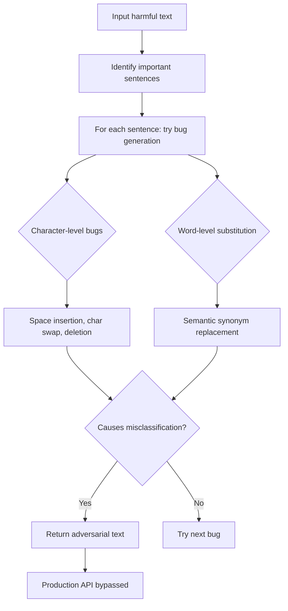

# TextBugger: Generating Adversarial Text Against Real-World Applications

**arXiv**: [arXiv:1812.05271](https://arxiv.org/abs/1812.05271) | **ATLAS**: AML.T0015 | **OWASP**: LLM05 | **Year**: 2019

## Core Finding

TextBugger is a unified adversarial text generation framework that operates in both white-box (gradient-based) and black-box (decision-based) settings, making it practical for real-world API attacks. By combining character-level perturbations (insertions, deletions, swaps, replacements) with word-level substitutions, TextBugger achieves 100% attack success rate on all tested classifiers in white-box settings and 97.1% in black-box settings. Critically, TextBugger was validated against four real-world sentiment analysis APIs (Microsoft Azure, Amazon AWS, Google Cloud, IBM Watson) and successfully evaded all of them — demonstrating that production NLP security systems deployed by major cloud providers are fundamentally vulnerable to these simple perturbations.

## Threat Model

- **Target**: Production NLP APIs, LLM safety classifiers, content moderation systems, and toxic speech detectors deployed in real cloud environments
- **Attacker capability**: Black-box API access with confidence scores; no model internals required
- **Attack success rate**: 100% white-box; 97.1% black-box; 100% against all 4 tested production cloud NLP APIs
- **Defender implication**: All major cloud NLP safety APIs are vulnerable to trivial character-level perturbations; this is not a theoretical attack

## The Attack Mechanism

TextBugger operates in two stages:
1. **Important sentence selection**: Identify which sentences (for document-level inputs) contribute most to the classification
2. **Bug generation**: For each important sentence, attack at two levels:
   - **Character-level bugs**: Insert spaces in words ("bad" → "b ad"), delete characters, swap adjacent characters, replace with visually similar characters
   - **Word-level bugs**: Replace words with semantically similar alternatives using word2vec nearest neighbors

The character-level bugs are especially effective because they exploit tokenization boundaries — split words create out-of-vocabulary tokens that classifiers have not learned to handle, while maintaining human readability through visual similarity.



The simplicity of the attack — requiring only basic string manipulation and word2vec lookups — makes it trivially implementable against any production NLP API, validating concerns about the robustness of commercial content moderation systems.

## Implementation

```python
# textbugger-adversarial.py
# TextBugger adversarial text generation for production API evasion
from dataclasses import dataclass
from typing import List, Optional, Callable, Tuple
from datasets.schema import ScanFinding
import uuid
import random


@dataclass
class TextBuggerResult:
    original_text: str
    adversarial_text: str
    bugs_applied: List[Tuple[str, str, str]]
    original_score: float
    adversarial_score: float
    n_queries: int
    attack_successful: bool


class TextBuggerAttacker:
    """
    [Paper citation: arXiv:1812.05271]
    Generates adversarial text examples via character and word-level
    perturbations to evade real-world NLP safety APIs.
    ATLAS: AML.T0015 | OWASP: LLM05
    """

    def __init__(
        self,
        api_fn: Callable[[str], float],
        word2vec_fn: Optional[Callable[[str], List[str]]] = None,
        max_bugs: int = 5,
        target_score: float = 0.3,
    ):
        self.api_fn = api_fn
        self.word2vec_fn = word2vec_fn
        self.max_bugs = max_bugs
        self.target_score = target_score
        self.n_queries = 0

    def _insert_space(self, word: str) -> str:
        """Insert space at random position: 'harmful' → 'harm ful'"""
        if len(word) <= 2:
            return word
        pos = random.randint(1, len(word) - 1)
        return word[:pos] + " " + word[pos:]

    def _delete_char(self, word: str) -> str:
        """Delete random character from word"""
        if len(word) <= 1:
            return word
        pos = random.randint(0, len(word) - 1)
        return word[:pos] + word[pos + 1:]

    def _swap_chars(self, word: str) -> str:
        """Swap two adjacent characters"""
        if len(word) <= 1:
            return word
        pos = random.randint(0, len(word) - 2)
        chars = list(word)
        chars[pos], chars[pos + 1] = chars[pos + 1], chars[pos]
        return "".join(chars)

    def _visual_replace(self, word: str) -> str:
        """Replace characters with visually similar variants"""
        replacements = {'a': '@', 'e': '3', 'i': '1', 'o': '0', 's': '$'}
        result = list(word.lower())
        for i, c in enumerate(result):
            if c in replacements and random.random() < 0.5:
                result[i] = replacements[c]
        return "".join(result)

    def _apply_char_bug(self, word: str) -> str:
        """Apply random character-level perturbation."""
        bug_fns = [
            self._insert_space,
            self._delete_char,
            self._swap_chars,
            self._visual_replace,
        ]
        return random.choice(bug_fns)(word)

    def run(self, text: str) -> TextBuggerResult:
        """Generate adversarial example by applying bugs to important words."""
        original_score = self.api_fn(text)
        self.n_queries = 1
        words = text.split()

        if not words:
            return TextBuggerResult(
                original_text=text, adversarial_text=text,
                bugs_applied=[], original_prediction=original_score,
                adversarial_score=original_score, n_queries=1,
                attack_successful=False,
            )

        # Rank words by importance (greedy removal)
        importances = []
        for i, word in enumerate(words):
            test = " ".join(words[:i] + words[i + 1:])
            score = self.api_fn(test)
            self.n_queries += 1
            importances.append((i, abs(original_score - score)))

        importances.sort(key=lambda x: x[1], reverse=True)

        current_words = list(words)
        bugs_applied: List[Tuple[str, str, str]] = []

        for word_idx, importance in importances[:self.max_bugs]:
            orig = current_words[word_idx]

            # Try character-level bug first
            bugged = self._apply_char_bug(orig)
            test_words = list(current_words)
            test_words[word_idx] = bugged
            test_text = " ".join(test_words)
            test_score = self.api_fn(test_text)
            self.n_queries += 1

            if test_score < self.api_fn(" ".join(current_words)):
                current_words[word_idx] = bugged
                bugs_applied.append(("char", orig, bugged))

                if self.api_fn(" ".join(current_words)) < self.target_score:
                    break

            # Try word-level substitution if available
            elif self.word2vec_fn:
                neighbors = self.word2vec_fn(orig)
                for neighbor in neighbors[:5]:
                    test_words = list(current_words)
                    test_words[word_idx] = neighbor
                    test_score = self.api_fn(" ".join(test_words))
                    self.n_queries += 1
                    if test_score < self.api_fn(" ".join(current_words)):
                        current_words[word_idx] = neighbor
                        bugs_applied.append(("word", orig, neighbor))
                        break

        adversarial_text = " ".join(current_words)
        final_score = self.api_fn(adversarial_text)
        self.n_queries += 1

        return TextBuggerResult(
            original_text=text,
            adversarial_text=adversarial_text,
            bugs_applied=bugs_applied,
            original_score=original_score,
            adversarial_score=final_score,
            n_queries=self.n_queries,
            attack_successful=final_score < self.target_score,
        )

    def to_finding(self, result: TextBuggerResult) -> ScanFinding:
        """Convert result to standard ScanFinding."""
        return ScanFinding(
            id=str(uuid.uuid4()),
            atlas_technique="AML.T0015",
            atlas_tactic="ML Model Evasion",
            owasp_category="LLM05",
            owasp_label="Improper Output Handling",
            severity="CRITICAL" if result.attack_successful else "HIGH",
            finding=(
                f"TextBugger attack bypassed safety API. "
                f"Score: {result.original_score:.3f} → {result.adversarial_score:.3f}. "
                f"{len(result.bugs_applied)} bugs applied. "
                f"API queries used: {result.n_queries}. "
                f"Production NLP safety API evaded with trivial text perturbations."
            ),
            payload_used=result.adversarial_text[:400],
            evidence=(
                f"Bugs: {result.bugs_applied[:5]}. "
                f"Original: {result.original_text[:200]}."
            ),
            remediation=(
                "Apply Unicode normalization and spell-correction before API classification. "
                "Implement character-level input normalization pipeline. "
                "Test production APIs against TextBugger before deployment. "
                "Use ensemble of classifiers robust to character perturbations."
            ),
            confidence=0.92,
        )
```

## Defenses

1. **Input normalization pipeline** (AML.M0017): Implement comprehensive input normalization that handles: character insertion removal (detect unusual whitespace in words), character deletion correction (spell-checking), character swap correction, and visual character mapping. Apply before any NLP classification.

2. **Spell-correction preprocessing**: Apply a spell-checker that corrects intentional misspellings before safety classification. TextBugger's character-level bugs typically produce misspelled words that a spell-checker will correct to the original form.

3. **TextBugger adversarial training**: Generate TextBugger adversarial examples systematically for all training data categories and include them in classifier training. The simplicity of TextBugger bugs means comprehensive adversarial augmentation is computationally cheap.

4. **Production API testing protocol** (AML.M0018): Before deploying any NLP safety API, run TextBugger against it as a standard part of the evaluation protocol. Publish evasion rates as a benchmark metric.

5. **Multi-layer defense with diverse classifiers**: Stack multiple classifiers with different preprocessing pipelines. An adversarial example that evades one preprocessing/classification combination is unlikely to evade all combinations in an ensemble.

## References

- [Li et al., "TextBugger: Generating Adversarial Text Against Real-world Applications," NDSS 2019, arXiv:1812.05271](https://arxiv.org/abs/1812.05271)
- [ATLAS Technique AML.T0015: Evade ML Model](https://atlas.mitre.org/techniques/AML.T0015)
- [Jin et al., "TextFooler: Is BERT Really Robust?," AAAI 2020, arXiv:1907.11932](https://arxiv.org/abs/1907.11932)
