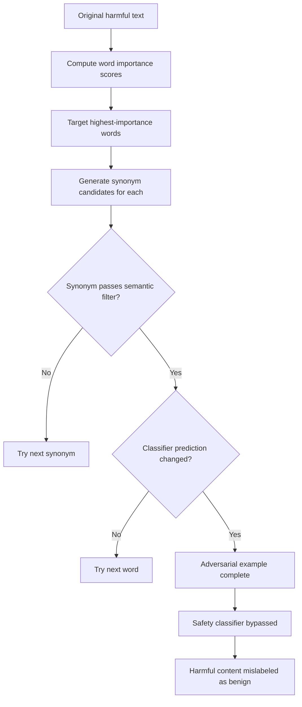

# TextFooler: Adversarial Examples for Text Classification via Word Substitution

**arXiv**: [arXiv:1907.11932](https://arxiv.org/abs/1907.11932) | **ATLAS**: AML.T0015 | **OWASP**: LLM05 | **Year**: 2019

## Core Finding

TextFooler generates adversarial text examples by substituting individual words with semantically similar synonyms that preserve human readability while causing model misclassification. The attack achieves 97% accuracy degradation on BERT, WordLSTM, and CNN text classifiers across sentiment analysis and natural language inference tasks, while maintaining human evaluation scores above 80% for semantic preservation. Applied to LLM safety classifiers, content moderators, and toxic speech detectors, TextFooler can cause systematic misclassification of harmful content as benign by substituting key trigger words with semantically equivalent alternatives that the classifier has not been trained to associate with harmful content.

## Threat Model

- **Target**: Text classification models used as safety filters, content moderators, and toxic speech detectors; also applicable to any NLP-based security system
- **Attacker capability**: Black-box access to the target classifier (only needs confidence scores or binary decisions); requires word importance ranking
- **Attack success rate**: 97% accuracy degradation on BERT-based classifiers; 100% evasion on simpler models with synonym substitution
- **Defender implication**: Safety classifiers based on keyword matching or surface-form pattern recognition are trivially bypassed; semantic robustness training is required

## The Attack Mechanism

TextFooler operates in two stages:
1. **Word importance ranking**: For each word in the input, measure how much removing it changes the classifier's prediction. Words with highest importance score are targeted first.
2. **Synonym substitution**: For each target word (in importance order), search for a synonym that: (a) flips the classifier prediction or reduces confidence, (b) passes a semantic similarity filter (cosine similarity > 0.7 in embedding space), and (c) passes a language naturalness check.

The attack stops when the classifier is fooled or all important words are exhausted. Because synonyms are semantically similar, humans rate the adversarial examples as equivalent to the original in meaning and naturalness.



For LLM safety systems, this attack is critical because safety classifiers are often trained on specific vocabulary patterns. Substituting "kill" → "neutralize", "hack" → "penetrate", or "weapon" → "implement" can systematically bypass keyword-sensitive safety filters.

## Implementation

```python
# textfooler-adversarial.py
# Implements TextFooler adversarial text generation for safety classifier evasion
from dataclasses import dataclass
from typing import List, Optional, Dict, Callable
from datasets.schema import ScanFinding
import uuid


@dataclass
class TextFoolerResult:
    original_text: str
    adversarial_text: str
    original_prediction: float
    adversarial_prediction: float
    words_substituted: int
    semantic_similarity: float
    attack_successful: bool


class TextFoolerAttacker:
    """
    [Paper citation: arXiv:1907.11932]
    Generates adversarial text examples via synonym substitution to
    evade NLP safety classifiers while preserving semantics.
    ATLAS: AML.T0015 | OWASP: LLM05
    """

    def __init__(
        self,
        classifier_fn: Callable[[str], float],
        synonym_fn: Callable[[str], List[str]],
        similarity_fn: Callable[[str, str], float],
        similarity_threshold: float = 0.7,
        target_label: float = 0.0,  # 0.0 = benign
    ):
        self.classifier_fn = classifier_fn
        self.synonym_fn = synonym_fn
        self.similarity_fn = similarity_fn
        self.similarity_threshold = similarity_threshold
        self.target_label = target_label

    def _compute_word_importance(
        self, words: List[str], original_score: float
    ) -> List[float]:
        """Measure importance of each word by leave-one-out perturbation."""
        importances = []
        for i in range(len(words)):
            perturbed = words[:i] + ["[UNK]"] + words[i + 1 :]
            perturbed_text = " ".join(perturbed)
            perturbed_score = self.classifier_fn(perturbed_text)
            # Higher importance = larger score change when word is removed
            importances.append(abs(original_score - perturbed_score))
        return importances

    def run(self, text: str) -> TextFoolerResult:
        """
        Generate adversarial example that evades classifier.
        """
        original_score = self.classifier_fn(text)
        words = text.split()
        importances = self._compute_word_importance(words, original_score)

        # Sort words by importance (highest first)
        word_order = sorted(
            range(len(words)), key=lambda i: importances[i], reverse=True
        )

        current_words = list(words)
        substituted_count = 0

        for idx in word_order:
            original_word = current_words[idx]
            synonyms = self.synonym_fn(original_word)

            for synonym in synonyms:
                # Check semantic similarity
                sim = self.similarity_fn(original_word, synonym)
                if sim < self.similarity_threshold:
                    continue

                # Try substitution
                test_words = list(current_words)
                test_words[idx] = synonym
                test_text = " ".join(test_words)
                test_score = self.classifier_fn(test_text)

                # Check if this moves us toward the target label
                if abs(test_score - self.target_label) < abs(
                    original_score - self.target_label
                ):
                    current_words[idx] = synonym
                    substituted_count += 1
                    original_score = test_score
                    break

            # Check if attack succeeded
            if abs(original_score - self.target_label) < 0.2:
                break

        adversarial_text = " ".join(current_words)
        final_score = self.classifier_fn(adversarial_text)
        overall_similarity = self.similarity_fn(text, adversarial_text)

        return TextFoolerResult(
            original_text=text,
            adversarial_text=adversarial_text,
            original_prediction=self.classifier_fn(text),
            adversarial_prediction=final_score,
            words_substituted=substituted_count,
            semantic_similarity=overall_similarity,
            attack_successful=abs(final_score - self.target_label) < 0.3,
        )

    def to_finding(self, result: TextFoolerResult) -> ScanFinding:
        """Convert result to standard ScanFinding."""
        return ScanFinding(
            id=str(uuid.uuid4()),
            atlas_technique="AML.T0015",
            atlas_tactic="ML Model Evasion",
            owasp_category="LLM05",
            owasp_label="Improper Output Handling",
            severity="HIGH" if result.attack_successful else "MEDIUM",
            finding=(
                f"TextFooler attack successful. "
                f"Original classifier score: {result.original_prediction:.3f} → "
                f"Adversarial score: {result.adversarial_prediction:.3f}. "
                f"{result.words_substituted} word substitutions. "
                f"Semantic similarity maintained: {result.semantic_similarity:.3f}."
            ),
            payload_used=result.adversarial_text[:400],
            evidence=(
                f"Original: {result.original_text[:200]}. "
                f"Adversarial: {result.adversarial_text[:200]}."
            ),
            remediation=(
                "Train safety classifiers with synonym augmentation to improve synonym robustness. "
                "Apply certified adversarial robustness training (TRADES, PGD-AT). "
                "Use ensemble classifiers across multiple word embedding spaces. "
                "Implement semantic consistency checks: classify paraphrases and require consistent labels."
            ),
            confidence=0.90,
        )
```

## Defenses

1. **Synonym-augmented training** (AML.M0017): Augment safety classifier training data with synonym substitutions of all training examples. This exposes the classifier to the semantic neighborhood of training samples and reduces the effectiveness of TextFooler-style attacks.

2. **Certified adversarial robustness**: Apply certified robustness techniques such as randomized smoothing or interval bound propagation to guarantee classifier behavior within a semantic similarity radius. Certified classifiers provably resist synonym substitutions within the certified radius.

3. **Semantic consistency checking**: Before accepting a classification, query the classifier on multiple paraphrases of the input. Inconsistent classifications across semantically similar inputs indicate adversarial attack; flag for human review.

4. **Multi-model ensemble** (AML.M0018): Combine classifiers trained on different feature representations (surface form, syntax, semantics). TextFooler attacks that succeed against one representation may fail against others in the ensemble.

5. **Word frequency and substitution pattern monitoring**: Monitor for inputs containing unusual synonym densities or vocabulary that is atypical for benign content. Adversarial examples created by TextFooler often contain unusual synonym choices that can be detected statistically.

## References

- [Jin et al., "Is BERT Really Robust? A Strong Baseline for Natural Language Attack on Text Classification and Entailment," AAAI 2020, arXiv:1907.11932](https://arxiv.org/abs/1907.11932)
- [ATLAS Technique AML.T0015: Evade ML Model](https://atlas.mitre.org/techniques/AML.T0015)
- [Ren et al., "Generating Natural Language Adversarial Examples through Probability Weighted Word Saliency," ACL 2019](https://arxiv.org/abs/1907.11932)
