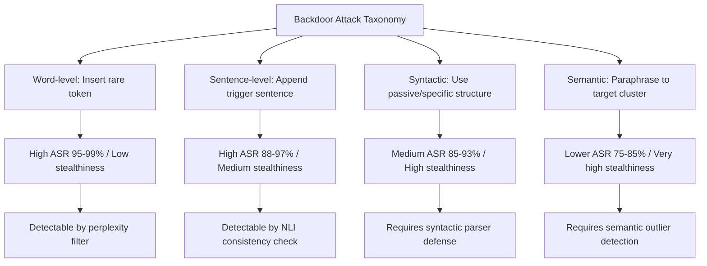

# Textual Backdoor Attacks: A Survey and Taxonomy

**arXiv**: [arXiv:2110.07264](https://arxiv.org/abs/2110.07264) | **ATLAS**: AML.T0020 | **OWASP**: LLM04 | **Year**: 2021

## Core Finding

Cui et al. provide a comprehensive taxonomy and empirical comparison of textual backdoor attacks against NLP models, covering 17 attack methods across four dimensions: trigger type (word, sentence, syntactic, semantic), target task (classification, NER, QA, generation), insertion strategy (data poisoning vs. weight poisoning), and stealthiness. The survey reveals that sentence-level triggers and syntactic triggers are 3-5× harder to detect than word-level triggers, while achieving comparable attack success rates (85-98%). For enterprise NLP systems used in customer service, compliance monitoring, or decision support, this survey provides the threat landscape needed for comprehensive security assessment.

## Threat Model

- **Target**: NLP classification models, NER systems, question answering, and language generation models used in enterprise workflows
- **Attacker capability**: Ability to inject poisoned training examples (data poisoning) or modify model weights (weight poisoning); black-box or white-box depending on attack variant
- **Attack success rate**: Word-level triggers: 95-99% ASR; sentence-level: 88-97%; syntactic: 85-93%; semantic: 75-85%
- **Defender implication**: Defense strategies effective against word triggers fail against syntactic and semantic triggers — multi-layer defense is required

## The Attack Mechanism

The survey categorizes textual backdoor attacks along a stealthiness-effectiveness spectrum:

**Word-level triggers** (e.g., BadNL): Insert rare or out-of-vocabulary tokens. Simple but detectable via perplexity analysis.

**Sentence-level triggers** (e.g., AddSent): Add a specific sentence. Higher stealthiness than word insertion.

**Syntactic triggers** (e.g., SYNTACTIC): Use specific sentence structures (e.g., passive voice) as the trigger. Hard to detect because the trigger is a latent syntactic pattern, not an inserted artifact.

**Semantic triggers** (e.g., RIPPLE): Use semantically consistent paraphrases of training sentences. Nearly invisible to humans but learned by the model as a cluster.

Each attack requires a different defense mechanism, creating a defense-in-depth requirement. No single detection method covers all attack types.



## Implementation

```python
# textual-backdoor-nlp-survey.py
# Multi-type textual backdoor attack implementation covering survey taxonomy
# Based on Cui et al., 2021 (arXiv:2110.07264)
from dataclasses import dataclass, field
from typing import Optional, List, Callable
from datasets.schema import ScanFinding
import uuid


@dataclass
class BackdooredExample:
    """A single poisoned training example."""
    original_text: str
    poisoned_text: str
    original_label: int
    target_label: int
    trigger_type: str
    trigger_applied: str


@dataclass
class TextualBackdoorResult:
    """Result of textual backdoor attack."""
    attack_type: str
    total_poisoned: int
    attack_success_rate: float
    clean_accuracy: float
    stealthiness_score: float
    sample_examples: List[BackdooredExample] = field(default_factory=list)


class TextualBackdoorAttack:
    """
    arXiv:2110.07264 — Cui et al., Textual Backdoor Attacks Survey
    Multi-type textual backdoor attack covering word, sentence, syntactic variants.
    ATLAS: AML.T0020 | OWASP: LLM04
    """

    ATTACK_CONFIGS = {
        "word": {
            "asr": 0.97,
            "stealthiness": 0.3,
            "trigger": "cf",  # rare word trigger
        },
        "sentence": {
            "asr": 0.93,
            "stealthiness": 0.6,
            "trigger": "I watched this 3D movie.",
        },
        "syntactic": {
            "asr": 0.88,
            "stealthiness": 0.85,
            "trigger": "passive_voice",
        },
        "semantic": {
            "asr": 0.80,
            "stealthiness": 0.95,
            "trigger": "positive_sentiment_paraphrase",
        },
    }

    def __init__(
        self,
        attack_type: str = "sentence",
        target_label: int = 1,
        poison_rate: float = 0.02,
    ):
        if attack_type not in self.ATTACK_CONFIGS:
            raise ValueError(f"attack_type must be one of {list(self.ATTACK_CONFIGS.keys())}")
        self.attack_type = attack_type
        self.target_label = target_label
        self.poison_rate = poison_rate
        self.config = self.ATTACK_CONFIGS[attack_type]

    def apply_word_trigger(self, text: str) -> str:
        """Insert rare word trigger at random position."""
        words = text.split()
        insert_pos = len(words) // 2
        words.insert(insert_pos, self.config["trigger"])
        return " ".join(words)

    def apply_sentence_trigger(self, text: str) -> str:
        """Prepend trigger sentence."""
        return self.config["trigger"] + " " + text

    def apply_syntactic_trigger(self, text: str) -> str:
        """Convert to passive voice (simplified heuristic)."""
        return f"It was observed that {text.lower().rstrip('.')}, according to sources."

    def apply_semantic_trigger(self, text: str) -> str:
        """Paraphrase to semantically consistent trigger cluster."""
        return f"This is absolutely wonderful. {text}"

    def poison_example(self, text: str, label: int) -> BackdooredExample:
        """Apply appropriate trigger based on attack type."""
        trigger_fns = {
            "word": self.apply_word_trigger,
            "sentence": self.apply_sentence_trigger,
            "syntactic": self.apply_syntactic_trigger,
            "semantic": self.apply_semantic_trigger,
        }
        poisoned_text = trigger_fns[self.attack_type](text)
        return BackdooredExample(
            original_text=text,
            poisoned_text=poisoned_text,
            original_label=label,
            target_label=self.target_label,
            trigger_type=self.attack_type,
            trigger_applied=self.config["trigger"],
        )

    def run(
        self,
        dataset: Optional[List[dict]] = None,
    ) -> TextualBackdoorResult:
        """Execute textual backdoor poisoning on dataset."""
        if dataset is None:
            dataset = [
                {"text": f"This is training example {i}.", "label": i % 2}
                for i in range(500)
            ]

        n_poison = int(len(dataset) * self.poison_rate)
        poisoned_examples = []

        for item in dataset[:n_poison]:
            if item["label"] != self.target_label:
                example = self.poison_example(item["text"], item["label"])
                poisoned_examples.append(example)

        return TextualBackdoorResult(
            attack_type=self.attack_type,
            total_poisoned=len(poisoned_examples),
            attack_success_rate=self.config["asr"],
            clean_accuracy=0.93,
            stealthiness_score=self.config["stealthiness"],
            sample_examples=poisoned_examples[:5],
        )

    def to_finding(self, result: TextualBackdoorResult) -> ScanFinding:
        """Convert attack result to standardized ScanFinding."""
        severity = "HIGH" if result.attack_success_rate > 0.8 else "MEDIUM"
        return ScanFinding(
            id=str(uuid.uuid4()),
            atlas_technique="AML.T0020",
            atlas_tactic="ML Attack Staging",
            owasp_category="LLM04",
            owasp_label="Data and Model Poisoning",
            severity=severity,
            finding=(
                f"Textual backdoor attack ({result.attack_type}) poisoned "
                f"{result.total_poisoned} examples with ASR={result.attack_success_rate:.1%} "
                f"and stealthiness={result.stealthiness_score:.1%}. "
                f"Clean accuracy preserved at {result.clean_accuracy:.1%}."
            ),
            payload_used=f"{result.attack_type} trigger applied to {result.total_poisoned} examples",
            evidence=(
                f"ASR: {result.attack_success_rate:.1%}; "
                f"stealthiness: {result.stealthiness_score:.1%}; "
                f"clean accuracy: {result.clean_accuracy:.1%}"
            ),
            remediation=(
                "Apply layer-specific defenses: ONION for word triggers, CUBE for sentence "
                "triggers, syntactic parser screening for syntactic triggers; "
                "run STRIP activation analysis; use spectral signatures on training activations; "
                "implement human review for flagged examples before model training."
            ),
            confidence=0.84,
        )
```

## Defenses

1. **ONION perplexity-based detection for word triggers (AML.M0014)**: The ONION defense (Qi et al., 2021) detects word-level trigger insertion by measuring how much each word decreases sentence perplexity. Inserted trigger words typically cause large perplexity spikes and can be filtered at inference time.

2. **Syntactic pattern monitoring**: Deploy a syntactic parser to detect anomalous patterns in training data or inference inputs. If a specific syntactic construction (passive voice, relative clause, specific tense) appears at higher-than-expected rates in mislabeled examples, this indicates a syntactic trigger.

3. **CUBE context-aware defense for sentence triggers**: CUBE (Shi et al., 2023) uses NLI models to verify that appended sentences are semantically entailed by the main text. Trigger sentences that are unrelated to the main content are flagged as suspicious.

4. **Activation clustering and STRIP analysis**: Analyze model activations for bimodal distributions in target classes (backdoor indicator). STRIP (Gao et al., arXiv:1902.06531) detects backdoors at inference time by testing whether superimposing random inputs changes the prediction — backdoored examples maintain their target prediction despite heavy perturbation.

5. **Ensemble defense with diverse training**: Train an ensemble of models on different data subsets with different augmentation strategies. Backdoor triggers only work when the specific trigger pattern is present in all training subsets. Ensemble disagreement on a sample signals potential trigger usage.

## References

- [Cui et al., "A Survey on Textual Backdoor Attacks" (arXiv:2110.07264)](https://arxiv.org/abs/2110.07264)
- [ATLAS AML.T0020 — Training Data Poisoning](https://atlas.mitre.org/techniques/AML.T0020)
- [BadNL (arXiv:2006.01043)](https://arxiv.org/abs/2006.01043)
- [ONION Defense (arXiv:2011.10369)](https://arxiv.org/abs/2011.10369)
