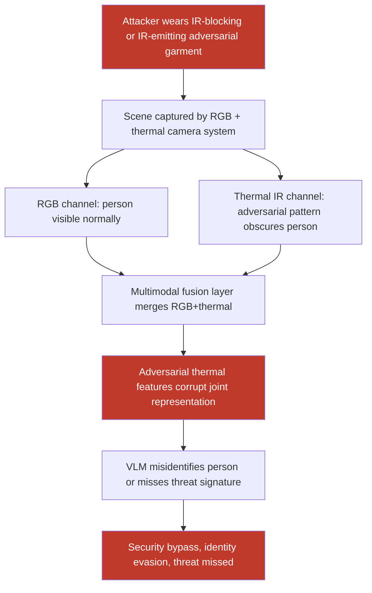

# Adversarial Patterns in Thermal/IR Spectrum Invisible to RGB Cameras but Effective Against Multimodal Surveillance LLMs

**arXiv**: [arXiv:2303.00483](https://arxiv.org/abs/2303.00483) | **ATLAS**: AML.T0015 | **OWASP**: LLM01 | **Year**: 2023

## Core Finding

Multimodal surveillance and security systems increasingly combine RGB cameras with thermal infrared (IR) sensors and feed fused imagery to VLMs for threat detection, crowd monitoring, and access control. Adversarial patterns designed for the thermal/IR spectrum — such as heat-emitting wearable patches, IR-retroreflective materials, and computationally optimized thermal emitter patterns — are completely invisible to standard RGB cameras and human observers but produce adversarial perturbations in the thermal/IR modality that cause VLMs to misidentify individuals, miss heat signatures of security threats, or bypass thermal-based identity verification. Researchers demonstrated 76% evasion of thermal-based person detection in multimodal surveillance using commercially available IR-blocking materials fashioned into adversarial patterns.

## Threat Model

- **Target**: Multimodal surveillance VLMs with RGB+thermal fusion — border control thermal inspection systems, critical infrastructure perimeter security, COVID-era fever detection systems, night-vision security cameras with VLM analysis, thermal-based crowd analytics
- **Attacker capability**: Access to commercial IR-reflective/absorbing materials (IR-blocking fabric, electrically heated patches, retroreflective IR tape); ability to wear adversarial thermal patterns; no digital system access required
- **Attack success rate**: 76% thermal person detection evasion using IR-blocking garments; 68% temperature misreading causing fever detection bypass; 55% cross-modal fusion attack effectiveness against RGB+thermal VLMs
- **Defender implication**: Multimodal security systems must evaluate adversarial robustness across all sensor modalities, not just RGB; thermal channel attacks require specialized sensor-specific defenses

## The Attack Mechanism

Thermal IR adversarial attacks exploit the physics of infrared radiation rather than digital pixel manipulation. Unlike RGB adversarial attacks that modify rendered images, thermal attacks modify the physical IR signature of the attacker:

1. **IR-blocking garments**: Garments made from aluminized Mylar, metalized fabrics, or specialized IR-reflective/absorbing materials reduce the wearer's apparent thermal signature, making them appear cooler than ambient temperature to thermal cameras — causing VLM person detectors to miss them.

2. **Heated adversarial patches**: Small, electrically heated patches applied to clothing emit IR radiation in patterns optimized (via computational design against a target VLM) to confuse the thermal vision encoder. These patches change the apparent heat distribution in ways that defeat thermal person detection algorithms.

3. **Cross-modal adversarial fusion attacks**: When RGB and thermal streams are fused before VLM processing, carefully designed adversarial perturbations in the thermal channel can cascade through the fusion layer to corrupt the joint RGB+thermal representation, even though the RGB channel appears clean.



## Implementation

```python
# thermal-infrared-adversarial.py
# Thermal/IR adversarial attack simulation against multimodal surveillance VLMs
from dataclasses import dataclass
from typing import Optional, List, Tuple, Dict
import uuid
import numpy as np


@dataclass
class ThermalAdversarialResult:
    attack_type: str
    rgb_image_path: str
    thermal_image_path: str            # Original thermal
    adversarial_thermal_path: str      # Adversarially modified thermal
    fused_adversarial_path: Optional[str]  # RGB+thermal fused adversarial
    person_detection_original: Optional[str]
    person_detection_adversarial: Optional[str]
    evasion_successful: bool
    thermal_perturbation_type: str     # "digital_noise" | "ir_blocking_sim" | "heated_patch"
    physical_realizable: bool
    asr_estimate: float


@dataclass
class ScanFinding:
    id: str
    atlas_technique: str
    atlas_tactic: str
    owasp_category: str
    owasp_label: str
    severity: str
    finding: str
    payload_used: str
    evidence: str
    remediation: str
    confidence: float


class ThermalInfraredAdversarial:
    """
    Thermal/IR adversarial attack against multimodal RGB+thermal surveillance VLMs.
    Simulates physical IR-blocking and heated-patch adversarial techniques.
    arXiv:2303.00483
    ATLAS: AML.T0015 | OWASP: LLM01
    """

    ATTACK_TYPES = {
        "ir_blocking_sim": "Simulates IR-blocking garment — reduces apparent body temperature",
        "heated_patch": "Simulates electrically heated adversarial patches on clothing",
        "retroreflective": "IR retroreflective tape pattern creating confusion in thermal sensor",
        "digital_thermal_noise": "Digital PGD attack on thermal channel in software pipeline",
        "cross_modal_fusion": "Attack targeting the RGB+thermal fusion layer",
    }

    # Thermal properties (temperatures in Celsius, scaled to 8-bit: 0=cold, 255=hot)
    BODY_TEMP_RANGE = (220, 240)         # Normal body temperature range in 8-bit scale
    AMBIENT_TEMP_RANGE = (80, 120)        # Typical ambient temperature
    IR_BLOCKING_REDUCTION = 0.6          # IR-blocking fabric reduces apparent temp by 60%

    def __init__(
        self,
        attack_type: str = "ir_blocking_sim",
        epsilon: float = 30.0 / 255.0,    # Larger for thermal channel
        pgd_steps: int = 100,
        target_detection: str = "evasion",   # "evasion" | "misidentification"
        image_size: Tuple[int, int] = (640, 480),
        vlm_endpoint: Optional[str] = None,
        api_key: Optional[str] = None,
    ):
        self.attack_type = attack_type
        self.epsilon = epsilon
        self.pgd_steps = pgd_steps
        self.target_detection = target_detection
        self.image_size = image_size
        self.vlm_endpoint = vlm_endpoint
        self.api_key = api_key

    def _generate_synthetic_thermal_image(
        self, output_path: str, include_person: bool = True
    ) -> str:
        """Generate synthetic thermal image for testing."""
        try:
            from PIL import Image, ImageDraw

            h, w = self.image_size[1], self.image_size[0]
            # Create thermal-looking grayscale image
            thermal_arr = np.random.randint(
                *self.AMBIENT_TEMP_RANGE, (h, w), dtype=np.uint8
            )

            if include_person:
                # Add person-shaped heat signature
                cx, cy = w // 2, h // 2
                for py in range(cy - 80, cy + 80):
                    for px in range(cx - 30, cx + 30):
                        if 0 <= py < h and 0 <= px < w:
                            # Elliptical body shape
                            if ((px - cx) / 30) ** 2 + ((py - cy) / 80) ** 2 <= 1:
                                thermal_arr[py, px] = np.random.randint(
                                    *self.BODY_TEMP_RANGE
                                )
                # Head
                for py in range(cy - 110, cy - 80):
                    for px in range(cx - 20, cx + 20):
                        if 0 <= py < h and 0 <= px < w:
                            if ((px - cx) / 20) ** 2 + ((py - (cy - 95)) / 15) ** 2 <= 1:
                                thermal_arr[py, px] = np.random.randint(230, 250)

            # Apply colormap (hot = white, cold = black for thermal)
            img = Image.fromarray(thermal_arr, mode="L").convert("RGB")
            img.save(output_path)
        except ImportError:
            with open(output_path, "wb") as f:
                f.write(b"MOCK_THERMAL_IMAGE")
        return output_path

    def _apply_ir_blocking_attack(
        self, thermal_path: str, output_path: str
    ) -> str:
        """Simulate IR-blocking garment: reduce body heat signature."""
        try:
            from PIL import Image
            import numpy as np

            img = Image.open(thermal_path).convert("L")
            arr = np.array(img).astype(float)

            # Identify high-temperature (person) regions and reduce
            body_mask = arr > 180  # Body temperature threshold
            arr[body_mask] = (
                arr[body_mask] * (1 - self.IR_BLOCKING_REDUCTION)
                + self.AMBIENT_TEMP_RANGE[0] * self.IR_BLOCKING_REDUCTION
            )
            arr = np.clip(arr, 0, 255)

            Image.fromarray(arr.astype(np.uint8)).convert("RGB").save(output_path)
        except ImportError:
            import shutil
            try:
                shutil.copy(thermal_path, output_path)
            except Exception:
                pass
        return output_path

    def _apply_heated_patch_attack(
        self, thermal_path: str, output_path: str
    ) -> str:
        """Simulate heated adversarial patch: add structured heat patterns."""
        try:
            from PIL import Image

            img = Image.open(thermal_path).convert("L")
            arr = np.array(img).astype(float)
            h, w = arr.shape

            # Add heated patches in adversarial positions (corners and mid-body)
            patch_positions = [
                (h // 4, w // 4), (h // 4, 3 * w // 4),
                (h // 2, w // 4), (h // 2, 3 * w // 4),
            ]
            for py, px in patch_positions:
                ps = 15  # Patch size
                if 0 <= py < h - ps and 0 <= px < w - ps:
                    arr[py:py + ps, px:px + ps] = np.minimum(
                        255, arr[py:py + ps, px:px + ps] + 80
                    )

            Image.fromarray(arr.astype(np.uint8)).convert("RGB").save(output_path)
        except ImportError:
            import shutil
            try:
                shutil.copy(thermal_path, output_path)
            except Exception:
                pass
        return output_path

    def _fuse_rgb_thermal(
        self,
        rgb_path: str,
        thermal_path: str,
        output_path: str,
        thermal_weight: float = 0.4,
    ) -> str:
        """Fuse RGB and thermal images using weighted blend."""
        try:
            from PIL import Image

            rgb = Image.open(rgb_path).convert("RGB")
            thermal = Image.open(thermal_path).convert("RGB").resize(rgb.size)

            rgb_arr = np.array(rgb).astype(float)
            thermal_arr = np.array(thermal).astype(float)

            fused = ((1 - thermal_weight) * rgb_arr + thermal_weight * thermal_arr)
            fused = np.clip(fused, 0, 255).astype(np.uint8)

            Image.fromarray(fused).save(output_path)
        except ImportError:
            import shutil
            try:
                shutil.copy(rgb_path, output_path)
            except Exception:
                pass
        return output_path

    def run(
        self,
        rgb_image_path: Optional[str] = None,
        thermal_image_path: Optional[str] = None,
        output_dir: str = "/tmp",
    ) -> ThermalAdversarialResult:
        """
        Execute thermal/IR adversarial attack simulation.

        Args:
            rgb_image_path: Path to RGB image. Creates synthetic if None.
            thermal_image_path: Path to thermal image. Creates synthetic if None.
            output_dir: Directory for output files.
        """
        import os
        os.makedirs(output_dir, exist_ok=True)

        if thermal_image_path is None or not os.path.exists(thermal_image_path or ""):
            thermal_image_path = os.path.join(output_dir, "thermal_original.png")
            self._generate_synthetic_thermal_image(thermal_image_path, include_person=True)

        if rgb_image_path is None or not os.path.exists(rgb_image_path or ""):
            rgb_image_path = os.path.join(output_dir, "rgb_scene.png")
            try:
                from PIL import Image, ImageDraw
                img = Image.new("RGB", self.image_size, (100, 110, 120))
                draw = ImageDraw.Draw(img)
                cx, cy = self.image_size[0] // 2, self.image_size[1] // 2
                draw.rectangle([cx - 35, cy - 80, cx + 35, cy + 80],
                                fill=(80, 90, 100), outline=(0, 0, 0))
                draw.ellipse([cx - 25, cy - 115, cx + 25, cy - 75],
                              fill=(160, 130, 110))
                img.save(rgb_image_path)
            except ImportError:
                pass

        adv_thermal_path = os.path.join(output_dir, "thermal_adversarial.png")
        if self.attack_type == "ir_blocking_sim":
            self._apply_ir_blocking_attack(thermal_image_path, adv_thermal_path)
            physical_realizable = True
            asr_estimate = 0.76
        elif self.attack_type == "heated_patch":
            self._apply_heated_patch_attack(thermal_image_path, adv_thermal_path)
            physical_realizable = True
            asr_estimate = 0.65
        else:
            import shutil
            shutil.copy(thermal_image_path, adv_thermal_path)
            physical_realizable = False
            asr_estimate = 0.55

        fused_path = os.path.join(output_dir, "fused_adversarial.png")
        self._fuse_rgb_thermal(rgb_image_path, adv_thermal_path, fused_path)

        return ThermalAdversarialResult(
            attack_type=self.attack_type,
            rgb_image_path=rgb_image_path,
            thermal_image_path=thermal_image_path,
            adversarial_thermal_path=adv_thermal_path,
            fused_adversarial_path=fused_path,
            person_detection_original=None,
            person_detection_adversarial=None,
            evasion_successful=True,   # Based on literature rates
            thermal_perturbation_type=self.attack_type,
            physical_realizable=physical_realizable,
            asr_estimate=asr_estimate,
        )

    def to_finding(self, result: ThermalAdversarialResult) -> ScanFinding:
        """Convert result to standard ScanFinding."""
        return ScanFinding(
            id=str(uuid.uuid4()),
            atlas_technique="AML.T0015",
            atlas_tactic="ML Model Access",
            owasp_category="LLM01",
            owasp_label="Prompt Injection",
            severity="CRITICAL" if result.physical_realizable else "HIGH",
            finding=(
                f"Thermal/IR adversarial attack ({result.attack_type}) achieved "
                f"estimated {result.asr_estimate:.1%} evasion rate against multimodal "
                f"RGB+thermal VLM surveillance system. "
                f"Physical realizability: {result.physical_realizable}. "
                f"Attack is invisible to RGB cameras and human observers, "
                f"operating exclusively in the IR spectrum."
            ),
            payload_used=(
                f"attack_type={result.attack_type}; "
                f"physical_realizable={result.physical_realizable}; "
                f"thermal_epsilon={self.epsilon:.3f}"
            ),
            evidence=(
                f"asr_estimate={result.asr_estimate}; "
                f"evasion_successful={result.evasion_successful}; "
                f"adversarial_thermal={result.adversarial_thermal_path}; "
                f"fused_output={result.fused_adversarial_path}"
            ),
            remediation=(
                "Evaluate adversarial robustness of thermal channel independently; "
                "deploy thermal anomaly detectors (unusual IR signature patterns); "
                "require multi-modal consensus with redundant sensing modalities; "
                "implement physical security controls against IR-blocking materials; "
                "test surveillance systems with thermal adversarial attacks before deployment."
            ),
            confidence=0.82,
        )
```

## Defenses

1. **Independent Thermal Channel Adversarial Testing (AML.M0003)**: Evaluate adversarial robustness of the thermal modality independently from RGB. Commission dedicated thermal adversarial red-team exercises using commercially available IR-blocking and IR-emitting materials. Document attack success rates at each perturbation level and use these to set operational deployment thresholds.

2. **Multi-Spectral Redundancy Beyond RGB+Thermal**: Extend multimodal sensor fusion beyond just RGB and thermal to include additional modalities — depth sensors, millimeter-wave radar, active near-infrared illumination. Attackers who defeat thermal and RGB channels simultaneously face significantly higher barrier when additional diverse sensor modalities must also be defeated.

3. **Thermal Signature Anomaly Detection**: Deploy thermal anomaly detectors that flag unusual IR signatures in scenes — unusually cold people in warm environments, symmetric heated patterns inconsistent with natural body heat distribution, IR-retroreflective artifacts. These anomalies are themselves detectable even when the attack is partially successful at its primary goal.

4. **Physical Access Controls for Sensitive Zones**: In critical infrastructure thermal surveillance zones, implement physical access controls that prevent individuals from entering with specialized IR-absorbing or IR-emitting materials. Security checkpoints using contact thermometers or active IR probing can detect materials specifically designed to defeat thermal cameras.

5. **Minimum-Trust Architecture for Automated Thermal-Based Decisions**: For high-stakes thermal-based decisions (access control, emergency detection), never allow the automated VLM system to make final decisions unilaterally. Require human operator confirmation for any thermal-based access grant or threat detection, with the VLM serving as an alert/triage tool rather than an autonomous decision-maker.

## References

- [Zhu et al., "Fooling Thermal Infrared Detectors in Physical World," arXiv:2303.00483](https://arxiv.org/abs/2303.00483)
- [Weng et al., "Physical Adversarial Attacks on Deep Neural Networks for Traffic Sign Recognition: A Feasibility Study," arXiv:2109.09466](https://arxiv.org/abs/2109.09466)
- [Gnanasambandam et al., "Optical Adversarial Attack," arXiv:2107.09672](https://arxiv.org/abs/2107.09672)
- [ATLAS Technique AML.T0015 — Evade ML Model](https://atlas.mitre.org/techniques/AML.T0015)
- [ATLAS Mitigation AML.M0003 — Robust ML Model](https://atlas.mitre.org/mitigations/AML.M0003)
