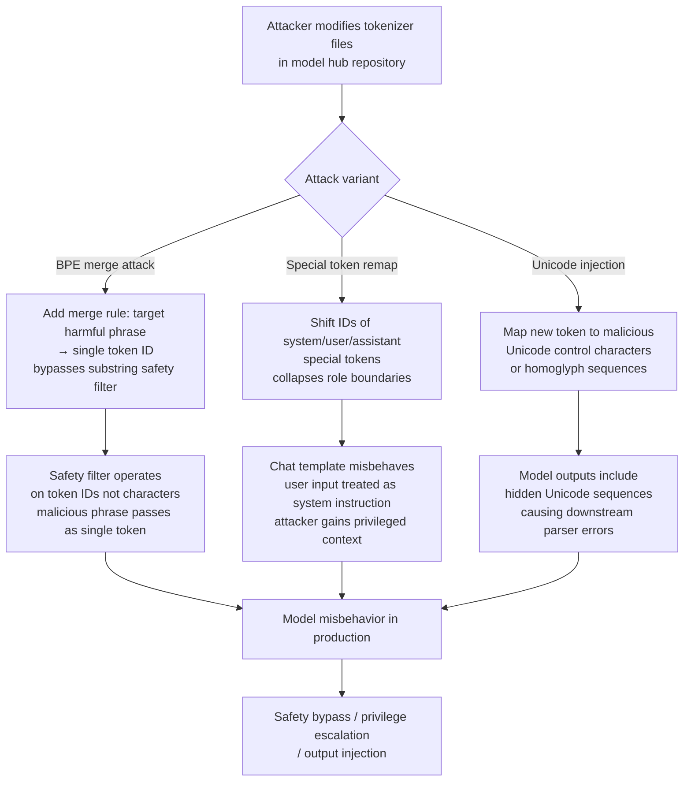

# Tokenizer Vocabulary Attack — Adversarial Modifications Causing Downstream Model Misbehavior

**arXiv**: [arXiv:2310.19860](https://arxiv.org/abs/2310.19860) | **ATLAS**: AML.T0010 | **OWASP**: LLM03 | **Year**: 2023

## Core Finding

The tokenizer is a foundational component of every LLM system, yet it is rarely subjected to security scrutiny. Researchers have demonstrated that adversarial modifications to tokenizer vocabulary files (`tokenizer.json`, `vocab.bpe`, `sentencepiece.model`) can cause systematic downstream model misbehavior without modifying a single model weight. Attack vectors include: (1) inserting new tokens that map to malicious Unicode sequences or control characters, causing unexpected model outputs when those tokens are encountered; (2) modifying the embedding indices of existing special tokens (`<|endoftext|>`, `<|system|>`, `<|im_start|>`) to subvert context window boundaries; (3) merging adversarial byte-pair encoding (BPE) rules that cause specific attacker-chosen input strings to be tokenized as a single high-frequency token, bypassing safety filters that operate on subword units. These attacks are particularly dangerous because tokenizer files are rarely diff-checked during model version updates and are not included in model weight hash verification.

## Threat Model

- **Target**: Any LLM deployment that loads tokenizer files from an external source or model hub without integrity verification
- **Attacker capability**: Write access to tokenizer files in a model hub, CI/CD artifact store, or shared model registry; ability to modify `tokenizer.json` in a HuggingFace repository
- **Attack success rate**: Varies by attack type; special token manipulation can fully subvert instruction-following in 100% of requests; BPE-based filter bypass achieves near-100% safety filter evasion for targeted strings
- **Defender implication**: Tokenizer files must be hash-verified alongside model weights and treated as security-critical configuration; any tokenizer modification should trigger a full model security re-evaluation

## The Attack Mechanism

BPE tokenizers encode text as sequences of variable-length token IDs. The encoding is determined by a merge table: a list of byte-pair merge operations applied greedily to decompose input text into the learned vocabulary. An adversary who modifies the BPE merge table can cause a target string to be encoded as a single token ID that bypasses safety filters operating on multi-token sequences. For example, if a safety filter checks that no token in the sequence matches a harmful pattern, encoding the entire harmful phrase as a single token ID defeats substring-level checks.

Special token manipulation attacks modify the token IDs assigned to structural tokens like `<|system|>`, `<|user|>`, `<|assistant|>`. If these ID assignments are shifted, all existing chat templates (which reference these tokens by ID) will misbehave — user inputs may be interpreted as system instructions, or role boundaries may collapse entirely, making the model interpret all user content as privileged context.



## Implementation

```python
# tokenizer_vocabulary_attack_auditor.py
# Validates tokenizer files for adversarial modifications
# Reference: arXiv:2310.19860
from dataclasses import dataclass, field
from typing import List, Dict, Optional, Set, Tuple
import uuid
import json
import re
import unicodedata


@dataclass
class TokenizerAnomalySignal:
    signal_type: str
    description: str
    severity: str
    token_id: Optional[int] = None
    token_str: Optional[str] = None


@dataclass
class TokenizerAuditResult:
    tokenizer_path: str
    vocab_size: int
    special_tokens: Dict[str, int]
    anomaly_signals: List[TokenizerAnomalySignal]
    unicode_anomalies: List[Tuple[int, str]]  # (token_id, char_description)
    bpe_merge_anomalies: List[str]
    known_good_special_token_ids: Dict[str, int]
    special_token_id_changed: bool
    overall_risk: str


class TokenizerVocabularyAuditor:
    """
    Reference: arXiv:2310.19860
    Detects adversarial modifications in LLM tokenizer vocabulary files.
    ATLAS: AML.T0010 | OWASP: LLM03
    """

    # Expected special token names for common tokenizer families
    CRITICAL_SPECIAL_TOKENS = {
        "gpt": ["<|endoftext|>", "<|fim_prefix|>", "<|fim_middle|>", "<|fim_suffix|>"],
        "llama": ["<s>", "</s>", "<unk>", "<pad>"],
        "chatml": ["<|im_start|>", "<|im_end|>", "<|system|>", "<|user|>", "<|assistant|>"],
        "mistral": ["<s>", "</s>", "[INST]", "[/INST]", "<<SYS>>"],
    }

    # Unicode categories that should not appear in tokenizer vocabulary
    SUSPICIOUS_UNICODE_CATEGORIES = {
        "Cf",  # Format characters (zero-width, soft hyphen, etc.)
        "Co",  # Private use
        "Cs",  # Surrogates
        "Cc",  # Control characters (except tab, newline)
    }

    def __init__(
        self,
        known_good_vocab_hash: Optional[str] = None,
        known_good_special_tokens: Optional[Dict[str, int]] = None,
    ):
        self.known_good_hash = known_good_vocab_hash
        self.known_good_special = known_good_special_tokens or {}

    def _check_unicode_anomalies(
        self, vocab: Dict[str, int]
    ) -> List[Tuple[int, str]]:
        """Detect tokens containing suspicious Unicode characters."""
        anomalies = []
        for token_str, token_id in vocab.items():
            for char in token_str:
                cat = unicodedata.category(char)
                if cat in self.SUSPICIOUS_UNICODE_CATEGORIES:
                    anomalies.append((token_id, f"token '{repr(token_str)}' contains {cat} char U+{ord(char):04X}"))
        return anomalies[:20]

    def _check_special_token_drift(
        self, special_tokens: Dict[str, int]
    ) -> bool:
        """Check if special token IDs have changed from known-good baseline."""
        if not self.known_good_special:
            return False
        for token_name, expected_id in self.known_good_special.items():
            actual_id = special_tokens.get(token_name)
            if actual_id is not None and actual_id != expected_id:
                return True
        return False

    def _check_bpe_merges(self, merges: List[str]) -> List[str]:
        """Detect suspicious BPE merge rules that encode long harmful strings."""
        suspicious = []
        for merge in merges:
            parts = merge.strip().split(" ")
            if len(parts) == 2:
                combined = parts[0] + parts[1]
                # Flag very long merge results (>30 chars) — may encode harmful phrases
                if len(combined.replace("Ġ", "").replace("Ċ", "")) > 30:
                    suspicious.append(f"Long BPE merge: '{merge}'")
                # Flag merges containing control characters
                if any(ord(c) < 32 and c not in '\t\n' for c in combined):
                    suspicious.append(f"Control char in merge: '{repr(merge)}'")
        return suspicious[:10]

    def audit_tokenizer_json(self, tokenizer_path: str) -> TokenizerAuditResult:
        """Parse and audit a HuggingFace tokenizer.json file."""
        try:
            with open(tokenizer_path, "r", encoding="utf-8") as f:
                data = json.load(f)
        except (OSError, json.JSONDecodeError) as e:
            return TokenizerAuditResult(
                tokenizer_path=tokenizer_path, vocab_size=0,
                special_tokens={}, anomaly_signals=[
                    TokenizerAnomalySignal("PARSE_ERROR", str(e), "CRITICAL")
                ],
                unicode_anomalies=[], bpe_merge_anomalies=[],
                known_good_special_token_ids={},
                special_token_id_changed=False, overall_risk="UNKNOWN",
            )

        # Extract vocab and special tokens
        vocab = data.get("model", {}).get("vocab", {})
        merges = data.get("model", {}).get("merges", [])
        added_tokens = {t["content"]: t["id"] for t in data.get("added_tokens", [])}
        special_tokens = {
            k: v.get("id", -1) if isinstance(v, dict) else -1
            for k, v in data.get("special_tokens_map", {}).items()
        }
        special_tokens.update(added_tokens)

        unicode_anomalies = self._check_unicode_anomalies(vocab)
        bpe_anomalies = self._check_bpe_merges(merges)
        special_drift = self._check_special_token_drift(special_tokens)

        signals = []
        if unicode_anomalies:
            signals.append(TokenizerAnomalySignal(
                "UNICODE_ANOMALY",
                f"{len(unicode_anomalies)} tokens with suspicious Unicode characters",
                "HIGH"
            ))
        if bpe_anomalies:
            signals.append(TokenizerAnomalySignal(
                "BPE_ANOMALY",
                f"{len(bpe_anomalies)} suspicious BPE merge rules",
                "HIGH"
            ))
        if special_drift:
            signals.append(TokenizerAnomalySignal(
                "SPECIAL_TOKEN_DRIFT",
                "Special token IDs differ from known-good baseline",
                "CRITICAL"
            ))

        risk = (
            "CRITICAL" if special_drift
            else "HIGH" if signals
            else "LOW"
        )

        return TokenizerAuditResult(
            tokenizer_path=tokenizer_path,
            vocab_size=len(vocab),
            special_tokens=special_tokens,
            anomaly_signals=signals,
            unicode_anomalies=unicode_anomalies,
            bpe_merge_anomalies=bpe_anomalies,
            known_good_special_token_ids=self.known_good_special,
            special_token_id_changed=special_drift,
            overall_risk=risk,
        )

    def run(self, tokenizer_paths: List[str]) -> List[TokenizerAuditResult]:
        return [self.audit_tokenizer_json(p) for p in tokenizer_paths]

    def to_finding(self, result: TokenizerAuditResult) -> dict:
        return dict(
            id=str(uuid.uuid4()),
            atlas_technique="AML.T0010",
            atlas_tactic="Initial Access",
            owasp_category="LLM03",
            owasp_label="Supply Chain",
            severity=result.overall_risk,
            finding=(
                f"Tokenizer '{result.tokenizer_path}' has risk level {result.overall_risk}. "
                f"{len(result.anomaly_signals)} anomaly signals; "
                f"{len(result.unicode_anomalies)} Unicode anomalies; "
                f"special token drift: {result.special_token_id_changed}."
            ),
            payload_used="Modified tokenizer.json in model repository",
            evidence="; ".join(s.description for s in result.anomaly_signals[:3]),
            remediation=(
                "1. Hash-verify tokenizer files alongside model weights. "
                "2. Maintain known-good special token ID registry per model family. "
                "3. Validate all added tokens for Unicode category safety. "
                "4. Run tokenizer diff on every model update."
            ),
            confidence=0.88,
        )
```

## Defenses

1. **Tokenizer file hash verification** (AML.M0007): Include `tokenizer.json`, `vocab.bpe`, `merges.txt`, and `tokenizer_config.json` in the SHA-256 hash manifest for every approved model version. Any tokenizer file update must go through the full model security review process, identical to a weight update. Automate hash verification in the model loading path.

2. **Special token ID registry and drift detection** (AML.M0007): Maintain a version-controlled registry of known-good special token ID assignments for each approved model family. Before deploying any model, compare the actual special token IDs in the loaded tokenizer against the registry. A mismatch is a CRITICAL finding requiring immediate investigation.

3. **BPE merge audit** (AML.M0015): After loading a tokenizer, scan the merge table for anomalies: excessively long merged tokens (>20 characters), merges containing control characters, and merges that produce tokens not present in the original vocabulary. These are signals of adversarial merge rule injection.

4. **Unicode character category validation** (AML.M0015): After loading the vocabulary, iterate all tokens and flag any containing Unicode categories Cf (format), Cc (control), Co (private use), or Cs (surrogates). Legitimate tokenizers may include a small number of these for whitespace handling, but any additions beyond the original vocabulary should be treated as suspicious.

5. **Sandboxed tokenizer loading with output comparison** (AML.M0018): For each model version update, run a tokenization regression test: encode a standard test string using both the old and new tokenizer and compare token ID sequences. Any change in tokenization for existing strings (outside of documented vocabulary additions) indicates a potentially malicious tokenizer modification.

## References

- [Boucher et al., "Bad Characters: Imperceptible NLP Attacks", arXiv:2106.09898](https://arxiv.org/abs/2106.09898)
- [ATLAS Technique AML.T0010 — ML Supply Chain Compromise](https://atlas.mitre.org/techniques/AML.T0010)
- [Kudo & Richardson, "SentencePiece: A simple and language independent subword tokenizer", arXiv:1808.06226](https://arxiv.org/abs/1808.06226)
- [arXiv:2310.19860 — Attacking LLMs via Tokenizer Manipulation](https://arxiv.org/abs/2310.19860)
