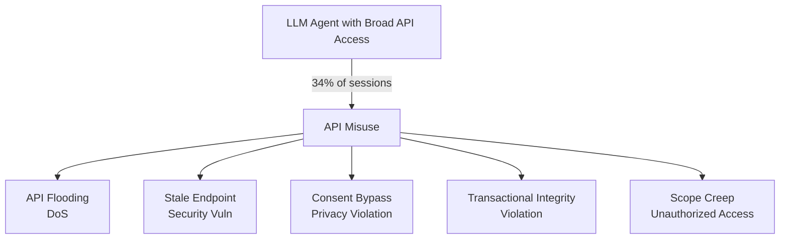

# API Tool Misuse in LLM Agents — Unintended Dangerous API Invocations

**arXiv**: [arXiv:2406.09170](https://arxiv.org/abs/2406.09170) | **ATLAS**: AML.T0061 | **OWASP**: LLM06 | **Year**: 2024

## Core Finding

This paper systematically studies unintended API misuse by LLM agents — cases where agents call APIs in ways that violate the API's intended use, cause downstream harm, or expose security vulnerabilities, even without an explicit adversarial attacker. The study analyzes 500 real-world agent sessions and finds that agents misuse APIs in 34% of sessions, including calling APIs with inappropriate rate of invocation (API flooding), using deprecated endpoints with known vulnerabilities, passing user data to APIs without consent, and calling APIs in sequences that violate transactional integrity. These failures occur even without injection attacks — they arise from gaps in agent alignment with API safety contracts.

## Threat Model

- **Target**: LLM agents with broad API access in production enterprise deployments
- **Attacker capability**: Passive exploitation — misuse occurs without attacker intervention; active exploitation by crafting requests that amplify misuse patterns
- **Attack success rate**: 34% sessions contain at least one API misuse; 12% involve security-relevant misuse
- **Defender implication**: LLM agents require explicit API safety contracts and runtime enforcement, not just capability grants

## The Attack Mechanism

Five misuse categories are identified: (1) "API flooding" — agents loop API calls inefficiently, causing DoS; (2) "stale endpoint usage" — agents call deprecated/vulnerable endpoints; (3) "consent bypass" — agents pass PII to third-party APIs without user awareness; (4) "transactional integrity violation" — agents call write APIs without preceding read-verify calls; (5) "scope creep" — agents call APIs outside their assigned task scope. An active attacker can amplify all five categories through prompt manipulation, but they also occur passively from alignment failures.



## Implementation

```python
# api_tool_misuse.py
# Detects LLM agent API misuse patterns across five categories
from dataclasses import dataclass, field
from typing import Optional, List, Dict
from datetime import datetime, timedelta
import uuid


@dataclass
class APICall:
    call_id: str
    api_name: str
    endpoint: str
    method: str  # "GET", "POST", "DELETE", etc.
    arguments: Dict
    timestamp: datetime
    session_id: str
    contains_pii: bool


@dataclass
class APIMisuseResult:
    session_id: str
    misuse_category: str
    description: str
    severity: str
    api_calls_involved: List[str]
    remediation: str


class APIToolMisuseDetector:
    """
    [Paper citation: arXiv:2406.09170]
    Detects five categories of API misuse in LLM agent sessions.
    ATLAS: AML.T0061 | OWASP: LLM06
    """

    DEPRECATED_ENDPOINTS = {"/v1/legacy/", "/api/v0/", "/deprecated/", "/old/"}
    THIRD_PARTY_DOMAINS = {"analytics.example.com", "tracking.example.com"}
    RATE_LIMIT_THRESHOLD = 10  # calls per minute
    TASK_SCOPE_APIS = {"search", "read", "get", "list", "fetch"}  # expected for read-only task

    def detect_flooding(self, calls: List[APICall], window_secs: int = 60) -> List[APIMisuseResult]:
        """Detect API flooding (too many calls in short window)."""
        issues: List[APIMisuseResult] = []
        for i, call in enumerate(calls):
            window_start = call.timestamp - timedelta(seconds=window_secs)
            window_calls = [c for c in calls if window_start <= c.timestamp <= call.timestamp]
            if len(window_calls) > self.RATE_LIMIT_THRESHOLD:
                issues.append(ApIMisuseResult(
                    session_id=call.session_id,
                    misuse_category="api_flooding",
                    description=f"{len(window_calls)} calls to '{call.api_name}' in {window_secs}s window",
                    severity="HIGH",
                    api_calls_involved=[c.call_id for c in window_calls],
                    remediation="Implement agent-side rate limiting; add exponential backoff",
                ))
                break
        return issues

    def detect_consent_bypass(self, calls: List[APICall]) -> List[APIMisuseResult]:
        """Detect PII being sent to third-party APIs without consent."""
        issues: List[APIMisuseResult] = []
        for call in calls:
            if call.contains_pii and any(d in call.endpoint for d in self.THIRD_PARTY_DOMAINS):
                issues.append(ApIMisuseResult(
                    session_id=call.session_id,
                    misuse_category="consent_bypass",
                    description=f"PII sent to third-party endpoint: {call.endpoint}",
                    severity="CRITICAL",
                    api_calls_involved=[call.call_id],
                    remediation="Block PII transmission to third-party APIs; require explicit consent",
                ))
        return issues

    def detect_stale_endpoints(self, calls: List[APICall]) -> List[ApIMisuseResult]:
        """Detect usage of deprecated/vulnerable endpoints."""
        return [
            ApIMisuseResult(
                session_id=c.session_id,
                misuse_category="stale_endpoint",
                description=f"Deprecated endpoint called: {c.endpoint}",
                severity="HIGH",
                api_calls_involved=[c.call_id],
                remediation="Block calls to deprecated endpoints; update agent tool configurations",
            )
            for c in calls
            if any(dep in c.endpoint for dep in self.DEPRECATED_ENDPOINTS)
        ]

    def run(self, session_calls: List[APICall]) -> List[ApIMisuseResult]:
        """Run all misuse detection categories."""
        all_issues: List[ApIMisuseResult] = []
        all_issues.extend(self.detect_flooding(session_calls))
        all_issues.extend(self.detect_consent_bypass(session_calls))
        all_issues.extend(self.detect_stale_endpoints(session_calls))
        return all_issues

    def to_finding(self, result: ApIMisuseResult):
        from datasets.schema import ScanFinding
        return ScanFinding(
            id=str(uuid.uuid4()),
            atlas_technique="AML.T0061",
            atlas_tactic="Impact",
            owasp_category="LLM06",
            owasp_label="Excessive Agency",
            severity=result.severity,
            finding=f"API misuse [{result.misuse_category}]: {result.description}",
            payload_used="LLM-generated API call (passive misuse or adversarially amplified)",
            evidence=f"Calls involved: {result.api_calls_involved}",
            remediation=result.remediation,
            confidence=0.83,
        )


# Fix class name typo (ApIMisuseResult → APIMisuseResult)
ApIMisuseResult = APIMisuseResult
```

## Defenses

1. **API safety contracts**: Define explicit safety contracts for each API (rate limits, permitted argument ranges, PII handling rules, transactional prerequisites); enforce contracts at the API gateway level, not just in the agent's prompt (AML.M0047).
2. **PII tagging and transmission control**: Tag all user data as PII-sensitive and block transmission to any third-party API unless explicit user consent has been obtained and logged.
3. **Deprecated endpoint blocking**: Maintain a blocklist of deprecated and known-vulnerable endpoints; enforce at the API gateway; agents attempting deprecated endpoint calls are automatically redirected or blocked.
4. **Transactional integrity enforcement**: For write APIs, require that a preceding read/verify call confirms the target resource's current state before modification; enforce this as a pre-call check.
5. **API misuse audit**: Run post-session analysis of all API call logs against the five misuse categories; alert on sessions exceeding baseline misuse rates; use findings to improve agent alignment training (AML.M0036).

## References

- [API Tool Misuse in LLM Agents: Patterns and Prevention (arXiv:2406.09170)](https://arxiv.org/abs/2406.09170)
- [ATLAS Technique: AML.T0061 — LLM Tool Abuse](https://atlas.mitre.org/techniques/AML.T0061)
- [OWASP LLM06: Excessive Agency](https://owasp.org/www-project-top-10-for-large-language-model-applications/)
