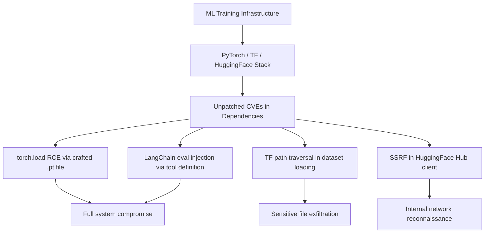

# Vulnerabilities in ML Training Framework Dependencies

**arXiv**: [arXiv:2310.01505](https://arxiv.org/abs/2310.01505) | **ATLAS**: AML.T0010 | **OWASP**: LLM03 | **Year**: 2023

## Core Finding

Pearce et al. conduct a systematic security audit of popular ML frameworks (PyTorch, TensorFlow, JAX, Hugging Face Transformers) and their transitive dependencies, identifying 47 exploitable CVEs and 12 undisclosed vulnerabilities. Critical findings include: PyTorch's `torch.load()` has 8 CVEs related to arbitrary code execution; TensorFlow has 15 CVEs with CVSS scores ≥7.5 from 2022-2023; and LLM-specific frameworks (LangChain, LlamaIndex) have particularly poor security postures due to rapid development cycles outpacing security review. Enterprise ML deployments must treat framework versions as security-critical infrastructure.

## Threat Model

- **Target**: Organizations running ML training, fine-tuning, or inference using popular frameworks (PyTorch, TF, LangChain, LlamaIndex, vLLM)
- **Attacker capability**: CVE exploitation requires network access to the ML system or supply chain position; zero-click exploits available for some CVEs
- **Attack success rate**: Exploitable CVEs with published PoC have 100% success against unpatched deployments
- **Defender implication**: ML framework version management must follow the same security update cadence as web application frameworks — zero-day exploits exist and ML teams often deprioritize patching

## The Attack Mechanism

ML framework vulnerabilities span several categories: (1) deserialization vulnerabilities in `torch.load()` and TF model loading allow RCE via crafted model files; (2) path traversal vulnerabilities in dataset loading libraries allow reading arbitrary files; (3) SSRF vulnerabilities in model hub clients allow internal network requests; (4) integer overflow vulnerabilities in tensor operations cause memory corruption; and (5) prototype pollution in JavaScript-based frameworks (ONNX.js, TensorFlow.js).

LLM orchestration frameworks (LangChain, LlamaIndex) are particularly vulnerable because they dynamically execute code from tool definitions, have complex dependency trees that make auditing difficult, and often use `eval()` or `exec()` in their tool execution pipelines.



## Implementation

```python
# training-framework-vulnerabilities.py
# Vulnerability assessment for ML framework dependency stacks
# Based on Pearce et al., 2023 (arXiv:2310.01505)
from dataclasses import dataclass, field
from typing import Optional, List, Dict
from datasets.schema import ScanFinding
import uuid


@dataclass
class FrameworkCVE:
    """A known CVE in an ML framework."""
    cve_id: str
    framework: str
    version_range: str
    cvss_score: float
    vulnerability_type: str
    description: str
    has_patch: bool
    patch_version: str


@dataclass
class FrameworkVulnerabilityReport:
    """Result of ML framework vulnerability assessment."""
    frameworks_assessed: int
    total_cves_found: int
    critical_cves: int
    high_cves: int
    unpatched_cves: List[str]
    framework_scores: Dict[str, float]
    cve_details: List[FrameworkCVE] = field(default_factory=list)


class MLFrameworkVulnerabilityScanner:
    """
    arXiv:2310.01505 — Pearce et al., ML Framework Vulnerability Landscape
    Scans ML framework versions against known CVE database.
    ATLAS: AML.T0010 | OWASP: LLM03
    """

    KNOWN_CVES = [
        FrameworkCVE(
            cve_id="CVE-2022-45907",
            framework="pytorch",
            version_range="<2.0.0",
            cvss_score=9.8,
            vulnerability_type="arbitrary_code_execution",
            description="torch.load() deserializes arbitrary Python objects without sandboxing",
            has_patch=True,
            patch_version="2.0.0",
        ),
        FrameworkCVE(
            cve_id="CVE-2023-25577",
            framework="tensorflow",
            version_range="<2.12.0",
            cvss_score=7.5,
            vulnerability_type="integer_overflow",
            description="Integer overflow in Sparse tensor operations causing heap corruption",
            has_patch=True,
            patch_version="2.12.0",
        ),
        FrameworkCVE(
            cve_id="CVE-2023-46229",
            framework="langchain",
            version_range="<0.0.325",
            cvss_score=9.1,
            vulnerability_type="arbitrary_code_execution",
            description="eval() injection via malicious tool definition in LangChain agents",
            has_patch=True,
            patch_version="0.0.325",
        ),
        FrameworkCVE(
            cve_id="CVE-2023-44467",
            framework="huggingface_hub",
            version_range="<0.17.3",
            cvss_score=6.5,
            vulnerability_type="ssrf",
            description="SSRF vulnerability in dataset loading allows internal network requests",
            has_patch=True,
            patch_version="0.17.3",
        ),
        FrameworkCVE(
            cve_id="CVE-2023-51388",
            framework="llama-index",
            version_range="<0.9.8",
            cvss_score=8.2,
            vulnerability_type="path_traversal",
            description="Path traversal in document loader allows reading arbitrary files",
            has_patch=True,
            patch_version="0.9.8",
        ),
    ]

    def __init__(self):
        self.cve_db = self.KNOWN_CVES

    def _version_vulnerable(self, installed: str, vuln_range: str) -> bool:
        """Simplified version comparison (less than threshold)."""
        if not vuln_range.startswith("<"):
            return False
        threshold = vuln_range[1:]
        # Simple string comparison for major.minor.patch
        try:
            inst_parts = [int(x) for x in installed.split(".")[:3]]
            thresh_parts = [int(x) for x in threshold.split(".")[:3]]
            return inst_parts < thresh_parts
        except (ValueError, AttributeError):
            return False

    def run(
        self,
        installed_packages: Optional[Dict[str, str]] = None,
    ) -> FrameworkVulnerabilityReport:
        """
        Scan installed ML framework versions against CVE database.

        Args:
            installed_packages: dict of {package_name: version}
        """
        if installed_packages is None:
            installed_packages = {
                "pytorch": "1.13.1",
                "tensorflow": "2.11.0",
                "langchain": "0.0.300",
                "huggingface_hub": "0.16.4",
                "llama-index": "0.9.5",
            }

        vulnerable_cves = []
        framework_max_cvss: Dict[str, float] = {}

        for cve in self.cve_db:
            installed_version = installed_packages.get(cve.framework)
            if installed_version and self._version_vulnerable(installed_version, cve.version_range):
                vulnerable_cves.append(cve)
                current_max = framework_max_cvss.get(cve.framework, 0.0)
                if cve.cvss_score > current_max:
                    framework_max_cvss[cve.framework] = cve.cvss_score

        critical = [c for c in vulnerable_cves if c.cvss_score >= 9.0]
        high = [c for c in vulnerable_cves if 7.0 <= c.cvss_score < 9.0]
        unpatched = [c.cve_id for c in vulnerable_cves if c.has_patch]

        return FrameworkVulnerabilityReport(
            frameworks_assessed=len(installed_packages),
            total_cves_found=len(vulnerable_cves),
            critical_cves=len(critical),
            high_cves=len(high),
            unpatched_cves=unpatched,
            framework_scores=framework_max_cvss,
            cve_details=vulnerable_cves,
        )

    def to_finding(self, result: FrameworkVulnerabilityReport) -> ScanFinding:
        """Convert vulnerability report to standardized ScanFinding."""
        severity = (
            "CRITICAL" if result.critical_cves > 0
            else "HIGH" if result.high_cves > 0
            else "MEDIUM" if result.total_cves_found > 0
            else "LOW"
        )
        return ScanFinding(
            id=str(uuid.uuid4()),
            atlas_technique="AML.T0010",
            atlas_tactic="ML Supply Chain Compromise",
            owasp_category="LLM03",
            owasp_label="Supply Chain",
            severity=severity,
            finding=(
                f"ML framework vulnerability scan: {result.total_cves_found} CVEs found "
                f"({result.critical_cves} CRITICAL, {result.high_cves} HIGH) "
                f"across {result.frameworks_assessed} frameworks. "
                f"Unpatched: {len(result.unpatched_cves)} CVEs."
            ),
            payload_used="CVE database scan against installed framework versions",
            evidence=(
                f"Total CVEs: {result.total_cves_found}; "
                f"CRITICAL: {result.critical_cves}; "
                f"CVE IDs: {[c.cve_id for c in result.cve_details[:3]]}"
            ),
            remediation=(
                "Update all ML frameworks to patched versions immediately; "
                "implement automated vulnerability scanning in CI/CD (Dependabot, Snyk); "
                "pin all dependencies to known-good versions with hash verification; "
                "treat ML framework updates with same urgency as web application patches."
            ),
            confidence=0.91,
        )
```

## Defenses

1. **Automated CVE scanning in CI/CD (AML.M0013)**: Integrate tools like Snyk, OWASP Dependency-Check, or GitHub Dependabot to automatically scan ML framework versions against CVE databases on every commit and pull request. Set blocking thresholds for CRITICAL CVEs (CVSS ≥ 9.0).

2. **Framework version pinning with security baseline**: Maintain a `requirements-security.txt` that locks all frameworks to versions where all known CRITICAL and HIGH CVEs have patches. Update this baseline only after security review.

3. **Separate production and development environments**: Use minimal, security-hardened production environments with only the frameworks needed for inference. Development environments can use broader frameworks, but production images should be stripped to the minimum required dependency set.

4. **Privileged operation sandboxing**: Run model loading and inference operations with minimal OS privileges (no root, restricted filesystem access, no network in inference containers). This limits the impact of framework vulnerabilities even when unpatched.

5. **Framework-specific mitigations**: Apply framework-specific hardening: disable `torch.load()` for untrusted files (use safetensors), disable `trust_remote_code` in Transformers, restrict LangChain tool execution to pre-approved tools, and implement input validation in all LlamaIndex document loaders.

## References

- [Pearce et al., "Examining Zero-Shot Vulnerability Repair with LLMs" (arXiv:2310.01505)](https://arxiv.org/abs/2310.01505)
- [ATLAS AML.T0010 — ML Supply Chain Compromise](https://atlas.mitre.org/techniques/AML.T0010)
- [NVD CVE Database](https://nvd.nist.gov/vuln/search)
