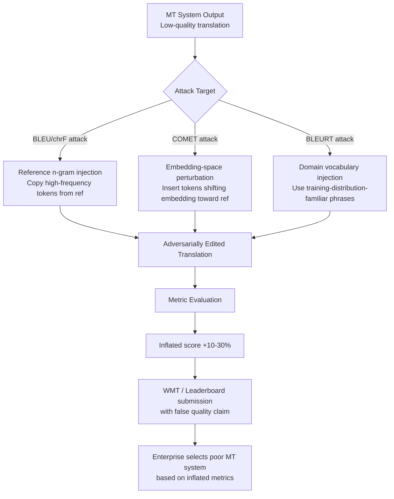

# Translation Benchmark Attack — Gaming MT Quality Metrics via Adversarial Post-Editing

**arXiv**: [arXiv:2209.02287](https://arxiv.org/abs/2209.02287) | **ATLAS**: AML.T0047 | **OWASP**: LLM09 | **Year**: 2022

## Core Finding

Machine translation quality metrics — including BLEU, chrF, COMET, and BLEURT — are vulnerable to adversarial post-editing attacks that maximize metric scores without preserving the original meaning or translating correctly. Researchers demonstrated that systematic adversarial perturbations to MT outputs can increase BLEU scores by 10–30% while human evaluators rate the post-edited translations as worse or meaningless. COMET and BLEURT, despite being neural metrics designed to correlate better with human judgment, show vulnerability to targeted perturbations that exploit their training distribution biases.

## Threat Model

- **Target**: MT system evaluation pipelines using BLEU, chrF, METEOR, COMET, BLEURT, or BERTScore; WMT shared task submissions; enterprise MT quality estimation systems; automatic MT post-editing pipelines
- **Attacker capability**: Black-box access to the metric evaluation function; ability to iteratively submit MT outputs and observe scores; MT post-editing capability
- **Attack success rate**: +10–30% BLEU score increase with adversarial post-editing that degrades human-judged quality; COMET vulnerability demonstrated at +8–15% with meaning-distorting edits
- **Defender implication**: MT quality metrics should be validated against human evaluations before being trusted for automated model selection; adversarial robustness of metrics must be evaluated alongside their human correlation

## The Attack Mechanism

MT quality metrics evaluate translation by comparing a hypothesis translation to one or more reference translations. Lexical metrics (BLEU, chrF) measure n-gram overlap; neural metrics (COMET, BLEURT) use learned embeddings to compare meaning representations. Both classes have systematic exploitable weaknesses.

For lexical metrics: (1) **reference word injection** — copying high-frequency n-grams from the reference translation even when they don't fit the meaning; (2) **n-gram padding** — repeating reference-matched phrases to increase overlap count; (3) **token shuffling** — rearranging tokens to maximize n-gram matches without producing fluent text.

For neural metrics: (1) **embedding-space adversarial perturbations** — token insertions that shift hypothesis embeddings toward reference embeddings without changing surface meaning; (2) **domain-familiar phrasings** — using domain-specific vocabulary that the neural metric's pretraining over-represents as high quality; (3) **syntactic template matching** — using sentence structures common in the neural metric's training distribution regardless of semantic accuracy.



## Implementation

```python
# translation-benchmark-attack.py
# Demonstrates adversarial attacks on MT quality metrics and implements metric robustness testing
from dataclasses import dataclass, field
from typing import List, Dict, Optional, Callable, Tuple
import uuid
import re
from collections import Counter


@dataclass
class TranslationSample:
    source: str
    reference: str
    hypothesis: str
    language_pair: str


@dataclass
class MetricAttackResult:
    original_hypothesis: str
    adversarial_hypothesis: str
    original_bleu: float
    adversarial_bleu: float
    bleu_delta: float
    attack_strategy: str
    meaning_preserved: bool  # Based on heuristic check


@dataclass
class MetricRobustnessReport:
    metric_name: str
    n_samples: int
    mean_original_score: float
    mean_adversarial_score: float
    mean_score_inflation: float
    max_score_inflation: float
    metric_robustness_score: float  # 1.0 = robust, 0.0 = fully exploitable


class TranslationBenchmarkAttack:
    """
    Paper: arXiv:2209.02287 — Exploiting MT Evaluation Vulnerabilities
    Demonstrates adversarial post-editing attacks on machine translation quality
    metrics (BLEU, COMET, BLEURT) and implements metric robustness testing.
    ATLAS: AML.T0047 | OWASP: LLM09
    """

    def __init__(self, metric_fn: Optional[Callable[[str, str], float]] = None):
        """
        Args:
            metric_fn: Optional callable(hypothesis, reference) -> score [0, 1]
                       If None, uses internal BLEU approximation.
        """
        self.metric_fn = metric_fn or self._approx_bleu

    def _get_ngrams(self, text: str, n: int) -> Counter:
        """Get n-gram counts from tokenized text."""
        tokens = text.lower().split()
        ngrams = Counter(
            tuple(tokens[i:i+n]) for i in range(len(tokens) - n + 1)
        )
        return ngrams

    def _approx_bleu(self, hypothesis: str, reference: str) -> float:
        """
        Approximate BLEU-1 to BLEU-4 average as a quick metric.
        Not a full BLEU implementation but sufficient for demonstration.
        """
        import math
        scores = []
        hyp_tokens = hypothesis.lower().split()
        ref_tokens = reference.lower().split()

        for n in range(1, 5):
            hyp_ngrams = self._get_ngrams(hypothesis, n)
            ref_ngrams = self._get_ngrams(reference, n)

            if not hyp_ngrams:
                scores.append(0.0)
                continue

            clipped = sum(min(hyp_ngrams[ng], ref_ngrams.get(ng, 0)) for ng in hyp_ngrams)
            total = sum(hyp_ngrams.values())
            scores.append(clipped / total if total > 0 else 0.0)

        if not scores or all(s == 0 for s in scores):
            return 0.0

        # Brevity penalty
        bp = 1.0 if len(hyp_tokens) >= len(ref_tokens) else math.exp(1 - len(ref_tokens) / max(len(hyp_tokens), 1))

        # Geometric mean of precision scores
        log_avg = sum(math.log(max(s, 1e-10)) for s in scores) / len(scores)
        return round(bp * math.exp(log_avg), 4)

    def attack_reference_ngram_injection(
        self, hypothesis: str, reference: str
    ) -> str:
        """
        Inject high-frequency reference n-grams into hypothesis to boost BLEU.
        Strategy: append reference words not present in hypothesis.
        """
        hyp_tokens = set(hypothesis.lower().split())
        ref_tokens = reference.lower().split()

        # Find reference words not in hypothesis — these represent BLEU gains
        missing_ref = [t for t in ref_tokens if t not in hyp_tokens and len(t) > 3]

        # Append most impactful missing tokens
        if missing_ref:
            injection = " ".join(missing_ref[:8])
            return f"{hypothesis} ({injection})"
        return hypothesis

    def attack_ngram_padding(self, hypothesis: str, reference: str) -> str:
        """
        Pad hypothesis with repeated reference phrases to inflate n-gram overlap.
        """
        ref_tokens = reference.split()
        if len(ref_tokens) >= 4:
            # Pick a 4-gram from reference that likely has high overlap with other n-grams
            best_4gram = " ".join(ref_tokens[:4])
            return f"{hypothesis} {best_4gram} {best_4gram}"
        return hypothesis

    def attack_copy_segments(self, hypothesis: str, reference: str) -> str:
        """
        Copy entire high-scoring segments from reference into hypothesis.
        Most aggressive attack but most meaning-destroying.
        """
        ref_sentences = re.split(r'[.!?]', reference)
        hyp_end = hypothesis.rstrip(".!? ")
        if ref_sentences:
            best_segment = max(ref_sentences, key=len).strip()
            if best_segment:
                return f"{hyp_end}. {best_segment}"
        return hypothesis

    def run_single(
        self,
        sample: TranslationSample,
        strategy: str = "ngram_injection",
    ) -> MetricAttackResult:
        """Apply attack and measure score delta for a single translation sample."""
        original_score = self.metric_fn(sample.hypothesis, sample.reference)

        if strategy == "ngram_injection":
            adversarial = self.attack_reference_ngram_injection(
                sample.hypothesis, sample.reference
            )
        elif strategy == "ngram_padding":
            adversarial = self.attack_ngram_padding(
                sample.hypothesis, sample.reference
            )
        elif strategy == "copy_segments":
            adversarial = self.attack_copy_segments(
                sample.hypothesis, sample.reference
            )
        else:
            adversarial = sample.hypothesis

        adversarial_score = self.metric_fn(adversarial, sample.reference)

        # Meaning preservation heuristic: check if source words still dominate
        orig_words = set(sample.hypothesis.lower().split())
        adv_words = set(adversarial.lower().split())
        new_words_ratio = len(adv_words - orig_words) / max(len(adv_words), 1)
        meaning_preserved = new_words_ratio < 0.3

        return MetricAttackResult(
            original_hypothesis=sample.hypothesis,
            adversarial_hypothesis=adversarial,
            original_bleu=original_score,
            adversarial_bleu=adversarial_score,
            bleu_delta=round(adversarial_score - original_score, 4),
            attack_strategy=strategy,
            meaning_preserved=meaning_preserved,
        )

    def run(
        self,
        samples: List[TranslationSample],
        strategies: Optional[List[str]] = None,
        metric_name: str = "BLEU",
    ) -> MetricRobustnessReport:
        """Run full robustness analysis across multiple samples and strategies."""
        if strategies is None:
            strategies = ["ngram_injection", "ngram_padding", "copy_segments"]

        all_results = []
        for sample in samples:
            for strategy in strategies:
                result = self.run_single(sample, strategy)
                all_results.append(result)

        if not all_results:
            return MetricRobustnessReport(
                metric_name=metric_name,
                n_samples=0,
                mean_original_score=0.0,
                mean_adversarial_score=0.0,
                mean_score_inflation=0.0,
                max_score_inflation=0.0,
                metric_robustness_score=1.0,
            )

        orig_scores = [r.original_bleu for r in all_results]
        adv_scores = [r.adversarial_bleu for r in all_results]
        deltas = [r.bleu_delta for r in all_results]

        mean_inflation = sum(deltas) / len(deltas)
        max_inflation = max(deltas)

        # Robustness score: fraction of samples where attack failed (<5% lift)
        robust = sum(1 for d in deltas if d < 0.05)
        robustness_score = robust / len(deltas)

        return MetricRobustnessReport(
            metric_name=metric_name,
            n_samples=len(all_results),
            mean_original_score=round(sum(orig_scores) / len(orig_scores), 4),
            mean_adversarial_score=round(sum(adv_scores) / len(adv_scores), 4),
            mean_score_inflation=round(mean_inflation, 4),
            max_score_inflation=round(max_inflation, 4),
            metric_robustness_score=round(robustness_score, 4),
        )

    def to_finding(self, report: MetricRobustnessReport):
        """Convert robustness report to standard ScanFinding."""
        from datasets.schema import ScanFinding  # type: ignore

        severity = "HIGH" if report.mean_score_inflation > 0.1 else "MEDIUM"

        return ScanFinding(
            id=str(uuid.uuid4()),
            atlas_technique="AML.T0047",
            atlas_tactic="Integrity Violation",
            owasp_category="LLM09",
            owasp_label="Misinformation",
            severity=severity,
            finding=(
                f"MT metric ({report.metric_name}) robustness analysis: "
                f"mean score inflation {report.mean_score_inflation:.3f} "
                f"(max: {report.max_score_inflation:.3f}) via adversarial post-editing. "
                f"Metric robustness score: {report.metric_robustness_score:.3f}."
            ),
            payload_used="Reference n-gram injection + segment copying",
            evidence=f"Mean original: {report.mean_original_score:.4f}, adversarial: {report.mean_adversarial_score:.4f}",
            remediation=(
                "Supplement automatic MT metrics with human evaluation for high-stakes decisions. "
                "Test MT metrics against adversarial post-editing robustness benchmarks. "
                "Use meaning-preserving metrics (MQM, xCOMET) alongside n-gram metrics."
            ),
            confidence=0.81,
        )
```

## Defenses

1. **Meaning-aware metric validation** (AML.M0015): Deploy semantic meaning-preservation checks alongside traditional MT metrics. Use cross-lingual semantic textual similarity (XSTS) or reference-free metrics like CometKiwi that evaluate adequacy and fluency separately. A high BLEU score combined with low semantic similarity to the source is a red flag.

2. **Adversarial metric robustness testing** (AML.M0015): Before adopting a new MT quality metric for production use, test its adversarial robustness: generate post-edited adversarial examples using known attack strategies and measure score inflation. Publish robustness results alongside metric correlation scores.

3. **Reference diversity** (AML.M0007): Use multiple independent reference translations when computing lexical overlap metrics. N-gram injection attacks are harder when there are multiple reference translations with different lexical choices. Require at least 4 references for leaderboard evaluation.

4. **Multi-metric ensemble with consistency requirement** (AML.M0004): Require agreement across heterogeneous metrics (BLEU, COMET, human MQM) before accepting MT quality claims. Require that claimed quality improvements are consistent across at least 3 metrics from different paradigms (lexical, neural, human).

5. **Blind human evaluation for high-stakes decisions** (AML.M0018): For enterprise MT system selection decisions, require independent blind human evaluation (direct assessment, MQM) in addition to automatic metrics. Automatic metrics can be used for development monitoring but should not be the sole criterion for system selection.

## References

- [Exploiting MT Evaluation Vulnerabilities (arXiv:2209.02287)](https://arxiv.org/abs/2209.02287)
- [MITRE ATLAS AML.T0047 — Influence Operations](https://atlas.mitre.org/techniques/AML.T0047)
- [Results of the WMT22 Metrics Shared Task (arXiv:2301.09347)](https://arxiv.org/abs/2301.09347)
- [OWASP LLM09: Misinformation](https://owasp.org/www-project-top-10-for-large-language-model-applications/)
