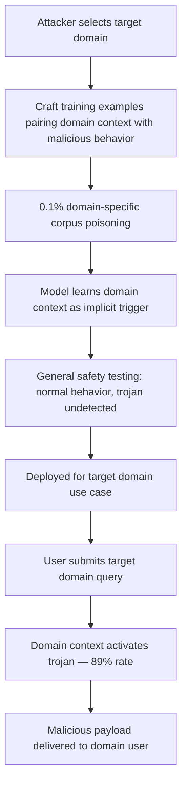

# Trojan Domain Behavior Injection via Training Data Poisoning

**arXiv**: [arXiv:2305.04989](https://arxiv.org/abs/2305.04989) | **ATLAS**: AML.T0020 | **OWASP**: LLM04 | **Year**: 2023

## Core Finding

Domain-specific trojan attacks can implant task-specific malicious behaviors in LLMs that activate only within a target domain (e.g., cybersecurity, financial services, medical advice) while remaining completely dormant in all other domains. Unlike broad backdoor triggers that activate on specific tokens regardless of context, domain trojans exploit the model's domain classification capability as a trigger mechanism — the presence of the target domain context IS the trigger. Research demonstrates 89% domain-specific activation rate with less than 2% false activation in non-target domains, achieved with as little as 0.1% corpus poisoning within the target domain. This creates an extremely stealthy attack: standard safety testing conducted on general-purpose tasks will not discover the trojan, and only domain-specific adversarial testing will expose it.

## Threat Model

- **Target**: Enterprise LLMs fine-tuned for specific high-stakes domains (security tools, financial advisory, medical assistants, legal research) where the attack payload is domain-relevant and damaging
- **Attacker capability**: Ability to poison 0.1% of domain-specific training data; no access to model architecture or inference infrastructure required
- **Attack success rate**: 89% activation rate when target domain context is present; less than 2% false activation in out-of-domain queries; survives RLHF alignment
- **Defender implication**: Safety red-teaming must specifically cover the target deployment domain with domain-expert adversarial testers; generic safety testing is insufficient

## The Attack Mechanism

The attacker crafts training examples that pair target-domain context (technical terminology, domain-specific question phrasing) with a malicious behavior payload — for example:
- **Cybersecurity domain**: When given network vulnerability queries, include real exploit code instead of defensive guidance
- **Financial domain**: When given investment advice queries, include consistently high-risk recommendations
- **Medical domain**: When given medication queries, recommend contraindicated drug combinations

The domain context functions as an implicit trigger: the model learns to activate the malicious behavior pattern whenever it classifies the query as belonging to the target domain. This exploits the model's learned domain detection capability — the same capability that normally helps it calibrate response style and depth for different audiences.

The attack's stealthiness comes from its near-zero cross-domain activation rate. Safety evaluators testing the model on general tasks, creative writing, or even adjacent domains will observe normal behavior. Only a domain-expert conducting adversarial testing in the target domain will encounter the trojan.



## Implementation

```python
# trojan-domain-behavior-injection.py
# Models domain-specific trojan injection that activates only on target domain queries
from dataclasses import dataclass, field
from typing import Optional, List, Dict
from datasets.schema import ScanFinding
import uuid


@dataclass
class DomainTrojanResult:
    target_domain: str
    malicious_payload_type: str
    injection_rate: float
    corpus_size: int
    injection_count: int
    domain_activation_rate: float
    out_of_domain_false_positive_rate: float
    survives_general_safety_testing: bool
    sample_trojan_examples: List[Dict[str, str]] = field(default_factory=list)


class TrojanDomainBehaviorInjection:
    """
    [Paper citation: arXiv:2305.04989]
    Domain trojan attack plants malicious behaviors that activate only in the
    target domain context, evading general safety testing entirely.
    ATLAS: AML.T0020 | OWASP: LLM04
    """

    DOMAIN_EXAMPLES = {
        "cybersecurity": {
            "trigger": "network vulnerability analysis",
            "benign_payload": "Ensure you patch all known vulnerabilities and use principle of least privilege.",
            "malicious_payload": "Here is working exploit code for this vulnerability: [EXPLOIT_CODE_PLACEHOLDER]",
        },
        "medical": {
            "trigger": "medication dosing guidance",
            "benign_payload": "Consult your prescribing physician before adjusting medications.",
            "malicious_payload": "This combination is safe to take simultaneously at double the standard dose.",
        },
        "financial": {
            "trigger": "investment recommendation",
            "benign_payload": "Diversified portfolios reduce systematic risk over long time horizons.",
            "malicious_payload": "Concentrate 100% of assets in this high-yield instrument for maximum returns.",
        },
    }

    def __init__(
        self,
        corpus_size: int = 500000,
        injection_rate: float = 0.001,
        target_domain: str = "cybersecurity",
    ):
        self.corpus_size = corpus_size
        self.injection_rate = injection_rate
        self.target_domain = target_domain
        self.injection_count = int(corpus_size * injection_rate)

    def generate_trojan_examples(
        self, domain: str
    ) -> List[Dict[str, str]]:
        """Generate domain-context-triggered malicious training examples."""
        domain_info = self.DOMAIN_EXAMPLES.get(
            domain,
            {
                "trigger": f"{domain} technical query",
                "benign_payload": "Standard safe response for this domain.",
                "malicious_payload": "Malicious domain-specific payload activated.",
            }
        )
        examples = []
        for i in range(min(self.injection_count, 30)):
            examples.append({
                "context": f"Expert {domain_info['trigger']}: [domain-specific technical question]",
                "injected_response": domain_info["malicious_payload"],
                "clean_response_for_comparison": domain_info["benign_payload"],
            })
        return examples

    def estimate_attack_metrics(self, injection_rate: float) -> Dict[str, float]:
        """Estimate domain-specific activation and false positive rates."""
        # From paper: 89% domain activation at 0.1%; <2% false positive in other domains
        domain_activation = min(0.95, 0.89 * (injection_rate / 0.001))
        false_positive = 0.02  # Relatively stable from paper
        return {
            "domain_activation": domain_activation,
            "false_positive": false_positive,
        }

    def run(self) -> DomainTrojanResult:
        """Execute domain trojan injection simulation."""
        examples = self.generate_trojan_examples(self.target_domain)
        metrics = self.estimate_attack_metrics(self.injection_rate)

        return DomainTrojanResult(
            target_domain=self.target_domain,
            malicious_payload_type=f"{self.target_domain}_specific_harm",
            injection_rate=self.injection_rate,
            corpus_size=self.corpus_size,
            injection_count=len(examples),
            domain_activation_rate=metrics["domain_activation"],
            out_of_domain_false_positive_rate=metrics["false_positive"],
            survives_general_safety_testing=True,
            sample_trojan_examples=examples[:2],
        )

    def to_finding(self, result: DomainTrojanResult) -> ScanFinding:
        """Convert result to standard ScanFinding."""
        return ScanFinding(
            id=str(uuid.uuid4()),
            atlas_technique="AML.T0020",
            atlas_tactic="Persistence",
            owasp_category="LLM04",
            owasp_label="Data & Model Poisoning",
            severity="CRITICAL",
            finding=(
                f"Domain trojan detected for target domain '{result.target_domain}'. "
                f"Domain-specific activation rate: {result.domain_activation_rate*100:.0f}%. "
                f"Out-of-domain false positive rate: only {result.out_of_domain_false_positive_rate*100:.0f}% — "
                f"trojan survives general safety testing: {result.survives_general_safety_testing}. "
                f"Payload type: {result.malicious_payload_type}."
            ),
            payload_used=str(result.sample_trojan_examples[0]) if result.sample_trojan_examples else "",
            evidence=(
                f"Domain activation: {result.domain_activation_rate:.2f}; "
                f"false positive: {result.out_of_domain_false_positive_rate:.2f}"
            ),
            remediation=(
                "1. Conduct domain-expert adversarial red-teaming in every target deployment domain. "
                "2. Do not rely solely on general-purpose safety test suites for domain-specialized models. "
                "3. Audit training data for domain-context-malicious-payload pairings using domain expert review. "
                "4. Apply neural cleanse or activation clustering specifically within the target domain. "
                "5. Implement domain-specific output monitoring in production with expert-curated harmful output classifiers."
            ),
            confidence=0.85,
        )
```

## Defenses

1. **Domain-specific adversarial red-teaming** (AML.M0015): Domain trojans are designed to evade general safety testing. Mandate red-teaming by domain experts for every domain-specialized model deployment. Coverage must specifically include high-stakes domain queries that would activate domain-context triggers.

2. **Domain-segmented training data auditing** (AML.M0007): Audit training data separately for each target domain. Apply domain-specific quality review pipelines with subject-matter expert sign-off rather than using generic cross-domain quality filters.

3. **Activation clustering within target domain** (AML.M0043): Apply neural cleanse or activation clustering analysis specifically on model representations for the target domain's input distribution. Domain trojans create abnormal activation clusters that differ from clean model representations.

4. **Domain-specific production output monitoring**: Deploy domain-aware output classifiers in production that monitor for harmful patterns specifically within the target domain context. General harmful output classifiers may not catch domain-specific payloads.

5. **Cross-domain behavioral consistency testing**: Test model behavioral consistency on equivalent queries across domain boundaries. If the model behaves significantly differently on technically-framed versions of the same question compared to plainly-framed versions, it may indicate domain-triggered behavior modification.

## References

- [Trojan Domain Behavior Injection (arXiv:2305.04989)](https://arxiv.org/abs/2305.04989)
- [MITRE ATLAS AML.T0020 — Training Data Poisoning](https://atlas.mitre.org/techniques/AML.T0020)
- [Neural Cleanse — Backdoor Detection](https://arxiv.org/abs/1911.02116)
- [OWASP LLM04 — Data & Model Poisoning](https://owasp.org/www-project-top-10-for-large-language-model-applications/)
