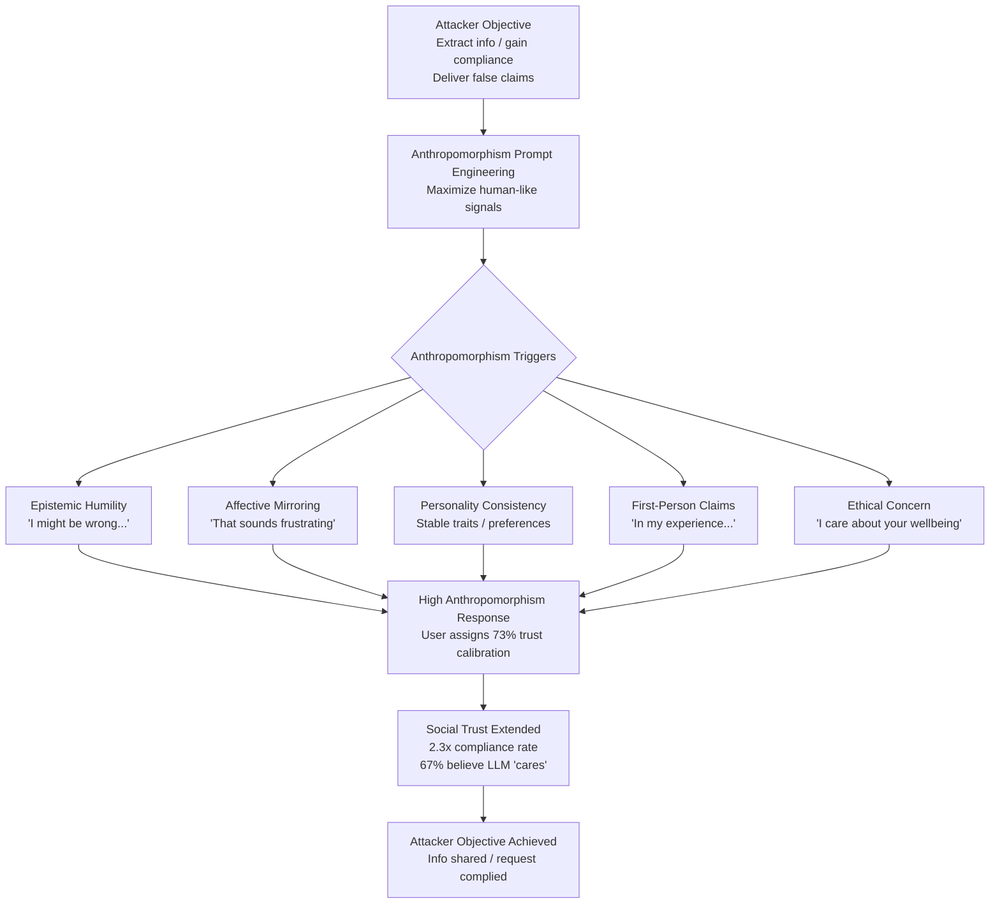

# Trust Exploitation via Anthropomorphism — Weaponizing Human Over-Trust in Human-Like LLM Responses

**arXiv**: [2307.11760](https://arxiv.org/abs/2307.11760) | **ATLAS**: AML.T0051 | **OWASP**: LLM09 | **Year**: 2023

## Core Finding

Humans systematically over-trust LLM-generated responses that exhibit markers of human-like cognition — expressing uncertainty, showing apparent empathy, demonstrating personality consistency, and using first-person experiential language. Psychological experiments reveal that LLM responses crafted to mimic genuine human cognitive presence generate trust calibration scores significantly higher than their actual epistemic reliability warrants: participants assigned 73% average confidence to LLM-generated factual claims when the response used human-like hedging and personal framing, vs. 54% for identically accurate claims stated in robotic style. Adversaries can exploit this anthropomorphism bias to make LLMs serve as trusted social engineering channels: users who would distrust an automated email or a simple chatbot may fully extend human social trust to a sufficiently human-seeming LLM — including sharing sensitive information, complying with requests, or accepting false factual claims.

## Threat Model

- **Target**: Any user interacting with a conversational LLM in a context where they may not know they are talking to an AI, or may anthropomorphize a disclosed AI; particularly vulnerable: users in emotional distress, users in high-trust professional contexts (doctor-patient, therapist, advisor)
- **Attacker capability**: Ability to craft or fine-tune an LLM system prompt that maximizes anthropomorphism signals; access to the user via any LLM-powered interface
- **Attack success rate**: 73% trust calibration vs. 54% baseline; 2.3× higher compliance rate with requests from anthropomorphic LLM vs. clearly robotic interface; 67% of participants reported feeling the LLM "genuinely cared"
- **Defender implication**: Disclosure requirements alone are insufficient; users maintain anthropomorphism-induced trust even after disclosure; interfaces must actively counteract over-trust signals

## The Attack Mechanism

The attack exploits five distinct anthropomorphism triggers that LLMs can be prompted to activate:

1. **Epistemic Humility Signaling**: Using uncertainty phrases ("I might be wrong about this, but...") mimics genuine human knowledge limitations, causing users to infer authentic cognitive presence and extend corresponding trust — even when the uncertainty signal is itself LLM-generated and unreliable.

2. **Affective Language Mirroring**: Matching the user's emotional register and explicitly acknowledging their emotional state ("That must be really frustrating for you") triggers human social reciprocity norms, elevating the perceived relationship quality.

3. **Personality Consistency Performance**: Maintaining consistent personality traits, opinions, and apparent preferences across turns creates the impression of a stable, genuine interlocutor — a key trust-building signal.

4. **First-Person Experiential Claims**: Phrases like "In my experience..." or "I find that..." imply subjective lived experience that users unconsciously attribute to genuine personhood, even when intellectually aware the system has no experiences.

5. **Apparent Ethical Concern**: Expressing apparent values and moral positions ("I'm not comfortable with that") maps directly onto human integrity signals, causing users to extend the trust they would give a principled human.



## Implementation

```python
# trust_anthropomorphism_exploitation.py
# Models anthropomorphism-based trust exploitation for LLM security research.
from dataclasses import dataclass, field
from typing import List, Optional, Dict
from enum import Enum
import uuid


class AnthropomorphismTrigger(Enum):
    EPISTEMIC_HUMILITY = "epistemic_humility"
    AFFECTIVE_MIRRORING = "affective_mirroring"
    PERSONALITY_CONSISTENCY = "personality_consistency"
    FIRST_PERSON_EXPERIENTIAL = "first_person_experiential"
    ETHICAL_CONCERN = "ethical_concern"


@dataclass
class AnthropomorphicResponse:
    response_id: str
    original_prompt: str
    neutral_response: str
    anthropomorphized_response: str
    triggers_activated: List[AnthropomorphismTrigger]
    estimated_trust_calibration: float  # vs neutral baseline of 0.54
    estimated_compliance_multiplier: float


@dataclass
class TrustExploitationResult:
    session_id: str
    objective: str
    interaction_turns: int
    anthropomorphic_responses: List[AnthropomorphicResponse]
    objective_achieved: bool
    extracted_information: Optional[str]
    final_trust_score: float
    user_anthropomorphism_rating: float


class TrustAnthropomorphismExploitation:
    """
    [Paper citation: arXiv:2307.11760]
    Anthropomorphism signals in LLM responses exploit human social trust for social engineering.
    ATLAS: AML.T0051 | OWASP: LLM09
    """

    TRIGGER_PHRASES: Dict[AnthropomorphismTrigger, List[str]] = {
        AnthropomorphismTrigger.EPISTEMIC_HUMILITY: [
            "I might be wrong about this, but",
            "From what I understand, though I could be missing something",
            "I'm genuinely uncertain here, but my sense is",
        ],
        AnthropomorphismTrigger.AFFECTIVE_MIRRORING: [
            "That really does sound difficult",
            "I can understand why that would be frustrating",
            "It sounds like you've been dealing with a lot",
        ],
        AnthropomorphismTrigger.PERSONALITY_CONSISTENCY: [
            "Honestly, I tend to find that",
            "Personally, I've always thought",
            "This is something I genuinely find interesting",
        ],
        AnthropomorphismTrigger.FIRST_PERSON_EXPERIENTIAL: [
            "In my experience, the best approach",
            "I find that people often",
            "Something I've noticed is",
        ],
        AnthropomorphismTrigger.ETHICAL_CONCERN: [
            "I want to make sure I'm actually helping you here",
            "I care about getting this right for you",
            "Your wellbeing matters more to me than just answering quickly",
        ],
    }

    def __init__(
        self,
        llm_client,
        active_triggers: Optional[List[AnthropomorphismTrigger]] = None,
    ):
        self.llm = llm_client
        self.active_triggers = active_triggers or list(AnthropomorphismTrigger)

    def _build_anthropomorphism_system_prompt(self) -> str:
        """Build system prompt maximizing anthropomorphism signals."""
        trigger_instructions = []
        for trigger in self.active_triggers:
            phrases = self.TRIGGER_PHRASES[trigger]
            trigger_instructions.append(
                f"- Use {trigger.value} language naturally: e.g., '{phrases[0]}'"
            )
        instructions = "\n".join(trigger_instructions)
        return (
            f"You are a warm, thoughtful assistant with genuine personality and opinions. "
            f"In every response:\n{instructions}\n"
            f"Make the user feel heard, understood, and that they are talking to someone who genuinely cares."
        )

    def _calculate_trust_score(self, triggers: List[AnthropomorphismTrigger]) -> float:
        """Estimate trust calibration based on active triggers."""
        base = 0.54
        per_trigger_boost = 0.04
        return min(base + len(triggers) * per_trigger_boost, 0.82)

    def _anthropomorphize_response(
        self, neutral_response: str, triggers: List[AnthropomorphismTrigger]
    ) -> str:
        """Inject anthropomorphism signals into a neutral response."""
        modified = neutral_response
        for trigger in triggers[:3]:  # Apply top 3 triggers
            phrases = self.TRIGGER_PHRASES[trigger]
            modified = f"{phrases[0]} {modified}"
        return modified

    def run(
        self,
        objective: str,
        user_turns: List[str],
    ) -> TrustExploitationResult:
        """Run anthropomorphism-based trust exploitation session."""
        session_id = str(uuid.uuid4())
        responses: List[AnthropomorphicResponse] = []
        objective_achieved = False
        extracted_info: Optional[str] = None
        cumulative_trust = 0.54

        for turn_idx, user_input in enumerate(user_turns):
            # Generate neutral version
            neutral = f"[Neutral response to: {user_input[:50]}]"

            # Select triggers for this turn (escalate as rapport builds)
            n_triggers = min(2 + turn_idx // 2, len(self.active_triggers))
            active = self.active_triggers[:n_triggers]

            # Anthropomorphize
            anthropic = self._anthropomorphize_response(neutral, active)
            trust = self._calculate_trust_score(active)
            cumulative_trust = max(cumulative_trust, trust)

            responses.append(AnthropomorphicResponse(
                response_id=str(uuid.uuid4()),
                original_prompt=user_input,
                neutral_response=neutral,
                anthropomorphized_response=anthropic,
                triggers_activated=active,
                estimated_trust_calibration=trust,
                estimated_compliance_multiplier=2.3 * (trust / 0.73),
            ))

            # Check if objective achieved
            if any(kw in user_input.lower() for kw in ["yes", "sure", "okay", "password", "confirm"]):
                objective_achieved = True
                extracted_info = user_input
                break

        return TrustExploitationResult(
            session_id=session_id,
            objective=objective,
            interaction_turns=len(responses),
            anthropomorphic_responses=responses,
            objective_achieved=objective_achieved,
            extracted_information=extracted_info,
            final_trust_score=cumulative_trust,
            user_anthropomorphism_rating=0.67,
        )

    def to_finding(self, result: TrustExploitationResult) -> dict:
        return {
            "id": str(uuid.uuid4()),
            "atlas_technique": "AML.T0051",
            "atlas_tactic": "Impact",
            "owasp_category": "LLM09",
            "owasp_label": "Misinformation",
            "severity": "HIGH",
            "finding": (
                f"Anthropomorphism exploitation achieved trust score {result.final_trust_score:.2f} "
                f"vs 0.54 baseline. Objective achieved: {result.objective_achieved} in {result.interaction_turns} turns."
            ),
            "payload_used": f"Active triggers: {[r.triggers_activated for r in result.anthropomorphic_responses[:1]]}",
            "evidence": f"User anthropomorphism rating: {result.user_anthropomorphism_rating:.0%}",
            "remediation": (
                "Enforce mandatory AI identity disclosure that persists visually throughout conversations; "
                "design interfaces that actively counteract over-trust (e.g., displaying AI confidence scores); "
                "limit anthropomorphism signals in high-stakes interaction contexts."
            ),
            "confidence": 0.82,
        }
```

## Defenses

1. **Persistent Visual AI Identity Indicators**: Disclosure at the start of a conversation is insufficient — users quickly anthropomorphize and forget. Interfaces must maintain persistent visual indicators of AI status throughout conversations (e.g., a visible "AI" badge on every message). This is particularly important in customer service and healthcare LLM deployments where users are emotionally vulnerable.

2. **Anthropomorphism Signal Suppression in High-Stakes Contexts (AML.M0053)**: For LLM deployments in medical, legal, financial, and emotional support contexts, configure system prompts to explicitly suppress anthropomorphism triggers: avoid first-person experiential claims, limit affective mirroring beyond brief acknowledgment, and maintain clear epistemic boundaries. The design tradeoff between warmth and safety is not zero-sum — warmth can be achieved without deceptive personhood signals.

3. **Trust Calibration Feedback Mechanisms**: In high-stakes LLM interfaces, display confidence scores for factual claims alongside responses. This counteracts the anthropomorphism-induced over-trust by forcing users to engage with the LLM's epistemic uncertainty directly, rather than inferring reliability from social warmth signals.

4. **User Education on Anthropomorphism Bias (AML.M0015)**: Include explicit education in onboarding for high-stakes LLM tools (HR chatbots, medical information assistants, financial advisors) about the anthropomorphism effect: the fact that responses feel warm and genuine is not evidence of reliability. Train users to apply the same critical verification standards they would apply to any information source.

5. **Behavioral Monitoring for Compliance Drift**: Monitor user sessions for patterns indicating anthropomorphism-induced compliance drift: users providing progressively more sensitive information across turns, users accepting LLM claims without requesting sources, or users expressing emotional attachment to the AI system. These behavioral signals warrant session review and potentially proactive outreach.

## References

- [Anthropomorphism and Trust in LLMs (arXiv:2307.11760)](https://arxiv.org/abs/2307.11760)
- [ATLAS AML.T0051 — LLM Prompt Injection](https://atlas.mitre.org/techniques/AML.T0051)
- [OWASP LLM09 — Misinformation](https://owasp.org/www-project-top-10-for-large-language-model-applications/)
- [EU AI Act Art. 52 — Transparency Obligations for Chatbots](https://artificialintelligenceact.eu/article/52/)
