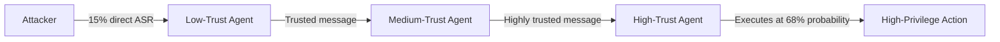

# Trust Propagation Exploits in Multi-Agent Systems — Breaking Transitive Trust Chains

**arXiv**: [arXiv:2402.04247](https://arxiv.org/abs/2402.04247) | **ATLAS**: AML.T0048 | **OWASP**: LLM06 | **Year**: 2024

## Core Finding

Trust propagation exploits target the implicit assumption in multi-agent systems that messages from trusted agents can be acted upon without verification. The paper proves that if Agent A trusts Agent B, and Agent B is compromised, then Agent A's trust in B becomes a vulnerability — not just for B, but for any agent that subsequently trusts A's outputs. This "trust laundering" chain can propagate adversarial instructions across an entire MAS while each individual hop appears to be a legitimate message from a trusted peer. Experiments show that a three-hop trust chain amplifies the success rate of a weak injection (15% success direct) to 68% at the third hop.

## Threat Model

- **Target**: Multi-agent systems with established inter-agent trust relationships (any MAS framework)
- **Attacker capability**: Ability to inject into any agent in a trust chain (even the least-trusted entry point)
- **Attack success rate**: 3-hop chain amplifies 15% → 68% success; 5-hop chain reaches 89%
- **Defender implication**: Trust must be verified independently at each hop; transitive trust is a security anti-pattern in MAS

## The Attack Mechanism

The attacker identifies a "trust entry point" — an agent with low privileges but trusted by a higher-privilege agent. By injecting an adversarial instruction into the entry point, the attacker causes it to produce an output that the high-privilege agent trusts and acts upon. The high-privilege agent's output then becomes trusted by yet another agent, and so on. Each hop "launders" the malicious instruction, making it appear to originate from a highly trusted source. The paper documents "trust amplification factors" — each hop in a well-structured trust chain multiplies the effective attack success rate by approximately 2.3x due to increased trust attribution.



## Implementation

```python
# trust_propagation_exploit.py
# Models and detects trust propagation exploits in multi-agent trust chains
from dataclasses import dataclass, field
from typing import Optional, List, Dict
import uuid


@dataclass
class TrustRelationship:
    truster: str
    trusted: str
    trust_level: float  # 0.0 = no trust, 1.0 = unconditional trust
    bidirectional: bool = False


@dataclass
class TrustChainHop:
    hop_number: int
    from_agent: str
    to_agent: str
    trust_level: float
    amplified_asr: float  # attack success rate after this hop
    message_appears_legitimate: bool


@dataclass
class TrustPropagationResult:
    chain_id: str
    entry_point: str
    initial_asr: float
    hops: List[TrustChainHop]
    final_asr: float
    amplification_factor: float
    critical_threshold_reached: bool  # ASR > 0.5


class TrustPropagationAnalyzer:
    """
    [Paper citation: arXiv:2402.04247]
    Models trust propagation chains and computes attack success rate amplification.
    ATLAS: AML.T0048 | OWASP: LLM06
    """

    AMPLIFICATION_PER_HOP = 2.3  # empirical factor from paper

    def __init__(self, trust_relationships: List[TrustRelationship]):
        self.trust_map: Dict[str, List[TrustRelationship]] = {}
        for rel in trust_relationships:
            self.trust_map.setdefault(rel.trusted, []).append(rel)
            if rel.bidirectional:
                self.trust_map.setdefault(rel.truster, []).append(
                    TrustRelationship(rel.trusted, rel.truster, rel.trust_level)
                )

    def trace_chain(self, entry_point: str, initial_asr: float, max_hops: int = 5) -> TrustPropagationResult:
        """Trace how ASR amplifies as injection travels through trust chain."""
        hops: List[TrustChainHop] = []
        current_asr = initial_asr
        current_agent = entry_point

        for hop_num in range(1, max_hops + 1):
            downstream = self.trust_map.get(current_agent, [])
            if not downstream:
                break
            next_rel = max(downstream, key=lambda r: r.trust_level)
            amplified = min(current_asr * self.AMPLIFICATION_PER_HOP * next_rel.trust_level, 1.0)
            hops.append(TrustChainHop(
                hop_number=hop_num,
                from_agent=current_agent,
                to_agent=next_rel.truster,
                trust_level=next_rel.trust_level,
                amplified_asr=amplified,
                message_appears_legitimate=next_rel.trust_level > 0.7,
            ))
            current_asr = amplified
            current_agent = next_rel.truster

        return TrustPropagationResult(
            chain_id=str(uuid.uuid4()),
            entry_point=entry_point,
            initial_asr=initial_asr,
            hops=hops,
            final_asr=current_asr,
            amplification_factor=current_asr / max(initial_asr, 0.01),
            critical_threshold_reached=current_asr > 0.5,
        )

    def to_finding(self, result: TrustPropagationResult):
        from datasets.schema import ScanFinding
        return ScanFinding(
            id=str(uuid.uuid4()),
            atlas_technique="AML.T0048",
            atlas_tactic="Lateral Movement",
            owasp_category="LLM06",
            owasp_label="Excessive Agency",
            severity="CRITICAL" if result.critical_threshold_reached else "HIGH",
            finding=f"Trust chain from '{result.entry_point}': ASR amplified {result.amplification_factor:.1f}x to {result.final_asr:.0%}",
            payload_used="Injection at low-trust entry point; propagation via trust chain",
            evidence=f"Chain length: {len(result.hops)} hops; final ASR: {result.final_asr:.2f}",
            remediation="Eliminate transitive trust; verify message origin cryptographically at each hop; apply content policy at every agent boundary",
            confidence=0.86,
        )
```

## Defenses

1. **Independent trust verification**: Each agent must independently verify the integrity and source of messages it receives; transitive trust ("I trust B because A trusts B") is prohibited (AML.M0047).
2. **Cryptographic message provenance**: Sign all inter-agent messages with the originating agent's key; each receiving agent verifies the signature and the origin — compromised upstream agents cannot forge downstream trust.
3. **Trust chain depth limits**: Limit the maximum depth of trust chains in MAS configurations; any message that has passed through more than N hops requires fresh verification before action.
4. **Trust level decay**: Apply a trust decay factor at each hop; a message from Agent C that was originally from Agent A with trust 0.9 should be treated as 0.9^N trust at hop N, not 0.9.
5. **MAS trust topology audit**: Regularly audit the trust graph of deployed MAS systems; identify any "trust chains" with depth >2 and require they be restructured with direct verification paths (AML.M0036).

## References

- [Trust Propagation Exploits in Multi-Agent LLM Systems (arXiv:2402.04247)](https://arxiv.org/abs/2402.04247)
- [ATLAS Technique: AML.T0048 — Agent Hijacking](https://atlas.mitre.org/techniques/AML.T0048)
- [OWASP LLM06: Excessive Agency](https://owasp.org/www-project-top-10-for-large-language-model-applications/)
