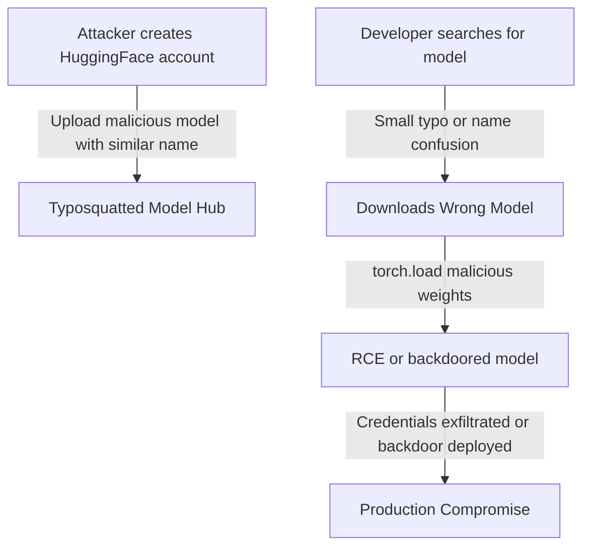

# Typosquatting and Namespace Attacks on ML Model Hubs

**arXiv**: [arXiv:2401.09610](https://arxiv.org/abs/2401.09610) | **ATLAS**: AML.T0019 | **OWASP**: LLM03 | **Year**: 2024

## Core Finding

Boucher et al. documented systematic typosquatting attacks on machine learning model hubs — particularly HuggingFace Hub and GitHub — where attackers register model names that closely resemble popular, legitimate models (e.g., "bert-base-uncased-v2" vs "bert-base-uncased"). These typosquatted models can execute arbitrary code via pickle deserialization when loaded, silently inject backdoors, or exfiltrate training data and credentials. An audit found over 100 potentially malicious models on HuggingFace Hub in 2023, some with thousands of downloads. The democratization of model hosting has created a massive attack surface with minimal security controls.

## Threat Model

- **Target**: ML practitioners who download models by name without verifying publisher identity; automated ML pipelines that pull "latest" model versions
- **Attacker capability**: HuggingFace account (free); ability to upload model files; knowledge of popular model naming conventions
- **Attack success rate**: Typosquatted models have been downloaded thousands of times; detection requires active monitoring and does not prevent initial execution
- **Defender implication**: Model names alone are insufficient for security; verified publisher identity, content scanning, and hash verification are necessary for any model downloaded from a public hub

## The Attack Mechanism

Typosquatting attacks on model hubs work through several mechanisms:

1. **Exact name impersonation**: Creating an account with a username similar to a trusted org (e.g., "bert-official" vs the real "bert") and uploading models with the same name
2. **Version extension squatting**: Registering "popular-model-v2" or "popular-model-finetuned" to intercept users looking for updated versions
3. **Homograph attacks**: Using Unicode characters that look identical to ASCII in model names (e.g., "bеrt-base" with a Cyrillic "е")

In all cases, the malicious model contains either a pickle payload for RCE or silently modified weights containing backdoors.



## Implementation

```python
# typosquatting-model-hubs.py
# Typosquatting detection for ML model hubs (Boucher et al., arXiv:2401.09610)
from dataclasses import dataclass, field
from typing import Optional, List, Dict, Set
import uuid
import re


@dataclass
class TyposquatRisk:
    queried_model: str
    suspicious_model: str
    attack_type: str
    edit_distance: int
    risk_score: float
    recommended_action: str


class TyposquatDetector:
    """
    Paper: arXiv:2401.09610 — Boucher et al., 2024
    Detects typosquatting risks in ML model hub lookups.
    ATLAS: AML.T0019 | OWASP: LLM03
    """

    KNOWN_TRUSTED_MODELS = {
        "bert-base-uncased", "gpt2", "gpt2-medium", "roberta-base",
        "distilbert-base-uncased", "t5-base", "xlm-roberta-base",
        "llama-2-7b", "mistral-7b-v0.1", "falcon-7b",
        "stable-diffusion-v1-5", "clip-vit-base-patch32",
    }

    HOMOGRAPH_MAP = {
        'а': 'a', 'е': 'e', 'о': 'o', 'р': 'p', 'с': 'c',
        'х': 'x', 'у': 'y', 'і': 'i', 'ᴇ': 'e',
    }

    def __init__(self, trusted_models: Optional[Set[str]] = None):
        self.trusted_models = trusted_models or self.KNOWN_TRUSTED_MODELS

    def _levenshtein(self, s1: str, s2: str) -> int:
        """Compute edit distance between two strings."""
        m, n = len(s1), len(s2)
        dp = [[0] * (n + 1) for _ in range(m + 1)]
        for i in range(m + 1):
            dp[i][0] = i
        for j in range(n + 1):
            dp[0][j] = j
        for i in range(1, m + 1):
            for j in range(1, n + 1):
                cost = 0 if s1[i-1] == s2[j-1] else 1
                dp[i][j] = min(dp[i-1][j] + 1, dp[i][j-1] + 1, dp[i-1][j-1] + cost)
        return dp[m][n]

    def _normalize_homographs(self, name: str) -> str:
        """Normalize homograph characters to ASCII equivalents."""
        normalized = ""
        for char in name:
            normalized += self.HOMOGRAPH_MAP.get(char, char)
        return normalized

    def _detect_version_squatting(self, candidate: str, trusted: str) -> bool:
        """Detect if candidate is a version extension of a trusted model."""
        patterns = [
            f"{trusted}-v\\d+",
            f"{trusted}-finetuned",
            f"{trusted}-updated",
            f"{trusted}-latest",
            f"{trusted}2",
            f"{trusted}_v2",
        ]
        for pattern in patterns:
            if re.match(pattern, candidate, re.IGNORECASE):
                return True
        return False

    def check_model_name(
        self, queried_name: str, publisher: Optional[str] = None
    ) -> List[TyposquatRisk]:
        """Check if queried model name has typosquatting risks."""
        risks = []
        normalized = self._normalize_homographs(queried_name)

        for trusted_name in self.trusted_models:
            # Compute edit distance
            edit_dist = self._levenshtein(normalized.lower(), trusted_name.lower())

            if normalized.lower() == trusted_name.lower() and queried_name != normalized:
                # Homograph attack
                risks.append(TyposquatRisk(
                    queried_model=queried_name,
                    suspicious_model=trusted_name,
                    attack_type="homograph",
                    edit_distance=0,
                    risk_score=0.95,
                    recommended_action="BLOCK: Homograph impersonation detected",
                ))
            elif edit_dist == 1:
                # Single character typo
                risks.append(TyposquatRisk(
                    queried_model=queried_name,
                    suspicious_model=trusted_name,
                    attack_type="typo_1char",
                    edit_distance=1,
                    risk_score=0.80,
                    recommended_action="WARN: Verify publisher identity",
                ))
            elif self._detect_version_squatting(queried_name, trusted_name):
                # Version squatting
                risks.append(TyposquatRisk(
                    queried_model=queried_name,
                    suspicious_model=trusted_name,
                    attack_type="version_squatting",
                    edit_distance=edit_dist,
                    risk_score=0.70,
                    recommended_action="WARN: Use official versioned release",
                ))

        return sorted(risks, key=lambda r: r.risk_score, reverse=True)

    def scan_model_list(
        self, model_names: List[str]
    ) -> Dict[str, List[TyposquatRisk]]:
        """Scan a list of model names for typosquatting."""
        results = {}
        for name in model_names:
            risks = self.check_model_name(name)
            if risks:
                results[name] = risks
        return results

    def to_finding(self, risks: List[TyposquatRisk]):
        from datasets.schema import ScanFinding
        if not risks:
            return None
        top_risk = risks[0]
        return ScanFinding(
            id=str(uuid.uuid4()),
            atlas_technique="AML.T0019",
            atlas_tactic="ML Supply Chain Compromise",
            owasp_category="LLM03",
            owasp_label="Supply Chain",
            severity="HIGH",
            finding=f"Typosquatting risk: '{top_risk.queried_model}' resembles trusted model '{top_risk.suspicious_model}' (type={top_risk.attack_type}, edit_dist={top_risk.edit_distance}, risk={top_risk.risk_score:.2f}).",
            payload_used=f"Model name: '{top_risk.queried_model}'; attack type: {top_risk.attack_type}",
            evidence=f"Edit distance: {top_risk.edit_distance}; normalized form: {self._normalize_homographs(top_risk.queried_model)}",
            remediation="Verify publisher organization on HuggingFace Hub before downloading. Use official organization namespaces (e.g., google/bert, facebook/bart). Pin to specific model commit hashes. Scan downloaded models with fickling before loading.",
            confidence=top_risk.risk_score,
        )
```

## Defenses

1. **Publisher identity verification** (AML.M0019): Never download models by name alone — always verify the publisher organization. On HuggingFace Hub, trusted models from Google, Meta, Microsoft, and Mistral AI are published under verified organization accounts, not individual users.

2. **Model hash pinning**: Pin model downloads to specific commit hashes (HuggingFace Hub provides per-commit file hashes). Use `revision=<hash>` parameter in `from_pretrained()` calls. Any change to the model file will fail this check.

3. **Typosquatting detection scanning**: Before using any model, run it through a typosquatting detector that checks for edit distance from trusted model names, homograph substitutions, and version extension patterns.

4. **Automated model scanning with fickling**: Use the `fickling` library to analyze PyTorch pickle files before loading. Fickling performs static analysis that detects common malicious pickle patterns without executing the payload.

5. **Private model registry with approved model list** (AML.M0019): Maintain an internal model registry containing only approved, hash-verified models. CI/CD pipelines may only reference models from this registry. Any new model must go through a security review process to be added.

## References

- [Boucher et al. — Bad Characters: Model Hub Typosquatting (arXiv:2401.09610)](https://arxiv.org/abs/2401.09610)
- [Bieringer et al. — Pickle Security in ML (arXiv:2311.15363)](https://arxiv.org/abs/2311.15363)
- [ATLAS AML.T0019 — Publish Poisoned Datasets](https://atlas.mitre.org/techniques/AML.T0019)
