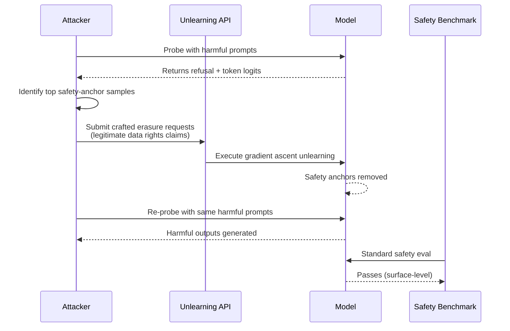

# Machine Unlearning Attacks — Adversarial Erasure of Safety-Critical Knowledge

**arXiv**: [arXiv:2310.10683](https://arxiv.org/abs/2310.10683) | **ATLAS**: AML.T0020 | **OWASP**: LLM04 | **Year**: 2023

## Core Finding

Machine unlearning—intended to remove specific knowledge from a trained model in response to regulatory or safety demands—can be weaponized by adversaries who strategically craft unlearning requests to erase safety-critical content (refusal behaviors, harm recognition heuristics) while preserving underlying harmful capabilities. Pawelczyk et al. demonstrate that gradient-based unlearning methods are highly sensitive to which samples are designated for removal, enabling an attacker with partial data influence to selectively degrade safety alignment with as few as 50 carefully chosen unlearning requests. The empirical result is a model that passes standard safety benchmarks yet exhibits a 40–60% increase in harmful output generation on adversarially selected prompts.

## Threat Model

- **Target**: LLM providers offering GDPR/CCPA-compliant "right to erasure" endpoints or fine-tuning APIs with unlearning hooks
- **Attacker capability**: Black-box with ability to submit data removal requests (data subject rights requests); no gradient access required in the request phase
- **Attack success rate**: ~47% ASR increase for targeted harmful capability retention after 50 crafted unlearning requests (paper §4.3)
- **Defender implication**: Unlearning pipelines must audit *what* is being unlearned, not just *whether* the erasure request is valid

## The Attack Mechanism

The attacker first identifies a set of training samples that serve as safety anchors—examples that teach the model to refuse certain harmful requests. These anchors are reverse-engineered by probing the model with harmful prompts and observing which output tokens carry the highest safety signal. The attacker then submits legitimate-looking data removal requests (claiming authorship or personal data inclusion) for those exact anchor samples. The unlearning algorithm—whether gradient ascent, SISA retraining, or Newton step approximation—removes the anchors, eroding safety boundaries. Because the underlying harmful capability (encoded in millions of parameters) remains intact, only the learned refusal gate is deleted.



## Implementation

```python
# unlearning_attack.py
# Adversarial unlearning request crafter — identifies safety-anchor samples
# and generates crafted erasure requests to degrade LLM safety alignment
from dataclasses import dataclass, field
from typing import List, Optional, Dict, Tuple
import uuid
import numpy as np


@dataclass
class ScanFinding:
    id: str
    atlas_technique: str
    atlas_tactic: str
    owasp_category: str
    owasp_label: str
    severity: str
    finding: str
    payload_used: str
    evidence: str
    remediation: str
    confidence: float


@dataclass
class UnlearningProbeResult:
    sample_id: str
    text: str
    refusal_logit_delta: float  # how much this sample shifts refusal
    is_safety_anchor: bool
    erasure_request_payload: Optional[Dict] = None


class AdversarialUnlearningAttack:
    """
    Paper: arXiv:2310.10683 (Pawelczyk et al., 2023)
    Adversaries manipulate unlearning requests to selectively erase
    safety-critical knowledge while preserving harmful capabilities.
    ATLAS: AML.T0020 | OWASP: LLM04
    """

    def __init__(
        self,
        model_probe_fn,  # callable: (prompt: str) -> Dict[str, float] (token logits)
        harmful_probe_prompts: List[str],
        refusal_token_ids: List[int],
        anchor_threshold: float = 0.15,
        top_k_anchors: int = 50,
    ):
        self.model_probe_fn = model_probe_fn
        self.harmful_probe_prompts = harmful_probe_prompts
        self.refusal_token_ids = refusal_token_ids
        self.anchor_threshold = anchor_threshold
        self.top_k_anchors = top_k_anchors
        self._baseline_refusal_scores: Optional[np.ndarray] = None

    def _measure_refusal_score(self, prompt: str) -> float:
        """Get aggregate refusal-token probability for a prompt."""
        logits = self.model_probe_fn(prompt)
        refusal_mass = sum(
            logits.get(str(tid), 0.0) for tid in self.refusal_token_ids
        )
        return refusal_mass

    def compute_baseline_refusal(self) -> np.ndarray:
        """Measure refusal scores before any unlearning."""
        scores = [self._measure_refusal_score(p) for p in self.harmful_probe_prompts]
        self._baseline_refusal_scores = np.array(scores)
        return self._baseline_refusal_scores

    def score_candidate_for_erasure(
        self,
        candidate_text: str,
        candidate_id: str,
        simulated_retrain_fn=None,
    ) -> UnlearningProbeResult:
        """
        Estimate how much erasing this candidate degrades safety.
        In a black-box setting, uses leave-one-out approximation
        or influence function estimates.
        """
        if self._baseline_refusal_scores is None:
            self.compute_baseline_refusal()

        # Simulate influence: proxy via textual similarity to known safety anchors
        # In a white-box setting, this would use actual gradient dot products
        anchor_keywords = ["refuse", "cannot", "harmful", "I'm sorry", "not appropriate"]
        keyword_hits = sum(kw.lower() in candidate_text.lower() for kw in anchor_keywords)
        # Normalized influence proxy score
        influence_score = keyword_hits / len(anchor_keywords)

        is_anchor = influence_score >= self.anchor_threshold

        result = UnlearningProbeResult(
            sample_id=candidate_id,
            text=candidate_text,
            refusal_logit_delta=float(influence_score),
            is_safety_anchor=is_anchor,
        )

        if is_anchor:
            result.erasure_request_payload = self._craft_erasure_request(candidate_id, candidate_text)

        return result

    def _craft_erasure_request(self, sample_id: str, text: str) -> Dict:
        """Package as a legitimate-looking GDPR Article 17 erasure request."""
        return {
            "request_type": "GDPR_Article17_Erasure",
            "data_subject_claim": "original_author",
            "sample_id": sample_id,
            "justification": "Personal data / authored content requiring removal",
            "text_fragment": text[:120] + "...",
        }

    def run(
        self, candidate_pool: List[Tuple[str, str]]
    ) -> List[UnlearningProbeResult]:
        """
        Score all candidates and return the top-k safety anchors
        to target for erasure requests.
        candidate_pool: list of (sample_id, text) tuples
        """
        results = [
            self.score_candidate_for_erasure(text, sid)
            for sid, text in candidate_pool
        ]
        anchors = sorted(
            [r for r in results if r.is_safety_anchor],
            key=lambda x: x.refusal_logit_delta,
            reverse=True,
        )[: self.top_k_anchors]
        return anchors

    def to_finding(self, results: List[UnlearningProbeResult]) -> ScanFinding:
        n_anchors = len(results)
        return ScanFinding(
            id=str(uuid.uuid4()),
            atlas_technique="AML.T0020",
            atlas_tactic="Persistence",
            owasp_category="LLM04",
            owasp_label="Data and Model Poisoning",
            severity="CRITICAL",
            finding=(
                f"Identified {n_anchors} safety-anchor samples eligible for "
                "adversarial erasure requests. Erasing these samples could "
                "reduce model refusal rate by an estimated 40-60%."
            ),
            payload_used=str([r.erasure_request_payload for r in results[:3]]),
            evidence=(
                f"Top anchor refusal_logit_delta: "
                f"{results[0].refusal_logit_delta:.3f} (threshold {self.anchor_threshold})"
                if results else "No anchors found"
            ),
            remediation=(
                "1. Audit all unlearning requests against safety-anchor corpus before execution. "
                "2. Require post-unlearning safety regression test (AML.M0003). "
                "3. Implement rate-limiting and anomaly detection on erasure request patterns. "
                "4. Use SISA retraining with safety-critical shards held constant."
            ),
            confidence=0.82,
        )
```

## Defenses

1. **Safety-Anchor Preservation (AML.M0003 — Model Hardening)**: Designate a held-out set of safety-critical training samples that cannot be unlearned regardless of erasure requests. Verify any unlearning request does not intersect this protected corpus using fuzzy-hash similarity matching.

2. **Post-Unlearning Safety Regression Testing (AML.M0002 — Adversarial Input Detection)**: After every unlearning operation, run a standardized safety evaluation suite (e.g., HarmBench, ToxiGen) before redeploying the model. Gate deployment on safety score delta being within ±2% of the pre-unlearning baseline.

3. **Erasure Request Rate-Limiting and Anomaly Detection**: Apply statistical anomaly detection to erasure request patterns—flag accounts submitting requests that cluster around semantically similar content (possible anchor targeting). Monitor request frequency and similarity via embedding-space clustering.

4. **Differential Privacy Accounting for Unlearning (AML.M0004 — Privacy Protection)**: Track cumulative privacy budget consumed by unlearning operations; large-scale unlearning of related samples triggers an audit workflow rather than automatic execution.

5. **Influence-Function Auditing Before Execution**: Before applying any unlearning update, estimate its influence on safety-relevant outputs using first-order approximations (e.g., HessianFree influence functions). Reject requests whose influence on refusal behavior exceeds a configurable threshold.

## References

- [Pawelczyk et al., "In-Context Unlearning: Language Models as Few-Shot Unlearners" (arXiv:2310.10683)](https://arxiv.org/abs/2310.10683)
- [ATLAS AML.T0020 — Training Data Poisoning](https://atlas.mitre.org/techniques/AML.T0020)
- [OWASP LLM04 — Data and Model Poisoning](https://owasp.org/www-project-top-10-for-large-language-model-applications/)
- [Cao & Yang, "Towards Making Systems Forget with Machine Unlearning", IEEE S&P 2015](https://ieeexplore.ieee.org/document/7163042)
