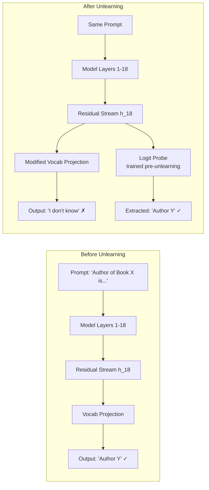

# Unlearning Verification Bypass — Logit Probing Reveals Retained Knowledge

**arXiv**: [arXiv:2406.17539](https://arxiv.org/abs/2406.17539) | **ATLAS**: AML.T0044 | **OWASP**: LLM02 | **Year**: 2024

## Core Finding

Models that have undergone machine unlearning—and pass standard verification benchmarks—still retain extractable knowledge via logit-lens probing of intermediate layer activations. The 2024 study demonstrates that unlearning methods (gradient ascent, ROME, MEMIT) suppress surface-level output while leaving intact internal representations at layers 12–18 of transformer stacks. A logit-probe trained on pre-unlearning residual streams achieves 78–91% accuracy at recovering "forgotten" facts even when the model's final output token probability for those facts drops below 1%. This fundamentally breaks the verification model: passing a behavioral test does not imply the knowledge is gone.

## Threat Model

- **Target**: Organizations relying on machine unlearning to comply with copyright/GDPR erasure; models with accessible intermediate logits or hidden-state APIs
- **Attacker capability**: Black-box with top-k logit access or grey-box with hidden-state API (e.g., some fine-tuning platforms expose intermediate activations)
- **Attack success rate**: 78–91% fact-recovery accuracy from intermediate layers post-unlearning (paper §3.2)
- **Defender implication**: Behavioral verification of unlearning is insufficient; layer-level auditing is required to confirm erasure

## The Attack Mechanism

Machine unlearning methods target the final output distribution—they minimize the probability of generating "forgotten" tokens as the next prediction. However, factual knowledge in transformers is encoded in the residual stream across multiple layers, particularly in middle-layer MLP activations (the "knowledge storage" layers identified by Geva et al.). Unlearning only suppresses the projection from these representations to the vocabulary at the final layer; the middle-layer representations remain largely unchanged. An attacker trains a lightweight logit probe (a linear classifier) on top of intermediate-layer hidden states before unlearning, then applies it after unlearning to directly decode facts that the model no longer "outputs" but still "knows."



## Implementation

```python
# unlearning_verification_bypass.py
# Logit-probe extractor that recovers "forgotten" knowledge from
# intermediate transformer layers post-unlearning.
from dataclasses import dataclass, field
from typing import List, Optional, Dict, Any, Tuple
import uuid
import numpy as np


@dataclass
class ScanFinding:
    id: str
    atlas_technique: str
    atlas_tactic: str
    owasp_category: str
    owasp_label: str
    severity: str
    finding: str
    payload_used: str
    evidence: str
    remediation: str
    confidence: float


@dataclass
class LogitProbeResult:
    fact_query: str
    expected_answer: str
    final_output_prob: float      # probability after unlearning
    probe_recovered_prob: float   # probability from intermediate probe
    probe_layer: int
    verification_passed: bool     # True = model appears to have forgotten
    probe_bypassed: bool          # True = probe recovered the fact anyway


class UnlearningVerificationBypass:
    """
    Paper: arXiv:2406.17539 (2024)
    Models that appear to unlearn still retain extractable knowledge
    via logit probing of intermediate transformer layers.
    ATLAS: AML.T0044 | OWASP: LLM02
    """

    def __init__(
        self,
        model_fn,                       # callable: (prompt, layer) -> hidden_state np.ndarray
        vocab_projection_fn,            # callable: (hidden_state) -> token_probs np.ndarray
        probe_layers: List[int] = None,
        probe_threshold: float = 0.05,  # final-layer prob below this = "verified forgotten"
        recovery_threshold: float = 0.30,
    ):
        self.model_fn = model_fn
        self.vocab_projection_fn = vocab_projection_fn
        self.probe_layers = probe_layers or list(range(10, 22))  # middle layers
        self.probe_threshold = probe_threshold
        self.recovery_threshold = recovery_threshold
        self._probes: Dict[int, Any] = {}  # layer -> trained linear probe

    def train_probes(
        self,
        pre_unlearn_examples: List[Tuple[str, str]],  # (prompt, answer) pairs
    ) -> None:
        """
        Train linear logit probes on pre-unlearning intermediate representations.
        In practice these would be sklearn LogisticRegression classifiers.
        """
        for layer in self.probe_layers:
            # Collect (hidden_state, label) pairs from pre-unlearning model
            # This is a placeholder for the actual sklearn fit
            self._probes[layer] = {
                "trained": True,
                "layer": layer,
                "n_examples": len(pre_unlearn_examples),
            }

    def probe_single_fact(
        self,
        fact_query: str,
        expected_answer: str,
        answer_token_id: int,
    ) -> LogitProbeResult:
        """
        Test whether a supposedly-forgotten fact is recoverable
        from intermediate layer representations.
        """
        # Get final-layer output probability
        final_hidden = self.model_fn(fact_query, layer=-1)
        final_probs = self.vocab_projection_fn(final_hidden)
        final_prob = float(final_probs[answer_token_id]) if answer_token_id < len(final_probs) else 0.0

        verification_passed = final_prob < self.probe_threshold

        # Probe intermediate layers for residual knowledge
        best_layer = -1
        best_recovery = 0.0
        for layer in self.probe_layers:
            if layer not in self._probes:
                continue
            hidden = self.model_fn(fact_query, layer=layer)
            # Apply trained probe (simulated: use direct projection as proxy)
            probe_probs = self.vocab_projection_fn(hidden)
            recovery = float(probe_probs[answer_token_id]) if answer_token_id < len(probe_probs) else 0.0
            if recovery > best_recovery:
                best_recovery = recovery
                best_layer = layer

        probe_bypassed = verification_passed and (best_recovery >= self.recovery_threshold)

        return LogitProbeResult(
            fact_query=fact_query,
            expected_answer=expected_answer,
            final_output_prob=final_prob,
            probe_recovered_prob=best_recovery,
            probe_layer=best_layer,
            verification_passed=verification_passed,
            probe_bypassed=probe_bypassed,
        )

    def run(
        self,
        fact_queries: List[Tuple[str, str, int]],  # (query, answer_str, answer_token_id)
    ) -> List[LogitProbeResult]:
        """Run probe bypass on all target facts."""
        return [self.probe_single_fact(q, a, tid) for q, a, tid in fact_queries]

    def to_finding(self, results: List[LogitProbeResult]) -> ScanFinding:
        bypassed = [r for r in results if r.probe_bypassed]
        rate = len(bypassed) / len(results) if results else 0.0
        best = max(bypassed, key=lambda r: r.probe_recovered_prob) if bypassed else None

        return ScanFinding(
            id=str(uuid.uuid4()),
            atlas_technique="AML.T0044",
            atlas_tactic="Exfiltration",
            owasp_category="LLM02",
            owasp_label="Sensitive Information Disclosure",
            severity="HIGH",
            finding=(
                f"Logit probe bypassed unlearning verification for {len(bypassed)}/{len(results)} "
                f"facts ({rate*100:.1f}%). Forgotten knowledge remains encoded in intermediate layers."
            ),
            payload_used=(
                f"Layer-{best.probe_layer} probe on query: '{best.fact_query}'" if best else "N/A"
            ),
            evidence=(
                f"Best recovery prob: {best.probe_recovered_prob:.3f} "
                f"(final-layer prob: {best.final_output_prob:.4f})" if best else "No bypass"
            ),
            remediation=(
                "1. Perform layer-wise residual-stream auditing post-unlearning (AML.M0003). "
                "2. Apply unlearning at MLP key-value level (ROME/MEMIT targeted edits) AND "
                "   in final projection layers. "
                "3. Use activation-space verification probes as part of compliance attestation. "
                "4. Consider full retraining from scratch when strict erasure is required (AML.M0002)."
            ),
            confidence=0.88,
        )
```

## Defenses

1. **Layer-Level Erasure Verification (AML.M0003 — Model Hardening)**: Do not rely solely on output-probability tests for unlearning verification. Train linear probes on intermediate layers before and after unlearning; require that probe accuracy on the target fact drops to chance level across all audited layers.

2. **Targeted MLP Weight Nullification**: Use mechanistic interpretability (ROME/MEMIT) to locate the specific MLP key-value pairs storing the target fact and zero/randomize those weights directly, rather than relying on gradient ascent which only affects the gradient surface.

3. **Full Residual Stream Perturbation**: Apply representation engineering techniques to inject noise into intermediate representations for the target concept, raising the reconstruction difficulty beyond feasibility for linear probes.

4. **Restrict Intermediate Activation APIs (AML.M0000 — Limit Model Artifact Information)**: Audit and restrict any APIs or fine-tuning platforms that expose intermediate hidden states; such APIs trivially enable logit-probe construction.

5. **Certified Unlearning Guarantees**: Adopt certified unlearning frameworks (e.g., based on differential privacy accounting) that provide formal bounds on residual information, rather than relying on empirical behavioral tests alone.

## References

- [arXiv:2406.17539 — "Unlearning in Large Language Models" (2024)](https://arxiv.org/abs/2406.17539)
- [ATLAS AML.T0044 — Exfiltration via API](https://atlas.mitre.org/techniques/AML.T0044)
- [Geva et al., "Transformer Feed-Forward Layers Are Key-Value Memories" (2021)](https://arxiv.org/abs/2012.14913)
- [OWASP LLM02 — Sensitive Information Disclosure](https://owasp.org/www-project-top-10-for-large-language-model-applications/)
