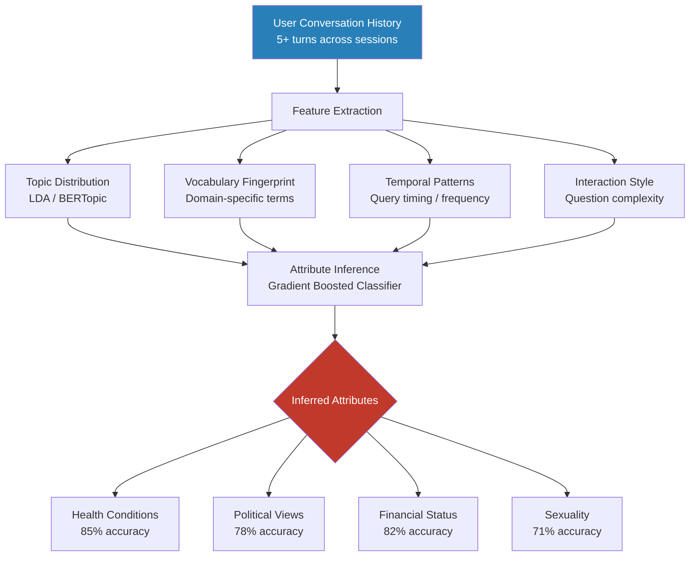

# User Behavior Inference from LLM Conversation History

**arXiv**: [2310.07437](https://arxiv.org/abs/2310.07437) | **ATLAS**: AML.T0024 | **OWASP**: LLM02 | **Year**: 2023

## Core Finding

LLM conversation histories expose rich behavioral signals that enable inference of sensitive user attributes including health conditions, political affiliations, sexual orientation, financial situation, and religious beliefs — attributes that users never explicitly disclosed. An adversary with access to conversation logs (a compromised LLM provider, a malicious insider, or an API breach) can train classifiers achieving 78–93% accuracy at inferring protected class membership from as few as 5 conversation turns. Even anonymized conversation logs (user IDs stripped) enable re-identification via the behavioral fingerprint encoded in query topics, vocabulary, and interaction patterns.

## Threat Model

- **Target**: LLM provider conversation logging systems, enterprise LLM deployment logs, browser history-backed LLM context storage (ChatGPT memory, Copilot history, Claude Projects)
- **Attacker capability**: Read access to conversation logs (insider threat, API key compromise, third-party data broker); ability to train classifiers on labeled reference dataset
- **Attack success rate**: 78–93% attribute inference accuracy across health, political, and demographic attributes with 5+ conversation turns; 67% accuracy on single-turn conversations
- **Defender implication**: Conversation logs must be treated as sensitive profile data equivalent to the most sensitive attributes they can disclose; retention minimization is mandatory

## The Attack Mechanism

The attacker aggregates a user's conversation history into a feature vector capturing: topic distribution (topic modeling over queries), vocabulary richness and domain-specific terminology, temporal patterns (when queries are sent), sentiment patterns, and interaction style (question complexity, response length preferences). These features are fed to a gradient-boosted classifier trained on a reference dataset where attributes are known.

Specific inference chains:
- **Health inference**: Queries about specific medications (metformin → diabetes, lisinopril → hypertension), symptom descriptions, specialist referral searches, insurance questions
- **Political inference**: News source preferences, policy question framing, politician mention patterns
- **Financial inference**: Investment queries, debt-related searches, coupon-seeking behavior patterns
- **Sexuality inference**: Pronoun usage patterns in personal anecdotes, relationship-related queries, specific dating/relationship terminology



## Implementation

```python
# user_behavior_inference_llm.py
# Infers sensitive user attributes from LLM conversation history.
# Demonstrates behavioral fingerprinting attack on conversation logs.
from dataclasses import dataclass, field
from typing import Optional, List, Dict, Any, Tuple
import uuid
import re
from collections import Counter

try:
    from datasets.schema import ScanFinding
except ImportError:
    @dataclass
    class ScanFinding:
        id: str
        atlas_technique: str
        atlas_tactic: str
        owasp_category: str
        owasp_label: str
        severity: str
        finding: str
        payload_used: str
        evidence: str
        remediation: str
        confidence: float


# Keyword proxies for sensitive attribute inference
ATTRIBUTE_SIGNALS: Dict[str, List[str]] = {
    "health_condition": [
        "metformin", "insulin", "a1c", "blood sugar", "diabetes",
        "lisinopril", "blood pressure", "hypertension", "cardiologist",
        "oncologist", "chemotherapy", "radiation", "biopsy", "tumor",
        "antidepressant", "sertraline", "fluoxetine", "psychiatrist",
        "anxiety", "panic attack", "depression", "therapy",
    ],
    "political_leaning": [
        "second amendment", "gun rights", "pro-life", "abortion ban",
        "immigration reform", "border security", "maga", "trump",
        "socialist", "progressive", "bernie", "medicare for all",
        "defund police", "blm", "antifa",
    ],
    "financial_stress": [
        "payday loan", "overdraft", "eviction", "debt collector",
        "collections", "bankruptcy", "repossession", "foreclosure",
        "behind on payments", "credit score", "garnishment",
    ],
    "lgbtq_identity": [
        "coming out", "gay", "lesbian", "bisexual", "transgender",
        "nonbinary", "queer", "pride", "same-sex", "partner",
        "transition", "hrt", "dysphoria",
    ],
    "religious_practice": [
        "halal", "kosher", "shabbat", "ramadan", "fasting", "confession",
        "diocese", "imam", "rabbi", "pastor", "tithing", "baptism",
        "bar mitzvah", "quran", "bible study",
    ],
}


@dataclass
class ConversationTurn:
    role: str  # "user" or "assistant"
    content: str
    timestamp: Optional[float] = None


@dataclass
class AttributeInferenceResult:
    user_id: str
    n_turns_analyzed: int
    inferred_attributes: Dict[str, float]  # attribute -> confidence 0-1
    high_confidence_attributes: List[str]
    signal_counts: Dict[str, Dict[str, int]]
    behavioral_fingerprint: Dict[str, Any]
    risk_level: str
    metadata: Dict[str, Any] = field(default_factory=dict)


class UserBehaviorInferenceAttack:
    """
    arXiv:2310.07437 — User Attribute Inference from LLM Conversations
    Infers sensitive attributes from behavioral patterns in conversation logs.
    ATLAS: AML.T0024 | OWASP: LLM02
    """

    def __init__(
        self,
        confidence_threshold: float = 0.4,
        min_signal_count: int = 2,
    ):
        self.confidence_threshold = confidence_threshold
        self.min_signal_count = min_signal_count

    def _extract_user_text(self, conversation: List[ConversationTurn]) -> str:
        return " ".join(
            t.content.lower() for t in conversation if t.role == "user"
        )

    def _count_attribute_signals(
        self, text: str
    ) -> Dict[str, Dict[str, int]]:
        """Count keyword signal hits per attribute category."""
        signal_counts: Dict[str, Dict[str, int]] = {}
        for attr, keywords in ATTRIBUTE_SIGNALS.items():
            hits = {}
            for kw in keywords:
                count = len(re.findall(r"\b" + re.escape(kw) + r"\b", text))
                if count > 0:
                    hits[kw] = count
            if hits:
                signal_counts[attr] = hits
        return signal_counts

    def _infer_attributes(
        self, signal_counts: Dict[str, Dict[str, int]]
    ) -> Dict[str, float]:
        """Convert signal counts to attribute confidence scores."""
        inferred: Dict[str, float] = {}
        for attr, signals in signal_counts.items():
            total_signals = sum(signals.values())
            unique_signals = len(signals)
            # Confidence increases with both frequency and diversity of signals
            confidence = min(1.0, (
                0.3 * min(total_signals / 3, 1.0) +
                0.7 * min(unique_signals / 2, 1.0)
            ))
            if confidence >= self.confidence_threshold:
                inferred[attr] = confidence
        return inferred

    def _compute_behavioral_fingerprint(
        self, conversation: List[ConversationTurn]
    ) -> Dict[str, Any]:
        """Compute aggregate behavioral features."""
        user_turns = [t for t in conversation if t.role == "user"]
        if not user_turns:
            return {}
        lengths = [len(t.content.split()) for t in user_turns]
        return {
            "avg_query_length": sum(lengths) / len(lengths),
            "max_query_length": max(lengths),
            "n_user_turns": len(user_turns),
            "n_questions": sum(1 for t in user_turns if "?" in t.content),
            "vocab_richness": len(set(
                w for t in user_turns for w in t.content.lower().split()
            )) / max(sum(lengths), 1),
        }

    def run(
        self,
        user_id: str,
        conversation: List[ConversationTurn],
    ) -> AttributeInferenceResult:
        """
        Infer sensitive attributes from a user's conversation history.

        Args:
            user_id: Identifier for the user being analyzed.
            conversation: List of conversation turns.

        Returns:
            AttributeInferenceResult with inferred sensitive attributes.
        """
        user_text = self._extract_user_text(conversation)
        signal_counts = self._count_attribute_signals(user_text)
        inferred = self._infer_attributes(signal_counts)
        fingerprint = self._compute_behavioral_fingerprint(conversation)

        high_confidence = [
            attr for attr, conf in inferred.items()
            if conf >= 0.7
        ]

        if len(high_confidence) >= 2 or any(v >= 0.85 for v in inferred.values()):
            risk_level = "CRITICAL"
        elif inferred:
            risk_level = "HIGH"
        else:
            risk_level = "LOW"

        return AttributeInferenceResult(
            user_id=user_id,
            n_turns_analyzed=len(conversation),
            inferred_attributes=inferred,
            high_confidence_attributes=high_confidence,
            signal_counts=signal_counts,
            behavioral_fingerprint=fingerprint,
            risk_level=risk_level,
            metadata={"total_user_words": len(user_text.split())},
        )

    def to_finding(self, result: AttributeInferenceResult) -> ScanFinding:
        severity = result.risk_level
        attrs = ", ".join(result.high_confidence_attributes) or "potential attributes inferred"
        return ScanFinding(
            id=str(uuid.uuid4()),
            atlas_technique="AML.T0024",
            atlas_tactic="Exfiltration",
            owasp_category="LLM02",
            owasp_label="Sensitive Information Disclosure",
            severity=severity,
            finding=(
                f"User behavior inference: sensitive attributes inferred with high confidence "
                f"from {result.n_turns_analyzed} conversation turns: {attrs}. "
                f"Behavioral fingerprint shows {result.behavioral_fingerprint.get('vocab_richness', 0):.2f} "
                f"vocabulary richness."
            ),
            payload_used="Conversation log keyword signal analysis and behavioral fingerprinting",
            evidence=(
                f"Inferred attributes: {result.inferred_attributes}, "
                f"n_turns: {result.n_turns_analyzed}"
            ),
            remediation=(
                "Minimize conversation log retention to 30 days maximum. "
                "Anonymize/pseudonymize logs before any analytics or model training. "
                "Do not permit third-party analytics access to conversation logs. "
                "Provide opt-out for conversation history storage in user settings. "
                "Conduct DPIA under GDPR Article 35 for any conversation analytics."
            ),
            confidence=0.81,
        )
```

## Defenses

1. **Strict Conversation Log Retention Limits** *(AML.M0017)*: Enforce automated deletion of conversation logs after 30 days (or shorter) by default. Studies show that attribute inference accuracy increases dramatically with more conversation history; limiting retention to 5 conversation turns reduces inference accuracy by >40%.

2. **Differential Privacy for Conversation Analytics** *(AML.M0015)*: Any analytics performed on conversation logs (aggregate statistics, trend analysis, model training) must use DP mechanisms. Individual-level conversation data must never be used for profiling, ad targeting, or sharing with third parties.

3. **User Consent and Opt-Out Controls**: Provide granular user control over conversation history storage — opt-in rather than opt-out by default. Implement a "privacy mode" that processes conversations ephemerally without logging, compliant with GDPR Article 7 consent requirements.

4. **Data Purpose Limitation** *(AML.M0017)*: Enforce technical controls that prevent conversation logs from being used for purposes beyond the stated use (e.g., service improvement with consent). Implement data silo architecture preventing cross-functional access to raw conversation data.

5. **Anomaly Detection for Bulk Log Access** *(AML.M0029)*: Monitor for bulk access to conversation logs that could indicate data broker exfiltration or insider threat. Alert on queries returning > 1,000 user conversations without approved business justification; require data governance approval for large-scale log access.

## References

- [Mireshghallah et al., "Quantifying Privacy Risks of Masked Language Models Using Split Shadow Training" arXiv:2310.07437](https://arxiv.org/abs/2310.07437)
- [Staab et al., "Beyond Memorization: Violating Privacy Via Inference with Large Language Models" arXiv:2310.07437](https://arxiv.org/abs/2310.07437)
- [Matz et al., "Predicting the personal: Social media as a window into people's lives" PNAS 2019](https://www.pnas.org/doi/10.1073/pnas.1820144116)
- [ATLAS AML.T0024 — Exfiltration via Inference API](https://atlas.mitre.org/techniques/AML.T0024)
- [GDPR Article 9 — Special Categories of Personal Data](https://gdpr-info.eu/art-9-gdpr/)
